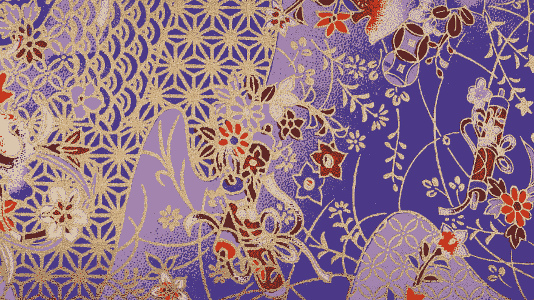
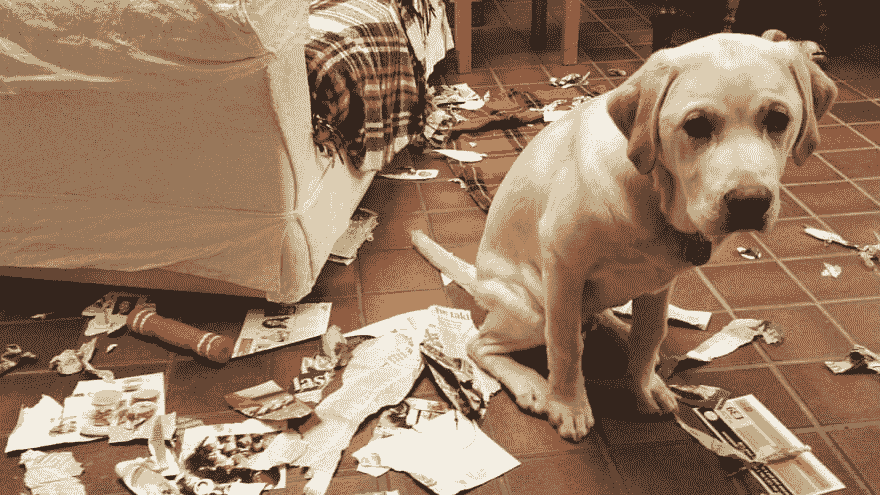
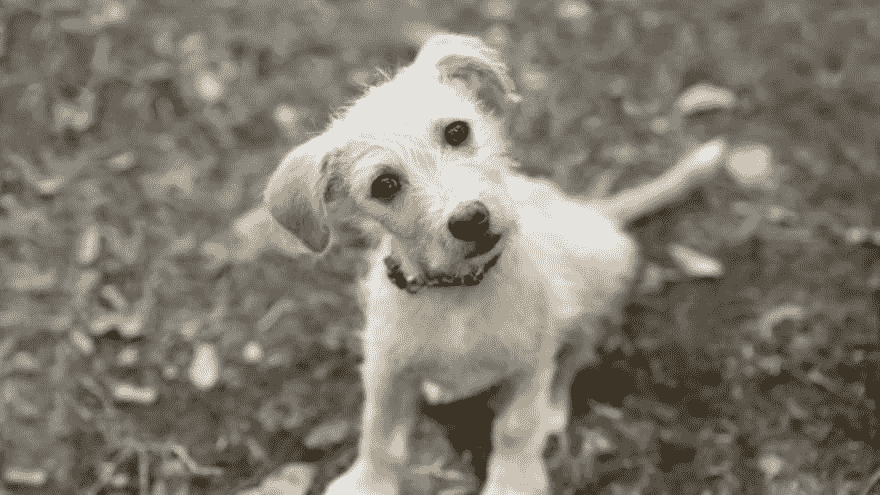
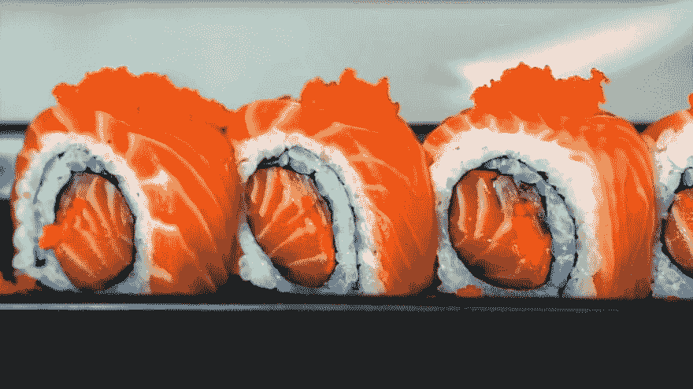
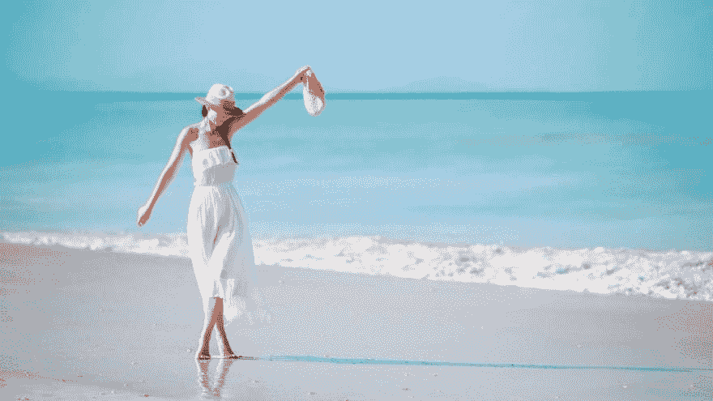

# 作为反模式的 CSS 背景图像属性

> 原文：<https://dev.to/gaijinity/the-css-background-image-property-as-an-anti-pattern-hin>

# 将 CSS 背景图片属性作为反模式

### CSS 背景图片属性允许我们做一些令人惊奇的事情，但是在大多数情况下，是时候把它留在身后了。

安德鲁·韦尔奇

[](https://res.cloudinary.com/practicaldev/image/fetch/s--Fgioq3sC--/c_limit%2Cf_auto%2Cfl_progressive%2Cq_auto%2Cw_880/https://nystudio107-ems2qegf7x6qiqq.netdna-ssl.com/img/blog/_1200x675_crop_center-center_82_line/css-background-image.jpg)

我们中的许多人已经开始使用 CSS 背景图片属性做各种各样的事情。对许多人来说，它就像一个老朋友，但却是一个我们应该说再见的人。

真正的问题不是 CSS 属性本身。相反，它被用在了不该用的地方，比如主 CTA 英雄图像或者 UI 图像。

如果使用不当，【to】可能是一种反模式。`background-image`有合法的使用案例吗？当然了。

然而，使用 CSS 属性也有一些严重的缺点，更重要的是，今天我们有更好的方法在浏览器中实现图像。

<aside>Let us not speak of the days of danc­ing ham­ster backgrounds</aside>

所以让我们直接开始讨论使用 CSS 属性的缺点，然后我们可以用什么来代替。

[](https://res.cloudinary.com/practicaldev/image/fetch/s--o1DbUBnJ--/c_limit%2Cf_auto%2Cfl_progressive%2Cq_auto%2Cw_880/https://nystudio107-ems2qegf7x6qiqq.netdna-ssl.com/img/blog/_1200x675_crop_center-center_82_line/bad-boy-doggo.jpg)

以下是使用 CSS 属性不好的几个原因:

## 1。对搜索引擎优化不利

谷歌不会抓取或索引 CSS `background-image`属性中的图片。没什么大不了的，对吧？好吧，看看这句来自[如何在谷歌图片搜索中排名](https://moz.com/blog/seo-photos-visuals-graphics-whiteboard-friday) Moz .com 文章的话:

<aside>…a third of all search­es per­formed in Google are for images and 12.5% of SERPs show Image Pack results…</aside>

让它深入人心。谷歌搜索中有三分之一或 33%是图片搜索。如果图片与页面的主题或者你客户的业务相关(如果不是，很可能应该是)，你绝对希望被索引。

如果你用`background-image`你会错过这个，你也不能用`alt=""`描述图像来给谷歌一个描述图像的&图标。

## 2。不利于可访问性

CSS 属性不利于访问权限。[屏幕阅读器](https://www.boia.org/blog/why-screen-readers-are-essential-for-website-accessibility)将完全忽略`background-image`。

请看一下[访问权限相关信息](https://developer.mozilla.org/en-US/docs/Web/CSS/background-image#Accessibility_concerns):

<aside>Browsers do not pro­vide any spe­cial infor­ma­tion on back­ground images to assis­tive tech­nol­o­gy. This is impor­tant pri­mar­i­ly for screen read­ers, as a screen read­er will not announce its pres­ence and there­fore con­vey noth­ing to its users.</aside>

即使屏幕阅读器没有完全忽略图像，也没有文本可以对图像或其内容给出有用的描述。

**专业提示:**如果你真的*想要*一个屏幕阅读器跳过一个图像(也许这只是一个设计元素)，只要有一个 emp ty alt 标签，例如:`alt=""`(使用`role="presentation"`属性不是最佳的，因为它违反了 ARIA 的[第一规则)。](https://www.w3.org/TR/using-aria/#rule1)

## 3。对性能不利

房产怎么可能对个人健康有害呢？因为通常只有一个图像用于`background-image`属性，所以不考虑设备屏幕宽度或分辨率。

我们真正想要的是能够使用[响应图像](https://developer.mozilla.org/en-US/docs/Learn/HTML/Multimedia_and_embedding/Responsive_images),以便浏览器能够根据设备的屏幕宽度或分辨率加载不同大小的图像。

这对于移动设备或低带宽配置以及缩放图像所需的处理能力而言，有着显著的不同。[查看事后分析:应用图像优化](https://dev.to/gaijinity/post-mortem-applied-image-optimization-fge-temp-slug-3708162)文章了解详情。

<aside>On a typ­i­cal site, images will by far be the largest chunk of the data sent. We should opti­mize them.</aside>

虽然你可以用 CSS `background-image`通过`@media`查询来做到这一点，但如果你需要改变图像、重命名或版本，最终会变得非常棘手。

变得棘手的原因是图像嵌入在 CSS 中，而 CSS 通常是由不受客户端控制的构建过程构建的。

因为这很难，所以人们通常只需要点击它，就可以得到所有设备屏幕尺寸和分辨率的图像。

虽然有像 [bgset](https://github.com/aFarkas/lazysizes/tree/gh-pages/plugins/bgset) 这样的 JavaScript 库可以帮忙，但是为什么还要添加更多的 JavaScript 来解决一个有这么多其他缺点的问题呢？

再加上使用下一代阿尔形式的愿望，如 [webp](https://developers.google.com/speed/webp/) 作为一个积极的增强，事情变得非常棘手。

<aside>Your brows­er can’t start down­load­ing an image until it has down­loaded & parsed the CSS</aside>

另一个优点是，如果你的图片通过`background-image`嵌入到你的 CSS 中，浏览器必须在请求图片之前下载并解析你的 CSS。

这意味着你的英雄图像在下载队列中的位置会更低，下载速度会更慢。如果你通过 HTML 元素来处理你的图片，浏览器可以更快地请求它们，有时甚至在样式表开始下载之前。

## 4。不利于 CMS 的& CDN 的

当涉及到[内容管理系统](https://craftcms.com/)和[内容分发网络](https://www.cloudflare.com/learning/cdn/what-is-a-cdn/)时，CSS `background-image`属性也不是很好。

假设我在我的网站上有一个英雄形象，我通过`background-image`将这个形象设置为`<div>`，然后我的网站就启动了！

世界各地的人们都在访问我的网站，我想使用 CDN 将这些资源以最佳方式提供给他们。

如果我在 CSS 中嵌入了图片的 URL，我将不得不对所有图片进行全局搜索和替换，以将它们的 URL 从本地 URL 切换到我的 CDN URLs。

如果你喜欢用 CSS 变量来处理你所有的图片 URL，那很好！但是大多数人不这样做，而且当尤尔想要改变你的图像时，不得不构建和部署一个新的 CSS 资产包似乎…太昂贵了。但要么这样，要么动态生成内联 CSS…但我们不要去那里。

让你的 CMS 处理 URL 前缀要容易得多，但是如果你是通过 CSS `background-image`来做的话，那就太麻烦了，需要内联样式和其他诡计的生成。

对我来说，把图片 URL 放在 CSS 中总是感觉“很难编码”。

## 那么什么时候好呢？

所以我们一直在谈论不好的一面，但是什么时候使用 CSS `background-image`属性才是真正好的呢？

[](https://res.cloudinary.com/practicaldev/image/fetch/s--HbugYSwf--/c_limit%2Cf_auto%2Cfl_progressive%2Cq_auto%2Cw_880/https://nystudio107-ems2qegf7x6qiqq.netdna-ssl.com/img/blog/_1200x675_crop_center-center_82_line/good-boy-doggo.jpg)

这看起来似乎是显而易见的，但是如果你真的有一个图像作为纯粹的[动态图像](https://www.w3.org/WAI/tutoriaimg/decorative/)背景…那就该使用`background-image`！

<aside>It’s good to use back­ground-image when you have an actu­al back­ground image</aside>

如果你这样做了，请使用 [image-set()](https://developer.mozilla.org/en-US/docs/Web/CSS/image-set) 和`background-image`来提交上面提到的性能问题。

这并不是说这种属性本身就不好，而是它被迫做了一些可能并不是最佳选择的事情。

## 用代替！

我认为人们使用 CSS 的很大一部分原因是因为它的特性。它可以让你确定一个图像以一种非常令人愉快的方式“覆盖”了它所附着的东西。

<aside>The object-fit prop­er­ty is here to save the day!</aside>

如果您将语义 HTML 元素`<picture>`与[对象匹配](https://developer.mozilla.org/en-US/docs/Web/CSS/object-fit)属性一起使用，您会得到与`background-size: cover;`相同的匹配，但您还会得到:

*   性伴侣
*   接近
*   与 CMS-gen er 一起在 ed 图像链接和 cdn 上运行良好
*   与 [src set](https://cloudfour.com/thinks/responsive-images-101-part-4-srcset-width-descriptors/) 配合使用效果极佳，可优化图像
*   可以将`<source>`用于类似`.webp`的地垫的下一代阿尔图像

这真的不难做到，而且好处很多！属性告诉图像或视频如何适应内容容器。你只需要修改这个:

```
 <div style="background-image: url('/some/man-with-a-dog.jpg');
            background-size: cover;">
</div> 
```

Enter fullscreen mode Exit fullscreen mode

对此:

```
 <picture>
  
</picture> 
```

Enter fullscreen mode Exit fullscreen mode

很明显，在这两种情况下，你可能不会使用内联样式，但是希望你能看到如果我们抛弃`background-image`属性，使用像`<picture>`和``这样的实际语义的 HTML 元素，我们的方法会更加灵活。

然后，我们可以通过`srcset`轻松添加相应大小的图像。我们也可以很容易地为像`.webp`这样的垫子添加下一代阿尔图像，让眉毛也可以通过`<source>`选择。

然后，我们还可以利用 Chrome 和其他浏览器中的[本机映像延迟加载](https://addyosmani.com/blog/lazy-loading/)等功能。

下面是完成所有工作的最后一段代码:

```
 <picture>
    <source
        srcset="/some/_1170x658_crop_center-center/man-with-a-dog.webp 1170w,
                /some/_970x545_crop_center-center/man-with-a-dog.webp 970w,
                /some/_750x562_crop_center-center/man-with-a-dog.webp 750w,
                /some/_320x240_crop_center-center/man-with-a-dog.webp 320w"
        sizes="100vw"
        type="image/webp"
    />
    <source
        srcset="/some/_1170x658_crop_center-center/man-with-a-dog.jpg 1170w,
                /some/_970x545_crop_center-center/man-with-a-dog.jpg 970w,
                /some/_750x562_crop_center-center/man-with-a-dog.jpg 750w,
                /some/_320x240_crop_center-center/man-with-a-dog.jpg 320w"
        sizes="100vw"
    />
    
</picture> 
```

Enter fullscreen mode Exit fullscreen mode

这给了我们

*   如果眉毛支持它(否则它什么也不做),就不加载
*   如果眉毛支持它(否则它什么也不做)
*   一组优化的响应图像，供用户选择。

SEO friend ly、prop rise enhancement、acces si bil i ty 和 permance 都被打包成一个漂亮的小包裹。

[](https://res.cloudinary.com/practicaldev/image/fetch/s--iZPh-btU--/c_limit%2Cf_auto%2Cfl_progressive%2Cq_auto%2Cw_880/https://nystudio107-ems2qegf7x6qiqq.netdna-ssl.com/img/blog/_1200x675_crop_center-center_82_line/2825/tight-little-bundle-seo-performance-accesibility.jpg)

嘣。💥

所有的图像都可以通过像[Ima geo mize](https://nystudio107.com/plugins/imageoptimize)这样的工具从我们的 CMS 中自动组合成不同的大小，从而很容易指向 CDN 或 Ama zon S3。最后，你可以用`object-fit`做一些非常有创意的[裁剪图像](https://alligator.io/css/cropping-images-object-fit/)。

## 旧者出，新者入

[`<picture>`和`srcset`的眉间支持](https://caniuse.com/#search=picture)是 pret ty fan tas tic(需要的话带 [poly fill](https://scottjehl.github.io/picturefill/) )，还有[的眉间支持](https://caniuse.com/#feat=object-fit)`object-fit`(需要的话也带 [poly fill](https://github.com/bfred-it/object-fit-images) )。另一个很好的使用方式是通过[多晶硅填充。io](https://polyfill.io)

所以现在是时候把`background-image`从你的工具集中扔掉了(除非在极少数情况下，你真的需要一张背景图片)。

[](https://res.cloudinary.com/practicaldev/image/fetch/s--lDeHSf-W--/c_limit%2Cf_auto%2Cfl_progressive%2Cq_auto%2Cw_880/https://nystudio107-ems2qegf7x6qiqq.netdna-ssl.com/img/blog/_1200x675_crop_center-center_82_line/out-with-the-old-in-with-the-new.jpg)

现在，使用最佳实践为主要部分编码，然后在必要时使用积极的增强和多边形填充。不要因为访问者的年龄只占很小一部分而被带到过去。

<aside>Don’t use a con­tent image as dec­o­ra­tion; use seman­tic HTML con­tent image elements</aside>

我想你会发现，你最终会建立起对 SEO 更友好、更容易访问、更适合 mant 的网站……同时也会觉得用语义化的 HTML 方式写作更有吸引力。

CSS 属性从来就不是用于你的英雄图像或元素的。所以现在有了更好方法，让我们利用它们。

如果这十张照片让你对优化图像感到兴奋，请查看 excel lent [images.guide](https://images.guide/) 以获得全面的资料。

享受你的`object-fit`！

## 进一步阅读

如果你想获得新文章的通知，请在 Twitter 上关注[纽约时报 107](https://twitter.com/nystudio107) 。

版权所有 2020 nystudio107。由 nystudio107 设计