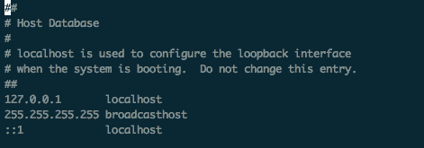

# 错误:getaddrinfo enotfound 和 localhost

> 原文:# t0]https://dev . to/dvddpl/error-getaddrinfo-enotford-localhost-4c 55

我把它放在这里是为了提醒我未来的自己和任何可能遇到这个奇怪错误的人。

在工作中，我们使用 nodejs 和无服务器框架来构建后端应用程序。为了测试它，我们只需用
在本地运行它

```
sls offline start --port 3001 
```

Enter fullscreen mode Exit fullscreen mode

今天，一个在远程工作的同事问我是否可以在本地运行这个应用程序，因为他得到了这个错误:
[](https://res.cloudinary.com/practicaldev/image/fetch/s--NQ0FPchD--/c_limit%2Cf_auto%2Cfl_progressive%2Cq_auto%2Cw_880/https://thepracticaldev.s3.amazonaws.com/i/94orzh0du54wdhvfmp8j.png)

我们搜索到的信息大多与 Webpack 或 Angular 有关，我们并没有使用它们，但它们在 etc/hosts 的配置中有一些共同的问题。

面对我工作站上的配置和他家里的笔记本电脑，我有:
[](https://res.cloudinary.com/practicaldev/image/fetch/s--Zv6QBIGL--/c_limit%2Cf_auto%2Cfl_progressive%2Cq_auto%2Cw_880/https://thepracticaldev.s3.amazonaws.com/i/zkpfdsetinvxui60utnt.png) 
其中 his 包含关于 OpenVN 客户端 SSL 的信息，但没有关于 localhost 的信息。可能当他配置 VPN 远程工作时，他覆盖了以前的内容，他在文件中添加了这一行:

```
127.0.0.1 localhost 
```

Enter fullscreen mode Exit fullscreen mode

一切都开始运转了。

附加提示:

*   编辑文件:转到主目录(`cd ~`)并打开 vim `sudo vi /etc/hosts`，然后按 I 键并开始编辑文件。

[](https://res.cloudinary.com/practicaldev/image/fetch/s--REJHmPl2--/c_limit%2Cf_auto%2Cfl_progressive%2Cq_auto%2Cw_880/https://thepracticaldev.s3.amazonaws.com/i/9m0zc89irdd23fkqi6b1.jpg)

*   要保存并退出 vim:按 ESC，然后按`:wq`或`:q!`,如果您只想退出而不保存。更多[备忘单点击此处](https://devhints.io/vim)