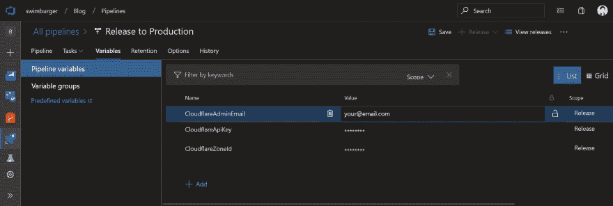
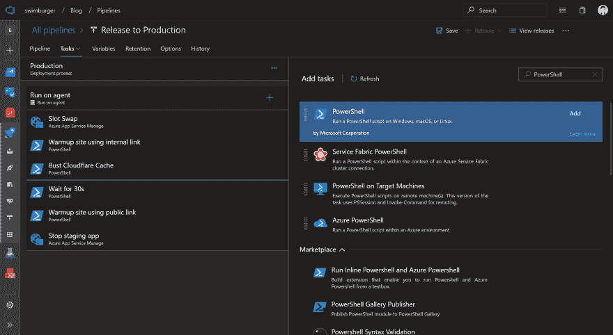
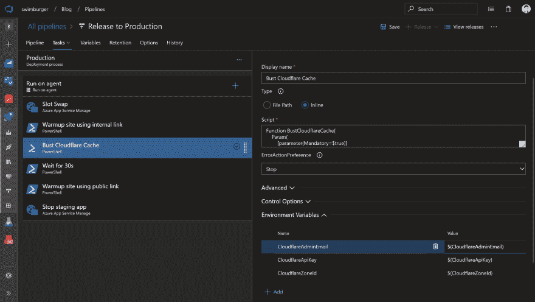

# 在 Azure DevOps 管道中使用 PowerShell 清除 Cloudflare 缓存

> 原文：<https://dev.to/swimburger/clearing-cloudflare-cache-using-powershell-in-azure-devops-pipelines-k38>

*以下帖子假设您已经安装了 Cloudflare 和 Azure Pipelines。*

当我将更改部署到应用程序时，这些更改并没有立即呈现给客户。这可能有很多原因，但通常是浏览器缓存。在这种情况下，清除浏览器缓存后，更改仍然没有显示出来。

那么，是什么在缓存网站的旧版本呢？web 服务器、数据库、负载平衡器还是代理服务器？

这是开发人员或系统管理员生活中常见的场景。结果是我没有遵循冗长的部署指南就部署了更改，该指南包含了清除所有缓存层的步骤。后悔自己的错误决定，我决定自动化这个过程，这样我就可以专注于编写代码，而不是解决部署问题。

该过程的一部分是清除 Cloudflare 的缓存，因此让我们了解一下我如何创建一个任务来清除 Cloudflare 的缓存，作为我的持续部署 Azure 管道(也称为 Visual Studio Team Service、Team Foundation Server)的一部分。

## 创建清除 Cloudflare 缓存任务

在创建我们的 Clear Cloudflare 缓存任务之前，我们需要从 Cloudflare 获取三个变量来与它们的 API 进行交互。

*   Cloudflare 管理员电子邮件地址
*   Cloudflare API 密钥
*   云耀斑区域 ID

要获得这些变量，请遵循前一篇文章“使用 Cloudflare 的 API 清除 Cloudflare 缓存”中的[“cloud flare API 密钥”一节中的说明。](https://dev.to/blog/powershell/powershell-snippet-clearing-cloudflare-cache-with-cloudflares-api#cloudflare-api-keys)

在我们的任务中，我们将使用所有三个变量，我们需要像这样在管道内部定义它们:

[](https://res.cloudinary.com/practicaldev/image/fetch/s--Ql39NmfP--/c_limit%2Cf_auto%2Cfl_progressive%2Cq_auto%2Cw_880/https://www.swimburger.net/media/1134/clearing-cloudflare-cache-azure-pipeline-variables.png)

既然我们的变量存储在 Azure DevOps 管道中，我们可以继续创建我们的任务。

导航到我们的管道，添加一个 PowerShell 任务，如下所示:

[](https://res.cloudinary.com/practicaldev/image/fetch/s--5_zbeRJN--/c_limit%2Cf_auto%2Cfl_progressive%2Cq_auto%2Cw_880/https://www.swimburger.net/media/1135/create-powershell-task-azure-pipelines.png)

让我们按如下方式配置任务:

[](https://res.cloudinary.com/practicaldev/image/fetch/s--UyMPWU-v--/c_limit%2Cf_auto%2Cfl_progressive%2Cq_auto%2Cw_880/https://www.swimburger.net/media/1136/configure-clear-cloudflare-cache-azure-pipeline-task.png)

**显示名称**:半身像云闪缓存

**类型**:内嵌

**脚本**:在我们的脚本中，我们将使用[的修改版本，也就是上一篇文章](https://dev.to/blog/powershell/powershell-snippet-clearing-cloudflare-cache-with-cloudflares-api)的 PowerShell 脚本。

修改后的版本将逻辑封装在一个函数中，并传递我们将在后面设置的环境变量。

```
Function  BustCloudflareCache{  Param(  [parameter(Mandatory=$true)]  [string]  $AdminEmail,  [parameter(Mandatory=$true)]  [string]  $ApiKey,  [parameter(Mandatory=$true)]  [string]  $ZoneId  );  $PurgeCacheUri  =  "https://api.cloudflare.com/client/v4/zones/$ZoneId/purge_cache";  $RequestHeader  =  @{  'X-Auth-Email'  =  $AdminEmail  'X-Auth-Key'  =  $ApiKey  };  $RequestBody  =  '{"purge_everything":true}';  Invoke-RestMethod  `
  -Uri  $PurgeCacheUri  `
  -Method  Delete  `
  -ContentType  "application/json"  `
  -Headers  $requestHeader  `
  -Body  $RequestBody  }  BustCloudflareCache  -AdminEmail  $Env:CloudflareAdminEmail  -ApiKey  $Env:CloudflareApiKey  -ZoneId  $Env:CloudflareZoneId 
```

Enter fullscreen mode Exit fullscreen mode

PowerShell 函数执行以下操作:

1.  构造 cache_purge 操作的 API URL，将您的区域 ID 嵌入其中
2.  设置所需的认证头，指定您的管理员电子邮件和 API 密钥
3.  将 HTTP 主体设置为 JSON 字符串，指定清除所有内容
4.  将所有这些放在一起，然后发送一个 HTTP 删除请求

有关更多详细信息，请阅读 cache_purge 的 [Cloudflare API 文档。](https://api.cloudflare.com/#zone-purge-all-files)

**环境变量**:

PowerShell 脚本将三个环境变量传递给函数，但是目前这些变量是$Null。

要定义环境变量，我们必须将管道变量连接到 PowerShell 任务的环境变量。

我们可以这样做，命名我们的环境变量，然后使用 **$()** 语法获取管道变量。

在执行时 **$(CloudflareAdminEmail)** 将被替换为管道变量的值。

| 名字 | 价值 |
| --- | --- |
| CloudflareAdminEmail | $(CloudflareAdminEmail) |
| CloudflareApiKey | $(CloudflareApiKey) |
| CloudflareZoneId | $(CloudflareZoneId) |

既然已经设置了任务，我们可以通过运行管道来测试它，该任务将清除 Cloudflare 的缓存。

## 结论

使用 Azure Pipelines，我们设置了一个 PowerShell 任务，它与 Cloudflare 的 API 进行交互，以清除 Cloudflare 边缘服务器上的缓存。通过将此作为部署管道的一部分，我们可以减少需要执行或忘记的手动步骤。

清空缓存后，我们现在可以添加另一个 PowerShell 任务，该任务抓取网站以重新水合 Cloudflare 的缓存( [ex1](https://gist.github.com/Swimburger/c2def1ea0dcb53d3d23030296c6e1b6c) 、 [ex2](https://dev.to/blog/powershell/powershell-snippet-crawling-a-sitemap) )。

自动化快乐！