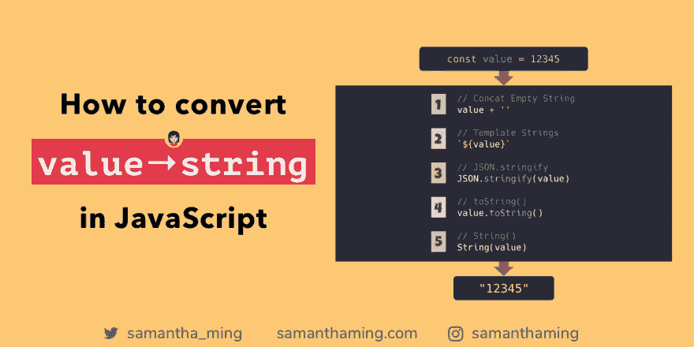

# 在 JavaScript 中将值转换为字符串的 5 种方法

> 原文：<https://dev.to/samanthaming/5-ways-to-convert-a-value-to-string-in-javascript-5877>

[](https://res.cloudinary.com/practicaldev/image/fetch/s--R1_vRfFY--/c_limit%2Cf_auto%2Cfl_progressive%2Cq_auto%2Cw_880/https://thepracticaldev.s3.amazonaws.com/i/1dhce0aq4x9xlifix859.png)

如果你遵循 Airbnb 的风格指南，首选的方法是使用“String()”👍

这也是我使用的一种方法，因为它是最显式的——让其他人容易理解你代码的意图🤓

记住，最好的代码不一定是最聪明的方法，它是最好的将你的代码的理解传达给其他人的方法💯

```
const value = 12345;

// Concat Empty String
value + '';

// Template Strings
`${value}`;

// JSON.stringify
JSON.stringify(value);

// toString()
value.toString();

// String()
String(value);

// RESULT
// '12345' 
```

## 比较 5 种方式

好的，让我们用不同的值来测试 5 种方法。以下是我们将要测试的变量:

```
const string = "hello";
const number = 123;
const boolean = true;
const array = [1, "2", 3];
const object = {one: 1 };
const symbolValue = Symbol('123');
const undefinedValue = undefined;
const nullValue = null; 
```

### 串联空字符串

```
string + ''; // 'hello'
number + ''; // '123'
boolean + ''; // 'true'
array + ''; // '1,2,3'
object + ''; // '[object Object]'
undefinedValue + ''; // 'undefined'
nullValue + ''; // 'null'

// ⚠️
symbolValue + ''; // ❌ TypeError 
```

从这里可以看到，如果值是一个`Symbol`，这个方法将抛出一个`TypeError`。除此之外，一切看起来都很好。

### 模板字符串

```
`${string}`; // 'hello'
`${number}`; // '123'
`${boolean}`; // 'true'
`${array}`; // '1,2,3'
`${object}`; // '[object Object]'
`${undefinedValue}`; // 'undefined'
`${nullValue}`; // 'null'

// ⚠️
`${symbolValue}`; // ❌ TypeError 
```

使用**模板字符串**的结果和 **Concat 空字符串**本质上是一样的。同样，这可能不是处理`Symbol`的理想方式，因为它会抛出一个`TypeError`。

如果你好奇的话，这是一个类型错误:`TypeError: Cannot convert a Symbol value to a string`

### JSON.stringify()

```
// ⚠️
JSON.stringify(string); // '"hello"'
JSON.stringify(number); // '123'
JSON.stringify(boolean); // 'true'
JSON.stringify(array); // '[1,"2",3]'
JSON.stringify(object); // '{"one":1}'
JSON.stringify(nullValue); // 'null'
JSON.stringify(symbolValue); // undefined
JSON.stringify(undefinedValue); // undefined 
```

因此通常不会使用 JSON.stringify 将值转换为字符串。这里真的没有强迫。我主要是通过这种方式来完成的。所以你知道你可以使用的所有工具。然后你可以根据情况决定用什么工具，不用什么工具👍

有一点我想指出来，因为你可能没听明白。当你对一个实际的`string`值使用它时，它会把它变成一个带有**引号**的字符串。

你可以在 Kyle Simpson 的《你不知道的 JS 系列》中了解更多内容:
[JSON Stringification](https://github.com/getify/You-Dont-Know-JS/blob/master/types%20%26%20grammar/ch4.md#json-stringification)

了解基本面的重要性！

是的，你可能已经注意到在我的代码笔记中，我经常引用凯尔的书。老实说，我学到了很多。不是来自计算机科学背景，我缺乏很多基础概念。而他的书让我意识到了了解基本面的重要性。对于那些想成为一名认真的程序员的人来说，提升的方法是真正理解基础知识。没有它，很难升级。你最终猜到了问题所在。但如果你了解了基本面，你就会明白一件事的“为什么”。知道“为什么”会帮助你更好地执行“如何”。总之，强烈推荐这个系列给那些想成为高级程序员的人！

### toString()

```
string.toString(); // 'hello'
number.toString(); // '123'
boolean.toString(); // 'true'
array.toString(); // '1,2,3'
object.toString(); // '[object Object]'
symbolValue.toString(); // 'Symbol(123)'

// ⚠️
undefinedValue.toString(); // ❌ TypeError
nullValue.toString(); // ❌ TypeError 
```

所以，当你想把一个值转换成一个**字符串**时，战斗实际上归结为`toString()`和`String()`。这个做得很好。除了它会为`undefined`和`null`抛出一个错误。所以一定要注意这一点

### 字符串()

```
String(string); // 'hello'
String(number); // '123'
String(boolean); // 'true'
String(array); // '1,2,3'
String(object); // '[object Object]'
String(symbolValue); // 'Symbol(123)'
String(undefinedValue); // 'undefined'
String(nullValue); // 'null' 
```

好吧，我想我们找到赢家了🏆

如你所见，`String()`很好地处理了`null`和`undefined`。不会抛出错误——除非这是您想要的。记住我的建议是一般来说。你会最了解你的 app，所以要挑最适合你情况的方式。

## 结论:字符串()🏆

向您展示了所有不同的方法如何处理不同类型的值。希望您能意识到这些差异，并且知道下次处理代码时应该使用什么工具。如果你不确定，`String()`总是一个很好的默认值👍

## 社区输入

*[@MaxStalker](https://twitter.com/MaxStalker/status/1132375146340278273) :* 我会根据应用程序使用不同的方法:

*   " "+ val:简单地将数字转换成字符串——比如说在。地图()
*   JSON.stringify(val):需要转换小型非嵌套对象
*   。toString(radix):将数字转换为十六进制或二进制

*[@frontendr](https://twitter.com/frontendr/status/1132393041350856704) :* 使用 JSON.stringify 时要小心，那样会把一个字符串变成一个带引号的字符串😉

*[@super.pro.dev](https://www.instagram.com/super.pro.dev/) :* 我也知道:new String (foo)但是我不喜欢这个方法(它会创建一个 String 的对象，对比 String(没有“new”)创建 String 原语)

## 资源

*   [MDN 网络文档:toString](https://developer.mozilla.org/en-US/docs/Web/JavaScript/Reference/Global_Objects/String/toString)
*   [Airbnb JavaScript 风格指南](https://github.com/airbnb/javascript#coercion--strings)
*   [2 真实性:在 JavaScript 中把一个值转换成字符串](http://2ality.com/2012/03/converting-to-string.html)
*   [将数字转换成字符串](https://stackabuse.com/javascript-convert-number-to-string/)
*   [栈溢出:铸入串](https://stackoverflow.com/questions/11083254/casting-to-string-in-javascript)
*   [详细加法运算符](https://dmitripavlutin.com/javascriptss-addition-operator-demystified/)
*   [YDKJS:强制](https://github.com/getify/You-Dont-Know-JS/blob/master/types%20%26%20grammar/ch4.md#tostring)

* * *

**感谢阅读❤**
问好！[insta gram](https://www.instagram.com/samanthaming/)|[Twitter](https://twitter.com/samantha_ming)|[脸书](https://www.facebook.com/hisamanthaming) | [媒体](https://medium.com/@samanthaming) | [博客](https://www.samanthaming.com/blog)