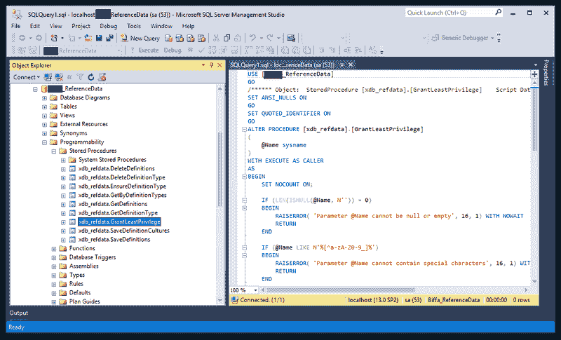

# Sitecore v9.1 中“可信连接”的痛点

> 原文：<https://dev.to/jermdavis/a-pain-point-with-trusted-connection-in-sitecore-v9-1-272k>

我目前正在从事的一个项目要求将 Sitecore v9.1 从使用默认 SQL 安全帐户运行更改为使用客户端提供的特定 Active Directory 帐户的可信连接。虽然要做到这一点还有一些工作要做，但应该不会太难。但是为了变得更聪明，我偶然发现了一个似乎值得记录的问题…

## 有点背景:

您可能从未深入研究过 Sitecore 提供的 SQL 数据库，但是一些更现代的数据库包括一个名为`GrantLeastPrivilege`的存储过程。它们似乎没有被正式记录，但是当您检查它们时，它们是帮助脚本，确切地授予用户帐户访问特定 Sitecore 数据库所需的数据库权限:

[](https://jermdavis.files.wordpress.com/2019/05/grantleastprivscrpt.png)

因此，如果您需要从一组数据库帐户转移到另一组，您希望它们会有所帮助…

## 问题:

但是当我试图将这些脚本用于客户端提供的活动目录帐户时，我得到了奇怪的不一致的结果。当我试图用我的用户
调用一些数据库中的过程时

```
USE [MyInstance\_Xdb.Collection.Shard0]
GO
[xdb\_collection].[GrantLeastPrivilege] 'Domain\ProcessAccountName' 
```

Enter fullscreen mode Exit fullscreen mode

我成功了。它会写出它所做的所有更改。但是当我用同样的方法在其他数据库中调用同样的程序时

```
USE [MyInstance\_ProcessingEngineStorage]
GO
[sitecore\_processing\_storage].[GrantLeastPrivilege] 'Domain\ProcessAccountName' 
```

Enter fullscreen mode Exit fullscreen mode

取而代之的是错误信息——比如:

```
Msg 102, Level 15, State 1, Line 9Incorrect syntax near '\'. 
```

Enter fullscreen mode Exit fullscreen mode

当我在所有非内容数据库中测试它时，它在处理引擎存储、营销自动化和处理方面都出现了问题。池，处理。任务，处理引擎任务和参考数据。

看看底层代码，运行的脚本以
的形式运行语句

```
EXECUTE('grant execute on TYPE::[database].[thing] TO [' + @Name + ']') 
```

Enter fullscreen mode Exit fullscreen mode

失败的看起来像

```
EXECUTE('grant execute on TYPE::[database].[thing] TO ' + @Name) 
```

Enter fullscreen mode Exit fullscreen mode

所以很容易调整它们来获得成功。但是这种开箱即用的方式并不奏效，这有点令人苦恼。所以我向 Sitecore 支持部门报告了这个问题，他们承认这是一个错误。如果你也碰到这个问题，请参考 bug 331327。

(是的，我知道整个“生成 SQL 语句时字符串连接是危险的——这是另一天的辩论。)