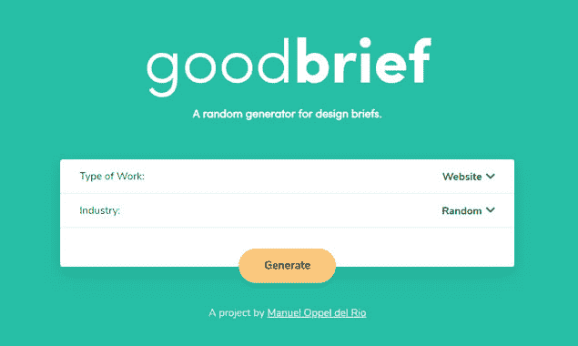
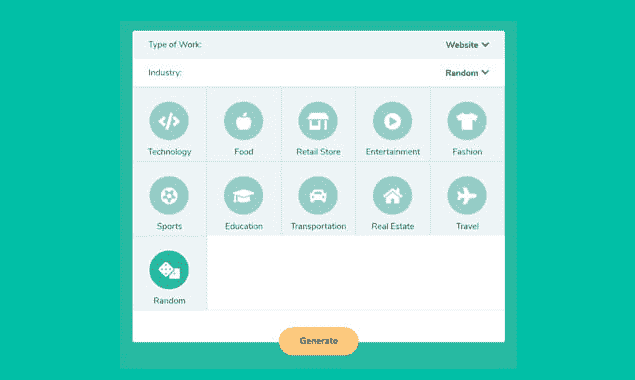

# good brief——设计概要的随机生成器

> 原文：<https://dev.to/manutastic/goodbrief-a-random-generator-for-design-briefs-1070>

你好，戴夫·托，

我是新来的，我想给你们看看这个我断断续续做了一段时间的兼职项目。我真的很感谢你的反馈！

我去了一所艺术和设计学校，所以从与同学的交谈和个人经历中，我知道设计专业的学生总是在寻找增加他们作品的方法。问题是，如果没有经验，通常很难找到专业工作。仅仅是在你的头脑中想出一个主意，并不等同于试图满足别人的要求。

这就是为什么我做了 [goodbrief](http://goodbrief.io/) 。它生成随机的设计概要——一个假设的客户会给你的包含所有设计规范的文档。你可以从许多不同类型的设计工作和行业中进行选择，这样你总是有新鲜的简报来练习。

## 1.0 版本

就像我说的，我已经半工半读这个项目有一段时间了。我在 2016 年制作了最初的版本(称为/Brief ),我很惊讶它的受欢迎程度！它在世界各地都被使用，我喜欢收到人们的电子邮件，告诉我他们觉得这个网站很有用。它甚至被一些学校用来教授设计，并出现在像 [UCreative](http://www.ucreative.com/articles/designer-creates-website-for-randomly-generated-design-briefs/) 这样的网站上。我喜欢我见过的人们根据我的网站简介做出的设计，2018 年，我决定从头开始重新设计网站。原来的版本还可以在[这里](http://goodbrief.io/v1)买到。

## 2.0 版本

虽然最初的网站只是用客户端 Javascript 和 jQuery 构建的，但我决定使用 Node.js 和 Express.js 进行重新设计。这将允许我为我计划的其他功能打下基础。目前，这次更新增加了几个新的工作类型和行业，以及更好的句子生成系统和刷新的设计。如果您对未来的更新有任何建议，请随时联系我们。

今天标志着一个重要的里程碑:GoodBrief 已正式启动产品搜索！在撰写本文时，它正处于 [#2 产品日现场](https://www.producthunt.com/posts/goodbrief)，反馈令人惊讶。如果你对那种东西感兴趣，请[去看看。](https://www.producthunt.com/posts/goodbrief)

就是这样！我只是想与社区分享这个项目。如果你决定看看它，请让我知道你是否最终用它做了什么。看到基于这些简介的设计是整个项目中我最喜欢的部分😊