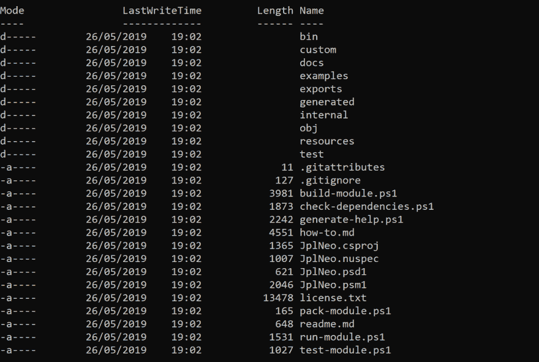

# 自动重测。PowerShell

> 原文:# t0]https://dev . to/omiosec/autoist-powershell-ekj

几年前，API、RestFull 和 webservices 是 Ops 的时髦词汇，他们不必关心这些。但是今天，你不能没有他们。如果您使用云服务、防火墙或任何硬件接口，您需要使用 Rest Full API。API 无处不在！

在 webservice 中使用一个方法或路径并不是什么大不了的事情。PowerShell 中有一个 cmdlet，invoke-RestMethod 可以让您轻松处理这个问题。但只是针对一个方法，一个路径，不是针对整个 API。如果你需要处理整个 API，那就另当别论了。您需要构建一个客户端，处理所有方法的参数，并为每个响应的每个对象创建一个自定义 PowerShell 对象。

这意味着，对于 API 中的每个方法，必须编写函数、返回对象、接受和单元测试，并且需要创建通信工具。这是一项耗时且容易出错的任务。更重要的是，这只是为了使用 API，你还需要添加你自己的逻辑，你自己的代码来构建你的基于 API 的模块。

### 安装自动测试。PowerShell

AutoRest 是自动执行这项任务的工具，它为每个方法创建一个函数，为每个返回的对象创建一个自定义对象。该应用程序构建在 Node.js 中，它允许您从 RestApi 规范文件、swagger 或 OpenApi 文件构建客户端库。AutoRest 用于从 Azure API 生成客户端。Il 帮助管理更新和新功能。现在 PowerShell 用户可以使用这个工具了。

自动重测。PowerShell 使 PowerShell 用户能够通过使用规范文件作为输入来创建 PowerShell 模块来处理 API。

当这些工具使用 Node.js 时，第一步是安装 Node.js 10.15。您还需要获得 PowerShell 核心和。net core SDK 2.2。在 Windows 平台上，我使用 [Chocolatey](https://chocolatey.org/) 包管理器来部署和更新工具。

```
choco  install  powershell-core  choco  install  node-lts  choco  install  dotnetcore 
```

Enter fullscreen mode Exit fullscreen mode

现在我们可以安装 AutoRest，但是要获得 PowerShell 支持，我们需要安装测试版。

```
npm install -g autorest@beta 
```

Enter fullscreen mode Exit fullscreen mode

如果已经安装了 AutoRest 怎么办？在这种情况下，您可以使用此命令重置 AutoRest。

```
autorest -reset 
```

Enter fullscreen mode Exit fullscreen mode

### 使用自动重测

安装完成后，我们就可以开始构建我们的第一个 PowerShell API 客户端了。我们需要一个 API，但更需要一个描述这个 API 的文档。对于 RestFull API，这个文档是一个 Swagger 或 OpenApi 文件。这是一个简单的描述服务的 YAML 或 JSON 文档。它包括路径或资源、操作或动词、参数和响应表示。

这是从 AutoRest 创建客户端所需的唯一文件。它不会尝试连接到 API 或其他任何东西。它刚刚读了文档。

要从 swagger 文件开始创建 PowerShell 模块，命令很简单(确保使用 PowerShell 核心):

```
autorest --powershell --input-file:PathToJson-Yaml-File 
```

Enter fullscreen mode Exit fullscreen mode

[](https://res.cloudinary.com/practicaldev/image/fetch/s--U3YDHWFr--/c_limit%2Cf_auto%2Cfl_progressive%2Cq_auto%2Cw_880/https://thepracticaldev.s3.amazonaws.com/i/24ohdrsszcypjaibxzkw.PNG)

这将在一个名为“Generated”的文件夹中生成一个模块，如果你需要改变文件夹名或文件夹路径你可以使用- OutPutFoler:参数来使用你想要的文件夹。

如果导航到生成的文件夹，您将找不到经典脚本模块。

[](https://res.cloudinary.com/practicaldev/image/fetch/s--VGZamo8k--/c_limit%2Cf_auto%2Cfl_progressive%2Cq_auto%2Cw_880/https://thepracticaldev.s3.amazonaws.com/i/impx4sw6okq2jehheqa3.PNG)

有一个测试文件夹包含纠缠文件。有一个自定义文件夹，可用于向模块添加其他 PowerShell 功能。你会发现几个文件夹和文件。如果您打开. psm1 文件，您会发现类似这样的内容。

```
# Load the private module dll  $null  =  Import-Module  -Name  (Join-Path  $PSScriptRoot  './bin/xxx.private.dll')  # Get the private module's instance  $instance  =  [xxxx.Module]::Instance 
```

Enter fullscreen mode Exit fullscreen mode

生成的模块是一个二进制模块，在包含 cmdlet 的 DLL 中有一个. Net framework 程序集。您可以在生成的文件夹中找到源代码。

如果您在生成的文件夹中查找 bin 文件夹，您将找不到它。该模块需要编译。对于此任务，您不需要 Visual Studio 或键入复杂的 dotnet 命令。这个任务有一个构建脚本，build-module.ps1

您可以不带任何参数运行脚本，但也可以使用开关来执行一些任务:

*   快跑。这将生成模块，创建 PowerShell 运行空间并加载模块，以便您可以在独立的控制台中使用它

*   测试时，它将运行测试文件夹中的 pester 脚本，并且只有在所有测试都通过的情况下才构建模块

*   Doc，这将通过在 generate-help.ps1 脚本中运行 new-markdownhelp cmdlet 来创建文档。如果此任务运行无误，它还将构建模块

*   代码，这将生成模块并打开 VsCode

*   包装，它将生成包装模块

*   发布，它将在发布模式下构建模块并编译代码。

要运行该脚本，请打开 PowerShell 核心控制台并键入:

```
.\generated\build-module.ps1  -run 
```

Enter fullscreen mode Exit fullscreen mode

编译可能会失败，这取决于 swagger 文件或 AutoRest 版本。在这种情况下，您可能需要打开 generated\api\Models 文件夹中的源代码来启动调试会话。

如果构建成功，你将进入一个独立的控制台，在那里你可以测试你的模块。

```
get-command  -module  yourModuleName 
```

Enter fullscreen mode Exit fullscreen mode

此命令将列出您可以从生成的模块中使用的所有公共 cmdlet。

但是该模块只是处于调试模式，还没有准备好投入生产。更有甚者，该模块在 API 中每条路径只包含一个函数，怎么能添加我们自己的代码和逻辑呢？最后一件事，如何处理 API 认证？

要添加自定义逻辑，我们需要使用自定义文件夹。它包含一个模块文件 ModuleName.custom.psm1，该文件将在构建过程中加载，以便在 export 文件夹中创建 cmdlets。可以使用传统的脚本文件和/或 C # cmdlets。但是只有脚本 cmdlet 让你使用从 swagger 规范生成的函数和 cmdlet。

但是在这两种情况下，我们都需要知道模块名称空间。默认名称是“样本”。Api”。但是我们可以用 namespace 参数来改变它。

```
autorest --powershell --namespance:MyNameSpace 
```

Enter fullscreen mode Exit fullscreen mode

创建一个脚本文件是不够的，为了使用这个模块，你必须添加一些参数。

```
[ValidateNotNull()]  [frpsug.Runtime.SendAsyncStep[]]  ${HttpPipelineAppend},  [Parameter(DontShow)]  [ValidateNotNull()]  [frpsug.Runtime.SendAsyncStep[]]  ${HttpPipelinePrepend},  [Parameter(DontShow)]  [System.Uri]  ${Proxy},  [Parameter(DontShow)]  [ValidateNotNull()]  [System.Management.Automation.PSCredential]  ${ProxyCredential},  [Parameter(DontShow)]  [System.Management.Automation.SwitchParameter]  ${ProxyUseDefaultCredentials} 
```

Enter fullscreen mode Exit fullscreen mode

当然，PowerShell 标准指南在这里适用，您应该用函数的名称命名您的脚本，您应该应用动词-名词模式，并且您应该在 test 文件夹中为每个函数编写至少一个 Pester 测试。并且一定要模仿 AutoRest 生成的任何函数。否则，您将无法在构建模块之前执行任何测试。

在生成过程中处理脚本 cmdlets。在自定义文件夹中构建后添加文件不会产生任何结果。每次添加自定义 cmdlet 时，都需要构建该模块。

为了测试该模块，您可以直接在测试文件夹中使用 invoke-pester。您也可以使用构建脚本来执行您的测试。

```
.\generated\build-module.ps1  -test 
```

Enter fullscreen mode Exit fullscreen mode

它将运行测试，并在此停止。如果在运行测试时 Pester 返回一个错误，它将停止构建过程。

您也可以添加 c# cmdlet，但 AutoRest 不鼓励这样做。PowerShell 团队。cmdlet 将在构建过程中编译并放入 DLL 中。它们必须使用与模块相同的命名空间。

您还可以使用自定义文件夹来更改模块行为。许多 API 使用某种安全措施，如 http 头中的令牌或 APIKEY。目前，自动重测。PowerShell 无法处理这种情况，模块可能无法工作。但是我们可以利用分部类来改变模块连接到 API 的方式。分部类只是将一个类的相同定义分成不同的文件。这些文件在编译过程中被合并。

在我们的例子中，我们需要在代码中扩展名为 Module 的类，为每个 http 请求添加一个 Apikey。但是我们如何将 apikey 传递给模块呢？不可能将它作为参数添加到每个路径中。但是我们可以从其他渠道获得。我们可以使用环境变量来代替。下面是加载 HttpResponseMessage 并从环境变量中添加 ApiKey nammed api_key 的代码。

```
namespace MyNameSpace
{
    using Runtime;
    using System.Collections.Generic;
    using System.Net.Http;
    using System.Threading;
    using System.Threading.Tasks;
    /// <summary>A class that contains the module-common code and data.</summary>
    /// <notes>
    /// This is a modified version from https://github.com/Azure/autorest/blob/master/docs/powershell/samples/timeswire/generated/custom/Module.cs
    /// </notes>
    public partial class Module
    {
        partial void CustomInit()
        {

            this._pipeline.Append(AddApiKey);

            this._pipelineWithProxy.Append(AddApiKey);
        }
        protected async Task<HttpResponseMessage> AddApiKey(HttpRequestMessage request, IEventListener callback, ISendAsync next)
        {
            // check if the query already contain a ?
            var sepChar = string.IsNullOrEmpty(request.RequestUri.Query) ? "?" : "&";

            // add on the api_key
            request.RequestUri = new System.Uri(
                request.RequestUri.AbsoluteUri +
                sepChar +
                "api_key=" +
                System.Environment.GetEnvironmentVariable("nasaapikey")
                );

            return await next.SendAsync(request, callback);
        }
    }
} 
```

Enter fullscreen mode Exit fullscreen mode

分部类将使用模块进行编译，并为模块进行的每个 http 查询添加 api_key 参数。

您将需要使用 build-module.ps1 脚本再次构建该模块

在添加我们的定制 cmdlet 和身份验证模块之后，在执行单元测试并生成我们需要打包模块的文档之后。

首先，我们需要创建一个版本。

```
.\generated\build-module.ps1  -release 
```

Enter fullscreen mode Exit fullscreen mode

之后，我们需要修改。nuspec 文件放在生成的文件夹的根目录下。打开文件并添加更改版本、作者、描述、项目 Url 和许可证 Url 字段。

我们现在可以使用 pack-module.ps1 脚本为我们的模块创建一个 nuget 包。

所有这些任务都可以通过管道实现自动化。使用 Azure DevOps pipeline，您必须确保使用 PowerShell 核心，而不是 Windows 版本。

您需要两个任务，一个生成模块，另一个构建并测试它。

但是记住，自动重测。PowerShell 仍处于测试阶段。您可能会发现一些错误和一些限制。

但是你可以随时在 https://github.com/Azure/autorest.powershell/issues[上发帖](https://github.com/Azure/autorest.powershell/issues)