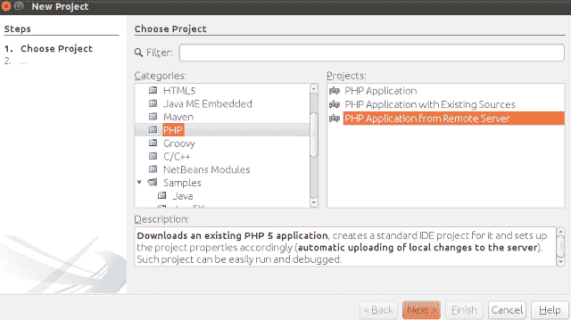
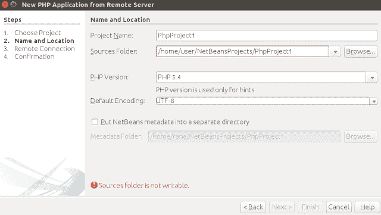
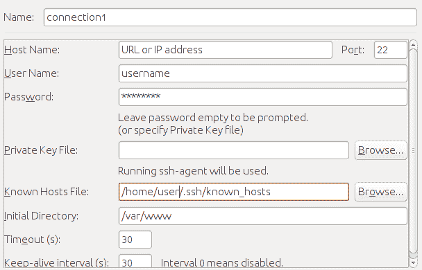
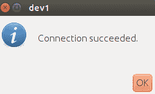
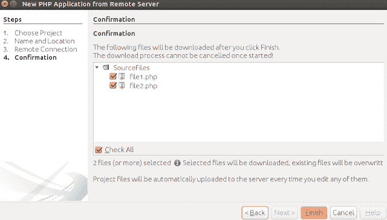
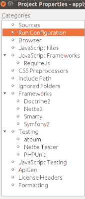

# 使用 Netbeans 编辑远程 PHP 项目

> 原文：<https://dev.to/anuragrana/editing-remote-php-project-using-netbeans-3gkg>

考虑一下这个场景。你写了一些代码并把它放在一个远程服务器上。现在您需要编辑源文件。你会怎么做？

这是第一种方法

*   SSH 到您的服务器。

> *$ ssh 用户名@ip 地址*

*   导航到放置源文件的目录

> *$ cd 文件夹路径*

*   使用 vi/emac/nano 编辑器编辑代码。省省吧。退出。

> *$ VI file1.php*

第二种方法

*   将文件从远程服务器复制到本地机器。

> *$ scp 用户名@ip 地址:文件路径*

*   使用您最喜欢的 IDE/编辑器编辑文件。省省吧。
*   将文件上传回远程服务器。

> *$ scp 本地机器文件路径用户名@ip 地址*

第三种方法(推荐用于大型项目) :

打开 Netbeans IDE。点击‘新项目’

从类别列表中选择‘PHP’。

在项目列表中选择‘来自远程服务器的 PHP 应用程序’。单击下一步。

在“名称和位置”屏幕上，填写项目名称，然后单击下一步。

在“远程连接”屏幕上，单击“管理”按钮。

输入连接名称，选择连接类型为“SFTP”。单击确定。

一个新的屏幕将出现(见截图)。填写 IP 地址、用户名和密码等详细信息。端口应该是 22。

在“初始目录字段”中，键入远程服务器上代码所在目录的绝对路径。可能是“/var/www”或者类似“/home/user/project”的东西。

填写所有详细信息后，单击“测试连接”按钮。如果一切顺利，那么连接将会成功。

在项目 URL 中键入 [http://localhost](http://localhost)

请确保您的上传目录是正确的。当您在屏幕上按下 contr+s 时，这是保存代码的地方。

单击下一步。

现在在确认屏幕上，它将要求从远程服务器下载文件。如果您想下载所有文件，请选中全部。

单击 finish 按钮，它会将所有文件从远程服务器下载到本地服务器。这可能需要一些时间，取决于项目的大小。

右键单击 IDE 左侧窗格中的项目名称。单击属性菜单项。这将打开项目属性窗口。

单击“运行配置”条目。

在主窗格中，请参见“上传文件”文本字段。“保存时”应该在那里。这意味着每次在 IDE 中保存文件时，它们都会在远程服务器上更新。

每次在 IDE 中创建新文件或删除新文件时，相同的更改都会反映在远程服务器上。您可以通过右键单击项目中的源文件夹，然后选择“上传”或“下载”选项来明确上传或下载文件。

现在你不必每次需要更新文件时都登录到远程服务器。

**更多来自作者:**

*   [**如何在 pythonanywhere 服务器上免费托管 Django app**](https://www.pythoncircle.com/post/18/how-to-host-django-app-on-pythonanywhere-for-free/)
*   [**如何使用 Office 365**](https://www.pythoncircle.com/post/36/how-to-send-email-from-python-and-django-using-office-365/) 从 Python 和 Django 发送邮件
*   [**如何用 Django 使用 AJAX**](https://www.pythoncircle.com/post/130/how-to-use-ajax-with-django/)
*   [**Python 脚本 2:抓取某网站的所有邮件**](https://www.pythoncircle.com/post/217/python-script-2-crawling-all-emails-from-a-website/)
*   [**如何用 python 创建完全自动化的电报通道**](https://www.pythoncircle.com/post/265/how-to-create-completely-automated-telegram-channel-with-python/)
*   [**使用 python Django**](https://www.pythoncircle.com/post/394/get-latest-bitcoin-and-other-crypto-currencies-rates-using-python-django/) 获取最新的比特币和其他加密货币汇率