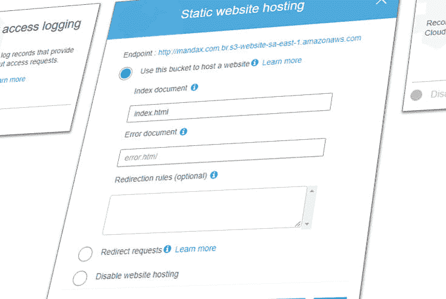
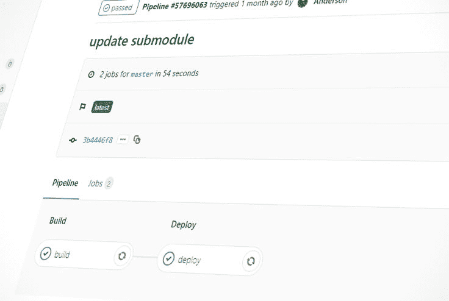

# 静态博客:使用雨果，S3 和部署与 Gitlab 管道

> 原文：<https://dev.to/mandax/static-blog-using-hugo-s3-and-deploying-with-gitlab-pipeline-5pc>

<sup>图片作者:[@ dsmacines](https://unsplash.com/@dsmacinnes)T3】</sup>

如果你想通过推一个新的提交来写博客，这篇文章是为你准备的，在这里我将试着解释我是如何部署我的博客的，我们将使用 Aws，Gitlab 和 Hugo。使用 Circle CI、Heroku、Azure、Zeit、Github、Bitbucket、Jenkins 等可以应用相同的概念。如果您已经有了要部署的静态内容，也可以跳过 Hugo 部分。

# 要求

*   雨果
*   饭桶

# 必备技能

*   饭桶
*   降价(写帖子)

# 问题

自从我开始从事开发工作以来，我总是有朋友和同事鼓励我开始写作，我从未开始写作的原因之一是建立博客、选择或制作布局以及围绕这个世界的一切。

我知道今天我们有像 dev.to 这样的优秀社区要写，但说实话，我想有一个地方把我所有的东西放在一起，不仅仅是代码，还有设计、3d、动画，也许还有我的个人想法，我希望写作的过程可以无缝地融入我作为开发人员的活动和静态生成的网站中，以低廉的成本部署在任何地方，不涉及任何魔法。

[](https://i.giphy.com/media/NmerZ36iBkmKk/giphy.gif)

# 解

这个解决方案的第一点是使用 Git 来部署一个新的帖子，而不使用任何沉重的*文本编辑器*，只需要 markdown。为此，我需要建立一个由新提交触发的连续交付管道。

然后，[雨果](https://gohugo.io/)！
T3T5】

# 雨果加油

## 安装

由于我用的是 macOS，所以我用 brew 安装了 Hugo，但是你可以在任何平台上安装它，只要在这里勾选[即可。](https://gohugo.io/getting-started/installing)

```
brew install hugo 
```

## 创建新站点

要创建一个新网站，你需要运行这个命令:

```
hugo new site [your-site-name] 
```

## 主题

现在我们需要为我们的网站选择和安装一个主题。我选择的主题是 ***Manis*** 由 **Yurizal Susanto** 开发，这是一个非常简约、干净和美丽的主题，当然，我自己对它进行了修改。你可以在这里查看[可用的主题](https://themes.gohugo.io/)。

要安装一个主题，您只需要将它的存储库克隆为 Hugo 项目的子模块:

```
git clone https://github.com/yursan9/manis-hugo-theme themes/manis 
```

Hugo 有一个名为`config.toml`的配置文件，这个文件包含我们网站的配置，主题也可以有一些特定的配置，比如颜色、图标和主题开发者放在那里的几乎任何东西。这使得 Hugo 非常灵活，你可以为许多不同的目的设计独特的主题。

要查看我们最近下载的主题有什么配置，我们可以在名为`exampleSite`的文件夹中的主题文件夹中找到它，顾名思义，这是一个用该主题构建的示例网站，你可以复制它的`config.toml`并通过覆盖默认的`config.toml`将其用于你的项目。

## 跑步

要在本地运行项目，只需键入:

```
hugo server 
```

# AWS - S3

## 快速解释

S3 桶作为一个存储，因为它就像一个容器来存储你的任何类型的文件，幸运的是`aws`有一个功能，可以将你的桶作为一个网站。因此，通过在它里面有一些`index.html`，你将能够在线看到它，并且，如果你有一个域，你可以使用 *Route 53* 将它指向你的桶，[查看这里的文档](https://docs.aws.amazon.com/AmazonS3/latest/dev/website-hosting-custom-domain-walkthrough.html)。

## 创建一个桶

要创建一个桶，我们只需进入 [Aws 控制台](https://console.aws.amazon.com/s3)并找到 *S3* 服务部分，在页面内点击蓝色按钮*创建桶*。将出现一个模式，以便您可以配置您的存储桶，但是，出于这个目的，我们还不需要进行任何特定的配置，只需命名存储桶，我们就可以开始了。

创建我们的 bucket 后，我们需要将其设置为公共可读，为此我们需要单击它的名称，然后在*权限*选项卡中，找到 *Bucket 策略*链接，在那里添加这个 *JSON* ，不要忘记用您的 Bucket 名称
替换`<your-bucket-name>`

```
 {  "Version":  "2012-10-17",  "Statement":  [  {  "Sid":  "PublicReadForGetBucketObjects",  "Effect":  "Allow",  "Principal":  {  "AWS":  "*"  },  "Action":  "s3:GetObject",  "Resource":  "arn:aws:s3:::<your-bucket-name>/*"  }  ]  } 
```

现在我们需要告诉 aws 将我们的 bucket 托管为一个网站，为此，我们需要转到 Properties 选项卡并激活一个静态网站托管，将默认文件设置为`index.html`。
您的 bucket URL 将显示在页面顶部。

[](https://res.cloudinary.com/practicaldev/image/fetch/s--x2bdCIrb--/c_limit%2Cf_auto%2Cfl_progressive%2Cq_auto%2Cw_880/http://www.mandax.com.img/post1_bucket_host.jpg)

## 获取您的访问密钥

在下一步之前，我们需要创建一个访问密钥，Gitlab 将使用它来将我们的网站文件同步到我们的 s3 存储桶，最简单的方法就是基于我们的管理员用户创建一个密钥，但是我们不会这样做，因为…安全第一，对吗？

[](https://res.cloudinary.com/practicaldev/image/fetch/s--sf8XdeiL--/c_limit%2Cf_auto%2Cfl_progressive%2Cq_66%2Cw_880/https://media.giphy.com/media/BouwBuyFhQwlQYBvmG/giphy.gif%3Fwidth%3D100)

最安全和正确的方法是创建一个策略，授予足够的访问权限来同步文件和我们的 bucket。

## 创建策略

在 aws 控制台中，转到**服务> IAM >客户管理策略>创建策略**，然后点击 *JSON* 选项卡并粘贴此文本，当然是用您的 bucket 的名称修改`<your-bucket-name>`。

```
 {  "Version":  "2012-10-17",  "Statement":  [  {  "Sid":  "ListObjectsInBucket",  "Effect":  "Allow",  "Action":  [  "s3:ListBucket"  ],  "Resource":  [  "arn:aws:s3:::<your-bucket-name>"  ]  },  {  "Sid":  "AllObjectActions",  "Effect":  "Allow",  "Action":  "s3:*Object",  "Resource":  [  "arn:aws:s3:::<your-bucket-name>/*"  ]  }  ]  } 
```

这将授予读取存储桶内所有对象的权限，并允许同步文件所需的所有对象操作。

## 创建用户

现在我们有了一个策略，我们需要将它分配给一个专门为 Gitlab 访问创建的新用户，这样我们就可以撤销访问，而不会危及我们的主用户。

在 IAM 页面，添加一个新用户，其 ***程序化权限******直接附加已有策略*** 。将为您显示一个带有搜索栏的列表，在该搜索栏上，您可以键入我们的策略名称并将其添加到用户。之后，您可以跳过下一步，将会生成一个 ***访问密钥 ID*** 和一个 ***秘密访问密钥*** 。将这些密钥保存在临时文件中。

# 连续交货

这里的想法是当一个新的提交被推送到 Gitlab 时，构建您的 Hugo 网站并将其发送到您的 s3 bucket。

## Gitlab CI/CD

**设置 aws 访问键**

在 Gitlab 上的库内，进入**设置> CI/CD >变量**并创建两个新变量:

[](https://res.cloudinary.com/practicaldev/image/fetch/s--CkwBdCiZ--/c_limit%2Cf_auto%2Cfl_progressive%2Cq_auto%2Cw_880/http://www.mandax.com.img/post1_keys.jpg)

1.  **AWS_ACCESS_KEY_ID** 以访问密钥 ID 为值
2.  **AWS_SECRET_ACCESS_KEY** 以密钥为值。
3.  保存

如果您问为什么不将这些密钥放在项目或部署脚本中，这只是为了不在代码中公开它们，并且不建议提交这样的敏感数据，因为根据项目的结构和将访问存储库的团队，您可能会泄漏密钥。在最坏的情况下，项目将使用管理员密钥，它将授予找到密钥的人完全访问权限。

## 配置 CI/CD

Gitlab 很聪明，它会在我们的存储库中寻找可以自动触发管道的指令，这个文件的名字是`.gitlab-ci.yml`。让我们创建这个文件，并给它两个简单的指令，一个用于构建 Hugo 网站，另一个用于在 s3 bucket 上同步构建的文件。

*。gitlab-ci.yml*

```
 stages:
      - build
      - deploy

    cache:
      paths:
        - public

    build:
      image: orus/hugo-builder:latest
      stage: build
      only:
        - master
      before_script:
       - git submodule sync --recursive
       - git submodule update --init --recursive
      script:
        - hugo

    deploy:
      image: xueshanf/awscli:latest
      stage: deploy
      only:
        - master
      script:
        - aws s3 sync public s3://<your-bucket-name> 
```

### 快速交代

第一个服务`build`将使用 docker 映像`orus/hugo-builder:latest`，它包含将用于构建我们项目的 Hugo 版本。只有当一些提交被推送到*主*分支时，并且在它运行一个脚本来克隆容器内的子模块之前，这个服务才会被触发。记住 Hugo 主题是一个子模块，所以如果我们只是克隆存储库，子模块将不会存在，Hugo 构建将使用默认主题或者无法构建。

第二个服务`deploy`将把构建的文件同步到我们的 s3 bucket，不要忘记用您的 bucket 的名称替换`<your-bucket-name>`。

[](https://res.cloudinary.com/practicaldev/image/fetch/s--iytQR3S6--/c_limit%2Cf_auto%2Cfl_progressive%2Cq_auto%2Cw_880/http://www.mandax.com.img/post1_pipeline.jpg)

# 就是这样

现在，要部署一篇新的博客文章，我们只需要将它推送到主分支，这个概念可以应用于许多不同的方式，我们可以推断它，并向我们的管道添加更多的步骤，包括单元测试和许多事情。

我认为这对于一个开发公司来说可以是一个很好的解决方案，可以高效地部署静态页面，不需要任何手动工作，只是自动和安全的。

[](https://i.giphy.com/media/26xBENWdka2DSvvag/giphy.gif)

# 参考文献

[Go Hugo](https://gohugo.io/)

[Gitlab Ci docs](https://docs.gitlab.com/ee/ci/)

[Markdown Guide](https://www.markdownguide.org/)

[Aws IAM Policies Guide](https://docs.aws.amazon.com/IAM/latest/UserGuide/access_policies.html)

[Aws S3 网站托管](https://docs.aws.amazon.com/AmazonS3/latest/dev/WebsiteHosting.html)

# 推荐

[Gitlab 管道文档](https://docs.gitlab.com/ee/ci/pipelines.html)

[Docker](https://www.docker.com/resources/what-container)