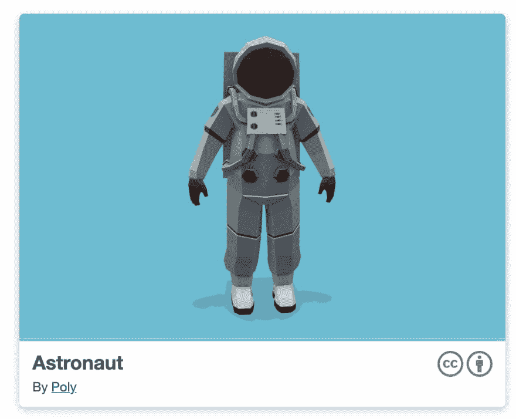
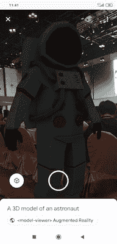
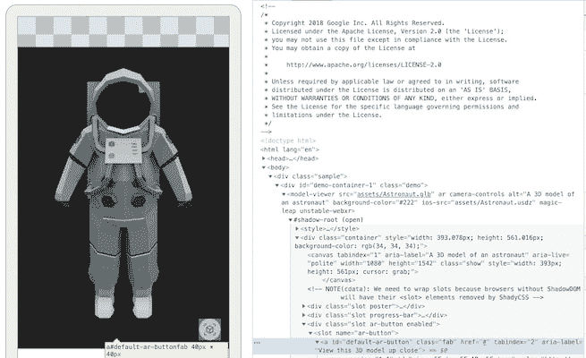

# 如何不用<model-viewer>在 Android 和 iOS 上显示 3d 为 AR</model-viewer>

> 原文：<https://dev.to/thangman22/how-to-display-3d-as-ar-on-android-and-ios-without-model-viewer-1bk3>

谷歌在谷歌 I/O 19 的谷歌搜索上推出 3d 和 AR 后，我很好奇，“谷歌是怎么做到的。”我希望在 Google I/O 事件中与 Google 交流，得到的回答是“我们使用 [model-viwer](https://github.com/GoogleWebComponents/model-viewer) ”我对这个名字并不感到惊讶，因为我以前不得不尝试这个 Web 组件，但在过去的版本中，你必须安装特定版本的 Chrome 才能使用(有问题的)ar 功能，但他们告诉我，新版本的 ARcore 不再需要特定版本的 Chrome。我回到家，试着摆弄和尝试逆向工程这个组件，这是一个结果

## 先说说

`<model-viewer>`是一个 web 组件，帮助 web 开发人员更容易地在 Web 上显示 3D 模型。通过下面的几行代码，您将在 web 上看到一个漂亮的 3D 模型查看器。

```
<!-- Import the component -->
<script type="module" src="https://unpkg.com/@google/model-viewer/dist/model-viewer.js"></script>
<script nomodule src="https://unpkg.com/@google/model-viewer/dist/model-viewer-legacy.js"></script>
<!-- Use it like any other HTML element -->
<model-viewer src="examples/assets/Astronaut.glb" alt="A 3D model of an astronaut" auto-rotate camera-controls background-color="#455A64"></model-viewer> 
```

[](https://res.cloudinary.com/practicaldev/image/fetch/s--DxTphtzt--/c_limit%2Cf_auto%2Cfl_progressive%2Cq_auto%2Cw_880/https://thepracticaldev.s3.amazonaws.com/i/xe9ssm2gslam7a516vtr.png)

通过几个属性，如`magic-leap` `unstable-webxr` `ar`，你将得到你的模型的 AR 浏览器，如下所示

[](https://res.cloudinary.com/practicaldev/image/fetch/s--NlSYaBSH--/c_limit%2Cf_auto%2Cfl_progressive%2Cq_auto%2Cw_880/https://thepracticaldev.s3.amazonaws.com/i/m2qk4ph1zl6fya7lg07u.png)

## 模型查看器如何做到这一点...

### 安卓

[](https://res.cloudinary.com/practicaldev/image/fetch/s--MPphpFD7--/c_limit%2Cf_auto%2Cfl_progressive%2Cq_auto%2Cw_880/https://thepracticaldev.s3.amazonaws.com/i/ak4dz73lae62fo2nnp36.png)

我试着用 Chrome Devtools 检查 AR 按钮，但是我看不到任何东西，因为它们没有在 HTML 标签上放置链接。我希望回到代码中找到 AR 按钮的 id...我明白了。

```
 modelUrl.protocol = 'intent://';

    const intent = `${modelUrl.toString()}?link=${link}&title=${
        title}#Intent;scheme=${
        scheme};package=com.google.ar.core;action=android.intent.action.VIEW;S.browser_fallback_url=${
        encodeURIComponent(locationUrl.toString())};end;`; 
```

在`src/features/ar.ts`中，如果 Chrome 中的 XR API 尚未启用，他们会尝试处理 AR 功能。我仍然不知道这个链接是什么样子的。尝试将 console.log 放入构建代码中，这就是该意图链接的结果。

```
intent://517d3b3f.ap.ngrok.io/examples/assets/Astronaut.glb?link=https://517d3b3f.ap.ngrok.io/examples/augmented-reality.html&amp;title=A3Dmodelofanastronaut#Intent;scheme=https;package=com.google.ar.core;action=android.intent.action.VIEW;S.browser_fallback_url=https://517d3b3f.ap.ngrok.io/examples/augmented-reality.html#model-viewer-no-ar-fallback;end; 
```

看起来他们在新版本的 ARcore (1.9)上使用了 Sense View 特性。现在我们知道了意图链接，所以这就是意图链接的结构以及这种神奇是如何发生的。

```
intent://[link of the glb file]?link=[link of the page of this model for display in Sense view]&title=[title of this model]#Intent;scheme=https;package=com.google.ar.core;action=android.intent.action.VIEW;S.browser_fallback_url=[if the viewer not support what is the fallback];end; 
```

试着复制这个链接，并把它放在标准 HTML 的

### iOS

在 iOS 上，这很容易，因为普通 iOS > (11.0)已经支持 3D 模型查看器作为 ar。我们只需将`.usdz`文件放到链接中就完成了。当一个链接是，点击 iOS 会打开一个 3D 模型查看器，带 AR 选项，你随便玩玩。

## 未来是什么？

使用这种解决方案，不容易使 AR 更加程序化，因为它只是浏览器外部的查看器。我们必须等待浏览器上的 XR API 更加稳定和支持，然后网络上的 AR 将比今天更好，但在等待期间，先玩这个。