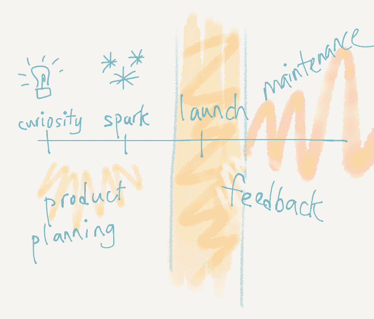

# 建设辅助项目

> 原文：<https://dev.to/cheeaun/building-side-projects-1eap>

2016 年 1 月 3 日，我开始了今年的第一个兼职项目，尽管我的袖子里还有几个兼职项目。它叫做[铁路路由器 SG](https://railrouter.sg/) 。这是一个供人们探索新加坡捷运和 LRT 路线的网络应用程序。在【2012 年 1 月 20 日，我建造了 [BusRouter SG](https://busrouter.sg/) ，它最初被称为‘新加坡巴士路线探索者’。这是一个网络应用程序，供人们探索新加坡所有公交服务的公交车站和路线。与 RailRouter SG 非常相似，但用于公共汽车。

我建造了很多东西。从小型 web 应用程序到桌面应用程序。从小库到浏览器插件。从基本的*演示*项目到基于网络的多人游戏。即便如此，我仍然发现自己与其他拥有超过数百个项目的人相比，没有*那么伟大，比如 [TJ Holowaychuk](https://github.com/tj) 和 [Sindre Sorhus](https://github.com/sindresorhus) 。*

所以问自己几个问题。我为什么要建造它？我建造它的动机是什么？这种 app 还有存在的必要吗？人们要求这样做吗？我这样做是为了名利吗？不。只有一个原因。

## 好奇心

有人称之为‘想法’。我更愿意称之为‘好奇心’。Sayanee 在《我的 AMA》中问了一个问题，[你如何实现你的下一个想法？](https://github.com/cheeaun/ama/issues/7)和我简短的[回答](https://github.com/cheeaun/ama/issues/7#issuecomment-119830311)是:

> 我通常不找灵感。对我来说，想法来自于对周围事物的觉察。

意识到会导致好奇:

> 首先是意识到你周围的事物，对它们保持好奇，思考它们，然后事情就自然而然地发生了。

10 多年前，我一直坐公交车。起初，这非常令人兴奋，因为那时没有应用程序或智能手机。没有谷歌地图，没有方向，没有全球定位系统。每次坐公交车都要上车问司机车是不是去目的地 x，而且有一次我试了几次，慢慢的从 A 点到 B 点和从 B 点到 A 点都成了我坐车的套路。我必须记住公共汽车的号码和路线。每当我看公共汽车站时，我会观察停在那里的每辆公共汽车，并对自己说，“啊，好吧，这些公共汽车在这里停，我必须记住它们，以防有一天我需要来这里。”一个问题总是浮现在我脑海里，如果有一天，我坐过站了怎么办？我会在哪里结束？事实上，公共汽车最终去了哪里？我知道每辆公共汽车都有路线，但是我不知道路线是什么样的。

那种*好奇心*已经跟随我*很久*了。

从我的经验来看，*想要*建造一些东西和*开始*建造一些东西是有区别的。好奇心是第一个触发的**，让我*觉得*我想要建造一些东西。或者也许换句话说，我*需要*去建造一些东西。这很像人们说他们有了一个想法，他们想*把它具体化*成更实在的东西*。现在我有了好奇心去点燃我的项目，我该如何开始呢？我什么时候开始？***

 *## 火花

火花是第**秒触发**。对一些人来说，这种触发发生在第一次触发后的几秒钟*。对另一些人来说，这发生在几周、几个月甚至几年后。对我和 BusRouter SG 来说，这件事发生在 2012 年 1 月 7 日，当时我读到了这条推文:*

> 如果我能像你在地图上看地铁线路一样在地图上看公交线路，我会带他们去更多的地方。
> 
> — [@mengwong](https://twitter.com/mengwong/status/155511398653362177)

9 天后，我[发了一条推特](https://twitter.com/cheeaun/status/158891916786794497):

> 如果我没弄错的话，新加坡有 318 条公交线路和 4617 个公交车站。

4 天后，我[向公众发布了 BusRouter SG](https://twitter.com/cheeaun/status/160380168739897344)。

也许这有另一种说法。对我来说，开始建造它有点像一个神奇的时刻。对我来说，现在开始*似乎是*的好时机*。这种*火花*不一定来自其他人、地方或任何外部*灵感*。有时它来自内心，例如当我洗澡、爬山或和朋友聊天时。*

显然，这并没有那么神奇。事情不会在第一次触发和第二次触发之间的时机突然发生。多年来，我下意识地将我的好奇心藏在脑海深处，不断地添加一些零碎的信息来慢慢地发展这个想法。我需要知道从哪里获取数据，哪些网站有这些数据。我需要确保有一个功能来检测我的当前位置，以立即找到附近的公交车站。我知道我不能在地图上画出*成千上万*的公交车站和路线，因为这对用户来说太难了，所以我需要为此想出一个更好的 UI。我在脑子里画出了*模型*，并学习其他应用如何用简单的用户界面呈现大量数据。我可能需要一个更好的应用程序名称。我需要把它推向市场，让用户了解它并使用它，因为我知道推出一个没人用的应用程序是没有意义的。我有点想显示每个公交车站的实时公交到站信息，但当时 API 还不完善，所以我可能会在下一阶段这样做。

一些人称之为“T0”产品规划“T1”，作为一个定义产品特性集的持续过程。在开发所花费的时间和金钱方面，它必须简单可行。这时，'**最小可行产品** ' (MVP)这个术语出现了。

从我开发应用的经验来看，我学到了这一点。事实上，我甚至没有或不知道这个术语，直到我看到一些提到他们的文章。我就想，“哦，这个有术语吗？好吧，酷。”那么，产品需要多小的*?对于自己的副业项目，我总是尽量估算自己一天能不能完成。一周怎么样？两周？一个月？我通常会避免持续一个月以上的兼职项目，因为我总是觉得一遍又一遍地看同样的东西很无聊。基本上最多一个月。一个月之内，我必须公开推出它。如果不知何故我*不能*发布它，我必须*至少*让它开源，让世界看到我的代码。*

 *## 发射

这是终极**第三次触发**。我称之为触发器，因为它就像一个游戏改变者，嗯，取决于你如何启动它。我已经看到一些开发者甚至没有设法跨过这条线，因为*蹩脚的*原因，比如应用程序还不完善或者代码太丑。我也看到一些开发者为他们的副业项目做了一个*试运行*，我认为这也很*蹩脚*。当我发布产品时，我会在推特上发布。我告诉人们。我试着把它写在博客上。我把它发布在黑客新闻上。我想让很多很多人看看我不完美的应用或丑陋的代码。

当我开始一个项目的时候，我的感觉会增强。突然，我意识到了我在编码时没有注意到的错误。我开始写好的读物，以便开发者理解我所做的。我开始为非技术用户撰写好的文案，让他们了解产品的功能。我检查语法错误、断开的链接和断开的流程。

会上瘾的。项目启动后，我开始学习如何营销，尝试广告，玩搜索引擎优化，思考商业化，甚至向其他人推销。令人惊讶的是**大量的工作**。

每当我做这些工作的时候，我开始理解所有非工程工作背后的情况和困难。在一个典型的公司里，这些都是由*其他*部门完成的；营销、销售、广告、社交媒体、设计师、博主和文案。有时候我觉得很有趣，我*可以*理解其他(非工程)人做什么，但是他们不理解我*做什么😥*

## 反馈

当项目公开后，我开始从人们那里得到各种类型的反馈。积极的反馈让我开心。负面反馈让我更加努力。*非建设性的*反馈让我学会了如何忽略它们。没有反馈？良好的...要么再努力点，要么耐心点。当你认为*没人*会关心，而*实际上*会关心的项目时，总是令人惊讶。如果仍然没有反馈，就继续前进，开始另一个项目，从第一个触发器开始，再次经历整个循环！

有时我会得到多一种类型的反馈，我认为这比消极的反馈更糟糕。这种反馈让我感觉很糟糕，并开始失去对这个项目的热爱，最终失去了我对建造东西的**热情**。显然，当我们为公众建造东西时，事情并不总是如你所愿。我不知道该如何描述这一点，但这有点像是我问自己，“哦，上帝，我做了什么？”。我也有过不好的时候。我犯了很多错误。我也知道有些人比我过得更糟。其中一个是雷米·夏普，他甚至有勇气写一个关于 JS Bin 的*阴暗面*的 [5 集故事，尤其是](https://remysharp.com/2015/09/14/jsbin-toxic-part-1)[第 5 集](https://remysharp.com/2015/09/18/jsbin-toxic-part-5)。

这就像是精神力量的测试。一个测试，看看我是否会放弃和退出。正如大多数人所想的那样，*只是*的一个副业，对吗？会有多糟？嗯，你永远不会知道，直到你发射它。

## 维护

我称之为**维护**阶段，在这段时间里，我必须不断地处理用户反馈，提供客户支持，修复 bug，添加特性并改进项目。这有点像一个*耐力*测试，看看我能坚持多久来维持每件事并保持专注。在这个阶段，很多事情都可能发生。有些人最终*停止*维持并开始做其他事情。一些人设法将他们自己的项目货币化，让它自我维持。有些人设法把一个副业项目变成了一家创业公司，例如 [Lanyrd](http://blog.natbat.net/post/61658401806/lanyrd-from-idea-to-exit-the-story-of-our) 。

这个“维持”阶段并不总是与第一个触发器——好奇心——一起工作，好奇心也被称为“启动”阶段。在保持旧东西的同时开始新的东西是非常困难的。反之亦然，当你不断创造新事物时，就很难把时间花在维护上。

[詹姆斯·龙提到的](http://jlongster.com/Starters-and-Maintainers):

> 任何项目都有两个角色:启动者和维护者。人们可能在生活中扮演两种角色，但出于某种原因，我发现对于一个项目来说，通常是不同的人。初学者擅长在不同的方向上迈出一大步，维护者擅长致力于保持代码的活力。

至于我，我尽我所能扮演这两个角色。很有挑战性。有时候我会失败。有时候我觉得无聊。有时，我构建的项目会被弃用。

几周前，我收到了[一个新的 GitHub 问题](https://github.com/cheeaun/mangafeeder/issues/1)的报道，关于一个我不再使用的旧项目。该项目名为 [mangafeeder](https://github.com/cheeaun/mangafeeder) ，建于 2012 年，直到那天才出现任何问题或拉动请求。它是在 AppFog V1 上举办的，而从去年 12 月 15 日起[就退休了](https://www.ctl.io/knowledge-base/afv1/migration-faq/)，我甚至没有意识到这一点。当我阅读报道的问题时，我非常惊讶*有人*实际上正在使用它。尽管事实上我已经做了很多东西，但这不应该再令人惊讶了，但我忍不住。我试图重新部署应用程序到新的 AppFog V2，发现它很麻烦，所以我决定把它部署到 Heroku。网站已经开通，我已经通过回复解决了这个问题。

我得到的回应是[这个](https://github.com/cheeaun/mangafeeder/issues/1#issuecomment-168313991):

> 可怕的👍

不知何故，这让我想起了 [WWDC 2012 开发者答谢视频](https://www.youtube.com/watch?v=FirarNC85sU)，尤其是 Emil Ovemar 说:

> 看到我们创造的东西改变了人们的生活，真是太棒了。这些反应比任何下载都有价值。

时不时地，我总是看到人们对数字感到兴奋或着迷。下载、喜欢、喜爱、转发、转发、分享、明星、追随者、粉丝、访问、印象和点击的数量。对我来说，那些只是*美好的拥有*。它们并不是世界上最重要的东西。

我不放弃并将继续创造的第一个原因是来自其他人的积极回应。**谢谢你的**。“哦，我的上帝，你救了我的命”这种反馈。有时候当我得到 9 个正面反馈，突然得到一个负面反馈，会让我一整天都很难受。我个人认识到，如果有一天，我得到 9 个负面反馈和一个正面反馈，我应该高兴，认为我至少帮助了一个人。

## 超越身边的项目

几天前，1 月 21 日，我[在写作的时候，在](https://www.facebook.com/photo.php?fbid=10153701648345189)[总会新加坡](https://generalassemb.ly/singapore)给一群学生做了一个关于这个话题的演讲。我画了这个简单的图表，作为描述*完成*‘侧面项目时间表’的一种视觉方式。这是我脑海中想象的草图。

我提到过，如果你看看这个时间线，它有点像一家初创公司，但没有商业战略，招聘流程，风险投资基金和资金。

我看了第三遍，意识到这有点像生活本身。当你出生在这个世界上时，好奇心就开始了。“星火”大概是从你开始在学校学习的时候开始的。“启动”发生在你毕业的时候。“维持”是指你开始工作、买房子、组建家庭和孩子。好吧，原谅我，可能我说得太多了😅

然而，这是一段旅程。

我希望更多的人能够经历并讲述这个故事。

* * *

最初发表于[cheeaun.com](https://cheeaun.com/blog/2016/01/building-side-projects/)。**