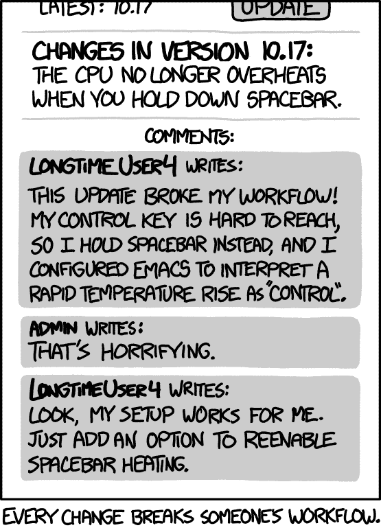

# 根据 SemVer，行为变化应被视为突破性变化吗？

> 原文：<https://dev.to/turnerj/should-behavioural-changes-be-considered-breaking-changes-under-semver-2d5n>

当[写另一篇文章](https://dev.to/turnerj/3-questions-i-have-about-developing-open-source-libraries-4a89)时，我想到了[语义版本(SemVer)](https://semver.org/) 规范的第 8 点。

> 8.如果任何向后不兼容的变化被引入到公共 API 中，主版本 X (X.y.z | X > 0)必须递增。它可能包括较小的和补丁级别的更改。当主版本增加时，修补程序和次版本必须重置为 0。

术语“向后不兼容的变更”在这里很有意思，因为它并不具体指两段代码之间的接口和契约——“向后不兼容的变更”可以很容易地是代码库的行为变更。

考虑以下行为准则变化的示例:

初始代码:

```
function encodeText(text) {
    return text.replace('a', 'xyz');
} 
```

Enter fullscreen mode Exit fullscreen mode

新代码:

```
function encodeText(text) {
    return text.replace('a', 'xyz').replace('b', 'foo');
} 
```

Enter fullscreen mode Exit fullscreen mode

从合同上来说，代码是一样的，仍然叫做`encodeText`，仍然接受一个参数，仍然返回一个字符串。另一方面，它的行为并不像现在一样，额外的文本也被编码。

再进一步，*bug 修复*呢？

对于一个 bug 修复，您正在将一组行为改变为另一组行为(将非预期行为改变为预期行为)。最初的 bug 可能从来不是有意的，但鉴于它现在处于野生状态，它现在可能会以这种方式行事。

[](https://xkcd.com/1172/)

你可能认为这有点极端，我同意。如果 bug 修复被认为是突破性的改变，因为它们是行为上的改变，那么将会有更多的库的主要版本。

提问时间:

1.  行为改变应该算作一种突破性的改变吗？
2.  如果上面的答案是肯定的，那么错误修正应该被算作一个突破性的改变吗？