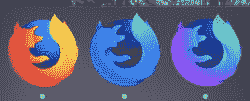
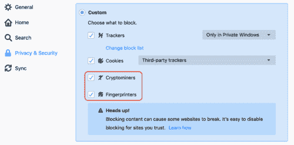

# 火狐 67 的新功能:偏好配色方案等等

> 原文：<https://dev.to/bnevilleoneill/what-s-new-in-firefox-67-prefers-color-scheme-and-more-55g1>

[](https://res.cloudinary.com/practicaldev/image/fetch/s--De-Ci5md--/c_limit%2Cf_auto%2Cfl_progressive%2Cq_auto%2Cw_880/https://cdn-images-1.medium.com/max/1024/1%2AH5DM9_4hsB_90aTjRN5z6Q.jpeg)

Mozilla 不断向前推进，Firefox 67 的发布为可访问性和定制提供了一个很棒的新功能:偏好配色方案查询，它允许我们知道用户是否请求了浅色或深色主题，并相应地调整我们的设计。

对于用户和开发人员来说，还有许多其他的新特性，所以在深入研究这个令人敬畏的媒体查询之前，让我们先来看看这些特性。

### 对用户的改进

#### 并排轮廓

用户现在可以同时运行多个版本的 Firefox，每个版本都有不同的配置文件。以前，所有安装的版本共享一个单独的概要文件，所以这使得它更加安全可靠。

[](https://res.cloudinary.com/practicaldev/image/fetch/s--aBfzEa36--/c_limit%2Cf_auto%2Cfl_progressive%2Cq_auto%2Cw_880/https://cdn-images-1.medium.com/max/250/0%2AEfhJKb88psDnc4LC.png)

#### WebRender 的增强性能

经过多年的努力，Firefox 逐渐开始为 Windows 10 用户提供 WebRender 引擎，其他平台也将陆续推出。这是一个巨大的性能改进，当它们以影响管道渲染步骤的方式实现时，将允许更快的动画和滚动。

#### 增强的隐私控制

现在，我们将能够阻止密码矿工和指纹。

[](https://res.cloudinary.com/practicaldev/image/fetch/s--AJ4skE0m--/c_limit%2Cf_auto%2Cfl_progressive%2Cq_auto%2Cw_880/https://cdn-images-1.medium.com/max/500/0%2An3-yoDAsFi82VSYh.png)

#### 更好的账户和密码管理

Firefox 67 包括许多旨在改善[密码和帐户管理](https://matthew.noorenberghe.com/blog/2019/05/password-manager-improvements-firefox-67)的新功能，例如更容易访问已保存的登录信息，能够在私人窗口上保存密码，并支持 autocomplete="new-password "，这将不再由已保存的登录信息自动填充。

[](https://logrocket.com/signup/)

### 针对开发者的改进

#### JavaScript string . prototype . matchall()

Firefox 现在与 Chrome 一起支持 [matchAll()方法](https://developer.mozilla.org/en-US/docs/Web/JavaScript/Reference/Global_Objects/String/matchAll)，该方法返回所有匹配正则表达式字符串的结果的迭代器，包括捕获组。这使得通过避免循环来获得结果变得更加简单。

#### CSS revert 关键字

CSS revert 关键字允许我们将选择器的任何属性恢复到用户代理样式表中指定的值(即浏览器的默认值)。有一个类似的关键字叫做 initial，但是它是基于每个属性的，而不是基于每个选择器的。

这意味着，例如，如果我们有我们的

tags set to display:flex for whatever reason, revert will set it back to display:block, which is the browser’s default value for the display property on elements. Likewise, initial will set it to display:inline, the initial value for the display property.

这似乎是一个奇怪的极端情况，当我们需要为某个规则添加一个例外时，它会非常有用。

### 偏好-配色方案

现代操作系统允许用户选择他们喜欢的浅色或深色主题。

preferred-color-scheme 媒体查询是 [CSS 媒体查询第 5 级规范](https://drafts.csswg.org/mediaqueries-5/#descdef-media-prefers-color-scheme)的一部分，该规范旨在通过允许浏览器查询用户偏好并相应地调整页面来在 web 上提供这一功能。

对于患有[畏光症(对光敏感)、前庭障碍](https://alistapart.com/article/accessibility-for-vestibular/)的人，以及任何只是喜欢黑暗方案的人来说，这是一个好消息，这些方案在网络上很少见，但奇怪的是，在我们的文本编辑器和 ide 中却非常流行。

有效值包括浅色(浅色背景上的深色文本)、深色(深色背景上的浅色文本)和无偏好(当用户没有已知偏好时)。

在其更基本的形式中，我们可以如下使用它:

```
.element { background: white; color: black; }

[@media](http://twitter.com/media) (prefers-color-scheme: dark) {
  .element { background: black; color: white; }
} 
```

这将在白色背景上有一个默认的黑色文本，但当用户指定了深色主题的偏好时，将它们反转。

如果上面的例子看起来非常简单，那是因为它确实如此。每次我们在 CSS 中设置颜色时都定义一个媒体查询是非常疯狂的。

#### CSS 变量来救援了！

我们可以在根级别的 CSS 变量中定义所有文档的颜色，并在媒体查询中简单地切换它们的值，以立即使一切适应用户的偏好:

```
:root{
  --foreground: #001144;
  --background: #CCFFEE;
  color: var(--foreground);
  background: var(--background);
}

@media (prefers-color-scheme: dark) {
  :root{
    --foreground: white;
    --background: black;
  }
}

@media (prefers-color-scheme: light) {
  :root{
    --foreground: black;
    --background: white;
  }
} 
```

默认情况下，这将在浅蓝色背景上提供深蓝色文本，当用户指定了深色主题的首选项时，这将变成黑色背景上的白色文本，当他们选择了浅色主题时，这将变成白色背景上的黑色文本。

上述方法可以很容易地适应多种颜色，无论主题约定。

#### 关于浏览器支持的说明

到目前为止，只有 Safari 支持这个查询。但是 Firefox 现在已经加入进来，Chrome 正在计划将其用于版本 76(计划于 7 月 30 日)，所以这是一个在我们的项目中开始实现它的好机会。

也就是说，IE、老 Edge 和 evergreen 浏览器的旧版本仍在使用，所以如果项目允许，我们应该考虑它们。那么，使用这个特性的正确方法是渐进增强。

使用上面的例子，不支持 prefers-color-scheme 媒体查询的浏览器将忽略这个规则，因此，根本不提供这个特性。这并不坏，但如果可能的话，我们应该允许用户在需要时通过其他方式来调整主题，比如在我们的应用程序或网站配置中的一个选项。

更大的问题是不支持 CSS 变量的浏览器，比如 IE。但是我们可以用处理任何其他 CSS 变量的方式来处理它:设置一个默认值，这个值稍后会被兼容浏览器上的变量覆盖:

```
:root{
  /* initial values for the color variables */
  --foreground: #001144;
  --background: #CCFFEE;

  /* fallbacks for browsers that don't support variables */
  color: black;
  background: white;

  /* Set colors for browsers that support CSS Variables */
  color: var(--foreground);
  background: var(--background);
}

/* change the theming on browsers that support both variables and prefers-color-scheme*/
@media (prefers-color-scheme: dark) {
  :root{
    --foreground: white;
    --background: black;
  }
} 
```

#### 记住不同的媒体

这很容易忘记，但打印页面仍然是一件事，而且通常情况下，选择了深色主题的用户在打印时仍然喜欢浅色主题。因此，我建议将配色方案、媒体查询和屏幕类型一起使用。

```
@media screen and (prefers-color-scheme: dark) {
  :root{
    --foreground: white;
    --background: black;
  }
} 
```

#### 不仅仅是颜色

任何选择器的任何 CSS 属性都可以在这些媒体查询中更改，因此您可以调整从不透明度(半透明的东西在切换背景时通常看起来很糟糕)到高级属性(如 mix-blend=mode)的任何内容。

* * *

### Plug: [LogRocket](https://logrocket.com/signup/) ，一款适用于网络应用的 DVR

[](https://logrocket.com/signup/)

<figcaption>[https://logrocket.com/signup/](https://logrocket.com/signup/)</figcaption>

LogRocket 是一个前端日志工具，可以让你回放问题，就像它们发生在你自己的浏览器中一样。LogRocket 不需要猜测错误发生的原因，也不需要向用户询问截图和日志转储，而是让您重放会话以快速了解哪里出错了。它可以与任何应用程序完美配合，不管是什么框架，并且有插件可以记录来自 Redux、Vuex 和@ngrx/store 的额外上下文。

除了记录 Redux 操作和状态，LogRocket 还记录控制台日志、JavaScript 错误、堆栈跟踪、带有头+正文的网络请求/响应、浏览器元数据和自定义日志。它还使用 DOM 来记录页面上的 HTML 和 CSS，甚至为最复杂的单页面应用程序重新创建像素级完美视频。

[免费试用](https://logrocket.com/signup/)。

* * *

帖子[火狐 67 的新功能:偏好配色方案和更多](https://blog.logrocket.com/whats-new-in-firefox-67-prefers-color-scheme-and-more-195be81df03f/)首先出现在[博客](https://blog.logrocket.com)上。