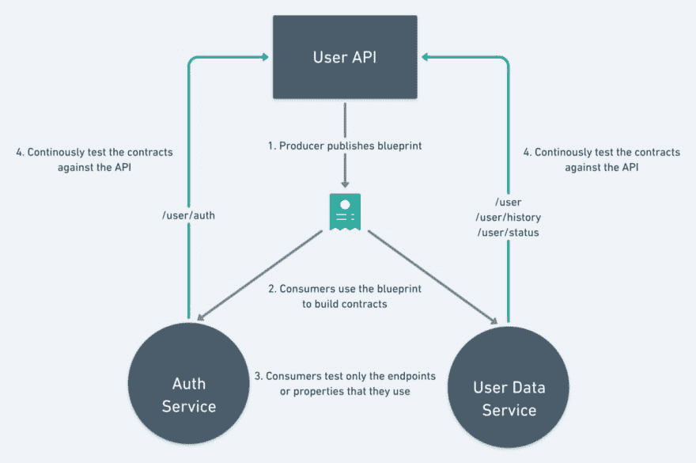
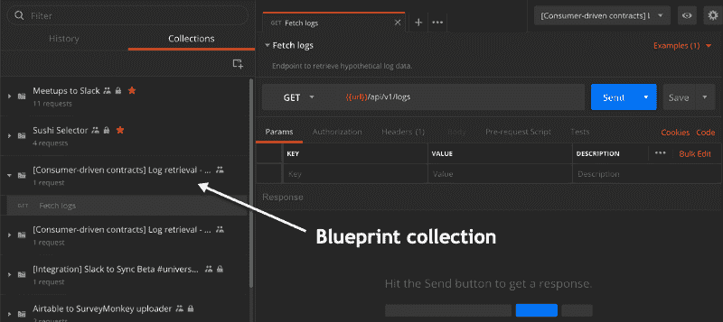
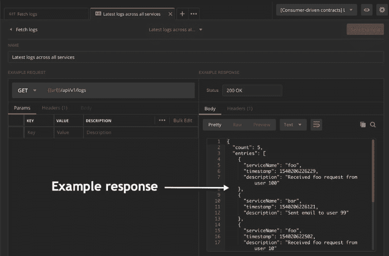
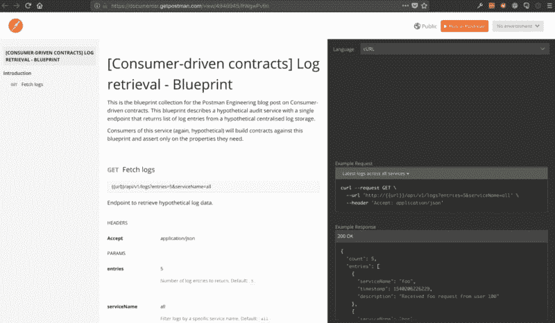
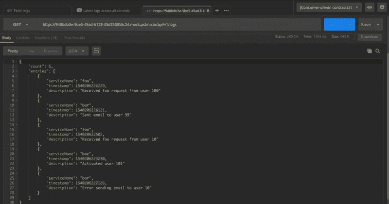
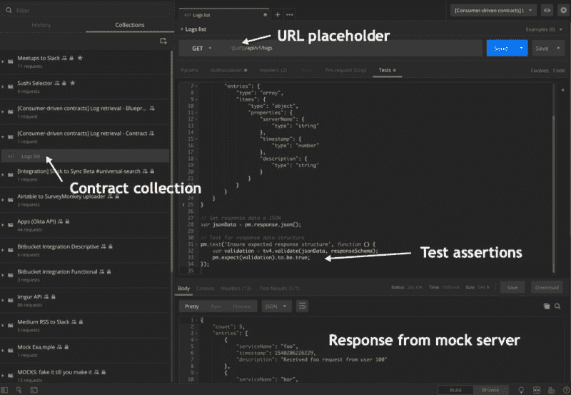
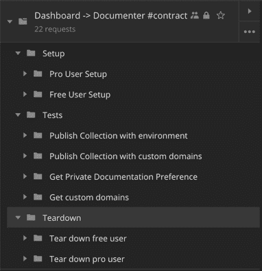

# 使用 Postman 的消费者驱动的契约测试

> 原文：<https://dev.to/kaustavdm/consumer-driven-contract-testing-using-postman-npm>

API 行为通常在文档页中描述，文档页列出了可用的端点、请求数据结构和预期响应数据结构，以及示例查询和响应。这些文档然后被构建使用这些 API 的系统的人使用。

但是，单独编写的文档并不能保护 API 的消费者免受 API 变化的影响。API 生产者可能需要改变响应数据结构或者重新命名一个端点来满足业务需求。

合并这些更改的责任就落在了这些 API 的消费者身上，他们必须不断检查文档中的任何更改。这种模式不适合扩展。消费者经常会遇到意想不到的错误，因为他们期望的响应已经改变了。

这就是让消费者断言 API 契约变得有用的地方。这些 API 的消费者可以通过让生产者知道他们想从 API 中得到什么数据来设定期望，而不是让 API 生产者自己建立一个规范。

<figure>[](https://res.cloudinary.com/practicaldev/image/fetch/s--rybta4vV--/c_limit%2Cf_auto%2Cfl_progressive%2Cq_auto%2Cw_880/https://cdn-images-1.medium.com/max/1200/1%2AI8DFC8EMPeVcuLqrto7U0w.png) 

<figcaption>一个示例场景，记录了在构建消费者驱动的微服务合同时通常采取的步骤</figcaption>

</figure>

然后，API 设计变成了消费者需要什么和提供者可以提供什么之间的协商。

## 使 API 契约明确且可执行

Postman [在 2018 年进行了一项调查](https://www.getpostman.com/infographics/postman-community-survey-2018.pdf)，该调查显示大多数业务 API 都是内部的。这些团队在一个组织内构建服务，共同构建一个更大的、面向用户的产品。在这种情况下，确保消费者的期望和 API 交付的数据之间没有差异就成为组织工作流的一个重要部分。拥有明确的、可共享的和可执行的合同可以避免这种困惑和挫折。

除了在静态页面中记录 API 行为，生产者可以通过使用市场上任何流行的工具为他们的 API 创建规范，如 RAML、API Blueprint、OpenAPI、Pact 或 [Postman Collections](http://blog.getpostman.com/2018/03/08/the-good-collection/) 。最后两个，Pact 和 Postman 让你实现消费者驱动的契约作为一级概念。Pact 进一步专注于合同测试，而 Postman 生态系统的功能远不止于此。

所有这些格式都允许您指定 API 行为的细节。它们让您通过请求和响应的端点名称、描述、数据类型和数据结构来传达 API 的意图。它们还支持向每个端点添加示例。

一旦您有了这些格式的规范，您就可以运行生成测试代码的工具，或者使用规范中描述的端点结构直接向给定的服务发送请求。您获得的灵活性程度因您使用的工具集而异。

这些规范构成了服务契约的来源——生产者所提供的和消费者所期望的之间的协议。这些工具集的潜在价值在于，它们使您的 API 结构对于那些协作构建服务的人以及服务的消费者来说是显而易见的。

## 针对多个消费者测试合同

如果您是消费者，手边有这样一个规范将让您准确地计算出您想从 API 中获取什么数据。您可以编写测试来设置期望，并断言您的服务将使用的数据。这种方法有两个主要好处:

1.  只要规范中有变化，您就可以运行您的测试套件，并主动响应 API 规范中的变化，
2.  您可以作为消费者参与 API 的设计过程，并在正式签订合同之前让大家知道您的需求。

在消费者驱动的合同测试中，合同是由消费者明确编写和管理的。如果生产者需要对他们的服务进行一些改变，比如实现一个新的功能，生产者将通过观察哪个消费者的合同测试失败来了解他们破坏了哪个消费者。这使得应用编程接口提供商不必担心每次对他们的服务进行更改时会意外破坏消费者应用程序或服务。

## 独立服务测试

这减少了对服务执行端到端测试的需要。如果所有的契约测试都通过了，那么 API 生产者就可以合理地确定他们的服务在与其他服务集成时会按照预期执行。这大大缓解了在微服务环境中进行端到端测试的复杂性。

对于 API 的每一个变化，端到端测试都是昂贵而繁琐的。生产者和消费者可以按照自己的步调前进，有自己的路线图，并不断部署他们的变化。只有当合同测试失败时，消费者团队才需要担心。将此与根据规范自动生成的更新文档相结合，可以快速检测故障，而无需构建运行端到端测试所需的复杂设置。

# 使用 Postman 进行消费者驱动的契约

Postman 拥有您在组织中开始实施契约测试所需的所有工具。邮递员集合是 API 的可执行规范。你可以在本地机器上使用 Postman 应用程序运行收集，在命令行和 CI 系统上使用 [newman](https://www.getpostman.com/docs/v6/postman/collection_runs/command_line_integration_with_newman) ，在云中使用 [Monitors](https://www.getpostman.com/docs/v6/postman/monitors/intro_monitors) 。无论哪种情况，集合中的请求都是按顺序执行的。

此外，您可以使用预请求脚本将动态行为添加到您的请求中，并使用测试断言响应。Postman 中关于从手动到自动 API 测试的文章向您展示了这些步骤的细节。

将所有这些与 Postman 中的[工作区结合起来，您就拥有了为整个团队准备好的可执行、共享和协作的合同集合。您不需要与您的团队成员手动共享这些详细信息。](https://medium.com/postman-engineering/how-to-dissolve-communication-barriers-in-your-api-development-organization-3347179b4ecc)

让我向您展示一个用例，说明这些如何结合起来实现消费者驱动的契约。

## 一个简单的用例:简单的日志检索服务

假设我们需要构建一个假想的服务，从一些集中式日志存储中返回一系列日志条目。该服务只公开一个端点(为了简单起见),该端点返回最新的 5 个日志条目，包括创建条目的服务名、条目的时间戳和描述条目的描述字符串。

端点位于`/api/v1/logs`。向这个端点发送一个`GET`请求应该返回 JSON 数据，结构如下:

```
{
  "count": Number,
  "entries": Array[Object]
} 
```

`entries`数组将为每个日志条目包含一个对象。它们的数据结构将会是这样的:

```
{
  "serviceName": String,
  "timestamp": Number,
  "description": String
} 
```

## 蓝图

首先，我们创建一个蓝图集合。蓝图集合奠定了 API 结构。这是由服务的生产者创建的。

**您可以通过点击下面的按钮来访问此示例的蓝图集合:**

[](https://app.getpostman.com/run-collection/9eef1b9b397c143b143f)

<figure>[](https://res.cloudinary.com/practicaldev/image/fetch/s--SW4Qicav--/c_limit%2Cf_auto%2Cfl_progressive%2Cq_auto%2Cw_880/https://cdn-images-1.medium.com/max/800/1%2A7p0fisGQeTheC2WNcR5h1A.png) 

<figcaption>样本蓝图收藏</figcaption>

</figure>

然后，我们为请求添加[示例。我已经举了一个例子。示例允许这样的蓝图集合来描述响应数据。它们出现在由 Postman 生成的文档中。下面是该服务的默认输出的响应数据示例:](https://www.getpostman.com/docs/v6/postman/collections/examples) 

```
{
  "count": 5,
  "entries": [
    {
      "serviceName": "foo",
      "timestamp": 1540206226229,
      "description": "Received foo request from user 100"
    },
    {
      "serviceName": "bar",
      "timestamp": 1540206226121,
      "description": "Sent email to user 99"
    },
    {
      "serviceName": "foo",
      "timestamp": 154020622502,
      "description": "Received foo request from user 10"
    },
    {
      "serviceName": "baz",
      "timestamp": 1540206223230,
      "description": "Activated user 101"
    },
    {
      "serviceName": "bar",
      "timestamp": 1540206222126,
      "description": "Error sending email to user 10"
    }
  ]
} 
```

每个示例都有一个名称和特定的请求路径。这是它在邮递员应用程序中的样子:

<figure>[](https://res.cloudinary.com/practicaldev/image/fetch/s--PvgfGW9k--/c_limit%2Cf_auto%2Cfl_progressive%2Cq_auto%2Cw_880/https://cdn-images-1.medium.com/max/800/1%2AMbv-RFbLIF5RRMLtT6Ab8Q.png) 

<figcaption>向样本蓝图集合添加样本的请求</figcaption>

</figure>

有了这些，Postman 会自动为蓝图生成基于 web 的文档。下面是已发布文档的截图。

<figure>[](https://res.cloudinary.com/practicaldev/image/fetch/s--i841kyy9--/c_limit%2Cf_auto%2Cfl_progressive%2Cq_auto%2Cw_880/https://cdn-images-1.medium.com/max/800/1%2AAg9cm5sxkftWzuRKWaDoKA.png) 

<figcaption>公布由邮差从样本蓝图集合中生成的文档</figcaption>

</figure>

属于创建此集合的工作区的所有成员都可以查看文档和访问集合，这是与其他成员协作的一种极好方式。然后，服务所有者可以基于这个集合在 Postman 中创建一个模拟服务器。请求中添加的示例作为模拟服务器响应的一部分发送。

一旦在 Postman 中创建了模拟服务器，就可以在 Postman 为您生成的模拟服务器 URL 之后使用同一个端点向模拟服务发出请求。因此，向`https://<mock-server-id>.pstmn.io/api/v1/logs`发出请求将返回以下响应:

<figure>[](https://res.cloudinary.com/practicaldev/image/fetch/s--vpuNAM5Z--/c_limit%2Cf_auto%2Cfl_progressive%2Cq_auto%2Cw_880/https://cdn-images-1.medium.com/max/800/1%2AGiPQ5S4jhDePvj32jNgJGQ.png) 

<figcaption>从样本集合创建的模拟服务器返回的响应</figcaption>

</figure>

## 撰写合同托收

服务的消费者可以基于蓝图和模拟来构建他们的契约集合。Postman 测试允许您断言响应的每个方面——包括响应头、主体和响应时间。因此，契约可以利用所有这些方法并构建健壮的测试。

对于这个例子，让我们假设这个服务只有一个消费者。为了简单起见，我们的契约集合示例也将有一个请求，它将只断言响应数据结构。真实世界的契约将断言数据结构以及响应中接收的数据。

<figure>[](https://res.cloudinary.com/practicaldev/image/fetch/s--5QcQNsSp--/c_limit%2Cf_auto%2Cfl_progressive%2Cq_auto%2Cw_880/https://cdn-images-1.medium.com/max/800/1%2AZgFFwoBEitJ7kgYqlocFOA.png) 

<figcaption>消费合同收集使用测试对响应数据进行断言</figcaption>

</figure>

下面是契约集合可以用来测试上述数据结构的测试脚本。它使用了作为[邮差沙箱](https://www.getpostman.com/docs/postman/scripts/postman_sandbox) :
的一部分提供的`tv4`库

```
// Define the schema expected in response
var responseSchema = {
    "type": "object",
    "properties": {
        "count": {
            "type": "number"
        },
        "entries": {
            "type": "array",
            "items": {
                "type": "object",
                "properties": {
                    "serverName": {
                        "type": "string"
                    },
                    "timestamp": {
                        "type": "number"
                    },
                    "description": {
                        "type": "string"
                    }
                }
            }
        }
    }
};

// Get response data as JSON
var jsonData = pm.response.json();

// Test for response data structure
pm.test('Ensure expected response structure', function() {
    var validation = tv4.validate(jsonData, responseSchema);
    pm.expect(validation).to.be.true;
}); 
```

**您可以点击下面的按钮下载合同集:**

[](https://app.getpostman.com/run-collection/cd78233f590dbd250abc)

注意合同集合中变量占位符`{{url}}`的使用。**当服务处于早期阶段时，消费者可以使用模拟服务器 URL 来发出请求。构建服务后，可以将环境变量切换到指向服务的托管实例。**通过这种方式，消费者应用或服务的开发可以并行进行，而不会因为上游服务的构建而受阻。

## 连续测试

合同需要不断测试，以确保它们长期有效。有两种方法可以实现这一点。

如果您有一个现有的持续集成系统:您可以从 Postman 导出集合文件和环境，并使用 newman 从[命令行运行它们。请参考纽曼的文档，了解为](https://www.getpostman.com/docs/v6/postman/collection_runs/command_line_integration_with_newman)[詹金斯](https://www.getpostman.com/docs/v6/postman/collection_runs/integration_with_jenkins)和[特拉维斯 CI](https://www.getpostman.com/docs/v6/postman/collection_runs/integration_with_travis) 建立持续构建的步骤。每当上游服务的规范或新版本发生变化时，您的构建管道都会被触发。

除此之外，您还可以使用 Postman 监视器运行合同收集。监视器可以定期运行，这使它成为一个很好的工具，可以长期观察合同违约情况。

> 阅读更多关于用 Postman 对 API 进行持续测试的信息。

## 组织合同测试

真实世界的测试有安装和拆卸阶段。合同测试也不例外。契约测试的一个常见用例是用一些数据填充被测试的系统，然后在其上执行操作，最后删除那些测试数据。

**在 Postman 中模仿这一点的一个简单模式是将一个`Setup`文件夹作为收藏的第一个文件夹，将一个`Teardown`文件夹作为收藏的最后一个文件夹。**所有的合同测试都作为文件夹放在`Setup`和`Teardown`文件夹之间。这将确保 Postman 在收集运行的开始总是运行`Setup`文件夹中的请求，然后运行执行实际测试的请求，最后运行`Teardown`文件夹中的所有请求。

我们在写内部合同时大量使用这种模式。

<figure>[](https://res.cloudinary.com/practicaldev/image/fetch/s--N0deyZs5--/c_limit%2Cf_auto%2Cfl_progressive%2Cq_auto%2Cw_880/https://cdn-images-1.medium.com/max/800/1%2Amwz39KbtJ8XRnEDkjis4bw.png) 

<figcaption>邮递员工程团队使用的实际合同集合中的设置和拆卸文件夹。</figcaption>

</figure>

这有助于通过提取第一个和最后一个文件夹中的重复任务来整齐地分组和组织您的测试。理想情况下，API 生产者应该提供一个带有`Setup`和`Teardown`请求的集合。消费者可以创建该集合的副本，并添加他们的契约测试。

* * *

您的契约测试的复杂性将取决于您的业务案例。编写消费者驱动的契约测试的额外好处之一是，通过查看服务拥有的消费者契约集合的数量，您可以很容易地发现服务何时变得太大或有太多的依赖项。

总的来说，消费者驱动的合同有助于将测试微服务和协商更改的表面积保持在可控的大小。

测试愉快！

* * *

# 参考文献

*   *[消费者驱动的契约:一种服务进化模式](http://consumer-driven%20contracts:%20A%20Service%20Evolution%20Pattern/)* 伊恩·罗宾逊著
*   Sam Newman 的 *[构建微服务:设计细粒度系统](https://books.google.com/books?id=jjl4BgAAQBAJ)*
*   *[第一天的微服务](https://books.google.co.in/books?id=4YOxDQAAQBAJ)* 小丁香·卡内罗，蒂姆·施默尔
*   *[如何确信您的微服务在生产中仍能与 Pact 和 Docker](https://www.infoq.com/articles/microservices-consumer-driven-contracts-pact-docker)* 通信

* * *

*最初于 2018 年 10 月 24 日在[更好的实践](https://medium.com/better-practices)中发布为[消费者驱动的合同测试，使用邮递员](https://medium.com/better-practices/consumer-driven-contract-testing-using-postman-f3580dba5370)。*