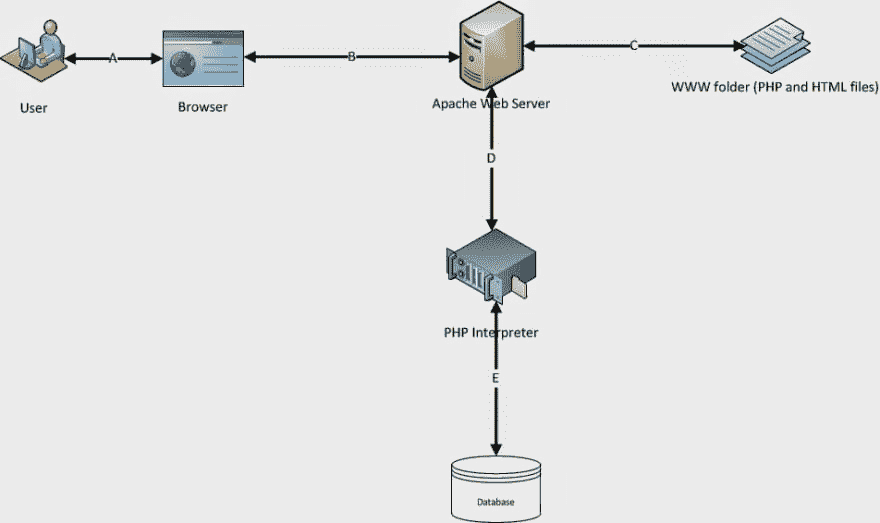

# PHP 初学者入门(模块 1)

> 原文：<https://dev.to/kh4l33l/intro-to-php-for-beginners-module-1-1m7b>

# 1。PHP 简介

PHP 是一种直观的服务器端脚本语言，它是“PHP: Hypertext Preprocessor”的递归首字母缩写——它是一种广泛使用的开源通用脚本语言，特别适合 web 开发，可以嵌入到 HTML 中。这种编程语言很容易学。作为一个开源软件，任何人都可以轻松开发 web 应用程序。它现在已经成为一个非常广阔的平台，为各种自由来源的发展。
这个后台工作区在 web 技术和内容管理系统(如 WordPress、Joomla 和 Magento)的开发中起着非常重要的作用。

# Web 架构

体系结构图是一个逻辑图，它显示系统中的每个组件是如何相互连接的，以及数据是如何在它们之间流动的。如果我们为一个典型的基于 PHP 的 web 应用程序绘制架构图，它将如下图所示。
 
我在下面的标签名称旁边使用的数字 1 表示请求流，2 表示响应流。

*   A1:第一个用户通过浏览器访问网站。这意味着用户在浏览器中键入网站的 URL 并点击 go。
*   B1:浏览器上的页面请求将到达 Web 服务器(Apache)。
*   C: Web 服务器将从它的文档根中收集请求的页面(HTML 或 PHP 或图像文件等)。(在我们的例子中，它将是 WAMP 的 www 文件夹。你会在下一集看到)
*   B2:如果它是一个静态元素，比如 HTML、CSS、图像文件或者 Java 脚本文件，那么 Apache 会直接把它发送到浏览器。
*   A2:浏览器会在屏幕上呈现给用户
*   D1:如果是一个 PHP 文件，那么 Apache 会将文件内容发送给 PHP 解释器。PHP 解释器解释 PHP 代码并执行它。如果需要 DB 操作，它会执行相同的操作(E)
*   D2: PHP 解释器生成输出(如果 PHP 代码要生成任何输出的话)并发送给 Apache
*   B2: Apache 将内容发送到浏览器
*   A2:浏览器将它呈现到用户的屏幕上。所有静态组件，如 HTML、CSS 文件、图像文件、Java 脚本等都不需要解释器。我们的网络浏览器就是用来渲染它们并在屏幕上正确显示的。这就是为什么如果用户请求这些类型的组件，Apache 会从文档根目录收集它们并直接发送回浏览器。

# PHP 平台概述

PHP 是一种直观的服务器端脚本语言。像任何其他脚本语言一样，它允许开发人员将逻辑构建到网页内容的创建中，并处理从 web 浏览器返回的数据。PHP 还包含许多扩展，使得与数据库的交互变得容易，提取要在网页上显示的数据，并将网站访问者输入的信息存储回数据库。PHP 由一个脚本语言和一个解释器组成。像其他脚本语言一样，PHP 允许 web 开发人员定义他们在 web 页面中需要的行为和逻辑。这些脚本被嵌入到 web 服务器提供的 HTML 文档中。解释器采用集成到 web 服务器中的模块的形式，将脚本转换成计算机执行的命令，以实现 web 开发人员在脚本中定义的结果。

# PHP 起源于开源社区

PHP 的第一个版本是由一个叫 Rasmus Lerdof 的人在 1995 年创建的。拉斯姆斯现在是雅虎的一名工程师。需要一种能使在他的网站上创建内容变得更容易的东西，一种能很好地与 HTML 一起工作，同时又能给他 HTML 所不能给他的能力和灵活性的东西。从本质上说，他需要的是一种简单的方法来编写在 web 服务器上运行的脚本，既创建内容，又处理从 web 浏览器传回服务器的数据。使用 Perl 语言，他创造了某种技术，这种技术给了他所需要的东西，他决定将这种技术称为“个人主页/表单解释器”。该技术提供了一种处理 web 表单和创建内容的便捷方式。
名字“个人主页/表单解释器”后来简称为 PHP/FI，最终更名为代表“PHP:超文本预处理器”。据说这个名字是递归的，因为全名还包括首字母缩写“PHP”——这是一个奇怪的极客笑话，当人们在命名事物时，这在技术界很常见。GNU 是另一个递归名称，代表“GNU 不是 Unix”。PHP/FI 1.0 版本从未真正在 Rasmus 自己的网站之外使用过。随着 PHP/FI 2.0 的引入，这种情况开始改变。当 PHP 3 在 1997 年发布的时候，PHP 的采用以超乎想象的速度增长。

# 我们为什么要用 PHP？

o PHP 可以在各种平台上运行(Windows、Linux、Unix、Mac OS X 等)。)
o PHP 几乎兼容现在使用的所有服务器(Apache、IIS 等。)
o PHP 支持多种数据库
o PHP 是免费的。从 PHP 官方资源下载:[www.php.net](http://www.php.net)T5】o PHP 简单易学，在服务器端运行高效

# PHP 的一些优势:

o PHP 可以生成动态页面内容
o PHP 可以在服务器上创建、打开、读取、写入、删除和关闭文件
o PHP 可以收集表单数据
o PHP 可以发送和接收 cookie
o PHP 可以添加、删除、修改数据库中的数据
o PHP 可以用来控制用户访问
o PHP 可以加密数据

# PHP 的一些主要竞争对手是 PERL、微软 ASP.NET、Java Server Page

尽管 PHP 与这些其他解决方案竞争，但这些语言都没有 PHP 容易学。

# 跨多个平台的可用性

用户可以在 Windows、Linux 或 MAC 上使用 PHP。

# 作为 Apache Web 服务器的模块安装

有一些优秀的一体化 Windows 发行版在单个安装文件中包含 Apache、PHP、MySQL 和其他应用程序，例如 XAMPP(包括 Mac 版本)和 WAMP 服务器，但手动安装 Apache 和 PHP 有助于了解更多关于系统及其配置选项的信息。