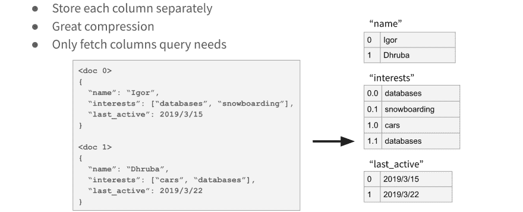
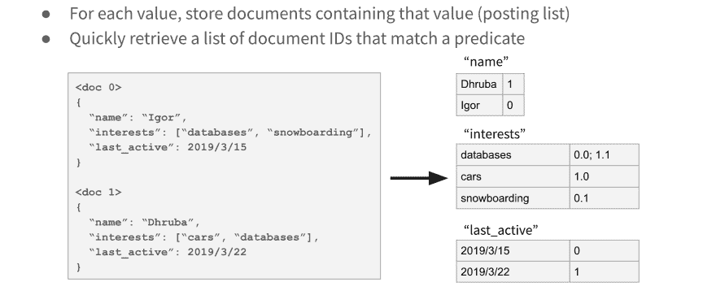
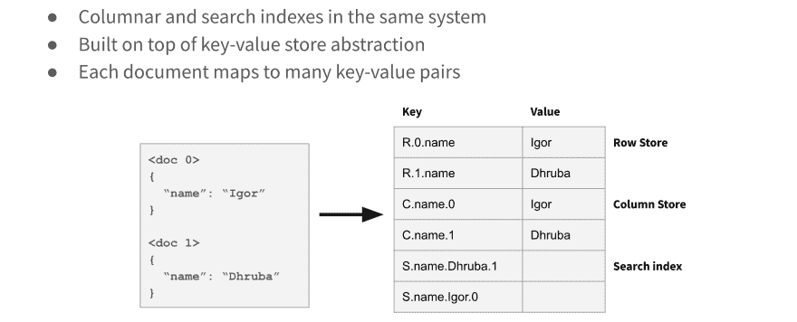

# 聚合索引:Rockset 快速查询背后的秘方

> 原文：<https://dev.to/rocksetcloud/converged-indexing-the-secret-sauce-behind-rockset-s-fast-queries-3hp8>

*作者[伊戈尔·坎纳迪](https://www.linkedin.com/in/igorcanadi/)T3】*

给数据库添加索引是生活中的一件小事。一个查询需要 10 秒钟，你添加一个好的索引，然后嘣...10 毫秒！客户高兴，经理高兴，数据库高兴(至少根据它的 CPU 图)。然而，管理索引很快就过时了。索引越多意味着写入速度越慢。总会有另一个查询爬上延迟图。想象一下人类在数据库索引上玩打地鼠游戏所花费的总时间。更糟糕的是，想象一下我们与技术的日常交互有多少受到缓慢的、无索引的查询的影响。

Rockset 正在用一个激进的解决方案来解决这个问题:在所有列上建立索引。Rockset 的设计目标之一是绝对最小化用户需要做的配置量。创建索引是一种配置；它必须消失。我们称我们的方法为聚合索引。在我们深入研究技术细节之前，让我分享一下我们构建的两种索引类型的背景:列索引和搜索索引。

### **柱状索引**

最初，存在面向行的存储，其中单行连续存储在存储介质上。提取单个行很快——单个 IO。然而，在某些情况下，数据库表可能包含大量的列，而查询只涉及一小部分。对于这类查询，面向列的存储效果更好。

在面向列的存储中，我们将特定列的所有值连续存储在存储中。一个查询可以有效地获取它所需要的列，这使得它非常适合在大数据集上进行分析查询。此外，面向列的存储具有更好的压缩率。一列中的值通常彼此相似，相似的值存储在一起时压缩效果非常好。有一些先进的技术使压缩更好，如字典压缩或游程编码。毫不奇怪，一些最成功的数据仓库解决方案都使用面向列的存储，如 Vertica、Amazon Redshift 或 Google 的 BigQuery。

### **搜索索引**

搜索索引是一种使类似搜索的查询更快的技术。在每个`(column, value)`对的搜索索引中，我们存储了一个文档列表，称为发布列表。任何带有简单谓词的查询都可以快速获取满足该谓词的文档列表。通过对发布列表进行排序，我们可以使列表相交或合并，以分别满足谓词的合取或析取。搜索索引用于 Elasticsearch 和 Apache Solr 等系统，这两个系统都基于 Apache Lucene 库。

### **融合索引:行+列+搜索**

在 Rockset，我们将每个文档的每一列存储在基于行的存储、基于列的存储和搜索索引中。

是的，我们制作了数据集的三个副本。这怎么合理呢？两个主要原因:

1.  聚合索引需要更多的磁盘空间，但是我们的查询速度更快。简单来说，我们用存储换取 CPU。然而，更重要的是，我们用硬件换取了人类的时间。人类不再需要配置索引，也不再需要等待缓慢的查询。
2.  任何有经验的数据库用户都知道，当您添加更多索引时，写入会变得更重。现在，单个文档更新需要更新许多索引，从而导致许多随机的数据库写入。在基于 B 树的传统存储中，对数据库的随机写入转化为对存储的随机写入。在 Rockset，我们使用 LSM 树而不是 B 树。LSM 树针对写入进行了优化，因为它们将对数据库的随机写入转变为对存储的顺序写入。您可以在这篇伟大的文章中了解更多信息:[现代存储系统背后的算法](https://queue.acm.org/detail.cfm?id=3220266)。我们使用 RocksDB 的 LSM 树实施，并在分布式设置中对每秒数百 MB 的写入进行了内部基准测试。

我们有所有这些索引，但是我们如何为我们的查询选择一个最好的呢？我们构建了一个定制的 SQL 查询优化器，用于分析每个查询并决定执行计划。例如，考虑以下查询:

**查询 1**