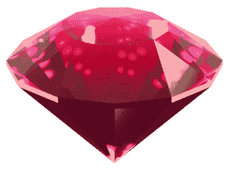
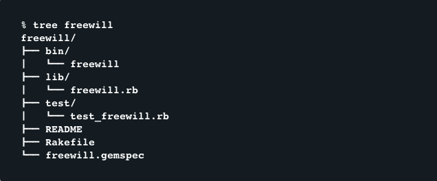
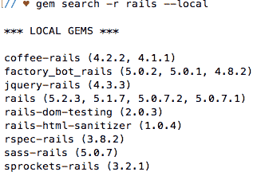
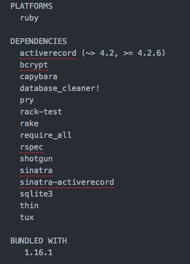
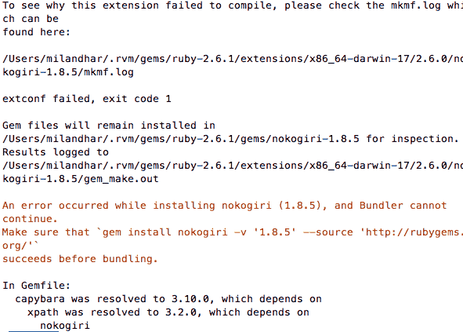
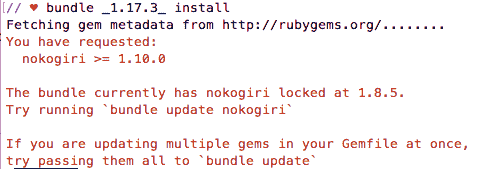
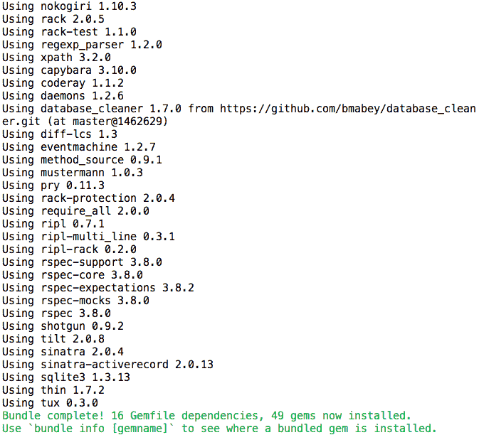

# 红宝石介绍

> 原文：<https://dev.to/milandhar/an-intro-to-ruby-gems-ap8>

作为初学 Ruby 的程序员，我们经常下意识地使用 gems。我们可以把 binding.prys 左右抛出来调试我们的代码，但是在没有真正理解 Pry gem 到底是什么或者它来自哪里的情况下，也有可能更深入地了解 Ruby 的情况。自从在熨斗学校开始使用 Ruby 以来，我注意到我们的实验室和项目已经包含了具有越来越长的 gem 列表的 gem 文件，并且我们已经开始使用越来越强大的 gem，例如 ActiveRecord、Sinatra 和 Rails。我意识到 gems 实际上为我们的 Ruby 代码增加了无限量的自由杠杆，但是许多方面似乎仍然很神秘。在继续 Ruby-On-Rails 之旅之前，我想确保我对什么是 gems 有一个坚实的理解，这样我就知道如何最大化它们的潜力，并且管理 bug...因此，这篇博文！

虽然我们不会深究单个宝石的功能，这篇文章将向你介绍什么是 Ruby 宝石，一些快速技巧，以及如何利用它们的全部潜力。

## 什么是 RubyGems？

RubyGems 是 Ruby 的一个包管理器，它为发布 Ruby 程序和库(又名 Gems)提供了一个标准格式。RubyGems 是我们用来创建、共享和安装 Gems 的工具。

## 宝石的结构是什么？

Gems 包括以下组件:代码、文档和 gemspec。所有 gem 都遵循以下代码组织结构:

## 寻找宝石和有用的命令

在大多数情况下，RubyGems.org 网站是寻找宝石的最佳地点。但是，您也可以使用`gems search -r`通过终端搜索 RubyGems 的存储库。

`--local`选项将 gems 的搜索限制在你机器上安装的 gems。例如，`gem search -r rails --local`返回以下安装在我的计算机上的 gems 列表:

使用`gem install [gem name]`安装宝石。您可以使用`gem list`浏览所有已安装的 gem。

您的终端内也有通过`gem help`提供的文档。

`gem help commands`很有用，因为它显示了所有可用 gem 命令的列表。

## Bundler 和 Gemfiles

### Bundler 是什么？

目前在熨斗工作已经一个月了，我可能已经对`bundle`这个词进行了上百次编码，但是很少停下来深入理解它的作用以及它为什么如此有用。根据它在 RubyGems 中的页面，Bundler 是一个“在应用程序的整个生命周期中，跨许多机器，系统地和可重复地管理应用程序的依赖性”的瑰宝。它通过跟踪和安装运行应用程序所需的 gems 的精确版本，为 Ruby 项目提供了一个一致的环境。如果没有 Bundler，跟踪一个项目所需的所有依赖项将是一场噩梦，但是 Bundler 可以确保您拥有用于开发、试运行和生产的正确宝石。要安装 Bundler，只需从您的终端运行`$ gem install bundler`。

### 什么是 Gemfiles？

Gemfile 是一种描述 Ruby 程序的 gem 依赖关系的格式。gem 文件放在包含相关代码的根目录中。在 gem 文件的顶部，您必须为 RubyGems 源添加一行，其中包含项目所需的所有 gems:
`source "https://rubygems.org"`

#### 名称

gem 文件的真正目的是列出单个的 gem 需求，每个需求在单独的一行:
`gem 'pry'
gem 'rails'
gem 'bootsnap'
gem 'byebug'
gem 'rspec-rails'`

#### 版本/组

每个宝石可以有一个或多个版本规格:
`gem "pry", ">= 0.10.3"
gem "nokogiri", ">= 1.10.1", "< 1.10.3"`

每个 gem 还可以指定它所属的组。如果没有指定组，它将被放在`default`组中。
T1】

### 安装需要的宝石

Bundler 的真正强大之处在于它为用户提供了安装运行应用程序所需的所有 gem 的简单性。只需要一个快速的`bundle install`，你的 gem 文件中指定的所有 gem 都将被安装。
你也可以使用`--without`指定一组 gem 在安装过程中跳过。例如:如果在开发模式下使用的数据库不同于生产模式下使用的数据库，则应该使用`$bundle install --without production`。

### Gemfile.lock

Gemfile.lock 是另一个我注意到挂在根目录下但被忽略的文件，假设我永远不需要打开它。我错了！

#### 什么是 Gemfile.lock？

Gemfile.lock 是 Gemfile 中所有 gem 在某个时间点的版本快照。

在我们的 Gemfile 中，我们编写如下依赖关系:

`gem 'sqlite3', '~>1.3.6'
gem 'sass-rails', '~> 5.0'
gem 'uglifier', '>= 1.3.0'`

`~>`符号在 gem 文件中有特殊的含义。`gem 'sqlite3', '~>1.3.6'`的意思是“我们想要任何版本的 sqlite3，只要它的*大于或等于* **1.3.6** *并且小于* **1.4** ”同样，`gem 'sass-rails', '~> 5.0'`的意思是“我们想要任何版本的 sass-rails，只要它的*大于或等于* **5.0** *并且小于* **5.1** ”如果我们在一年前开发我们的应用，而现在 sqlite3 的版本是 1.4.1，那么今天运行`bundle install`可能会带来问题(假设没有 Gemfile.lock)。当前版本的 sqlite3 可能会破坏我们的应用程序，或者以前版本中可用的功能不再可用，等等。这就是 Gemfile.lock 的用武之地！

在 Gemfile.lock 中，当运行`bundle install`时，只安装指定的精确版本。因此，如果您使用 Gemfile.lock 分发您的应用程序，每台机器将使用每个 gem 的完全相同的版本，从而提供稳定的部署堆栈。

#### 如何创建 Gemfile.lock

轻松！首次运行`bundle install`时，会自动创建一个 Gemfile.lock。之后每次运行`bundle install`，Bundler 都会先查找 Gemfile.lock，安装那里指定的版本。

如果您想将 Gemfile.lock 中的 gem 更新到最新版本，您可以将依赖项更新到您在 Gemfile 中想要的确切版本，并且下次运行`bundle install`时，更新的版本将反映在 Gemfile.lock 中

最佳实践是将您的 Gemfile.lock 检查到 git 中，以便下载您的应用程序的每台机器也有您的 Gemfile.lock，使用每个 gem 的相同版本，并且不需要单独解析所有依赖项。

### 一个 Bundler Bug 的例子

最近，我在我们的实验室遇到了一些问题，实验室中指定的 Bundler 版本阻止了其他必要的 gem 的正确安装。

在最近的一个实验中，Gemfile.lock 与旧版本的 Bundler (1.16.1)捆绑在一起，而当前版本是 2.0.1。下面是根目录下 Gemfile.lock 的一个片段:

如您所见，Gemfile.lock 包含了 Bundler gem 的旧版本(1.16.1)。
尝试在此实验室上运行`bundle install`时，我收到了以下错误消息:

我们被提示安装 nokogiri-1.8.5，因为 capybara 被解析为 v 3.10.0，它依赖于旧的 nokogiri，但是有几个依赖项阻止了 nokogiri-1.8.5 的成功安装，结果是安装这些依赖项也没有解决问题。这里的问题是 Bundler (1.16.1)指定了一个我不能再下载的 nokogiri 版本。结果，我试着用我电脑上的 Bundler 的稍新版本(1.17.3)运行了一个`bundle _1.17.3_ install`。运行普通的`bundle install`只会使用 Gemfile.lock 中指定的 Bundler 版本(本例中为 1.16.1 ),并继续请求不工作的 nokogiri 版本。但是通过`bundle _1.17.3_ install`指定更高的版本要求使用稍微高一点的版本来安装许多依赖项，并且*希望*将把 nokogiri 版本移到 1.8.5 之后。唉，我现在得到了一个*不同的*错误，我的`bundle _1.17.3_ install`命令要求 nokigiri > = 1.10.0，但当前捆绑包将 nokogiri 锁定在 1 . 8 . 5——有进展了！：

在接受了错误消息的建议并使用 Bundler (1.17.3)运行了一个快速的`bundle update nokogiri`之后，我能够将 nokogiri 更新到 1.10.3。然后我运行了一个简单的`bundle install`，所有的依赖项都正确安装了，包括正确版本的水豚——实验室准备就绪！

## 结论

我希望这篇文章能为您继续 Ruby-On-Rails 之旅提供有益的参考。理想情况下，我所经历的 bug 示例展示了熟悉 gems 的效用。网上有很多关于 gems 的帮助，但理想情况下，这是一个单一的知识库，可以帮助你优化与 gems 的交互并消除一些错误！欢迎在下面发表问题/评论。

感谢阅读！

##### 我在这篇文章中使用了以下参考资料:

[https://rubygems.org/gems/bundler/versions/1.11.2](https://rubygems.org/gems/bundler/versions/1.11.2)
[https://bundler.io/](https://bundler.io/)
[https://bundler.io/man/gemfile.5.html](https://bundler.io/man/gemfile.5.html)
[https://stack overflow . com/questions/6927442/what-of-the-difference-gem file-and-gem file-lock-in-ruby-on-rails/10959764](https://stackoverflow.com/questions/6927442/what-is-the-difference-between-gemfile-and-gemfile-lock-in-ruby-on-rails/10959764)
[https://www . realife webdesigns . com/web-programming/ruby on rails/gem-bundler . ASP](https://www.realifewebdesigns.com/web-programming/rubyonrails/gem-bundler.asp)