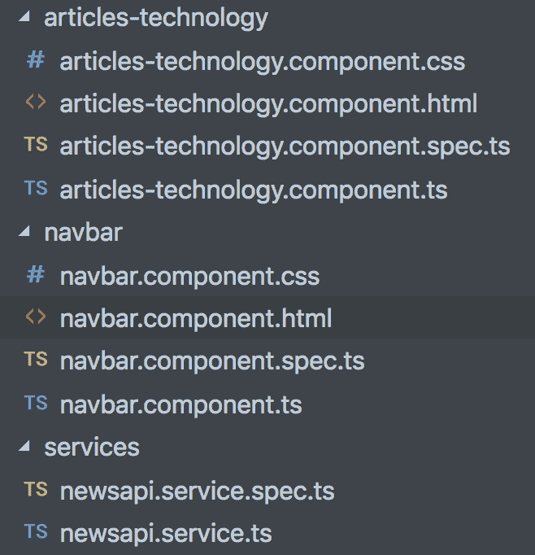
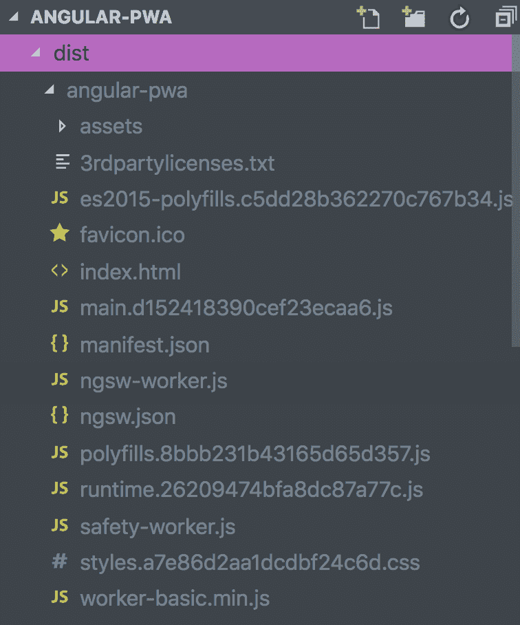
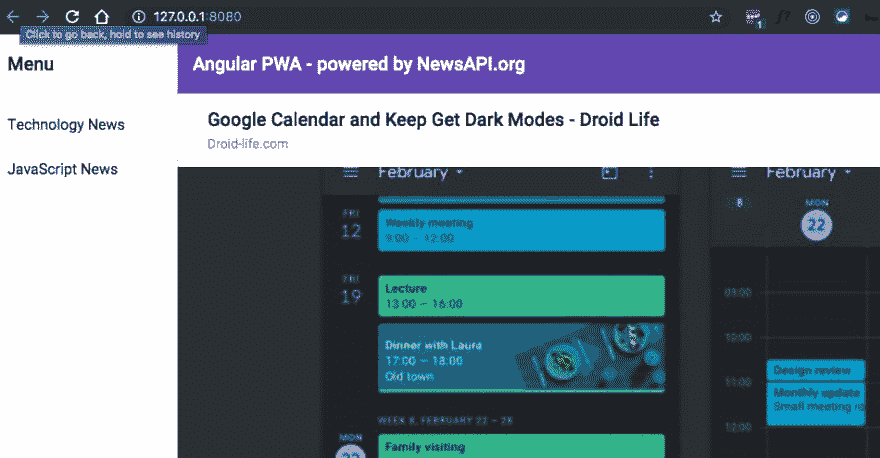
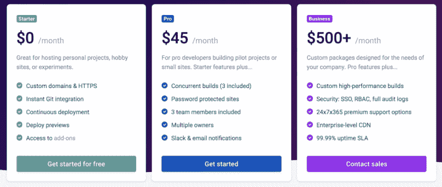
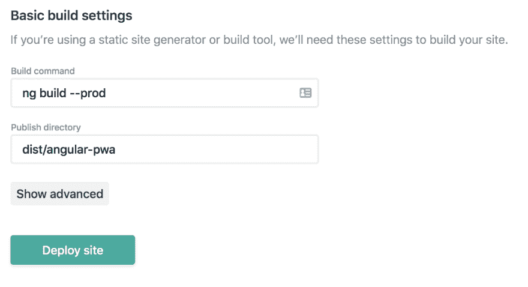
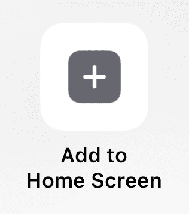

# 使用 Angular 构建渐进式 Web 应用程序

> 原文：<https://dev.to/clevernickname/build-a-progressive-web-app-with-angular-47c0>

* * *

[](https://res.cloudinary.com/practicaldev/image/fetch/s--KUALYc26--/c_limit%2Cf_auto%2Cfl_progressive%2Cq_auto%2Cw_880/http://john-green.net/wp-content/uploads/2019/05/001-1.png)

> 通过使用 Angular 创建渐进式 Web 应用程序，将 JavaScript 的灵活性与本机应用程序的用户体验结合起来。

在本教程中，我们将构建一个 Angular 应用程序，逐步使其成为渐进式 Web 应用程序(PWA ),然后使用 Netlify 部署它，以便在移动设备上使用该应用程序。

你可以 [**使用 GitHub 库**](https://medium.com/r/?url=https%3A%2F%2Fgithub.com%2Fclevernickname%2Fangular-pwa) 作为参考，并在我们从头开始构建 Angular PWA 的过程中编写代码。

如果你是 Angular 的新手，你可能会发现在开始之前查看我关于 Angular 开发的 [**计算机设置**](https://medium.com/r/?url=https%3A%2F%2Fjohn-green.net%2Fweb%2Fcomputer-setup-for-angular-development%2F) 和[**Angular CLI**](https://medium.com/r/?url=https%3A%2F%2Fjohn-green.net%2Fweb%2Fgetting-started-with-angular-cli%2F)入门的文章会有所帮助。

### 打造角度 App

* * *

要开始构建我们的 Angular 应用程序，请打开您的终端，在您想要创建应用程序(app)的位置创建一个新目录(或者选择一个现有的目录)。然后使用以下 Angular CLI 命令创建一个新的 Angular app:

```
ng new angular-pwa 
```

对于角度路由选择**是，对于样式表格式**选择 **CSS。**

[](https://res.cloudinary.com/practicaldev/image/fetch/s--AsK5krZs--/c_limit%2Cf_auto%2Cfl_progressive%2Cq_auto%2Cw_880/http://john-green.net/wp-content/uploads/2019/05/002-1.png)

我们将使用 [**有棱角的材料**](https://medium.com/r/?url=https%3A%2F%2Fmaterial.angular.io%2F) 来处理我们的应用程序的外观、布局和可访问性。进入你刚刚创建的 **angular-pwa** 目录，添加 angular 材质:

```
cd angular-pwa 
```

```
ng add @angular/material 
```

选择一个颜色主题并回答 **Yes** 来添加 HammerJS 和浏览器动画。

[](https://res.cloudinary.com/practicaldev/image/fetch/s--DTufFL7s--/c_limit%2Cf_auto%2Cfl_progressive%2Cq_auto%2Cw_880/http://john-green.net/wp-content/uploads/2019/05/003-1.png)

您可以通过运行:
来查看 web 浏览器中的样本 Angular 应用程序

```
ng serve -o 
```

[](https://res.cloudinary.com/practicaldev/image/fetch/s--SfLSNqGa--/c_limit%2Cf_auto%2Cfl_progressive%2Cq_auto%2Cw_880/http://john-green.net/wp-content/uploads/2019/05/004-1.png) 
该应用程序应该加载到您的默认浏览器中，如下所示。

我们正在构建的应用程序将允许用户查看技术和 JavaScript 新闻标题。因为用户将需要在两者之间导航，所以让我们通过运行:
来添加带角度材料的导航

```
ng g @angular/material:material-nav --name navbar 
```

我们将从 NewsAPI 获取内容。你需要一个访问 api 的密匙，所以去 [**NewsAPI 网站**](https://medium.com/r/?url=https%3A%2F%2Fnewsapi.org%2F) 注册一个开发者来获得一个免费的密匙。

[](https://res.cloudinary.com/practicaldev/image/fetch/s--2dalE7X8--/c_limit%2Cf_auto%2Cfl_progressive%2Cq_auto%2Cw_880/http://john-green.net/wp-content/uploads/2019/05/005-1.png)

一旦您有了您的 NewsAPI 密钥，让我们通过运行:
为我们的应用程序创建服务提供者

```
ng generate service services/newsapi 
```

这将创建一个新的 **services** 子目录，其中包含样板文件。启动你选择的代码编辑器，打开你刚刚在**angular-pwa/src/app/services/**中创建的 **newsapi.service.ts** 文件

我们想要设置两个 API 端点；一个是科技新闻，另一个是 T2 JavaScript 新闻。 [**NewsAPI 文档**](https://medium.com/r/?url=https%3A%2F%2Fnewsapi.org%2Fdocs) 展示了如何格式化 http 端点。下面是我们将使用的:

```
https://newsapi.org/v2/top-headlines?category=technology&language=en&country=us&apiKey=

https://newsapi.org/v2/everything?q=javascript&sortBy=latest&apiKey= 
```

现在使用下面的代码编辑 **newsapi.service.ts** 文件。我们将把 HttpClient 和 Observable 添加到我们的导入中，并创建从我们的 API 端点获取新闻文章的函数。

请务必在下面一行输入您的 NewsAPI 密钥:

```
 _api_key = ‘YOUR NEWSAPI KEY GOES HERE’_ 
```

```
import { HttpClient } from '@angular/common/http';
import { Injectable } from '@angular/core';
import { Observable } from 'rxjs';
import { map } from 'rxjs/operators';

@Injectable({
  providedIn: 'root'
})
export class NewsapiService {
  api_key = 'YOUR NEWSAPI KEY GOES HERE';

  constructor(private http: HttpClient) {}

  getArticlesTechnology(): Observable<any> {
    return this.http
      .get(
        'https://newsapi.org/v2/top-headlines?category=technology&language=en&country=us&apiKey=' +
          this.api_key
      )
      .pipe(map((data: any) => data.articles));
  }

  getArticlesJavaScript(): Observable<any> {
    return this.http
      .get(
        'https://newsapi.org/v2/everything?q=javascript&sortBy=latest&apiKey=' +
          this.api_key
      )
      .pipe(map((data: any) => data.articles));
  }
} 
```

要使用我们的新服务提供者，我们需要将它和 **HttpClientModule** 添加到我们的 **app.module.ts** 文件中。打开并编辑 **app.module.ts** 文件。

```
import { LayoutModule } from '@angular/cdk/layout';
import { HttpClientModule } from '@angular/common/http';
import { NgModule } from '@angular/core';
import {
  MatButtonModule,
  MatCardModule,
  MatIconModule,
  MatListModule,
  MatSidenavModule,
  MatToolbarModule
} from '@angular/material';
import { BrowserModule } from '@angular/platform-browser';
import { BrowserAnimationsModule } from '@angular/platform-browser/animations';
import { AppRoutingModule } from './app-routing.module';
import { AppComponent } from './app.component';
import { ArticlesTechnologyComponent } from './articles-technology/articles-technology.component';
import { NavbarComponent } from './navbar/navbar.component';
import { NewsapiService } from './services/newsapi.service';

@NgModule({
  declarations: [AppComponent, NavbarComponent, ArticlesTechnologyComponent],
  imports: [
    BrowserModule,
    AppRoutingModule,
    BrowserAnimationsModule,
    HttpClientModule,
    LayoutModule,
    MatToolbarModule,
    MatCardModule,
    MatButtonModule,
    MatSidenavModule,
    MatIconModule,
    MatListModule
  ],
  providers: [NewsapiService],
  bootstrap: [AppComponent]
})
export class AppModule {} 
```

现在通过运行:
创建一个新组件来显示技术新闻

```
ng g c articles-technology 
```

回到你的代码编辑器，你会看到我们创建的新的**文章-技术**目录，以及我们之前创建的**导航条**目录。

[](https://res.cloudinary.com/practicaldev/image/fetch/s--OYA35OV1--/c_limit%2Cf_auto%2Cfl_progressive%2Cq_auto%2Cw_880/http://john-green.net/wp-content/uploads/2019/05/006-1.png)

打开**articles-Technology . component . ts**文件，编辑它以添加我们的 NewsAPI 服务并为技术新闻文章创建数组。

```
import { Component } from '@angular/core';
import { Observable } from 'rxjs';
import { NewsapiService } from '../services/newsapi.service';

@Component({
  selector: 'app-articles-technology',
  templateUrl: './articles-technology.component.html',
  styleUrls: ['./articles-technology.component.css']
})
export class ArticlesTechnologyComponent {
  articles$: Observable<any>;

  constructor(private newsapi: NewsapiService) {}

  ngOnInit() {
    // technology news articles
    this.articles$ = this.newsapi.getArticlesTechnology();
  }
} 
```

接下来打开**articles-technology.component.html**文件，删除 CLI 创建它时添加的所有样板代码。编辑该文件以显示来自我们服务提供商的技术新闻文章。

```
<mat-card *ngFor="let article of articles$ | async">
  <mat-card-header>
    <mat-card-title class="title">{{ article.title }}</mat-card-title>
    <mat-card-subtitle>{{ article.source.name }}</mat-card-subtitle>
  </mat-card-header>
  
  <mat-card-content>
    <p>
      {{ article.description }}
    </p>
  </mat-card-content>
  <mat-card-actions class="action-buttons">
    <a mat-button color="primary" href="{{ article.url }}">
      <mat-icon>description</mat-icon> Full Article
    </a>
  </mat-card-actions> </mat-card> 
```

让我们看看那是什么样子。打开**app.component.html**文件，删除所有样板代码，添加**文章-技术**组件:

```
<app-articles-technology></app-articles-technology> 
```

保存您的文件并在浏览器中查看应用程序，以查看正在显示的技术新闻。现在我们需要创建 JavaScript 新闻组件并格式化我们的导航。

在您的终端中，创建一个新组件来保存我们的 JavaScript 新闻内容:

```
ng g c articles-javascript 
```

正如我们对 articles-technology 组件文件所做的那样，首先我们将编辑**articles-JavaScript . component . ts**:

```
import { Component, OnInit } from '@angular/core';
import { Observable } from 'rxjs';
import { NewsapiService } from '../services/newsapi.service';

@Component({
  selector: 'app-articles-javascript',
  templateUrl: './articles-javascript.component.html',
  styleUrls: ['./articles-javascript.component.css']
})
export class ArticlesJavascriptComponent implements OnInit {
  JSarticles$: Observable<any>;

  constructor(private newsapi: NewsapiService) {}

  ngOnInit() {
    // javascript news articles
    this.JSarticles$ = this.newsapi.getArticlesJavaScript();
  }
} 
```

然后编辑**articles-javascript.component.html**文件:

```
<mat-card *ngFor="let article of JSarticles$ | async">
  <mat-card-header>
    <mat-card-title class="title">{{ article.title }}</mat-card-title>
    <mat-card-subtitle>{{ article.source.name }}</mat-card-subtitle>
  </mat-card-header>
  
  <mat-card-content>
    <p>
      {{ article.description }}
    </p>
  </mat-card-content>
  <mat-card-actions class="action-buttons">
    <a mat-button color="primary" href="{{ article.url }}">
      <mat-icon>description</mat-icon> Full Article
    </a>
  </mat-card-actions> </mat-card> 
```

现在我们已经有了技术新闻和 JavaScript 新闻组件，我们将添加导航。首先，我们将通过编辑 **app-routing.module.ts** 文件来添加路由，以导入我们的组件并构造它们的路径。

```
import { NgModule } from '@angular/core';
import { RouterModule, Routes } from '@angular/router';
import { ArticlesJavascriptComponent } from './articles-javascript/articles-javascript.component';
import { ArticlesTechnologyComponent } from './articles-technology/articles-technology.component';

const routes: Routes = [
  { path: 'articles', component: ArticlesTechnologyComponent },
  { path: 'articles-javascript', component: ArticlesJavascriptComponent }
];

@NgModule({
  declarations: [],
  imports: [RouterModule.forRoot(routes)],
  exports: [RouterModule]
})
export class AppRoutingModule {} 
```

现在我们可以通过编辑**navbar.component.html**文件:
来格式化导航条组件

```
<mat-sidenav-container class="sidenav-container">
  <mat-sidenav
    #drawer
    class="sidenav"
    fixedInViewport="true"
    [attr.role]="(isHandset$ | async) ? 'dialog' : 'navigation'"
    [mode]="(isHandset$ | async) ? 'over' : 'side'"
    [opened]="!(isHandset$ | async)"
  >
    <mat-toolbar>Menu</mat-toolbar>
    <mat-nav-list>
      <a
        mat-list-item
        [routerLink]="['/articles']"
        routerLinkActive="router-link-active"
        >Technology News</a
      >
      <a
        mat-list-item
        [routerLink]="['/articles-javascript']"
        routerLinkActive="router-link-active"
        >JavaScript News</a
      >
    </mat-nav-list>
  </mat-sidenav>
  <mat-sidenav-content>
    <mat-toolbar color="primary">
      <button
        type="button"
        aria-label="Toggle sidenav"
        mat-icon-button
        (click)="drawer.toggle()"
        *ngIf="isHandset$ | async"
      >
        <mat-icon aria-label="Side nav toggle icon">menu</mat-icon>
      </button>
      <span>Angular PWA - powered by NewsAPI.org</span>
    </mat-toolbar>
    <router-outlet></router-outlet>
    <app-articles-technology></app-articles-technology>
  </mat-sidenav-content> </mat-sidenav-container> 
```

在**navbar.component.html**中，我们将内容设置为文章-技术组件。所以，回到 app.component.html 的**文件中，删除我们之前添加的代码，用我们的导航栏:
替换它**

```
<app-navbar></app-navbar> 
```

检查您的浏览器，查看该应用程序正在运行，并导航到技术新闻和 JavaScript 新闻。

[](https://res.cloudinary.com/practicaldev/image/fetch/s--mv0XnTz6--/c_limit%2Cf_auto%2Cfl_progressive%2Cq_auto%2Cw_880/http://john-green.net/wp-content/uploads/2019/05/007-1.png)

### 建立 PWA

* * *

既然我们已经有了一个正常运行的应用程序，让我们把它变成一个 PWA 吧！转到您的终端并运行:

```
ng add @angular/pwa --project angular-pwa 
```

Angular CLI 将处理一些事情，将我们的 Angular 应用程序设置为 PWA。它将:

*   将 **@angular/service-worker** 包添加到我们的 **app.module.ts** 文件导入中:

```
import{ ServiceWorkerModule } from ‘@angular/service-worker’; @NgModule({ ..
 imports: [ …
 ServiceWorkerModule.register(‘ngsw-worker.js’, { enabled: environment.production })
 ] … 
```

*   在 **src** 目录下创建两个文件: **manifest.json** 和 **ngsw-config.json** 并在 **angular.json** 文件中添加 **manifest.json** 。

```
“assets”: [
“src/favicon.ico”,
“src/assets”,
“src/manifest.json”
] 
```

*   用到 **manifest.json** 的链接和主题颜色的 meta 标签更新我们的 index.html 文件。

```
<link rel=”manifest” href=”manifest.json”>
<meta name=”theme-color” content="#1976d2"> 
```

如果你想改变主题颜色，你需要在**index.html**和 **manifest.json** 文件中进行修改。

好吧——让我们建立我们的 PWA。在您的终端运行:

```
ng build --prod 
```

注意添加到我们项目中的新的 **dist 目录**。

[](https://res.cloudinary.com/practicaldev/image/fetch/s--p_rSiAKA--/c_limit%2Cf_auto%2Cfl_progressive%2Cq_auto%2Cw_880/http://john-green.net/wp-content/uploads/2019/05/008-1.png)

构建创建了我们的服务人员和我们的应用程序需要成为 PWA 的其他一切。要查看它的运行情况，我们需要从 http 服务器提供服务，因为服务人员不使用 ng serve。

要在全球范围内安装 **http-server** ，请在您的终端上运行:

```
npm i -g http-server 
```

然后通过运行:
启动 PWA

```
http-server -p 8080 -c-1 dist/angular-pwa 
```

现在去查看我们的 PWA:[http://127 . 0 . 0 . 1:8080](http://127.0.0.1:8080)

[](https://res.cloudinary.com/practicaldev/image/fetch/s--jcp2EPtz--/c_limit%2Cf_auto%2Cfl_progressive%2Cq_auto%2Cw_880/http://john-green.net/wp-content/uploads/2019/05/009-1.png)

打开你的**浏览器开发工具**，在**网络标签**中选择**离线**然后刷新页面。由于服务工作者缓存，我们的 PWA 仍在提供内容！

[](https://res.cloudinary.com/practicaldev/image/fetch/s--YTV3GrvT--/c_limit%2Cf_auto%2Cfl_progressive%2Cq_auto%2Cw_880/http://john-green.net/wp-content/uploads/2019/05/010-1.png)

### 使用 Netlify 部署 PWA

* * *

好吧，我们用 Angular 构建了一个 PWA，但是如果我们不把它放到我们的移动设备上又有什么意义呢？为此，让我们使用 Netlify。

[](https://res.cloudinary.com/practicaldev/image/fetch/s--lJPVlhLR--/c_limit%2Cf_auto%2Cfl_progressive%2Cq_auto%2Cw_880/http://john-green.net/wp-content/uploads/2019/05/011.jpeg)

Netlify 是一家基于云的托管公司，通过 git 库的持续部署快速部署静态网站。

首先要做的是在 GitHub、GitLab 或 BitBucket 上创建一个代码库。然后前往**和 [**使用你的 git 服务**](https://medium.com/r/?url=https%3A%2F%2Fapp.netlify.com%2Fsignup) **注册。他们有像本教程这样的免费实验。****

 **[ ](https://res.cloudinary.com/practicaldev/image/fetch/s--D8ANjy1j--/c_limit%2Cf_auto%2Cfl_progressive%2Cq_auto%2Cw_880/http://john-green.net/wp-content/uploads/2019/05/012-1.png) [ ](https://res.cloudinary.com/practicaldev/image/fetch/s--9nmjoL45--/c_limit%2Cf_auto%2Cfl_progressive%2Cq_auto%2Cw_880/http://john-green.net/wp-content/uploads/2019/05/013-1.png)

从 Git 按钮登录并点击新网站。

添加您的存储库，输入 **ng build - prod** 作为构建命令，输入 **dist/angular-pwa** 作为发布目录，然后单击 Deploy site 按钮。

[](https://res.cloudinary.com/practicaldev/image/fetch/s--juqDeYuP--/c_limit%2Cf_auto%2Cfl_progressive%2Cq_auto%2Cw_880/http://john-green.net/wp-content/uploads/2019/05/014-1.png)

部署完成后，您将获得一个可以在智能手机上打开以查看 PWA 的 URL。将其保存到主屏幕，以将图标保存到您的作品中。

[ ](https://res.cloudinary.com/practicaldev/image/fetch/s--uFg5Uj6b--/c_limit%2Cf_auto%2Cfl_progressive%2Cq_auto%2Cw_880/http://john-green.net/wp-content/uploads/2019/05/015-1.png) [ ](https://res.cloudinary.com/practicaldev/image/fetch/s--SpJxhgUH--/c_limit%2Cf_auto%2Cfl_progressive%2Cq_auto%2Cw_880/http://john-green.net/wp-content/uploads/2019/05/016-1.png)

我希望你和我一样发现用 Angular 构建 PWA 既有用又有趣。如果您有任何意见或问题，请在这里告诉我，或者[给我发推文](https://twitter.com/johndashgreen)。谢谢，祝编码愉快！**