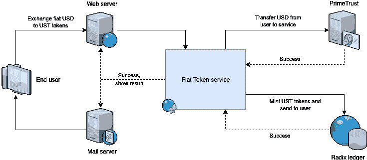

# 基数积木-平面代币

> 原文：<https://dev.to/radixdlt/radix-building-blocks-fiat-tokens-f4j>

> 需要测试版访问
> 这个 Radix 应用程序目前正在预发布测试中，代码尚未在我们的 github 上提供，如果您希望尽早访问以立即开始测试，或者只是希望在它准备好使用时得到通知，请通过此表单注册:
> 【https://radixdlt.typeform.com/to/QUOiQJ】T2
> 我们目前预计该代码将于 2019 年 7 月底公开。

# 简介

在本文档中，我们将详细描述 Fiat Token (FT)参考实现，并回顾其背后的铸造、刻录和发送过程。

这个 FT 系统示例展示了使用 Radix 分布式分类帐在法定货币和用户定义的令牌之间实现桥接是多么简单。

> 对于这个用例场景，我们选择 PrimeTrust 作为我们的技术合作伙伴，因为他们是业内值得信赖的参与者，他们可以为我们提供强大的沙盒托管银行 API 和[详细的技术文档](https://primetrust.com/api_docs.html)。

# 主要成分

菲亚特令牌系统被设计为模块化解决方案，由几个相关组件组成:

web 服务器
-令牌造币服务
-托管接口
-邮件服务器
-基数账户
-基数客户端库
-基数服务钱包
-基数移动/桌面钱包

# Web 服务器

FT 服务公开了一个 REST API，任何客户端都可以直接将其作为目标。它还托管了一个依赖于上述 API 的默认 web 应用程序。REST API 和 web 应用程序都由这个内部 Web 服务器提供服务。

> WebApp 的默认用户界面( [VueJS](https://vuejs.org/) + [布尔玛](https://bulma.io/))是通过内置的 [NanoHTTPD](https://github.com/NanoHttpd/nanohttpd) 网络服务器提供的。它允许注册用户登录并在 PrimeTrust 账户(托管账户)和 Radix wallet 地址之间转移资金，并查看余额和历史交易。

# 代币造币服务

Exchange 服务持有主要的业务逻辑。该组件监听发送到服务的 Radix wallet 或保管人帐户的交易。当 Exchange 服务检测到有新的令牌转移到 Radix Wallet 时，它会烧掉这些令牌，并将相应数量的虚拟资产发送到用户的托管账户(在我们的例子中，是分配给用户的 PrimeTrust 账户，用户可以在该账户中保管他的美元)。当检测到新的现金转移时，该服务将铸造相应数量的代币，并将其发送到用户的 Radix 钱包。

# 保管人界面

这个组件是 PrimeTrust 的 REST API 之上的一个抽象层。该组件使 Mint 服务能够与保管人的基础设施进行通信。与另一个资产服务提供者集成只需要为该层编写一个新的实现。

> 围绕 PrimeTrust API 的抽象层严重依赖于 [OKHTTP](https://square.github.io/okhttp/) 作为传输机制。

# 邮件服务器

当用户交换菲亚特资产和代币时，会通过电子邮件发送一条确认消息。菲亚特令牌服务依靠一个简单的外部谷歌邮件服务器来发送电子邮件通知。

# 基数账户

帐户代表在基数分布式分类帐上为用户存储的所有数据。这包括令牌，也包括任意数据，以及更高级的事务类型。

除了用户的私人基数帐户之外，FT 服务还需要自己的基数帐户来铸造和刻录令牌。

# 基数客户端库

开源的 [Java 客户端库](https://github.com/radixdlt/radixdlt-java)提供了从 Java 项目对 Radix 分布式分类帐的简单访问。FT 服务利用 Java 客户端库来处理所有必需的基数分类帐交互。

# 基数服务钱包

菲亚特令牌服务有一个与其自己的 Radix 帐户相关联的钱包，用于接收、存储、铸造和处理所请求的菲亚特令牌。

# Radix 手机/桌面钱包

Radix 为任何用户提供一个完全分散的[移动](https://github.com/radixdlt/radixdlt-wallet-android)和[桌面](https://github.com/radixdlt/desktop-wallet)钱包，与他们的 Radix 账户相关联。通过这些钱包，用户可以发送、存储和接收来自 FT 服务的菲亚特令牌。

# 工作流程

菲亚特令牌系统为以下用户旅程提供了简单的工作流程:

1.入职现金
2。创建菲亚特代币
3。收回法定代币
4。存放菲亚特代币
5。场外现金

# 入职现金

如果用户希望将现金从其私人银行账户转移到金融时报服务:

1.用户访问他的私人银行账户
2。用户将所需数量的美元货币转移到他的托管账户
3。交易一结算，托管基础设施就向金融时报服务发送回叫。
4。FT 服务收到通知并更新现金余额。

# 创建菲亚特令牌

一旦用户决定将美元资产转换为 UST 菲亚特令牌，以下工作流程将开始运行:

1.FT 服务将请求的现金金额从用户的托管账户转移到该服务的托管账户。
2。交易一结算，托管基础设施就向金融时报服务发送回叫。
3。然后，FT 服务铸造相应数量的 UST 代币，并将其发送到用户的 Radix 钱包。
4。当分类帐以成功状态响应时，web 应用程序被更新，并且通知电子邮件被发送给用户。

用户现在可以根据需要提取这些代币。

# 收回菲亚特代币

当用户决定将 UST 菲亚特代币提取到自己的私人钱包中时，适用以下工作流程:

1.用户指定取款金额和目的基数地址
2。FT 服务将 UST 代币从用户的 ABT 钱包转移到指定的目的地地址。
3。用户在他自己的 Radix 钱包上接收 UST 代币。

# 存放法币

如果用户希望将私人钱包中的菲亚特代币存回金融时报服务:

1.用户打开他的私人 Radix 钱包
2。用户将期望数量的代币发送回他的 ABT 钱包地址
3。ABT 服务接收 UST 代币，并将其保存在用户的 FT 钱包中，以供未来交易使用。

# 场外现金

如果用户想要将 UST 代币转换回美元资产，工作流程如下:

1.FT 服务将 UST 令牌从用户的 FT Radix wallet 转移到服务的 Radix wallet。
2。FT 服务检测到服务钱包的交易，烧录收到的令牌，并将相应金额的美元资产发送到用户的托管账户。
3。web 应用程序会更新新的余额，并通过电子邮件发送确认消息。

用户现在可以选择将资产提取到他的私人银行账户。

# 技术细节

# 交换法定资产和代币

FT 服务正在监控一个专用的 PrimeTrust 银行账户和一个相应的专用基数地址。一旦它检测到对 PrimeTrust 账户的资产交易，它就在用户数据库中寻找发送者。如果找到了发送者，则铸造相应数量的代币并发送给所述用户的 Radix 钱包。

类似地，如果检测到对被监控的基数地址的代币交易，并且在用户数据库中找到发送者，则代币将被烧掉，并且相应数量的资产将被发送到用户的 PrimeTrust 银行账户。

为了简单起见，在这个演示实现中，我们只处理 PrimeTrust 的内部现金转移。此外，该服务被设计成用户 PrimeTrust 账户和 Radix 钱包的“所有者”。这使得后者的私钥处理更加容易。当用户想要将资产换成代币(或者相反)时，他或她只需请求演示服务代表他/她执行必要的交易。

在生产就绪的服务中，这些假设不一定是真的，因此，需要某种明确定义的方式为用户提供事务引用，作为伪标识方法。
此外，任何“了解你的客户”( KYC)和反洗钱(AML)程序在处理这些交易之前，都需要更详细的用户信息。

# 铸造和焚烧代币

像这样按需铸造和燃烧代币的一个挑战是在银行交易和代币铸造/燃烧动作之间保持严格的一对一关系。同样重要的是保持这个状态机与银行和令牌基础设施同步。

Radix ledger 通过 UniqueIdParticle 提供了一种非常方便的方法来加强这种严格的一对一关系。以下示例显示了如何将 UniqueIdParticle 添加到 mint 动作中(该过程与 burn 流的过程几乎相同)。

如果分类帐将检测到唯一 id 冲突(例如，已经为特定资产交易铸造了代币)，它将放弃新的铸造操作并引发错误。

public Single< String >mint tokens(
String userId，
BigDecimal amount，
String asset transferid){
radix address service address = radix application pi . getmy address()；
Token Token = tokendefinitionreference . of(service address，“UST”)；
String uniqueId = userId+"/"+asset transferid+"/mint "；
Action mint Action = mintokensaction . create(token，amount)；
Action uniqueId Action = new putuniqueid Action(service address，uniqueId)；
Action atomication = new atomication(mint Action，uniqueid Action)；
返回 radixApplicationApi
。执行(原子化)
。toCompletable()
。超时(20 秒)
。tossingledefault(asset transferid)；
}

在上面的代码片段中，我们正在编写一个要在分类帐上执行的原子操作。该操作由两部分组成:

-代币的实际铸造，
-附上指定的唯一 id。

通过使用 PrimeTrust 资产转移 id 作为唯一 id 的一部分，我们不仅加强了一对一的关系，还保持了两个基础设施(银行和分类账)的同步，而且我们只用了几行代码就做到了这一点。唯一 id 的另一个吸引人的特性是，它的唯一性只在所提供的地址(上例中的 serviceAddress)下实施。我们通常只能对我们自己的地址强制使用唯一的 id，这样可以防止我们的唯一 id 影响分类帐的其他部分。

# 向用户转移令牌

一旦我们的代币成功铸造，它们将在我们受监控的钱包中可用，然后我们可以将它们发送给首先向我们发送相应资产的用户。

public Single< String >send tokens(
String userId，
BigDecimal amount，
String address，
String asset transferid){
radix address to = radix address . from(address)；
radix address from = radix applicationpi . getmy address()；
Token Token = tokendefinitionreference . of(来自，“UST”)；
String uniqueId = userId+"/"+asset transferid+"/send "；
Action send Action = transfertokensaction . create(from，to，amount，token)；
Action uniqueId Action = new putuniqueid Action(from，uniqueId)；
Action atomication = new atomication(mint Action，uniqueid Action)；
返回 radixApplicationApi
。执行(原子化)
。toCompletable()
。超时(20 秒)
。tossingledefault(transferId)；
}

同样，我们在 send 操作中使用与 mint 操作完全相同的 PrimeTrust transfer id，以确保我们不会为任何资产转移多次发送令牌。

# 交易终结

与所有高度分布式系统一样，终结性成为一个需要牢记的话题，例如，从数据第一次提交到分类帐的时刻到它在网络中的所有节点上可用所花费的时间。通常，目前在基数分类帐中，大约 5 秒应该是一个合理的终结时间。

如果我们太急于对一个成功的结果采取行动，理论上，我们可能会陷入这样一种情况，Radix Java 库由于任何合理的原因可能会暂时失去与生成一些令牌的节点的连接，并立即重新连接到另一个不知道已成功生成令牌的节点。例如，该节点将显示与原始节点不同的钱包余额，直到成功的 mint 操作传播到该节点。

# 结论

我们已经看到，使用 Radix 分布式分类帐和提供的 Radix 开源库，您可以轻松地创建一个服务来铸造、刻录和发送菲亚特令牌。我们还解释了 FT 服务的基本工作流程，以及它们如何与持有用户固定资产的外部托管系统(PrimeTrust)进行交互。此外，我们分享了一些代码片段，以展示使用我们的 Java 客户端库刻录、铸造和传输令牌是多么简单。

# 加入 Radix 社区

[电报](https://t.me/radix_dlt)普通聊天
[不和](https://discord.gg/7Q7HSZZ)开发者聊天
[Reddit](https://reddit.com/r/radix) 普通讨论
[论坛](https://forum.radixdlt.com/)技术讨论
[推特](https://twitter.com/radixdlt)发布公告
[电子邮件](https://radixdlt.typeform.com/to/nyKvMV)简讯每周更新
邮件[hello@radixdlt.com](//hello@radixdlt.com)普通查询