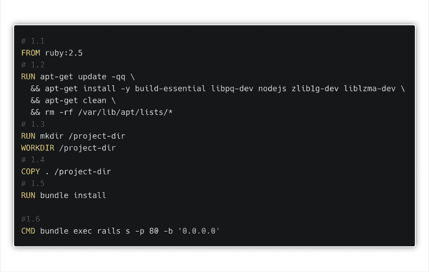
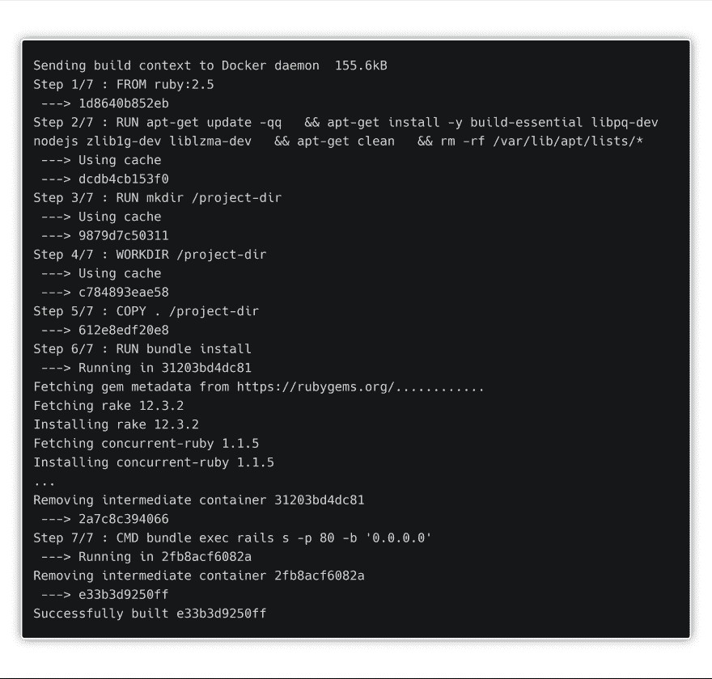
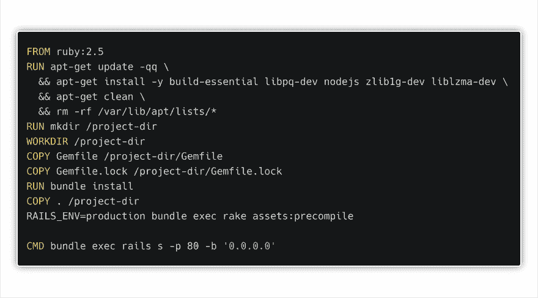
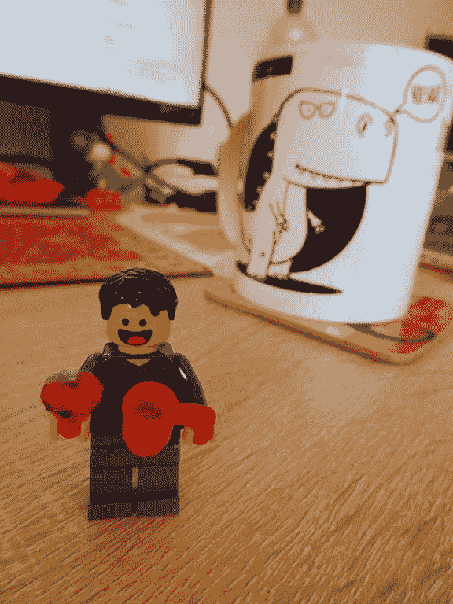

# 如何停靠在铁轨上？

> 原文：<https://dev.to/2nit/how-to-docker-on-rails-5h2d>

开始一个新项目最有趣的事情之一是学习新事物的可能性。去年，我有机会在运行应用程序的运营方面工作，而不仅仅局限于后端编程。这是了解 docker 以及 aws 服务和 kubernetes 更多信息的机会。现在我想分享一些我想知道的东西，作为一系列的文章。第一个是关于在 docker 中运行一个 rails 应用程序。

## I .起点

我知道你可能喜欢“让我看看你的 dockerfile 已经”，所以在这里。

现在我将简要解释上述步骤:

1.1 第一步是您将使用的基础映像。虽然您可以自己从头构建 docker 映像，但从包含大多数所需工具的预构建映像开始更容易。在我们的例子中，我们从预装 ruby 和 bundler 的官方 ruby 映像开始。

1.2 安装您将使用的 gem 所需的系统库。之后，我们将清理下载的包，以获得更容易上传的更清晰的图像。

1.3 为您的代码准备一个位置

1.4 复制应用程序的代码。copy 命令的第一个参数是您希望在 docker 映像中包含的代码的位置，第二个参数是您希望它在映像文件系统中的位置。

1.5 安装运行应用程序所需的任何 gems。

1.6 定义运行 docker 映像时将执行的命令。对于 rails 应用程序，它将是 rails s。注意，与前面的步骤不同，该命令将在运行映像时执行，而不是在构建映像时执行。

现在我们可以使用命令来测试它: **docker build** 。

为了节省空间，我在第 6 步中截掉了一点日志。

注意 docker 文件中的每个命令如何导致一个步骤。每一步的结果都会被缓存，这样下一步的构建会更快。如果假设您更改了代码，但是 docker 文件中没有定义新的通用库，那么新的构建将重用步骤 1 到 4 的缓存版本。

您可以使用命令检查映像是否构建成功: **docker images**

因为我们构建图像时没有传递任何额外的参数，所以结果图像的名称和标签是 none。对我们来说，最重要的信息是图像 id，这将有助于运行图像。

现在您已经有了图像 id，您还可以运行它:**docker run-p 8000:80 e 33 B3 d 9250 ff**

-p 参数将映射端口。第一个是您希望能够访问容器的端口，第二个应该是 docker 文件中设置的端口(检查 CMD 命令末尾的-p 参数)。您现在可以在 *localhost:8000* 上访问 rails 应用程序。

## 二世。下一步

上一部分描述的简单流程足以运行您的应用程序，但是如果您需要经常构建，我们可以对它进行一点优化。

### 1。捆绑安装

最耗时的步骤之一是 gem 安装，即使对应用程序的代码库进行最小的更改也能完成。但是我们可以使用我之前提到的步骤缓存来帮助我们在不必要的时候避免它。

为了实现这一点，我们将首先复制应用程序的 gemfile 并安装它，然后复制其余的文件。这样，如果没有对 gem 文件进行修改，我们就不需要重新安装 gem。

### 2。资产

当在生产中托管网站时，您可能还需要生成资产。我们也将增加这一步。这将在每次构建时重新编译资产，目前还可以。

这是最终的 dockerfile 文件:

感谢阅读！:)
[T3】](https://res.cloudinary.com/practicaldev/image/fetch/s--pxjNHL2m--/c_limit%2Cf_auto%2Cfl_progressive%2Cq_auto%2Cw_880/https://thepracticaldev.s3.amazonaws.com/i/abqcl2eqj16i0towp9cb.png)