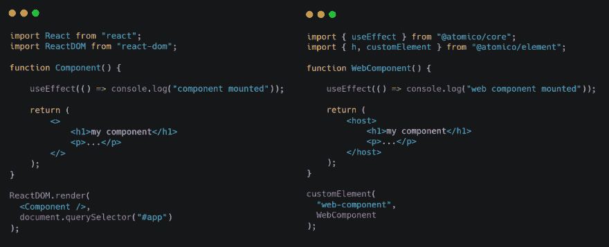
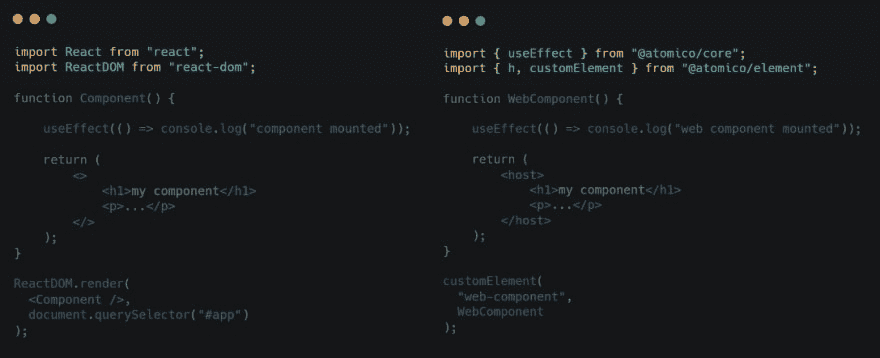
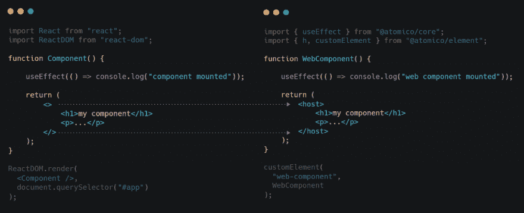
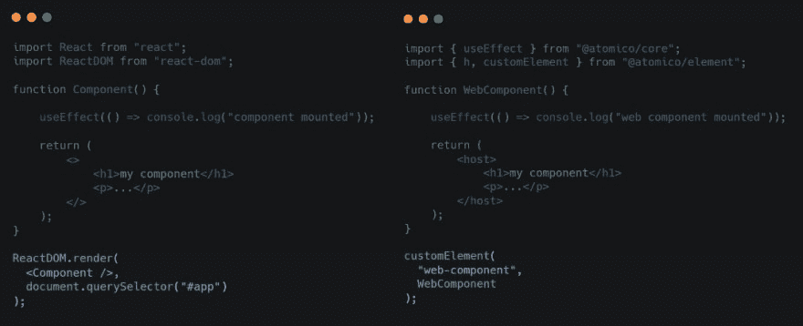

# ⚛️的原子网络组件

> 原文：<https://dev.to/uppercod/de-react-a-webcomponents-con-atomico-53n2>

> ∞今天原子看起来不同于 2017 年，现在原子更强大、更快、更具宣示性、更稳定。我请你在《原子文件》中复习这篇更新的文章

[原子](https://github.com/atomicojs/core)是 OSS [个人](https://twitter.com/Uppercod)项目，旨在简化基于 JSX、Virtual-dom、挂接仅 2.7kB 的 web 组件的创建**本文是对简单的介绍，就是用原子**创建 web 部件

## 反应堆与原子间的微小差异

atomico 部分基于 react API，如:

1.  **挂钩**:[@ atomic/core](https://github.com/atomicojs/core)交付对以下挂钩的支持，`useState`、`useEffect`、`useMemo`、`useRef`和`useReducer`。
2.  **hos**:此模式在高阶元件内运作，意图庇护 DOM 不可见的逻辑，如[路由器](https://github.com/atomicojs/router)或 [Lazy](https://github.com/atomicojs/lazy) ，本文并未介绍使用此模式。

为了更好地说明差异以及如何将 reactor 组件迁移到 WebComponent，我们将使用一个简单的示例。

### 示例代码

### 进口

要将原子绑定到 WebComponents，需要 2 个软件包:

1.  [**@ atomico/core**](https://github.com/atomicojs/core):package que integra soporte sobre，virtual-dom，Hooks，HoCs y mas。
2.  [**@ atomico/element**](https://github.com/atomicojs/element):package que utiliza El render de atomico sobre web components。

### 组件一个 web 组件

`function Component`和`function WebComponent`功能之间最大的区别在于使用片段标签(`<></>`相对于主机(`<host></host>`)原子主机标签指向同一容器，从而获得对 web 组件属性、属性和事件的更具表达性的处理。

**种植主机标记应为返回用原子创建的 web 组件**，如果不返回此标记，atomic 假定在内部生成该组件的拆卸。

### 渲染一个自定义元素

这个小差异允许您在文档中全局声明您的 webComponent 函数，您可以从 React、vue 或 HTML 中使用该函数。

## 可观察到的🧐

`obserbables`是用于定义 WebComponent 特性和属性的原子层，每次更改这些特性和属性时，都会强制呈现这些观测值的新状态。

#### 我还在写这篇文章，希望您喜欢，如果您有任何意见可以随时发表，如果您想尝试原子，请访问以下存储库[@ atomic/core](https://github.com/atomicojs/core)