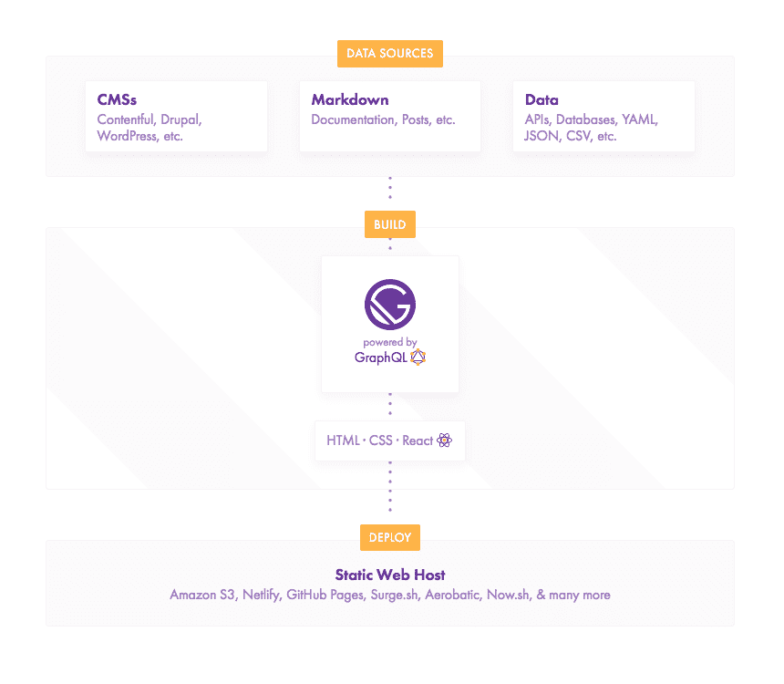
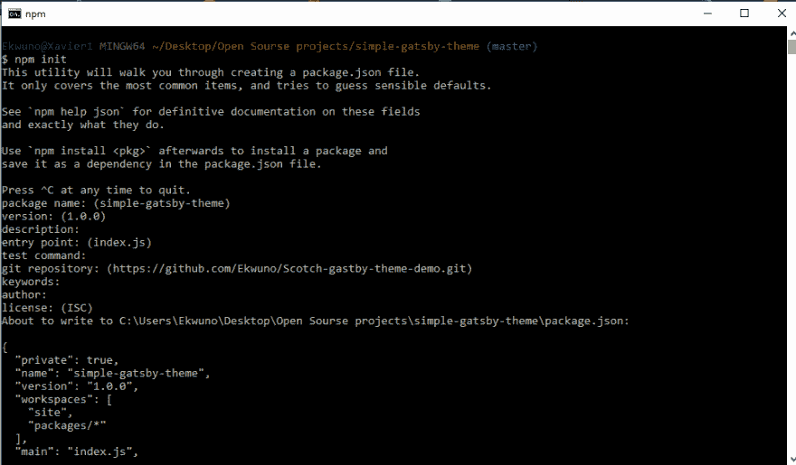
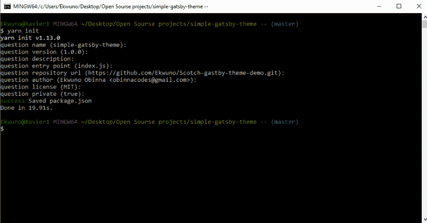
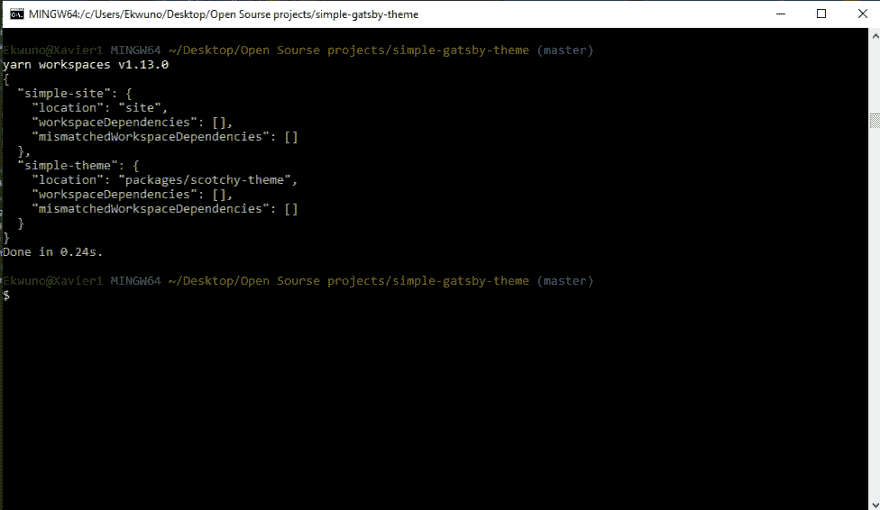
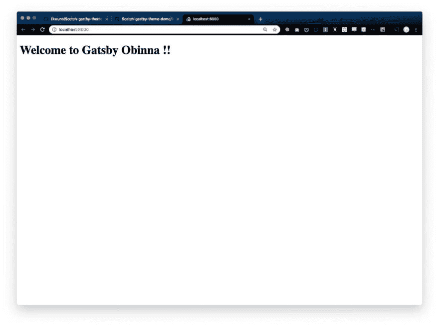
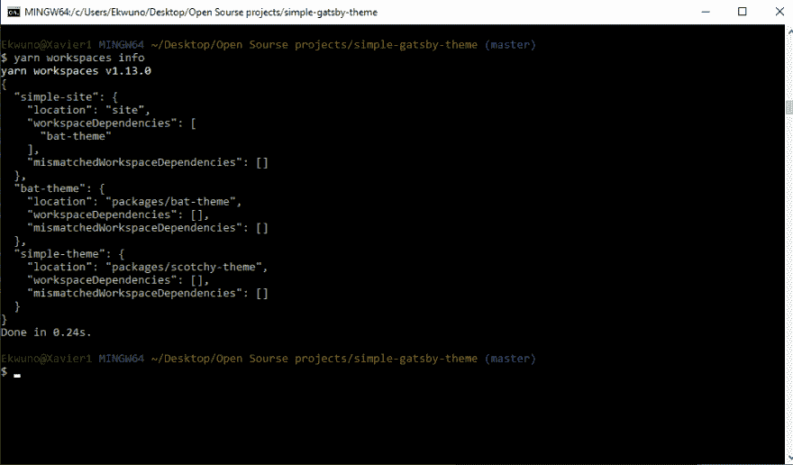

# 如何构建自定义的 GatsbyJS 主题

> 原文：<https://dev.to/bnevilleoneill/how-to-build-a-custom-gatsbyjs-theme-5080>

[](https://res.cloudinary.com/practicaldev/image/fetch/s--cXX30NkB--/c_limit%2Cf_auto%2Cfl_progressive%2Cq_auto%2Cw_880/https://cdn-images-1.medium.com/max/1024/1%2AB_dBwMNWwJn6Jafgiz04wg.png)

### 盖茨比简介

[Gatsby](https://www.gatsbyjs.org) 是一个静态站点生成器，由 [React.js](https://reactjs.org/) 、 [Webpack](https://webpack.js.org/) 和 [GraphQL](https://graphql.org/) 构建而成。它用于构建速度非常快、内容相对静态的网站，例如博客、电子商务网站，甚至公司网站。

> 注意:static site generator 是一个平台，它允许您获得静态 HTML 中的所有请求，而不必担心每次用户发出请求时服务器和模板(代码)的交互。

<figure>[](https://res.cloudinary.com/practicaldev/image/fetch/s--8OzXa21X--/c_limit%2Cf_auto%2Cfl_progressive%2Cq_auto%2Cw_880/https://cdn-images-1.medium.com/max/860/1%2AR8hv5pm2bqGGeM6PQMmbvg.png) 

<figcaption>盖茨比是如何工作的。</figcaption>

</figure>

#### **TL:DR**

以下是我们将在这篇文章中看到的内容的简要概述:

1.  创建主题目录并安装依赖项
2.  将网站连接到自定义主题
3.  导出站点要使用的一些组件
4.  通过实现组件隐藏来重写站点的一些自定义主题功能

[](https://logrocket.com/signup/)

### 先决条件

在我们进一步讨论之前，本文假设:

*   [Node.js ≥ v6](https://nodejs.org/en/) 安装在您的机器上
*   [NPM](https://www.npmjs.com/get-npm) 已安装在您的机器上
*   全球安装 Gatsby CLI
*   你对 [React.js](https://reactjs.org/) 有了基本的了解

### 文件夹设置

在完成以下所有步骤后，文件结构看起来会像这样:

*   简单-盖茨比主题>>套餐> >苏格兰主题
*   位置

simple-gatsby-theme 目录是我们项目的文件夹。packages 目录包含一个文件夹，它的名字就是我们将要创建的主题，在这个文件夹中，我们有我们的主题文件。最后，站点目录包含了我们的 Gatsby 站点，当我们开发它时，它使用了我们的主题。

### 构建盖茨比主题

在某种意义上，主题不同于启动器，因为您可以将主题构建为库。然后，它变成一个可以更新的包，通过隐藏复杂性，可以让您更快地启动和运行。因此，通过构建主题，我们允许导入该主题的用户从主题中获得一些灵感，并更快地建立用户界面。

**设置项目配置**

1.  首先，在本地设备上为 Gatsby 主题创建一个目录

`$ mkdir simple-gatsby-theme`

然后运行 npm init 来设置软件包。

[](https://res.cloudinary.com/practicaldev/image/fetch/s--vULnxRHu--/c_limit%2Cf_auto%2Cfl_progressive%2Cq_auto%2Cw_880/https://cdn-images-1.medium.com/max/973/1%2Al87reCpEyNHxNnkEcVH_MQ.png)

1.  在创建的 package.json 中，我们可以添加一个[工作区](https://yarnpkg.com/lang/en/docs/workspaces/)，这将允许我们从用户端管理主题的更新，我们还添加了一个“packages/*”来帮助我们将 Gatsby 主题链接到这个最终用户工作区主题管理包:

```
{
"private": true, 
"name": "simple-gatsby-theme", 
"version": "1.0.0", 
"workspace": [ "site", "packages/*" ]
 } 
```

Enter fullscreen mode Exit fullscreen mode

1.  创建一个新目录，将其命名为 packages，在该目录中，我们将创建主题目录，并使用 yarn init bash 命令创建 package.json:

[](https://res.cloudinary.com/practicaldev/image/fetch/s--afUUe4fZ--/c_limit%2Cf_auto%2Cfl_progressive%2Cq_auto%2Cw_880/https://cdn-images-1.medium.com/max/973/1%2ApVukWILY1XvSy2c2tvSidw.png)

1.  接下来，让我们到站点主管那里运行$ yarn workspace simple-site add Gatsby。这使用 Yarn 的工作区特性将 Gatsby 添加为我们项目的依赖项。

> 注意:上面的命令指向站点目录中的 package.json 名称“simple-site”。

```
{ 
 "name": "simple-site",
 "version": "0.0.1",
 "description": "A simple site built for a Gatsby Theme ", 
 "main": "gatsby-config.js", 
 "license": "MIT", 
 "private": true,
 "scripts": { "develop": "gastby develop", "build": "gatsby build" },
 "dependencies": { "gatsby": "^2.1.19", "simple-theme":"*" }
 } 
```

Enter fullscreen mode Exit fullscreen mode

我们必须手动添加主题的配置作为项目的依赖项，这样它就可以访问主题:`"[THEME NAME]" : "*"`

### 设置主题依赖关系

在我们的主题目录中，我们要做的第一件事是安装 Gatsby，通过运行$ yarn workspace simple-site add Gatsby-D，我们的 package.json 现在看起来像这样:

```
{ 
 "name": "simple-theme", 
"version": "0.0.1", "description": "A Simple gatsby theme", 
"main": "index.js",
 "license": "MIT",
 "devDependencies": { 
 "gatsby": "^2.1.19",
 "react": "^16.8.3", 
"react-dom": "^16.8.3" 
}, 
"peerDependencies": { 
"gatsby": "^2.1.19", 
"react": "^16.8.3",
 "react-dom": "^16.8.3" 
 } 
} 
```

Enter fullscreen mode Exit fullscreen mode

这里我们有一个 peer 依赖项和一个 dev 依赖项集，这样如果用户安装了主题，它会确保 Gatsby 被安装。如果他们还没有安装盖茨比，它会警告他们。我们还通过运行`$ yarn workspace simple-theme react react-dom -D`为主题安装了 React 和 react-dom。

### 建筑主题

我们会使用。mdx 扩展，因为它允许您编写内嵌在 markdown 中的 JSX。这是一个很好的组合，因为它允许你对小东西使用 markdown 的语法(比如`# heading`)而对更高级的组件使用 JSX。另外，MDX 没有运行时，所有编译都发生在构建阶段。

这在 Mac 上运行良好:

```
$ yarn workspace simple-theme add gatsby-mdx @mdx-js/mdx @mdx-js/tag 
```

Enter fullscreen mode Exit fullscreen mode

对于 windows 设备，运行这个命令(我将在后面的部分解释原因):

```
$ yarn workspace simple-theme add gatsby-mdx@0.4.2-ci.318 
```

Enter fullscreen mode Exit fullscreen mode

由于 Gatsby 在默认情况下只会在 src/pages/index.mdx 目录中查找站点信息，所以我们的第一步是在我们的主题文件夹中创建这个目录。另外，记得在主题目录中创建一个 index.js。

### 为主题设置盖茨比配置文件

我们将首先在主题目录中创建一个 gatsby-config.js 文件，并输入以下内容:

```
module.exports= { plugins : [ 
{ 
  resolve : 'gatsby-mdx', 
  options:{} 
},
 { 
  resolve : 'gatsby-plugin-page-creator',
  options:{ path: ${__dirname}/src/pages, 
      }
    }
  ]
} 
```

Enter fullscreen mode Exit fullscreen mode

我们安装了[gast by-content-page-creator](https://www.gatsbyjs.org/packages/gatsby-plugin-page-creator/)插件，这样当构建主题时，它也可以通过读取我们的包来查看主题的 src/pages/index.mdx。这确保了当我们运行代码时，它从我们的包中读取，因为默认情况下，它查看站点目录中的页面。因此，如果我们想让它从主题中加载页面，我们可以在 bash 中运行以下代码:

```
$ yarn workspace simple-theme add gatsby-plugin-page-creator 
```

Enter fullscreen mode Exit fullscreen mode

### 为站点设置 gatsby-config.js

在这里，我们指定使用一个主题:

```
module.exports = { 
  __experimentalThemes : [ 'simple-theme' ] 
}; 
```

Enter fullscreen mode Exit fullscreen mode

> **注意:**一个快速检查你的站点是否真的有主题作为依赖项的方法是运行$ yarn workspace info

[](https://res.cloudinary.com/practicaldev/image/fetch/s--7_MtwGrg--/c_limit%2Cf_auto%2Cfl_progressive%2Cq_auto%2Cw_880/https://cdn-images-1.medium.com/max/976/1%2A3A98mNUEcttiu1U0v1_UaA.png)

从上面，我们可以看到，简单的网站有简单的主题作为依赖，这意味着他们是链接的，我们准备好了。

然后，我们通过运行$ yarn workspace simple-site develop 来运行演示程序进行测试，我们应该在屏幕上显示以下内容:

[](https://res.cloudinary.com/practicaldev/image/fetch/s--Ux1kh80m--/c_limit%2Cf_auto%2Cfl_progressive%2Cq_auto%2Cw_880/https://cdn-images-1.medium.com/max/1024/1%2AN6cq6OMAgtbskn-M9X2ePg.jpeg)

### 向简单主题添加布局

我们可以使用 [gatsby MDX layouts](https://gatsby-mdx.netlify.com/api-reference/options/default-layouts/) 来定位我们想要显示的实际布局。我们首先在站点的 src 中创建一个组件目录和一个 layout.js 组件，在其中我们有一个简单的 react 组件:

```
import React from 'react' 

export default 
({children}) => ( 
  <section style = 
{{
   display: 'block', 
   maxWidth : '650px',
   margin: '2rem auto'
 }}>
     {children}
   </section>
 ); 
```

Enter fullscreen mode Exit fullscreen mode

为了让上面的代码在简单主题中可用，我们必须告诉 MDX 解析这个布局:

```
module.exports = { 
plugins : [ 
  { 
    resolve : 'gatsby-mdx', 
    options:{ defaultLayouts:{
     default: require.resolve('./src/components/layout.js') 
         }
       }
     }
   ]
 } 
```

Enter fullscreen mode Exit fullscreen mode

所以默认情况下，MDX 会查找 layout.js 并对整个 MDX 实现样式。

### 将组件样式导入 index.mdx

我们可以写普通的。mdx，并导入 React 组件，对这些组件进行如下样式化:

首先，我们创建一个 info.js 文件，导入 React 和一些服装造型:

```
import React from 'react' 
const Info = ({children}) =>{ 
return( 
    <div 
      style = {{
                 padding: "1rem", 
                 backgroundColor: "blue" 
              }} > 
              {children} 
          </div>
           ); 
  }
   export default Info 
```

Enter fullscreen mode Exit fullscreen mode

然后我们转到 info.mdx 并导入组件，就像我们在常规 React 中做的一样:

```
import Info from "./../components/info" 

<Info>
   My name is obinna  welcome to my simple theme
 </Info> 
```

Enter fullscreen mode Exit fullscreen mode

我们应该有一个蓝色背景的显示，指示包裹在 info 标签周围的部分:

```
export {default as Info} from './src/components/info' 
export {default as color} from './src/tokens/color' 
```

Enter fullscreen mode Exit fullscreen mode

### 从简单主题导入组件到站点

构建主题的整个目的是为了能够在站点中使用它的属性。现在，我们将在站点中创建一些页面，并按照以下步骤将主题的布局导入到样式中:

1.  创建一个`src/pages/info.mdx`目录

2.  从简单主题的 index.js 中导出 Info 组件

```
export {default as Info} from './src/components/info' 
```

Enter fullscreen mode Exit fullscreen mode

1.  导入到网站目录中的 info.mdx

```
import {Info} from 'simple-theme' 
#More Information about me 
<Info> 
  I like to write a lot of poetry
 </Info> 
```

Enter fullscreen mode Exit fullscreen mode

就这样，我们使用了主题中的组件。

### 在你的主题中使用设计符号

假设我们有一些主题自定义样式，我们希望在默认情况下被我们的主题识别，我们还希望给用户覆盖这些样式的能力。我们可以在主题中创建一个令牌目录，在这个目录下我们有自己的默认颜色配置:

```
export default {
primary : 'blue'
} 
```

Enter fullscreen mode Exit fullscreen mode

为了将样式导入 index.js 组件，我们重构了组件以实现导入:

```
import React from 'react' 
import color from '../tokens/color';
 const Info = ({children}) =>{
   return( 
      <div 
          style = {{ 
              padding: "1rem", 
              backgroundColor: color.primary 
            }} > 
        {children} 
          </div> ); 
      }
   export default Info 
```

Enter fullscreen mode Exit fullscreen mode

### 构件遮蔽

这个概念允许我们根据自己的喜好修改部分主题，我们可以通过创建一个本地文件(以正在使用的主题命名)在我们的站点目录中进行渲染。这样，我们放入文件夹的任何文件都将优先于主题默认值。

*   在站点的 src 中创建一个简单主题文件夹
*   在新创建的文件夹中导出您喜欢的颜色

```
export default {
primary: 'brown'
}; 
```

Enter fullscreen mode Exit fullscreen mode

因此，我们现在有一个页面呈现文本，包裹在信息文本周围的部分为棕色。

我们甚至可以覆盖网站上的组件。首先，我们必须在我们的站点目录中创建相同的组件文件夹。姑且称之为`simple-theme/components/info.js`。

> *注意:要访问要修改的自定义组件，我们必须从主题*
> 的 index.js 导出

```
export {default as Info} from './src/components/info'
export {default as color} from './src/tokens/color' 
```

Enter fullscreen mode Exit fullscreen mode

我们的 index.js 变成:

```
import React from 'react' 
import {color} from 'simple-theme'
 const Info = ({children}) =>{
  return( 
      <div style = {{ 
                padding: "10rem",
                 background : color.primary,
                 fontSize : '30px' 
        }} > 
            {children} 
        </div> ); 
 } 
 export default Info 
```

Enter fullscreen mode Exit fullscreen mode

### 在同一个站点上使用两个主题

之前，我提到过我们可以使用不止一个主题；因此，我们将建立一个子主题，它也依赖于简单主题。我将调用我的“bat-theme”，这里我们通过运行 yarn init 来初始化 yarn，并用所需的主题依赖项设置 package.json。

```
{ 
"name": "bat-theme", 
"version": "0.0.1", 
"main": "index.js", 
"dependencies": {
 "gatsby-plugin-page-creator": "^2.0.9", 
 "simple-theme": "*"
 },
 "devDependencies": { 
  "gatsby": "^2.1.19",
 "react": "^16.8.3",
 "react-dom": "^16.8.3"
 }, 
"peerDependencies": { 
  "gatsby": "^2.1.19", 
  "react": "^16.8.3", 
  "react-dom": "^16.8.3" 
}, 
"license": "MIT" 
} 
```

Enter fullscreen mode Exit fullscreen mode

我们添加了 simple-theme 作为 bat-theme 的依赖项，因为我们希望它连接到父主题，这样即使用户安装了 bat-theme，他们也可以访问 simple-theme 的特性。

然后我们可以创建一个 gatsby-config.js 来将父主题导入到子主题中，就像我们连接到站点并解析 index.js:
中的 package.json 一样

```
module.exports = {
__experimentalThemes:[‘simple-theme’]
}; 
```

Enter fullscreen mode Exit fullscreen mode

我们可以通过修改站点的 gatsby-config.js 和 package.json 来使用链接到 simple-theme 的 bat-cave 主题，从而测试子主题是否正常工作。为了检查这一切是如何相互作用的，我们运行 yarn workspaces info，我们应该显示以下内容:

[](https://res.cloudinary.com/practicaldev/image/fetch/s--3_Y2xKty--/c_limit%2Cf_auto%2Cfl_progressive%2Cq_auto%2Cw_880/https://cdn-images-1.medium.com/max/971/1%2Aw0OSOdVa1RItDs3pinslmA.png)

我们可以看到蝙蝠主题依赖于简单主题，而简单主题又是网站所依赖的。

### 创建主题的常见错误

在准备这篇文章时，我遇到了一些错误:

*   **错别字**:在陈述像“_ _ experimental themes”“plugins”这样的关键词时要小心。我联系了盖茨比团队，[在 GitHub 上发布了一个问题](https://github.com/gatsbyjs/gatsby/issues/12291)，以帮助在出现错别字时突出显示这些错误，所以我相信你会没事的
*   我还遇到了一个错误。mdx 文件没有显示在浏览器上，结果是 Gatsby 有一些特定于 windows 操作系统的错误。问题在于，由于 windows 和 unix 文件路径的差异，webpack 加载器规则并不适用。你可以在这里找到补丁
*   在这里找到 windows 错误[的修复方法](https://github.com/ChristopherBiscardi/gatsby-mdx/commit/c672ef5b9a80f69a81aed9672e187fefc461b5b5)

### 近期更有盖茨比的进言

从盖茨比主题中我们应该期待的事情:

*   不需要一直清理缓存
*   组件阴影可以与主题合并

### 结论

我真的很喜欢解释盖茨比主题是如何工作的。主题的众多优点之一是你可以一次安装多个主题到你的项目中。您还可以构建许多主题来帮助其他开发人员改进工作流程。

构建主题最令人兴奋的部分是编写 MDX，它确实名副其实。我希望与盖茨比建立一些主题，我也希望你这样做:)如果你对此感兴趣，我可以建议你观看杰森和约翰的完整视频。[这里的](https://github.com/Ekwuno/Scotch-gastby-theme-demo)是本文回购的链接。编码快乐！

* * *

### Plug: [LogRocket](https://logrocket.com/signup/) ，一款适用于网络应用的 DVR

<figure>[](https://logrocket.com/signup/)

<figcaption></figcaption>

</figure>

LogRocket 是一个前端日志工具，可以让你回放问题，就像它们发生在你自己的浏览器中一样。LogRocket 不需要猜测错误发生的原因，也不需要向用户询问截图和日志转储，而是让您重放会话以快速了解哪里出错了。它可以与任何应用程序完美配合，不管是什么框架，并且有插件可以记录来自 Redux、Vuex 和@ngrx/store 的额外上下文。

除了记录 Redux 操作和状态，LogRocket 还记录控制台日志、JavaScript 错误、堆栈跟踪、带有头+正文的网络请求/响应、浏览器元数据和自定义日志。它还使用 DOM 来记录页面上的 HTML 和 CSS，甚至为最复杂的单页面应用程序重新创建像素级完美视频。

[免费试用](https://logrocket.com/signup/)。

* * *

帖子[如何构建一个定制的盖茨比主题](https://blog.logrocket.com/how-to-build-a-custom-gatsbyjs-theme-e9b9529f217b/)最先出现在[的日志博客](https://blog.logrocket.com)上。