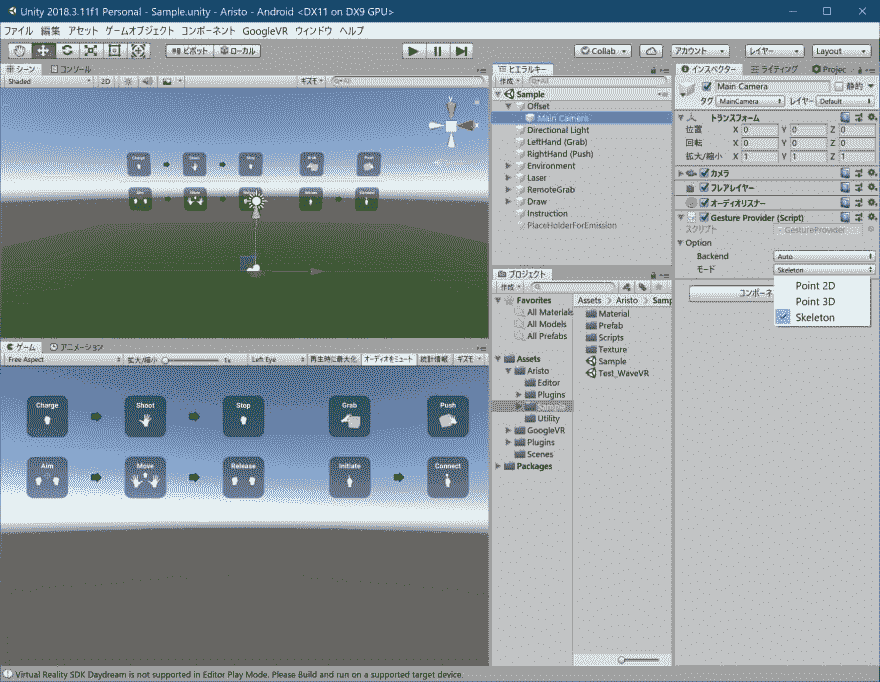
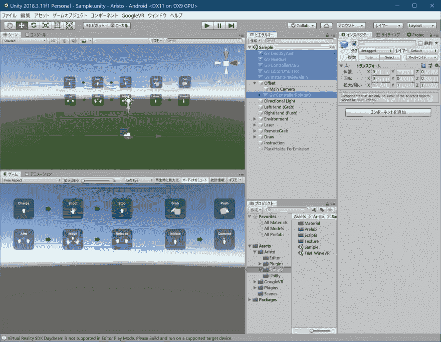

# UnityでVIVE 手跟踪 SDKとDaydreamを組合せてみた

> 原文：<https://dev.to/shiena/unity-vive-hand-tracking-sdk-daydream-562a>

# 前言

日前，VIVE Hand Tracking SDK 发布。
使用它可以通过 VIVE Pro / VIVE / VIVE Focus / Android 识别双手的位置跟踪和手势。
话虽如此，但每个设备都能进行的跟踪却不一样。

| 设备 | 二维指针 | 3D 指针 | 骨骼 |
| --- | --- | --- | --- |
| VIVE Pro | o | o | o |
| 万岁 | o | x | o |
| 聚焦生活 | o | o | x |
| 安卓(需要支持 camera2API 的摄像头) | o | x | x |

因为 VIVE 好像有人在做，所以试着和 Android(Daydream )组合了一下。

> 已尝试将 DaydreamView 与 Vive Hand Tracking SDK 结合使用。 如果是 Daydream 的话，手势识别和位置追踪会有明显的动作[#unity](https://twitter.com/hashtag/unity?src=hash&ref_src=twsrc%5Etfw) [pic.twitter.com/f5iuYPuTgX](https://t.co/f5iuYPuTgX)
> 
> — Mitsuhiro Koga ([@shiena](https://dev.to/shiena) ) [March 19, 2019](https://twitter.com/shiena/status/1108001649866366977?ref_src=twsrc%5Etfw)

# 试试看

## Opening environment

*   团结 2018.3.11f1
*   gvr-unity-sdk v1.190.1
*   VIVE 手动追踪 SDK 0.8.0

## 示例场景

[下载并展开 VIVE Hand Tracking SDK](https://developer.vive.com/resources/knowledgebase/vive-hand-tracking-sdk/) 后，将会有以下软件包进行导入。

*   手动跟踪 SDK unity . unity 包
*   手动跟踪 SDK Unity Sample.unitypackage

因为`/Assets/Aristo/Sample`有 2 个场景，所以打开`Sample.unity`。 另一个`Test_WaveVR.unity`是 Vive Focus 用的，所以这次不用。

该场景包含五种类型的示例(右上角为 Grab 和 Push )，就像屏幕快照一样。
因为 Android 只支持 2D 指针，所以如果把摄像头附带的`Gesture Provider`的模式设为`Point 2D`的话应该可以直接改造。

## 与 Daydream 组合

1.  [从 GVR SDK for Unity v1.190.1](https://github.com/googlevr/gvr-unity-sdk/releases/tag/v1.190.1) 下载软件包并导入。
2.  像截图一样，在场景根中添加 4 个预制单元和`Main Camera`在同一个层次上添加预制单元。 `Assets/GoogleVR/Demos/Scenes/HelloVR.unity`从场景复制很简单。
3.  勾选`Player Settings`>`XRセッティング`>`VRサポート`。
4.  在`Player Settings`>`XRセッティング`>`Virtual Reality SDK`中增加`Daydream`。
5.  因为示例场景中有错误，所以参考[论坛](https://community.viveport.com/t5/Vive-Hand-Tracking-SDK/Vive-Pro/td-p/29239?__woopraid=H4JPEg3iBbDa)进行修正。

构建它后，它的行为就像开头的视频一样。
这次使用的是 Pixel3 和 Daydream View，但是因为需要摄像头，所以保持前面的盖子打开，手机用胶带固定。

> 因为需要照相机，所以只是在打开盖子的状态下用胶带强行固定 w [pic.twitter.com/kPHfB8r0aD](https://t.co/kPHfB8r0aD)
> 
> — Mitsuhiro Koga ([@shiena](https://dev.to/shiena) ) [March 19, 2019](https://twitter.com/shiena/status/1108001669072089088?ref_src=twsrc%5Etfw)

目前无法在 Mirage Solo 上使用，但由于可以操作前置摄像头，希望 VIVE Hand Tracking SDK 也能支持今后的版本升级。

### Memories

[GVR SDK for Unity v1.200.0](https://github.com/googlevr/gvr-unity-sdk/releases/tag/v1.200.0) 支持透视模式，但很遗憾无法处理相机图像。 [issue](https://github.com/googlevr/gvr-unity-sdk/issues/988#issuecomment-479247636) 似乎并不是不应对，所以今后很期待。

# 链接

*   [VIVE 手动追踪 SDK](https://developer.vive.com/resources/knowledgebase/vive-hand-tracking-sdk/)
*   [文件](https://developer.viveport.com/documents/sdk/en/vivehandtracking_index.html)
*   [示例场景的错误修正](https://community.viveport.com/t5/Vive-Hand-Tracking-SDK/Vive-Pro/td-p/29239?__woopraid=H4JPEg3iBbDa)