# 如何用 React 和 Stream 搭建一个 Ionic 聊天 App

> 原文：<https://dev.to/nickparsons/how-to-build-an-ionic-chat-app-with-react-and-stream-3c1g>

> **更新** : [这是一篇关于 2020 年云计算技术趋势愿景的精彩帖子](https://getstream.io/blog/interview-predictions-for-cloud-in-2020/)，由 Ionic 首席执行官 [Max Lynch](https://twitter.com/maxlynch) 和 [Stream](https://getstream.io/) 、 [Thierry Schellenbach](https://twitter.com/tschellenbach) 发表。

与 [Ionic](https://ionicframework.com/) 相比， [React Native](https://facebook.github.io/react-native/) 和 [Flutter](https://flutter.dev/) 等平台之间存在巨大差异。Ionic 认为，驱动当今网络的开放技术是未来的发展方向，应该用于构建移动应用。由于这种方法，Ionic 是唯一受欢迎的平台之一，它允许你为网络和移动设备重用相同的代码库——允许你保持代码干燥(不要重复)。

另一方面，Flutter 和 React Native 取代了 web 技术堆栈。Flutter 通过其[渲染引擎](https://github.com/flutter/flutter/wiki/The-Engine-architecture#architecture-overview)来实现这一点，React Native *将*与 [iOS 和 Android 的原生渲染引擎](https://facebook.github.io/react-native/)挂钩。

Ionic 的好处是你可以使用基于网络的技术，并且可以重用单一的代码库。然而，Flutter 和 React Native 不允许您尽可能多地重用代码；然而，它们的性能更接近于本机应用程序的感觉。尽管如此，保持代码干燥的能力是任何应用程序构建的首要目标。

在这个教程节目中，我将带你了解如何使用 Ionic、 [React](https://reactjs.org/) (是的，你在网络上使用的同一个版本)和 [Stream 的实时聊天 API](https://getstream.io/chat/) 构建一个实时聊天应用程序。

> *如果你想跳过前面，在[开胃](https://appetize.io/app/afcadgqt1p2q26rqdecvb10w68?device=nexus5&scale=100&orientation=portrait&osVersion=9.0&deviceColor=white)上有一个演示，所以你可以自己评估性能(注意，开胃确实慢了不少)。你还可以[下载安卓](https://cl.ly/549207e68774)的签名 APK，获得更高性能的体验。[这里是 React / Ionic GitHub repo](https://github.com/GetStream/ionic-chat-tutorial-react) 这里是 API GitHub repo 。*
> 
> *这有一些要求，主要是 Node.js 的版本(我更喜欢使用 nvm 进行节点版本管理)，如果你在 macOS 上，则为 iOS 使用 [XCode](https://developer.apple.com/xcode/) ，或者如果你在 macOS 或 Windows 上，并且想要针对 Android 进行构建，则使用 [Android Studio](https://developer.android.com/studio) ，并且使用 [yarn](https://yarnpkg.com/) 进行依赖管理。*

我们来编码吧！🤓

## 1。安装[离子](https://ionicframework.com/)

要开始使用 [Ionic](https://ionicframework.com/) ，使用 yarn:
下载 [Ionic CLI](https://ionicframework.com/docs/cli)

```
$ yarn global add ionic 
```

Enter fullscreen mode Exit fullscreen mode

安装完成后，使用新的 CLI 从命令行登录 Ionic】

```
$ ionic login 
```

Enter fullscreen mode Exit fullscreen mode

现在，这就是我们要做的一切。我们将使用 [Create React App](https://reactjs.org/docs/create-a-new-react-app.html) (下一步)继续我们的安装。

## 2。安装创建 React 应用程序和依赖项

类似于我们安装 Ionic 的方式，让我们使用 npm:
在全球范围内安装 Create React App (CRA)

```
$ yarn global add create-react-app 
```

Enter fullscreen mode Exit fullscreen mode

接下来，创建一个新目录。我将在我的`~/Code`目录中工作，但是你可以自由使用你选择的目录:

```
$ cd ~/Code 
```

Enter fullscreen mode Exit fullscreen mode

现在，使用 Create React App (CRA)安装 React—(`ionic-chat`是将要生成的目录的名称—这也是可选的，因为您可以随意命名):

```
$ npx create-react-app ionic-chat 
```

Enter fullscreen mode Exit fullscreen mode

进入`ionic-chat`目录，我们将开始安装必要的依赖项。

```
$ yarn add stream-chat stream-chat-react axios react-router react-router-dom @ionic/react 
```

Enter fullscreen mode Exit fullscreen mode

安装完依赖项后，让我们继续进行下一步设置。

## 3。用 [Heroku](https://heroku.com) 设置 API

API 虽然很小，但在聊天中起着至关重要的作用。该 API 接受来自登录屏幕的用户凭证，并生成一个 JWT 供聊天应用程序使用。它还将用户添加到频道中。

为了加速 API，我加入了一个简单的[一键式 Heroku](https://heroku.com/deploy?template=https://github.com/GetStream/ionic-chat-tutorial-react-api) 按钮。这将在 Heroku 上生成一个新的应用程序，然后创建一个流聊天试用版供您使用。

[](https://heroku.com/deploy?template=https://github.com/GetStream/ionic-chat-tutorial-react-api)

点击 Heroku 按钮后，系统会提示您添加一个应用程序名称——要唯一。然后点击“部署”开始 Heroku 部署过程。

[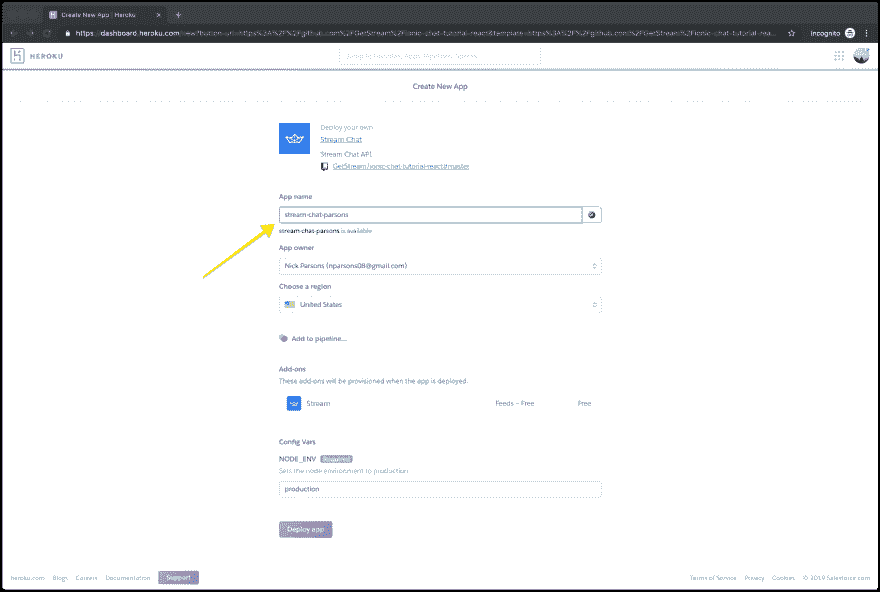](https://res.cloudinary.com/practicaldev/image/fetch/s--uXLjkXgX--/c_limit%2Cf_auto%2Cfl_progressive%2Cq_auto%2Cw_880/https://i.imgur.com/AnAeqp6.png)

安装完成后，从 Heroku 获取环境变量(Heroku 创建时生成的)并将它们放到您的。React 应用程序中的 env 文件。环境变量可以在 Heroku 仪表板的“设置”部分找到，如 Heroku 在这篇博客文章中显示的[。注意，只有一个环境变量叫做“STREAM_URL”。API 密钥和秘密由一个`:`分隔，第一个是密钥，第二个是秘密。](https://devcenter.heroku.com/articles/config-vars)

[](https://res.cloudinary.com/practicaldev/image/fetch/s--PkBaLprL--/c_limit%2Cf_auto%2Cfl_progressive%2Cq_auto%2Cw_880/https://i.imgur.com/yfvXXvF.png)

> *或者，如果你想跳过 Heroku，你可以[克隆这个 GitHub repo](https://github.com/GetStream/ionic-chat-tutorial-react-api) 并使用 yarn start 命令运行 API 确保在启动之前运行 yarn install，并确保填写你的。env 带有在 Stream dashboard 上找到的凭证(您将需要启用免费聊天试用)。*

## 4。安装 iOS 模拟器(可选)

如果你已经安装了 XCode，那你就基本上一切就绪了。如果没有，你想下载 XCode，你可以在这里下载[。默认情况下，XCode 与 iOS 模拟器捆绑在一起。](https://developer.apple.com/xcode/)

如果你不想安装 XCode，你可以选择安装这个 npm 包，它会为你安装一个独立的 iOS 模拟器。

```
$ yarn global add ios-sim 
```

Enter fullscreen mode Exit fullscreen mode

> 如何使用它的完整说明在这里:[https://www.npmjs.com/package/ios-sim](https://www.npmjs.com/package/ios-sim)T3】

## 5。安装 Android Studio(可选)

在装有 macOS 的 iOS 上运行似乎是测试你的代码最快的方法；然而，如果你使用的是 Windows 或者只是想使用 Android，我会在下面介绍。

前往 [Android Studio 下载页面](https://developer.android.com/studio/)并选择您的下载选项。Android Studio 适用于 iOS、Windows 和 macOS。这是一个很大的文件，下载可能需要相当长的时间。

下载完成后，按照安装说明操作，打开 Android Studio。我们将下载必要的 SDK 并创建一个 Android 虚拟设备(AVD)。

**打开 Android Studio，点击“配置”，然后点击“SDK 管理器”。**

[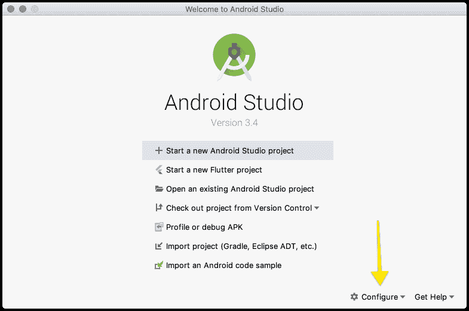](https://res.cloudinary.com/practicaldev/image/fetch/s--hBRM1Im---/c_limit%2Cf_auto%2Cfl_progressive%2Cq_auto%2Cw_880/https://i.imgur.com/8eCbh7n.png)

现在，在 SDK 管理器打开的情况下，选择“Android 9.0 (Pie)”，然后单击“应用”。

[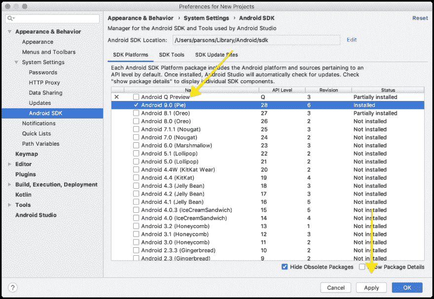](https://res.cloudinary.com/practicaldev/image/fetch/s--yd0Qat23--/c_limit%2Cf_auto%2Cfl_progressive%2Cq_auto%2Cw_880/https://i.imgur.com/Qgpg9xa.png)

您的下载将开始。一旦完成，回到主屏幕，点击“配置”按钮，然后是“AVD 管理器”。在 AVD 管理器屏幕上，您需要单击“+创建虚拟设备”。

接下来，选择“Pixel 3 XL”设备，然后单击“下一步”。为您的 API 级别选择“Pie (28)”，然后选择“Next”按钮。

[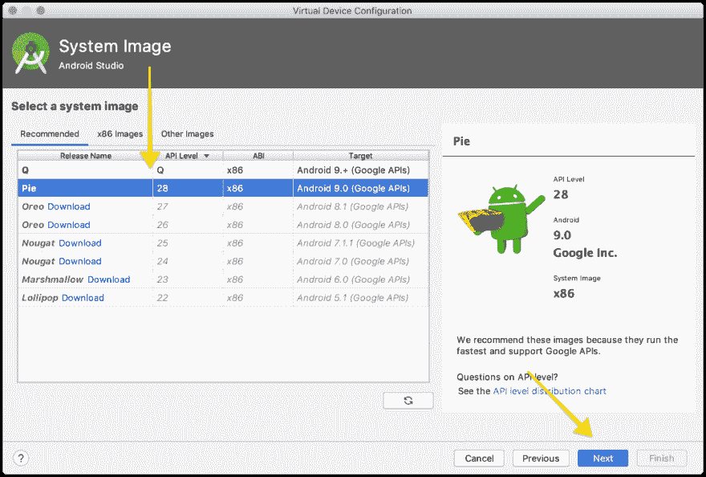](https://res.cloudinary.com/practicaldev/image/fetch/s--x2c3UWk---/c_limit%2Cf_auto%2Cfl_progressive%2Cq_auto%2Cw_880/https://i.imgur.com/fjEtqZ3.png)

最后，单击“完成”,您的 AVD 将被配置。一旦完成，您可以安全地退出 AVD 屏幕，您将在 AVD 管理器中看到您新创建的 AVD。

[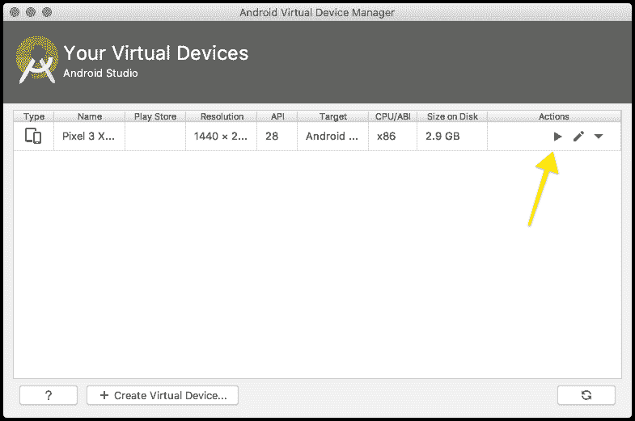](https://res.cloudinary.com/practicaldev/image/fetch/s--JSK97K0G--/c_limit%2Cf_auto%2Cfl_progressive%2Cq_auto%2Cw_880/https://i.imgur.com/p9YzU31.png)

> 当你点击“绿色播放按钮”时，你的 AVD 就会启动！

[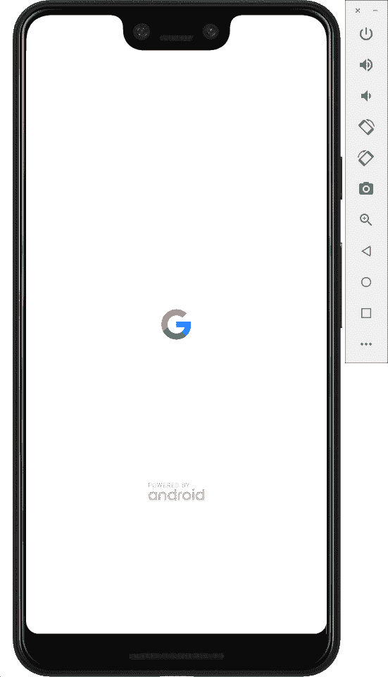](https://res.cloudinary.com/practicaldev/image/fetch/s--dGzXZ_xc--/c_limit%2Cf_auto%2Cfl_progressive%2Cq_auto%2Cw_880/https://i.imgur.com/6Azc7D1.png)

恭喜你！您已经成功地在 Android Studio 中生成了一个 AVD！我们现在还不打算使用它，但是在本教程后面的测试中，AVD 将会派上用场。

## 6。创建文件

我们已经准备好了一切；现在，是时候添加必要的文件来使我们的代码工作了！我们需要创建一些文件，所以请密切注意:

1.  在您的根目录下，创建包含以下内容的`ionic.config.json`:

```
{  "name":  "Ionic Chat",  "type":  "custom",  "integrations":  {}  } 
```

Enter fullscreen mode Exit fullscreen mode

1.  在`public/index.html`中，将当前 HTML 替换为以下内容:

```
<html lang="en">
  <head>
    <meta charset="utf-8" />
    <link rel="shortcut icon" href="%PUBLIC_URL%/favicon.ico" />
    <meta
      name="viewport"
      content="width=device-width, initial-scale=1.0,
    minimum-scale=1.0, maximum-scale=1.0, viewport-fit=cover user-scalable=no"
    />

    <meta name="apple-mobile-web-app-capable" content="yes" />
    <meta
      name="apple-mobile-web-app-status-bar-style"
      content="black-translucent"
    />
    <meta name="theme-color" content="#ffffff" />
    <meta name="apple-mobile-web-app-title" content="Ionic Chat" />

    <link rel="manifest" href="%PUBLIC_URL%/manifest.json" />

    Ionic Chat
  </head>
  <body ontouchstart="">
    <noscript>You need to enable JavaScript to run this app.</noscript>
    <div id="root"></div>
  </body>
</html> 
```

Enter fullscreen mode Exit fullscreen mode

1.  移入`src/`目录；我们将创建并修改几个文件:

**在 app.css 中，将现有的所有 css 换成这个:**

```
@import url("https://fonts.googleapis.com/css?family=Open+Sans");

html,
body {
  background: #ffffff;
  padding: env(safe-area-inset-top) env(safe-area-inset-right) env(
      safe-area-inset-bottom
    ) env(safe-area-inset-left);
  font-family: "Open Sans", sans-serif;
}

.no-scroll .scroll-content {
  overflow: hidden;
}

::placeholder {
  color: #3f3844;
}

.login-root {
  text-align: center;
  margin-top: 25%;
}

.login-card > h4 {
  margin-bottom: 22px;
}

.login-card > input {
  padding: 4px 6px;
  margin-bottom: 20px;
  border: 1px solid #d3d3d3;
  background: hsla(0, 0%, 100%, 0.2);
  border-radius: 4px !important;
  font-size: 16px;
  color: #24282e;
  -webkit-box-shadow: none;
  box-shadow: none;
  outline: 0;
  padding: 0 16px 1px;
  -webkit-box-shadow: 0 1px 3px rgba(0, 0, 0, 0.2);
  box-shadow: 0 1px 3px rgba(0, 0, 0, 0.2);
  height: 50px;
  width: 300px;
}

.login-card button {
  font-size: 16px;
  background-color: #3880ff;
  border-radius: 4px;
  line-height: 1.4em;
  padding: 14px 33px 14px;
  margin-right: 10px;
  border: 0 solid rgba(0, 0, 0, 0);
  color: #ffffff;
  box-shadow: 0 1px 3px rgba(0, 0, 0, 0.08), 0 2px 4px rgba(0, 0, 0, 0.12);
  border-radius: 6px;
  text-transform: none;
  outline: none;
}

.str-chat__loading-indicator {
  text-align: center;
  margin-top: 15%;
}

.str-chat-channel {
  background-color: #ffffff !important;
}

.str-chat__header-livestream {
  box-shadow: none !important;
  background: transparent;
}

.str-chat__square-button {
  display: none !important;
}

.str-chat__input {
  box-shadow: none !important;
}

.rta__textarea {
  padding: 4px 6px;
  margin-bottom: 20px;
  border: 1px solid #d3d3d3 !important;
  background: hsla(0, 0%, 100%, 0.2);
  border-radius: 4px !important;
  font-size: 14px !important;
  color: #24282e !important;
  -webkit-box-shadow: none !important;
  -webkit-appearance: none !important;
  box-shadow: none !important;
  outline: none !important;
  padding: 0 16px 1px;
  -webkit-box-shadow: 0 1px 3px rgba(0, 0, 0, 0.2);
  box-shadow: 0 1px 3px rgba(0, 0, 0, 0.2);
  height: 50px;
}

.str-chat__textarea {
  height: 45px !important;
}

.str-chat__input-footer--count {
  margin-top: 4px;
  margin-left: 4px;
}

.footer {
  margin-bottom: 50px;
} 
```

Enter fullscreen mode Exit fullscreen mode

**在 App.js 中，换出这个 JavaScript 的现有代码(这个逻辑将负责文件之间的路由):**

```
import React from "react";
import { BrowserRouter as Router, Switch } from "react-router-dom";

import Chat from "./Chat";
import Login from "./Login";

import UnauthedRoute from "./UnauthedRoute";
import AuthedRoute from "./AuthedRoute";

const App = () => (
  <Router>
    <Switch>
      <UnauthedRoute path="/auth/login" component={Login} />
      <AuthedRoute path="/" component={Chat} />
    </Switch>
  </Router> );

export default App; 
```

Enter fullscreen mode Exit fullscreen mode

**创建一个名为`AuthedRoute.js`的文件，将以下内容放入该文件:**

```
import React from "react";
import { Redirect, Route } from "react-router-dom";

const AuthedRoute = ({ component: Component, loading, ...rest }) => {
  const isAuthed = Boolean(localStorage.getItem("token"));
  return (
    <Route
      {...rest}
      render={props =>
        loading ? (
          <p>Loading...</p>
        ) : isAuthed ? (
          <Component history={props.history} {...rest} />
        ) : (
          <Redirect
            to={{
              pathname: "/auth/login",
              state: { next: props.location }
            }}
          />
        )
      }
    />
  );
};

export default AuthedRoute; 
```

Enter fullscreen mode Exit fullscreen mode

**创建一个名为 Chat.js 的文件，并使用下面的代码(这是支持 Chat 的所有逻辑):**

```
import React, { Component } from "react";
import { IonApp, IonContent } from "@ionic/react";
import {
  Chat,
  Channel,
  ChannelHeader,
  Thread,
  Window,
  MessageList,
  MessageInput
} from "stream-chat-react";
import { StreamChat } from "stream-chat";

import "./App.css";
import "@ionic/core/css/core.css";
import "@ionic/core/css/ionic.bundle.css";
import "stream-chat-react/dist/css/index.css";
import "stream-chat-react/dist/css/index.css";

class App extends Component {
  constructor(props) {
    super(props);

    const { id, name, email, image } = JSON.parse(localStorage.getItem("user"));

    this.client = new StreamChat(localStorage.getItem("apiKey"));
    this.client.setUser(
      {
        id,
        name,
        email,
        image
      },
      localStorage.getItem("token")
    );

    this.channel = this.client.channel("messaging", "ionic-chat", {
      image: "https://i.imgur.com/gwaMDJZ.png",
      name: "Ionic Chat"
    });
  }

  render() {
    return (
      <IonApp style={{ paddingTop: "2px" }}>
        <IonContent>
          <Chat client={this.client} theme={"messaging light"}>
            <Channel channel={this.channel}>
              <Window>
                <ChannelHeader />
                <MessageList />
                <div className="footer">
                  <MessageInput />
                </div>
              </Window>
              <Thread />
            </Channel>
          </Chat>
        </IonContent>
      </IonApp>
    );
  }
}

export default App; 
```

Enter fullscreen mode Exit fullscreen mode

**接下来，创建一个名为`Login.js`的文件，并使用下面的代码(这会将 auth 添加到您的应用程序中):**

```
import React, { Component } from "react";
import axios from "axios";

import "./App.css";

class Login extends Component {
  constructor(props) {
    super(props);

    this.state = {
      loading: false,
      name: "",
      email: ""
    };

    this.initStream = this.initStream.bind(this);
  }

  async initStream() {
    await this.setState({
      loading: true
    });

    const auth = await axios.post(process.env.REACT_APP_TOKEN_ENDPOINT, {
      name: this.state.name,
      email: this.state.email
    });

    localStorage.setItem("user", JSON.stringify(auth.data.user));
    localStorage.setItem("token", auth.data.token);
    localStorage.setItem("apiKey", auth.data.apiKey);

    await this.setState({
      loading: false
    });

    this.props.history.push("/");
  }

  handleChange = e => {
    this.setState({
      [e.target.name]: e.target.value
    });
  };

  render() {
    return (
      <div className="login-root">
        <div className="login-card">
          <h4>Ionic Chat</h4>
          <input
            type="text"
            placeholder="Name"
            name="name"
            onChange={e => this.handleChange(e)}
          />
          <br />
          <input
            type="email"
            placeholder="Email"
            name="email"
            onChange={e => this.handleChange(e)}
          />
          <br />
          <button onClick={this.initStream}>Submit</button>
        </div>
      </div>
    );
  }
}

export default Login; 
```

Enter fullscreen mode Exit fullscreen mode

> *记得在您的。env 与您的 Heroku 端点凭证。*

**现在，创建一个名为`UnauthedRoute.js`的文件，以容纳未经授权进入的用户:**

```
import React from "react";
import { Redirect, Route } from "react-router-dom";

const UnauthedRoute = ({ component: Component, loading, ...rest }) => {
  const isAuthed = Boolean(localStorage.getItem("token"));
  return (
    <Route
      {...rest}
      render={props =>
        loading ? (
          <p>Loading...</p>
        ) : !isAuthed ? (
          <Component history={props.history} {...rest} />
        ) : (
          <Redirect
            to={{
              pathname: "/"
            }}
          />
        )
      }
    />
  );
};

export default UnauthedRoute; 
```

Enter fullscreen mode Exit fullscreen mode

**创建一个名为`withSession.js` :**
的文件

```
import React from "react";
import { withRouter } from "react-router";

export default (Component, unAuthed = false) => {
  const WithSession = ({ user = {}, streamToken, ...props }) =>
    user.id || unAuthed ? (
      <Component
        userId={user.id}
        user={user}
        session={window.streamSession}
        {...props}
      />
    ) : (
      <Component {...props} />
    );

  return withRouter(WithSession);
}; 
```

Enter fullscreen mode Exit fullscreen mode

## 4。在您的`package.json`文件中安装 Ionic 构建脚本:

```
"scripts":  {  "start":  "react-scripts start",  "build":  "react-scripts build",  "ionic:build":  "react-scripts build",  "ionic:serve":  "react-scripts start"  } 
```

Enter fullscreen mode Exit fullscreen mode

[电容](https://capacitor.ionicframework.com/)作者 [Ionic](https://ionicframework.com/) 是 Ionic 提供的一个开源框架，可以帮助你构建渐进式的原生 web 应用、移动和桌面应用。它针对 Ionic 应用进行了优化；然而，它几乎可以用于任何框架。

我们将使用 Capacitor 来提升和准备我们的 iOS 和 Android 版本。不过，首先，让我们安装电容器！

```
$ ionic capacitor add ios 
```

Enter fullscreen mode Exit fullscreen mode

然后，在根目录下使用以下命令启动 React 应用程序:

```
$ yarn start 
```

Enter fullscreen mode Exit fullscreen mode

在 iOS 上打开:

```
$ ionic capacitor open ios 
```

Enter fullscreen mode Exit fullscreen mode

[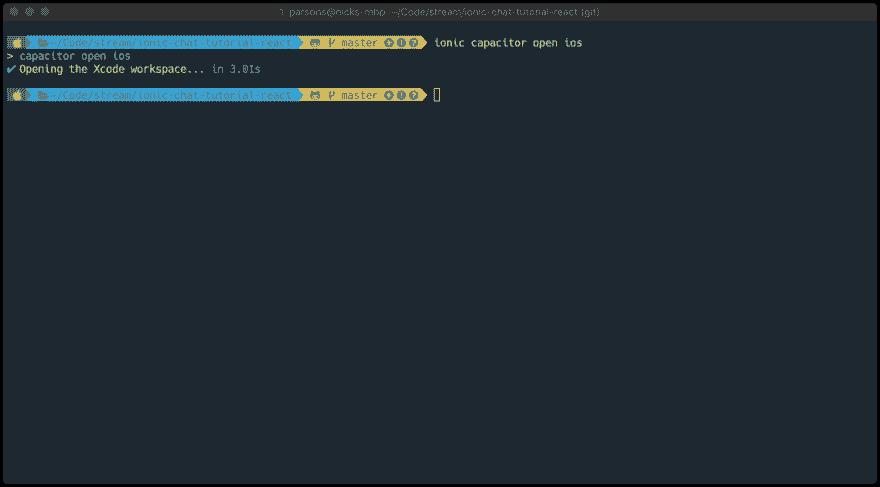](https://res.cloudinary.com/practicaldev/image/fetch/s--Ic0geSS5--/c_limit%2Cf_auto%2Cfl_progressive%2Cq_auto%2Cw_880/https://i.imgur.com/fQuNXBT.png)

或者，在 Android 上打开:

```
$ ionic capacitor open android 
```

Enter fullscreen mode Exit fullscreen mode

[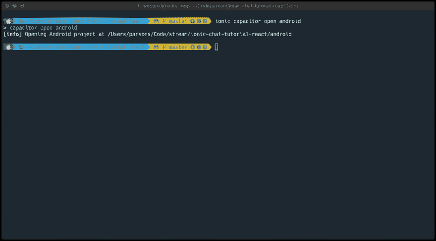](https://res.cloudinary.com/practicaldev/image/fetch/s--iI7JPFWp--/c_limit%2Cf_auto%2Cfl_progressive%2Cq_auto%2Cw_880/https://i.imgur.com/74CXU0j.png)

因为我运行的是 macOS，所以我将使用 iOS 模拟器。运行`ionic capacitor open ios`后，XCode 会启动。您需要等待大约一分钟，让它对项目进行索引，然后您可以按下 run 按钮。

[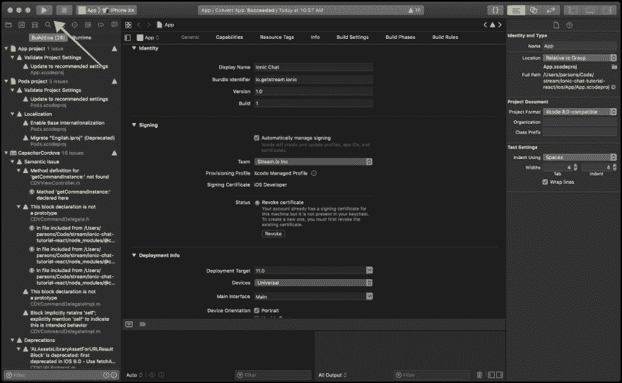](https://res.cloudinary.com/practicaldev/image/fetch/s--g90qrpgq--/c_limit%2Cf_auto%2Cfl_progressive%2Cq_auto%2Cw_880/https://i.imgur.com/AMJ3JrX.png)

您的 iOS 模拟器应该在安装了应用程序的情况下启动，您应该会看到类似于以下内容的登录屏幕:

[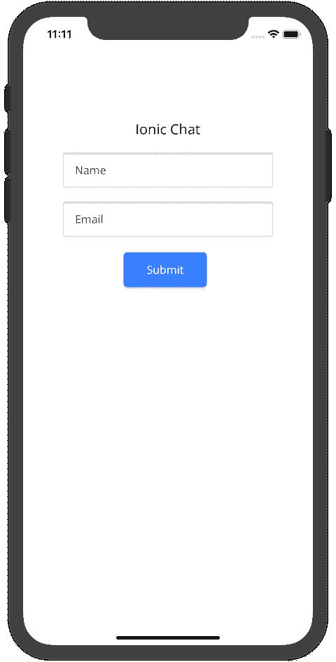](https://res.cloudinary.com/practicaldev/image/fetch/s--CZe4vjAU--/c_limit%2Cf_auto%2Cfl_progressive%2Cq_auto%2Cw_880/https://i.imgur.com/Bj4Qelo.png)

继续使用您的姓名和电子邮件地址登录。不要担心，您的信息只存储在本地存储中，不会持久存储到任何类型的第三方平台。加载聊天窗口后，您就可以开始聊天了！

[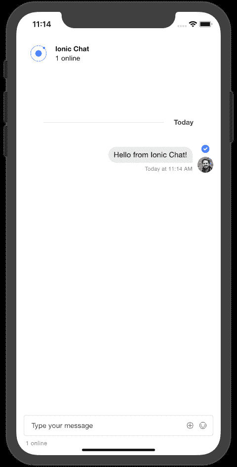](https://res.cloudinary.com/practicaldev/image/fetch/s---RqXic_3--/c_limit%2Cf_auto%2Cfl_progressive%2Cq_auto%2Cw_880/https://i.imgur.com/xrAtW85.png)

## 接下来是什么？

我鼓励你继续开发你已经创建的代码库。如果你遇到了任何问题，你可以随时从 GitHub 克隆回购协议，重新开始。

在将应用程序部署到 iOS 或 Android 等独立设备方面，Ionic 有一套很好的教程来指导如何做。iOS 和 Android 出版物的教程[都可以在 Ionic 文档](https://ionicframework.com/docs/publishing/app-store)中找到。

想了解更多[流聊](https://getstream.io/chat/)？看看我们的交互式 [API 之旅](https://getstream.io/chat/get_started/)，它将带你通过 Stream 从头开始创建聊天的各个步骤。

Stream 还拥有出色的 API 文档和漂亮的 T2 UI 套件，允许你构建任何类型的实时消息平台。

最后但并非最不重要的是，不要忘记查看我们的各种流聊天软件开发套件，包括针对 [iOS/Swift](https://getstream.io/tutorials/ios-chat/) 和 [Android/Java/Kotlin](https://getstream.io/tutorials/android-chat/) 的教程。

比如 demos？我们在流聊天网站上也有互动演示。

编码快乐！✌