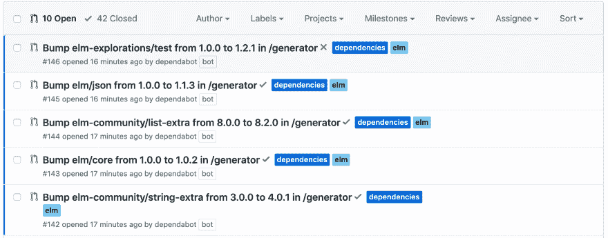
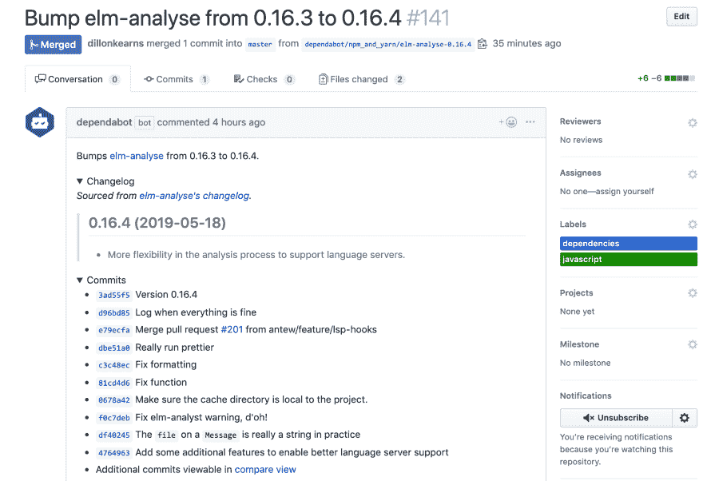

# 保持 elm 依赖关系最新

> 原文：<https://dev.to/dillonkearns/keeping-elm-dependencies-current-2b25>

很难使依赖关系保持最新。你手动检查它们吗？设置日历提醒？在您的 CI 上运行脚本？

您当然可以创建一个手动过程来自动化它，但是即使这样，将那些依赖项更新到最新版本也是很乏味的。当然，这并不难，但这会分散注意力，很容易推迟或跳过。所以任何减少摩擦的事情都是受欢迎的改变！

我对[依赖机器人](https://dependabot.com/#how-it-works)的榆树和 NPM 依赖支持非常满意。

## 工作流

真的非常简单。在为您的项目配置 dependabot 时，只需点击几下，它就会为每个过时的 elm 或 NPM 依赖项发出 pull 请求。

以下是我最喜欢的这个工作流程的一些特性。

### CI 构建集成

*   如果您有一个绿色的勾号，表示您的 CI 构建通过，那么您可以**自信地点击合并按钮**！🎉
*   在极少数情况下，有一个红色的勾号，您可以看到构建错误并手动修复它们

### 变更日志和发布说明

Dependabot 在 pull 请求中包含当前版本和最新版本之间的所有 changelog 条目。这非常方便，因为您可以快速浏览以查看每个依赖项中需要注意的内容。由于每个过时的依赖项都有一个单一的拉请求，所以快速合并琐碎的更改，然后一次一个地进行更大的更改，这真的很容易管理。

如果项目没有 changelog，您可以看到每个带有链接和提交消息的提交。加上一个快速链接，带你到项目的差异，比较你的当前版本和最新版本。

### 单回购支持

如果您有一个 github 存储库，其中包含同一个 repo 中的多个项目，那么很容易设置 dependabot 来观察每个 repo 项目的依赖关系。这很简单，只要告诉它监视哪个目录，依赖哪种类型(榆树，NPM 等)。).

## 底线

我喜欢这个工作流程，强烈推荐！对于您的开源 elm 项目，这是显而易见的。对于私人商业项目，也就 15 美元/月，值得考虑。您可能会发现，在管理 NPM 安全漏洞和提高开发人员生产率方面，这是值得的。

了解更多信息，现在就从[https://dependabot.com/#how-it-works](https://dependabot.com/#how-it-works)开始。

## 感谢阅读！

我希望这个技巧对你有所帮助！如果你想要更多关于提高你的 elm 代码库的生产率的技巧，请查看我的每周 elm 技巧。