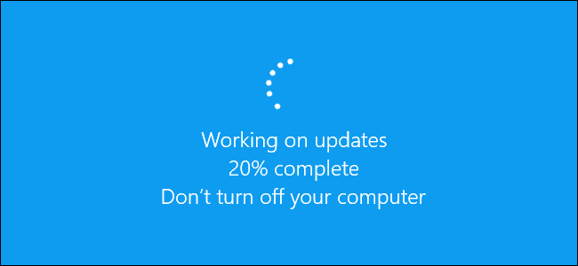

# 如何避免 Windows 10 更新重启

> 原文：<https://dev.to/navid_awan/how-to-avoid-windows-10-update-restart-3a80>

 
你已经在一个使用 Windows 10 的项目上辛苦了一整天。你几乎完成了你的工作，离开了你的电脑。您不知道的是，Windows 已经下载了一个更新并自动重新启动了您的设备。

你回来完成你的工作，只是在你的机器重新启动时沮丧地离开，因为你已经因为自动重新启动而丢失了所有的工作。

如果这听起来对你来说很熟悉，那么你已经经历了 Windows 10 更新重启的烦恼。虽然 Windows 10 提供了很多很棒的功能，但它在更新后自动重启的倾向绝对不是其中之一

不幸的是，更新对计算机的安全和性能至关重要。如果你不尽快重启，你的操作系统会自动启动来完成更新。不是理想的情况。

Microsoft 采取措施，通过“活动时间”功能来阻止在您使用设备时安装更新，从而使更新更加方便。但这不会阻止 Windows 在下班时间重启。如果你想让你的机器长时间完成任务，这是有问题的。

幸运的是，有一些变通方法可以让你控制你的操作系统，防止每次安装更新时 Windows 自动重启。

## 使用任务调度器

*   打开开始并搜索任务计划程序。单击打开此工具
*   找到重新启动任务。右键单击它，并选择禁用。

恭喜你。采取这两个简单的步骤后，Windows 10 在下载安装新的更新后会停止重启。

请记住，新的更新不会应用，除非您手动重新启动计算机，否则未来的更新不会安装。

此外，您的计算机可能会自动重新启用重新启动任务，您可以通过以下方式停止该任务:

*   按 Windows 键+ R 打开运行命令
*   键入:“% windir % \ System32 \ Tasks \ Microsoft \ Windows \ update orchestrator”并点击“确定”
*   选择没有扩展名的重新启动文件。
*   右键单击，然后选择重命名
*   将文件重命名为 Reboot.old
*   右键进入文件夹，选择新建文件夹

现在 Windows 10 将无法重新创建自动重启计算机的任务。

## 使用组策略

这种方法使用 GPEDIT。MSC，并不是所有版本的 Windows 10 都有。

*   按 Windows + R 打开运行命令并键入 GPEdit.msc
*   在计算机配置中，展开管理模板，然后展开 Windows 组件
*   展开选项 2-3
*   选择 Windows Update 文件夹
*   对于计划的自动更新安装，双击不允许登录用户自动重新启动
*   选择启用
*   单击确定
*   关闭编辑器
*   使用 Windows 10 设置##重新启动设置# #
*   搜索设置并选择它
*   单击更新和安全选项卡
*   选择窗口底部的高级选项
*   寻找这样的按钮:“当我们准备好重新启动时，我们会显示一个提醒。如果你想看到更多关于重新启动的通知，请打开它。
*   选择
*   这将阻止 Windows 10 在自动更新后重新启动。这些方法中的任何一种都会阻止 windows 在更新后自动重新启动，所以选择一种你觉得最舒服的方法。

如果您遇到了自己无法解决的计算机问题，如硬件问题或需要重新安装操作系统，可能是时候联系[计算机维修店](https://computerrepairdoctor.com/computer-repair/desktop-repair/)了。当地第三方维修店的专家可以立即让您的机器正常运行。

## 标签:电脑维修