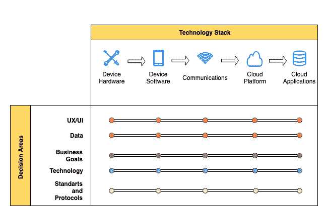
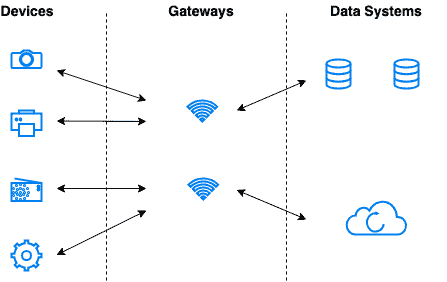
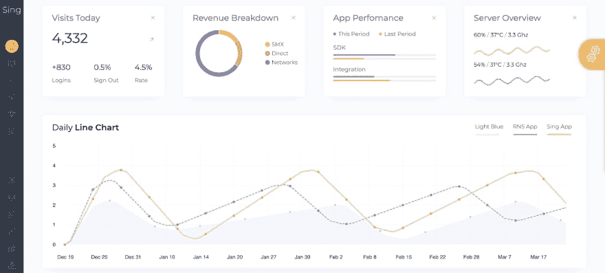
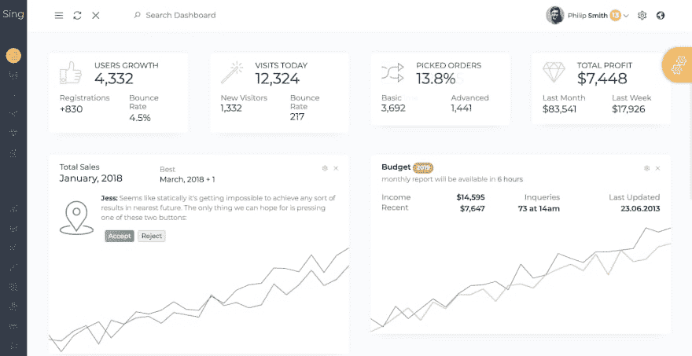
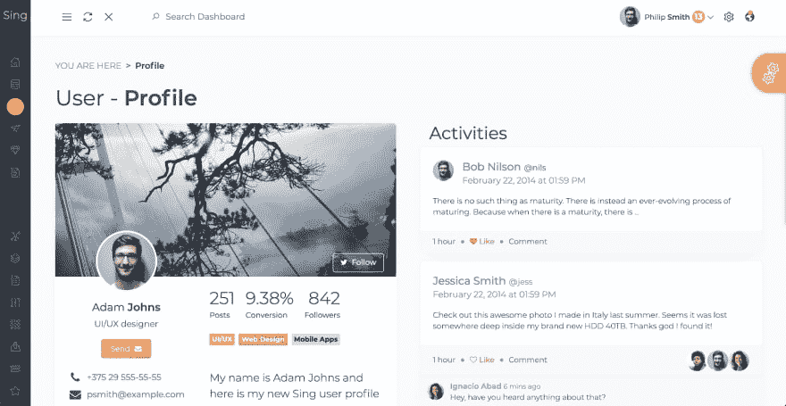
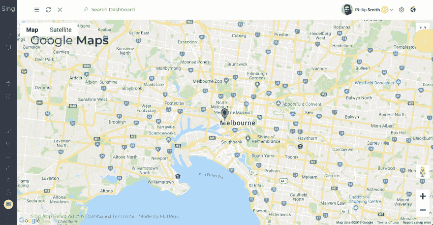

# 如何构建物联网仪表盘

> 原文：<https://dev.to/flatlogic/how-to-build-an-iot-dashboard-4jph>

事实证明，互联网是不可遏制的。从个人电脑、手机到古老的路由器，我们正在进入一个新时代——物联网时代。汽车、手表、甚至狗项圈、冰箱和许多其他家用物品都可以连接到互联网。所有这些都是为了利用他们的数据和分析各种客户需求。

在本文中，我们将了解如何实际使用物联网生成的数据，为什么要分析它，以及最后使用什么工具来构建信息系统。

### 为什么要构建 IOT 仪表盘？

构建显示物联网信息的仪表盘有几个原因:

*   根据位置、时间、天气、温度和客户特有的其他外部因素，自动增强来自设备的输入数据。
*   在物联网仪表盘的帮助下，用户和操作员可以(远程)监控特定资产和流程，并根据安全要求，从世界任何地方访问和控制环境。
*   监控硬件和软件性能以降低运营成本，并通过预防产品故障和最大限度地减少停机时间来降低维护成本。
*   深入了解客户如何使用物联网设备，并以此指导您的产品开发。
*   快速将您自己的物联网分析产品推向市场，为客户提供优质仪表盘和报告功能。

### 构建物联网仪表盘之前

在构建您的 IOT 仪表板之前，您应该问自己一些重要的问题:

*   仪表板上应该显示哪些组件？
*   我的数据将在哪里接收和处理？
*   我将使用什么协议？
*   我将构建自定义仪表板还是使用现成的解决方案？
*   您将使用什么网关？
*   为什么我还要做 IOT 仪表盘？

我们将回顾物联网数据处理平台，并考虑各种协议。此外，我们将考虑将设备连接到平台和仪表板的一些细微差别。

这将有助于您应对市场上存在的各种解决方案。

还值得一提的是，互联网上关于这个话题的文章分为两种。第一类是如何从 UI 方面构建仪表板，其他的告诉你如何从基础设施方面构建仪表板。首先，我将回顾仪表板的内容、平台和软件。

如果你尝试过构建自己的物联网应用架构，你就知道这个简单的图有多复杂了。所有这些都耗费时间和金钱，需要数百个工时来纠正、测试和部署。

要构建物联网应用程序，您需要创建一个包含设备、变量、仪表板和警报的结构。

### IOT 连接、架构和网络的类型

物联网系统具有三层架构:设备、网关和数据系统。数据通过四种类型的传输通道在这些层之间移动。

### 连接类型:

1.  设备对设备——两个智能设备之间的直接联系；
2.  设备到网关——传感器和网关之间的数据传输；
3.  数据系统网关——从网关到数据云的数据传输；
4.  数据系统之间。

### 网络类型:

纳米网络——一组小型设备(尺寸最大为几微米),执行非常简单的任务，如传感、计算、存储和驱动。这种系统应用于生物统计学、军事和其他纳米技术领域。

NFC(近场通信)—一种低速网络，用于连接相距不超过 4 厘米的电子设备。可能的应用有非接触式支付系统、身份证件和钥匙卡。

BAN(身体区域网络)—连接可穿戴计算设备的网络，这些设备可以固定在身体上或靠近身体的不同位置佩戴，也可以嵌入体内(植入物)。

PAN(个人区域网络)—一种连接大约一个或几个房间半径内的设备的网络。

LAN(局域网)—覆盖一栋建筑区域的网络。

CAN(校园/企业区域网络)—在有限的地理区域(企业、大学)内联合较小的局域网的网络。

城域网(MAN)—由微波传输技术驱动的某个大城市区域的大型网络。

WAN(广域网)—存在于大范围地理区域内的网络，将不同的小型网络(包括局域网和城域网)连接在一起。

### 协议

在本节中，我介绍了与物联网仪表盘配合使用的主要协议。

MQTT(Message Queue Telemetry Transport)是一种轻量级协议，最常用于将简单的数据流从传感器发送到应用程序和中间件。该协议运行在 TCP/IP 之上，包括三个组件:订阅者、发布者和代理。发布者收集数据并将其发送给订阅者。MQTT 适合小型、廉价、低内存和低功耗的设备。

DDS(数据分发服务)是一种物联网标准，用于实时、可扩展和高性能的机器对机器通信。您可以在低占用空间的设备和云中部署 DDS。

AMQP(高级消息队列协议)是面向消息的中间件环境的应用层协议。它被认可为国际标准。其处理链包括遵循特定规则的三个组件。

蓝牙是一种集成在大多数智能手机和移动设备中的短距离通信技术，这是个人产品，尤其是可穿戴设备的一大优势。蓝牙为移动用户所熟知。

### 选择合适的平台。平台和仪表板之间的区别。

IOT 平台是一个硬件和软件系统，用于管理物联网设备以及收集、存储、可视化和分析来自这些设备的数据。市场上有许多 IOT 平台，它们的功能千差万别。尽管所有 IOT 平台都有一个显示数据的仪表板，但事实上，有些平台只有仪表板，只能显示来自设备的数据。

您会经常发现术语仪表板和平台可以互换使用。IOT 仪表板可以被视为一个基本的 IOT 平台。

仪表板通常可以显示数据和控制设备。

然而，IOT 平台通常可以

*   从各种来源收集数据
*   存储数据
*   控制设备
*   显示数据
*   运行测试
*   部署设备更新
*   管理设备清单

### 当前平台:

[Thingsboard](https://thingsboard.io/) ThingsBoard 是一个开源的物联网平台，用于为您的物联网项目进行设备管理、数据收集、处理和可视化。

Thingstream 的智能全球连接平台通过 GSM 上的 MQTT 提供低功耗、低成本、无处不在的物联网连接。

ThingWorx 提供工具和技术，帮助企业快速开发和部署强大的工业物联网应用和增强现实(AR)体验。

[Thingspeak](https://thingspeak.com/) -ThingSpeak 是一个开放的物联网平台，具有 MATLAB 分析功能。

[Wolkabout](https://wolkabout.com/)–物联网应用支持平台，可集成任何设备，将实时读数转换为有意义的数据，并将不同的设备和服务组合成完整的物联网解决方案。

[IOTgo](http://iotgo.iteadstudio.com/) -IoTgo 是一个开源物联网平台，就像 WordPress、ZenCart 和所有其他开源软件一样。可以部署自己的 IoTgo 云平台。

[Kaa](https://www.kaaproject.org/) 是一个开源物联网平台，用于设备管理、数据收集、分析和可视化、远程控制、软件更新等。

### 物联网平台和 DIY 解决方案的区别

简而言之，物联网平台是一个生态系统，它已经被组合在一起，以促进物联网产品和解决方案的轻松、省时的创建。物联网平台本身就是一个物联网环境，任何地方的企业都可以使用它来创建自己版本的物联网产品、解决方案和服务。

另一方面，物联网 DIY 解决方案是指作为企业或系统集成商，您将自己的想法、经验和思维方式结合起来，创造技术创新和进步，帮助您在世界地图上构建自己的物联网解决方案。

如果您需要一个相当简单的解决方案，预算非常有限，不需要品牌，并且您使用最有经验的设备和广泛的协议，请选择现成的解决方案。

对于更复杂的情况，可以考虑构建自己的定制解决方案。

### 现成仪表板解决方案示例

这些是支持 MQTT 协议的仪表板，可以用来显示来自 MQTT 设备的数据。

[Node-Red](https://nodered.org/)–开源基于 Node js 的平台，用于基于流程的编程。使用红色节点用户界面的设备管理。

[things board](https://thingsboard.io/)–开源数据可视化和设备管理。开源 Apache 许可证。可作为云服务或通过安装在本地硬件上获得。

[free board . io](https://freeboard.io/)–开源。非常流行，但是目前不支持 MQTT 开箱即用。

当然，您可以使用自定义解决方案。

### 构建自定义仪表板

在创建您自己的仪表板之前，请执行以下操作:

1)构建您的解决方案–要构建物联网应用，您需要创建一个包含设备、变量、仪表板和警报的结构。

2)选择一个设备–设备是在特定环境中选择用来检测数据的单个硬件。根据环境和您希望设备完成的要求来选择设备是非常重要的。此外，请考虑您选择的连接协议，可以是 WiFi、蓝牙、Sigfox、LoRa、以太网等。

### 组件

将在仪表板中使用的组件取决于您需要显示的数据以及您构建仪表板的目的。

我们将考虑几种数据类型以及它们的构建目的。

想象一下，你有一堆温度传感器，用在现有的系统中来控制你家的供暖。将这些传感器联网的一个好方法是 MQTT。每个传感器发布一个特定的主题，锅炉控制器订阅这些主题。

现在，您可能需要一个仪表板，通过 MQTT 获取当前温度数据非常容易:只需使用您选择的客户端库订阅温度主题。但是温度数据历史呢？为此，我们需要某种数据存储。

这种情况下的组件应该是:

*   状态
*   温度
*   照相机
*   地图
*   制图法
*   时间

如果您为其他用户构建应用程序，您还需要这些额外的模块:

警报。警报是当传感器的读数达到或超过任何设计规则时触发的任何动作。例如，只要传感器停止发送数据或温度或振动超过阈值，您就可以发送电子邮件或短信。

认证，登录，用户管理，品牌。

### 在 Flatlogic 仪表板的顶部

在 Flatlogic 中，我们拥有利用物联网构建数据显示解决方案的经验。

您可以使用我们的组件来显示这两部分信息，并构建一个完整的前端解决方案。要显示图表，您可以使用分析模块的组件:

小部件可用于显示天气和各种定量指标:

您还可以使用人员模块构建完整的配置文件管理解决方案:

在图表、地图和表格模块中，您会发现显示这些组件的许多选项:

您还可以自定义自己的外观。设计完全符合您需求的布局。更改部件和背景颜色，添加徽标，匹配您的品牌，打造您自己的品牌。

您也可以像白色标签解决方案一样:

*   设置您的徽标
*   匹配您的品牌
*   定义你的外观和感觉
*   响应性

### 回顾和总结

在当今各种各样的技术中，在选择任何解决方案之前，您需要确定您需要它来做什么。显示物联网数据有两种主要方式:构建自己的解决方案或信任现成的平台。

现成的平台对于一些常见的情况可能是有用的。没有深度定制，只包含一组基本组件。此外，不要忘记您依赖于您所使用的平台的能力和协议。你的数据也有可能会泄露。

如果您有许多采用不同协议和数据的设备，请考虑构建自己的解决方案。如果您想要构建一个包含警报、用户权限、您自己的设计、文章的完整解决方案，您应该选择此选项。总的来说，你需要知道自己想要什么。而这里准备好的[管理模板](https://flatlogic.com/admin-dashboards)
就可以派上用场了。

最初发表于[https://flatlogic.com/blog/how-to-build-an-iot-dashboard/](https://flatlogic.com/blog/how-to-build-an-iot-dashboard/)