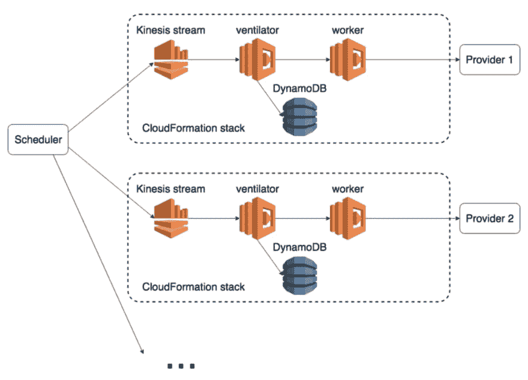
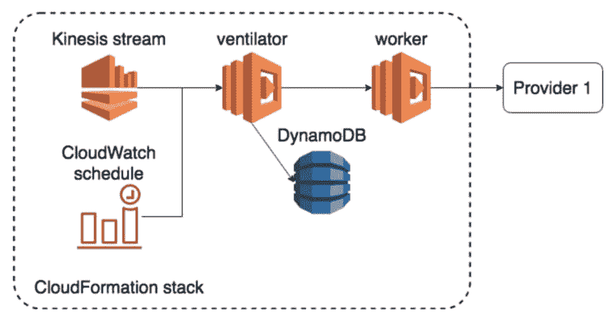
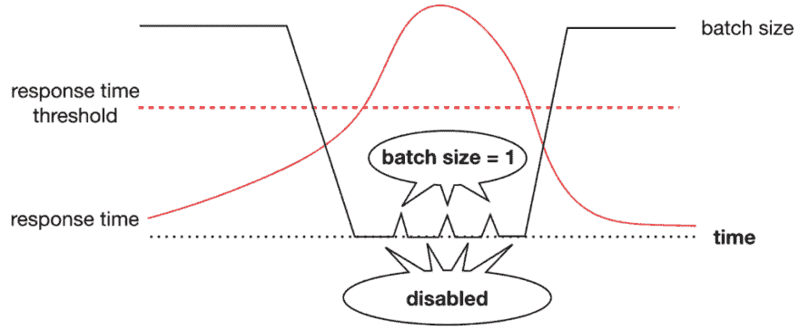

# 如何写一个自我修复的 Kinesis 函数

> 原文：<https://dev.to/theburningmonk/how-to-write-a-self-healing-kinesis-function-162a>

本周，我与一位客户一起解决了一个有趣的问题——根据响应时间和错误率动态调整对下游服务的并发请求数量。当与第三方集成时，这是一个常见的挑战，所以我们决定分享我们的方法，以便其他人可以从中受益。

# 问题

我的客户是金融服务行业的，他们与 50 多家服务提供商进行集成。他们可以通过 API 访问提供商的数据，并且每天都需要从每个提供商那里获取这些数据。

但是，许多提供商对其 API 设置了限制和速率限制，例如:

*   您只能在非高峰时段访问 API。
*   在每周维护窗口期间，您无法访问 API。
*   您只能向 API 发出 X 个并发请求。

我的客户实现了一个*调度器*服务来管理时间约束。*调度器*知道**何时**开始每个提供者的接收过程。但是还有一个次要的过程，他们的用户(财务顾问)可以自己安排临时摄入。

我们还必须记住其他一些情况:

*   API 遵循既定的行业标准。不幸的是，他们一次只能返回一条记录。
*   API 响应时间变化很大，从 5 毫秒到 70 秒不等。
*   客户端需要获取的数据量因提供商而异。有些只有几千条记录，有些则有几十万条记录。
*   我们不应该每天从一个提供者获取相同的记录超过一次。这归因于使用限制。
*   这个摄取过程是他们系统中最关键的业务部分**之一。需要谨慎管理向这一新系统的迁移，以最大限度地减少对客户的潜在影响。**

# 解

为了解决上述挑战，我们需要一种机制来:

*   缓慢而稳定地从提供商的 API 获取大量记录。该过程需要可靠，但如果需要，可能需要几个小时。
*   最多只能同时获取 X 条记录。
*   当提供者 API 的响应时间或错误率开始上升时，逐渐减少并发性。

我们没有从头开始实现这样的机制，而是选择利用 Kinesis 和 Lambda 的内置批处理支持。在我们建议的设置中:

*   每个供应商都有一个 Kinesis 流。
*   调度程序服务将我们需要提取到流中的记录排队。
*   一个 *ventilator* Lambda 函数将批量接收记录，并将它们分发给一个 *worker* 函数(通过直接的函数调用)。
*   有许多不同的工作函数，每个提供者都有一个。这是因为大多数提供者都有特定于提供者的业务逻辑。
*   为了避免在同一天处理相同的记录两次，*呼吸机*在 DynamoDB 表中跟踪今天已经处理过的记录。
*   为了支持重试失败的记录，*呼吸机*还跟踪在同一 DynamoDB 表中处理每个记录的尝试次数。当遇到部分故障时，*呼吸机*会增加失败记录和例外的*尝试*计数。Kinesis 会自动为我们重试同一批记录。在随后的尝试中，先前成功的记录将被忽略。

从高层次来看，该系统如下所示:

这种设计不能提供最大的吞吐量，这是设计的**！如前所述，这是由于提供者 API 的日常使用限制和可伸缩性问题。**

每个提供者都有自己的 CloudFormation 堆栈，包含 Kinesis 流、呼吸机和 worker Lambda 函数，以及 DynamoDB 表。这种设置使得一次一个提供者地逐渐迁移到新系统变得容易。

## 自愈功能

每个提供者一个流的配置让我们可以使用 Kinesis 事件源映射的批处理大小来控制并发性。因此，*呼吸机*功能可以通过[更新 Kinesis 事件源映射](https://docs.aws.amazon.com/lambda/latest/dg/API_UpdateEventSourceMapping.html)，**自我调整其批量**。

随着提供者 API 的响应时间增加，*呼吸机*可以通过减少其批量大小来做出响应。这给了 API 一个喘息和恢复的机会。当响应时间恢复到可接受的水平时，那么*呼吸机*可以逐渐将其批量增加回先前的水平。

我们甚至更进一步。

如果提供者 API 仍然在批量大小为 1 的情况下挣扎，那么很明显有些事情不对劲。不能将批大小更改为 0，但可以完全禁用 Kinesis 事件源映射。当您稍后重新启用它时，Kinesis 会将事件从它之前停止的地方推送到*呼吸机*，就像什么都没发生一样。

然而，如果 Kinesis 事件源被禁用，那么稍后需要其他东西来触发唤醒*呼吸机*。为此，我们有一个 CloudWatch 计划，每 10 分钟触发一次*呼吸机*功能。

如果 Kinesis 事件源已经启用，那么这些 CloudWatch 触发的调用就什么也不做。然而，当 Kinesis 被禁用时，*呼吸机*可以在批量为 1 时重新启用它。这允许 Kinesis 在下一次调用时向提供者 API 发出一个请求。如果反应时间仍然高于阈值，那么我们将再次禁用 Kinesis，循环重复。直到提供者 API 能够及时响应请求。然后，Kinesis 流保持启用状态，并且*呼吸机*功能将逐渐恢复其之前的批量。

这是应用于流处理的经典[断路器模式](https://martinfowler.com/bliki/CircuitBreaker.html)。

# 给我看看它是怎么工作的！

如果你想看看这在实践中是如何工作的，我做了一个演示程序来说明。你可以在这里找到源代码[。按照自述文件中的说明部署演示应用程序，并使用提供的 *feed-stream* 脚本输入数据。](https://github.com/theburningmonk/self-adjusting-kinesis-function-demo)

有了这个演示应用程序，我可以通过环境变量调整来自 *worker* 函数的缓慢和错误响应的比率。

当我这样做时，你很快就会看到*呼吸机*采取行动，以减少其批量大小。它将调整批量大小，相应地增加和减少。

您还可以创建一个指标过滤器来从日志中提取批量大小，并在 CloudWatch 中将它转换成一个指标。这让您可以观察批次大小如何随时间变化。

如果提高的响应时间和错误率继续，那么最终*呼吸机*功能将禁用其 Kinesis 事件源。

然后，cron 作业将每 10 分钟重新启用该流。

并且如果*工作者*功能已经恢复。

然后*呼吸机*功能将逐渐增加其批量。

直到它最终恢复到原来的批量 10。如果您一直监视批量大小的变化，您可能会看到以下内容:

# 总结

在这篇文章中，我们讨论了一个自我修复运动功能的设计，它可以根据性能调整吞吐量。通过这样做，我们能够仔细地调整我们的系统对第三方 API 发出的并发请求的数量，并保持在它们的操作限制之内。我们还讨论了这样的设计如何实现断路器模式，以及如何在第三方 API 陷入困境时完全摆脱困境。

帖子[一个基于性能](https://theburningmonk.com/2019/05/a-self-healing-kinesis-function-that-adapts-its-throughput-based-on-performance/)调整其吞吐量的自愈式驱动功能最早出现在 theburningmonk.com[号](https://theburningmonk.com)上。

