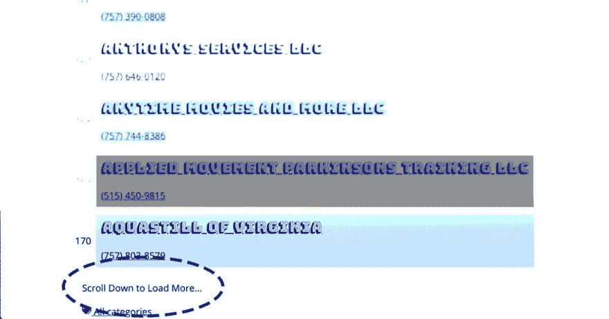

# 用 React Hooks 为你的 Gatsby 项目添加桌面和移动无限滚动

> 原文：<https://dev.to/wesleylhandy/adding-infinite-scroll-for-both-desktop-and-mobile-in-your-gatsby-project-kp5>

[](/static/310b5d4fba2ad789399bfaeb5397a733/c35de/infinite-scroll.jpg)

我最近创建了我的第二个产品 [Gatsby](https://gatsbyjs.org) 应用程序，它给出了一个地方政府公开数据数据集的简单展示。我说的是产品，虽然，这个应用程序的大部分是我正在开发的一个更大的应用程序的概念验证(也许是一个组合中的创业公司？还不确定...).我的应用程序包括 2400 多个节点，因此我需要一种以用户友好的方式呈现数据的方法。我的集合中的每条记录都包含一组类别，因此我可以轻松地创建一个类别页面，并以这种方式拆分数据。然而，我还想最终添加搜索，并允许用户浏览整个数据集。这是我调查`pagination`和`infinite-scroll`的地方。你可以在 Gatsby 博客上阅读关于添加分页的内容——这非常简单。下面是我如何设置 infinite-scroll，它可以在开发和生产环境中工作，也可以在浏览器和触摸屏上工作。我能够在一个功能性组件而不是基于类的组件中使用 React `Hooks`来实现这一点。

## 无限卷轴&反应钩子

尽管这篇文章是关于在盖茨比内部整合这一点，但这确实是一个`react`问题。Gatsby 只是一个获取数据的平台。这可以很容易地通过在客户端组件期间从 API 中`fetch`调用数据来实现。根据您的情况调整这种方法。

### 设置`gatsby-node.js`

在`gatsby-node.js`中，您将定义一个名为`createPages`的导出，该导出从您的数据源中查询`graphql`节点并返回节点列表。在返回之前，您可以根据需要多次调用`createPage` API 来生成您的站点。我打算，在许多其他事情中，创建一个单一的页面，通过我的企业列表生成和无限滚动。我将调用`createPage`，向其传递页面路径、页面模板以及将通过`Context` api:
提供给客户端的数据

```
exports.createPages = ({ actions, graphql }) => {
  const { createPage } = actions
  return graphql(`
    {
      #some query specific to your source data
      specificNameOfYourQuery {
        edges {
          node {
            #specific fields
          }
        }
      }
    }
  `).then(result => {
    if (result.errors) {
      return Promise.reject(result.errors)
    }
    const { data: [specificNameOfYourQuery]: edges } } } = result;
    const infiniteScrollTemplate = path.resolve(`src/templates/infinite-scroll-template.js`)
    createPage({ 
      path: "/businesses", 
      component: infiniteScrollTemplate, 
      context: { 
        edges,
      },
    }) return edges;
  }) 
```

### 创建将包含无限滚动的模板

从项目的根目录，进入您的`src`目录，创建一个`templates`文件夹(如果它不存在的话),然后创建您的模板页面。我给我的取名为`infinite-scroll-template.js`。

```
cd src
mkdir templates
cd templates
touch infinite-scroll-template.js 
```

#### 反应钩子- `useEffect`和`useState`

一旦你在 IDE 中打开了你的模板文件，你将需要导入`React`以及`useEffect`和`useState`钩子。对于 Gatsby 项目，您还将导入您的`Layout`组件，以便您的页面将与站点的其余部分相匹配。`createPage` API 作为道具传递给你的组件`pageContext`，在那里你可以访问从`gatsby-node`传递给你的模板的`edges`列表。

```
import React, { useState, useEffect } from 'react'
import Layout from '../components/Layout'

function InfiniteScroll({ pageContext: { edges } }) {
    return null
}

function InfiniteScrollTemplate(props) {
  return (
    <Layout {...props}>
      <InfiniteScroll {...props}/>
    </Layout>
  )
}

export default InfiniteScrollTemplate 
```

我们将着重于向`InfiniteScroll`功能组件添加无限滚动的核心逻辑。由于前面提到的两个钩子—: `useState`和`useEffect`，我们不需要声明一个`React`类

##### 用`useState`创建和设置内部状态

React 挂钩允许我们编写可以“挂钩”其他 React 特性的功能组件。`useState`允许我们添加功能组件渲染之间保留的状态。与 React `class`中的`state`不同，`useState`替换先前的状态，而不是与先前的状态合并。调用`useState`只需要一个参数，无论你认为初始状态是什么。可以多次调用`useState`钩子，所以你可以有多个类似`state`的变量，而不是一个`state`对象。这是因为对`useState`的调用返回一个包含两个属性的数组——当前状态的值和一个用来更新该状态值的函数。

```
const [currentState, setState] = useState(/* some initial value or function that returns a value */) 
```

对于这个例子中的无限滚动，我们需要两个状态变量——一个表示是否有更多记录要加载的`boolean`,以及一个已经加载的记录的`array`。用前 10 条记录播种`currentList`。不要担心初始集合可能小于 10，如果您提供的结束值大于数组的最后一个索引，`Array.slice`将返回数组长度以内的所有记录。

*注意:如果我们有一个从 API 异步加载数据的情况，我们也需要某种方法来确定数据是否处于加载状态*

```
const [hasMore, setMore] = useState(edges.length > 10)
const [currentList, addToList] = useState([...edges.slice(0, 10)])
const [isLoading, setLoading] = useState(false) // if loading from an API asynchronously 
```

##### 创建事件处理程序来读取和设置状态

读取和设置状态将在页面滚动位置的事件侦听器中发生。如果你使用一个外部 api，并且这个 api 仍然在加载内容，我们将立即返回，如果我们知道没有更多的边需要加载，我们也将退出。否则，我们将检查窗口的`document`加上`innerHeight`的滚动位置是否等于文档的`offsetHeight`，如果是，我们可以加载更多的边。基本上，它检查页面是否一直滚动到底部。

```
const handleScroll = () => {
  if ( !hasMore || isLoading ) return;
  if ( window.innerHeight + document.documentElement.scrollTop === document.documentElement.offsetHeight ){
    loadEdges(true)
  }
} 
```

`loadEdges`功能将依次执行以下操作:

1.  如果使用异步 api 调用，会将加载标志设置为 true
2.  确定是否还有剩余的边
3.  切割一个新的边块并添加到当前列表中
4.  如果使用异步 api 调用，会将加载标志返回 false

由于我是从`Context` API 加载的，我将忽略上面的步骤 1 & 2。

```
const loadEdges = () => {
  const currentLength = currentList.length
  const more = currentLength < edges.length
  const nextEdges = more ? edges.slice(currentLength, currentLength + 20) : []
  setMore(more)
  addToList([...currentList, ...nextEdges])
} 
```

*如何使用`isLoading`？*

这里有一个过于简单的例子:

```
const loadEdges = async () => {
  setLoading(true);
  try {
      const newEdges = await fetch('https://path/to/some/api')
      const more = newEdges.length > 0
      setMore(more)
      addBusinesses([...currentList, ...nextEdges])
  } catch(err) {
      console.error({fetchNewEdgesError: err})
  }
  setLoading(false)
} 
```

##### 用`useEffect`检查每个渲染上的滚动位置

初始化无限滚动的最后一步是`useEffect`钩子。钩子`useEffect`接受两个参数:一个函数和一个数组。第一个参数是组件在每次后*被渲染时调用的函数。这个函数被允许返回另一个函数，这个函数将被记住并作为清理函数被调用(我不确定我是否完全理解清理，但我认为[丹·阿布拉莫夫理解](https://overreacted.io/a-complete-guide-to-useeffect/))。第二个参数是一个依赖项数组，如果这些依赖项的值在渲染之间没有改变，它将阻止调用效果。无限滚动将使用一个清理回调函数以及一个充满依赖关系的数组来工作。* 

```
useEffect(
  () => {
    /* function that gets called every time */
    return () => {
      /* cleanup function to be called */
    }
  }, [/* dependencies */]) 
```

`useEffect`是在`window`或`document`上初始化事件监听器的好地方，也是在清理过程中移除这些监听器的好地方，比如监听`scroll`事件。

```
 window.addEventListener('scroll', handleScroll) 
```

因此，清理功能:

```
 window.removeEventListener('scroll', handleScroll) 
```

这给了我们一个几乎完整的`useEffect`函数调用，我们将简单地把我们的状态变量添加到依赖数组中，这样只有当变量改变时，效果才会被设置或清除:

```
useEffect(
  () => {
    window.addEventListener('scroll', handleScroll)
    return () => {
      window.removeEventListener('scroll', handleScroll)
    }
  }, [hasMore, isLoading, currentList]) 
```

随着状态、事件处理程序、效果的初始化，我们可以自由地为滚动列表返回`jsx`。下面的内容映射到了`currentList`数组。它还添加了显示列表当前状态的标签:

```
return (
  <> {/* shorthand for React.Fragment */}
    <ul>
      {
        currentList.map(({node: { fields }}, idx) => {
          return (
            <li key={`fields-${idx}`} index={idx + 1}>
              { 
                /* you will know the specifics here from how you load your data */
                fields 
              }
            </li>
          )
        })
      }
    </ul>
    {
      !hasMore &&
        <div>All Businesses Loaded!</div>
    }
    {
      hasMore &&
        <div>Scroll Down to Load More...</div>
    }
    {
      /* if using this flag, otherwise omit */
      isLoading && 
        <div>Loading...</div>
    }
  </>
) 
```

### 把所有的东西放在一起

现在我们有了无限卷轴功能组件的完整图片。见下文，但先别走，我们还是要交代`gatsby build`和移动事件。

```
import React, { useState, useEffect } from 'react'
import Layout from '../components/Layout'

function InfiniteScroll({ pageContext: { edges } }) {
  const [hasMore, setMore] = useState(edges.length > 10)
  const [currentList, addToList] = useState([...edges.slice(0, 10)])

  const loadEdges = () => {
    const currentLength = currentList.length
    const more = currentLength < edges.length
    const nextEdges = more ? edges.slice(currentLength, currentLength + 20) : []
    setMore(more)
    addToList([...currentList, ...nextEdges])
  }

  const handleScroll = () => {
    if ( !hasMore ) return;
    if ( window.innerHeight + document.documentElement.scrollTop === document.documentElement.offsetHeight ){
      loadEdges()
    }
  }

  useEffect(() => {
    window.addEventListener('scroll', handleScroll)
    return () => {
      window.removeEventListener('scroll', handleScroll)
    }
  }, [hasMore, currentList])

  return (
    <> {/* shorthand for React.Fragment */}
      <ul>
        {
          currentList.map(({node: { fields }}, idx) => {
            return (
              <li key={`fields-${idx}`} index={idx + 1}>
                { 
                  /* you will know the specifics here from how you load your data */
                  fields 
                }
              </li>
           )
          })
        }
      </ul>
      {
        !hasMore &&
          <div>All Businesses Loaded!</div>
      }
      {
        hasMore &&
          <div>Scroll Down to Load More...</div>
      }
      {
    </>
  )
}

function InfiniteScrollTemplate(props) {
  return (
    <Layout {...props}>
      <InfiniteScroll {...props}/>
    </Layout>
  )
}

export default InfiniteScrollTemplate 
```

这个功能组件在桌面浏览器上开发时会工作得很好。但是在构建过程中和触摸屏上，您将会失去滚动效果。它将在构建期间失败，因为像`window`和`document`这样的客户端全局变量在构建期间是未定义的。它在手机上会失败，因为`scroll`是一个鼠标事件。我们需要为事件侦听器添加一些条件来处理这两种情况。

### 优化生产和触摸屏

除了在`scroll`上添加一个事件监听器，我们还需要`touchend`和`resize`的事件监听器(来处理有人调整浏览器大小的情况)，另外我们需要添加`preventDefault`到触摸事件，以防止在设备既有鼠标又有触摸屏的某些情况下触发重复事件。首先，创建一个新的事件处理程序来处理`touchend`。这个新的处理程序将简单地阻止`touchend`上的默认动作，并调用滚动事件的处理程序(简单地检查我们是否应该加载更多的文档)。其次，更新`useEffect`函数以添加额外的事件处理程序。

```
const handleTouchEnd = (e) => { e.preventDefault(); handleScroll();}
useEffect(() => {
  window.addEventListener('scroll', handleScroll)
  window.addEventListener('resize', handleScroll)
  window.addEventListener('touchend', handleTouchEnd)
  return () => {
    window.removeEventListener('scroll', handleScroll)
    window.removeEventListener('resize', handleScroll)
    window.removeEventListener('touchend', handleTouchEnd)
  }
}, [hasMore, currentList]) 
```

最后，我们需要向`window`或`document`的每个实例添加一些简单的`boolean`检查(`window &&`)，以便构建过程成功完成*和*，这样无限滚动仍然可以在客户端运行。另外，我们需要将滚动位置检查改为`>=`，而不是严格的相等`===`。

```
const handleScroll = () => {
  if ( !hasMore || isLoading ) return;
  if ( window && ( ( window.innerHeight + document.documentElement.scrollTop ) >= document.documentElement.offsetHeight ) ){ loadEdges()
  }
}
useEffect(() => {
  window && window.addEventListener('scroll', handleScroll)
  window && window.addEventListener('resize', handleScroll)
  window && window.addEventListener('touchend', handleTouchEnd)
  return () => {
    window && window.removeEventListener('scroll', handleScroll)
    window && window.removeEventListener('resize', handleScroll)
    window && window.removeEventListener('touchend', handleTouchEnd) }
}, [hasMore, currentList]) 
```

你有它！您有一个组件，它将在浏览器、触摸屏以及 Gatsby 或 React 应用程序的生产环境中实现无限滚动。

在您的浏览器和手机上查看以下页面，以[了解这段代码的运行](https://vb-business-licenses.netlify.com/businesses)。

还可以在 github 上看到[我具体实现的源代码。](https://github.com/wesleylhandy/got-business-client)