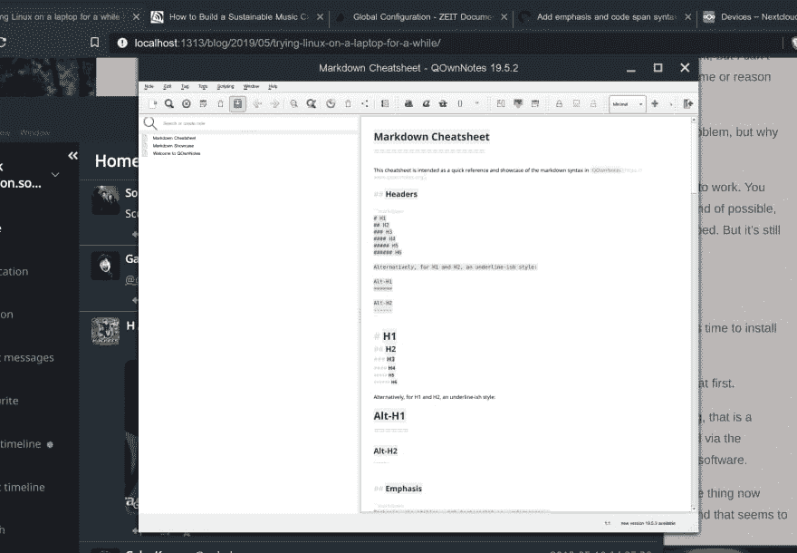
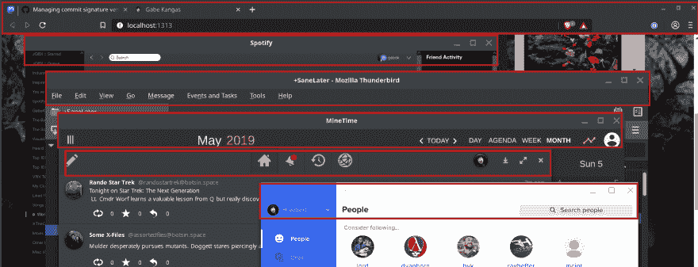

# 是改变的时候了:我正在桌面上尝试 Linux

> 原文：<https://dev.to/gabek/it-s-time-for-a-change-i-m-trying-linux-on-the-desktop-6i3>

最近我对互联网、软件、电脑和技术感到恶心。最近我放弃了一个项目，这让我感觉很糟糕。这让我想到了我和我的个人电脑的关系，以及我用它做的事情。我意识到，一旦我把 macOS 和 iOS 软件开发从我使用的电脑中移除，我就不会真的依赖 Mac 了。尽管我喜欢苹果电脑、麦金塔电脑和整个苹果生态系统，但我只是需要暂时看看别的东西，重新点燃我对电脑的热情。

所以我买了一台全新的电脑，一台联想 Thinkpad X1 Carbon。在我成为 Mac 用户之前，我有一台 IBM Thinkpad，我对它有着美好的回忆。此外，当我在 Fe diversity 上对人们进行民意调查时，许多人认为它与 Linux 和 X1 硬件有很好的兼容性。所以我去了旧金山的中央电脑公司，一家真正的实体电脑商店，拿出了一台新的笔记本电脑。

#### 挑选一个 Linux 发行版

第一步是选择一个我满意的 Linux 发行版。最初有人建议我去看看 [Pop！_OS](https://system76.com/pop) 所以我把 ISO 写到一个 USB 驱动器上安装。装之前真的不太了解，但是没理由不试试。但是玩了一会儿之后，我发现窗口管理有点奇怪。我真的看不到哪些应用程序是打开的，不得不查看子菜单，以便在没有 dock 或其他东西的情况下了解应用程序的状态。没什么大不了的。下一个，在读了一点之后，是 [Linux Mint](https://linuxmint.com/) 肉桂版。对于一个漂亮的桌面来说，它看起来足够精致了，但也有一些我期待的标准元素。它花了不到 5 分钟的时间下载 ISO，写入 USB 驱动器，并启动到它。我无法解释这么快就测试出不同的发行版有多酷。

#### 前期印象:硬件+操作系统

随着操作系统的安装，我可以四处闲逛，并检查它。我马上注意到，在 Thinkpad 键盘上打字比在苹果 Macbook Pro 上那可怕的蝶形开关键盘好得多。

虽然键盘很棒，但有一样东西却不是:键盘快捷键。出于某种原因，即使像复制/粘贴这样简单的快捷方式也只在某些地方有效。我可以在 web 浏览器中命令+c 来复制文本，但不能在终端中命令+v 来粘贴文本。但我可以在其他应用中命令+v。捷径在哪里行得通，在哪里行不通，似乎没有什么规律或道理。

这么多图标模糊不清。这台机器有一个高 DPI 屏幕，所以我知道这可能是问题所在，但为什么应用程序没有更新到支持现代屏幕？

在使用这个设置大约一周后，我研究了如何让惯性(或 kenetic)滚动工作起来。你知道如果你快速投掷触控板，它会随着时间的推移快速滚动并减速。事实证明这是可能的，但是你必须改变鼠标驱动程序。所以我用 [Synaptics 驱动程序](https://wayland.freedesktop.org/libinput/doc/latest/faqs.html#kinetic-scrolling-does-not-work)替换了 [libinput](https://www.freedesktop.org/wiki/Software/libinput/) ，这很有帮助。但它仍然是“关着的”，以那种难以描述的方式。

但是除了触控板驱动程序之外，我不需要安装任何自定义驱动程序，不需要手动编辑配置文件，也不需要启动控制台来调整一些设置。目前实际的 Linux 发行版看起来非常坚固。桌面环境和窗口管理器都经过了改进，非常好用。

#### 安装软件

因此，随着 Linux Mint 的安装，我对操作系统的标准元素足够满意，是时候安装我需要开始获得功能的应用程序了。

在 Linux 中安装软件有很多方法，你永远不知道应该先看哪一种。

Linux Mint 有这个“软件管理器”,我认为它可能只是 apt 的 GUI 前端，或者别的什么。这是搜索和安装应用程序的便捷方式。但是，有些东西，您将希望或者必须通过命令行安装。macOS 也是如此，因为家酿软件可以让你轻松安装大量的 unix 软件。

现在还有一些叫做[“snap”](https://snapcraft.io/store)的东西，你可以在那里安装某种处理依赖关系的一体化应用程序映像，一旦你在 snap 生态系统上找到它，它似乎会工作得很好。它表明在 Linux 中安装应用程序的体验多年来一直是一个焦点，因为现在有许多不同的方法，都试图比下一个更容易。不幸的是，他们把所有的时间都花在了安装界面上，而不是软件本身。

#### Linux 软件的状态

因此，如果实际的 Linux 发行版和软件体验非常好，那么这整个事情听起来就像是成功的，对吗？好了，让我们来谈谈实际的应用。

老实说，自从 10 多年前我最后一次使用 Linux 作为桌面操作系统以来，Linux 桌面应用程序似乎没有怎么被接触过。似乎没有任何真正完善的应用程序，人们现在仍然在使用那些当时存在的应用程序，它们并不比十年前更好。

我只能假设，我在 macOS 桌面上抱怨的同样的事情，即人们刚刚放弃使用网络，正在 Linux 上发生。或者也许 Linux 用户只是决定没有理由离开终端？雷鸟仍然是邮件客户端的最佳选择的原因是因为每个人都只是在他们的浏览器中使用愚蠢的 Gmail 吗？

当然也有一些例外，从技术上来说，现在的应用程序比以前多了。但就像在 Mac 上一样，大部分都是跨平台的电子/Javascript 应用。Visual Studio 代码在 Linux 上，Signal messenger 也是，乳齿象和 Keybase 的 Whalebird 也是。我发现了一个叫做 MineTime 的新日历应用。但所有这些都只是电子包装中的网络应用。

虽然有些应用程序是“坏的”，但有些完全无法使用。以 QOwnNotes 应用程序为例，它完全无法使用，因为出于某种原因，它只是自行处理屏幕分辨率。Spotify 也是这样做的，但至少 Spotify 不是一个生产力应用程序，你只需按下播放和最小化即可完成工作。一个你看不到笔记的笔记应用程序是桌面上所有不良 Linux 软件的一个很好的例子。

#### 使用 Linux 日常

真的很难形容。但是在桌面上使用 Linux，以及 Linux 桌面应用程序，有点像在一层泥地上使用计算机。只是移动鼠标光标，点击鼠标感觉很奇怪。一切都有点乱。

很难用语言来描述这些。但是，即使是在打这篇博文的时候，我也会打字，然后光标会跳到文档的随机部分，因为我*猜测*我在打字的时候不小心碰到了触控板还是什么？这种事情经常发生，太让人沮丧了。如果我试图高亮显示一段文字，有时我会删除它，或者因为这些奇怪的输入把它拖到其他地方。在使用触控板时，你必须非常、非常谨慎，因为它感觉像是总会绊倒你。我想象使用带有外部鼠标和键盘的 Linux 会是一种非常非常愉快的体验。这感觉就像是十多年前 Linux 停滞不前的另一个例子，当时笔记本电脑上的 Linux 可能不太受欢迎，每个人都在使用带有外部设备的强大的台式电脑。

应用程序对它们没有任何一致性。有些有菜单栏，有些有菜单按钮，有些没有菜单。因此，如果你想在应用程序中寻找“偏好”窗口，你必须去挖掘。这里有几个不同的应用程序的例子。浏览器有一个三条水平线的“汉堡菜单”，Spotify 有一个与你的个人资料图像相关的下拉菜单，Thunderbird 有一个菜单栏，MimeTime 有一个三条垂直线的菜单按钮，图特尔有一个自定义工具栏(和完全不同的最小化、最大化和关闭按钮)，Keybase 有你的个人资料图像。使用这些应用程序的认知开销有点大。

因为我花了太多时间在 macOS 终端上，所以使用桌面 Linux 感觉很舒服。我使用相同的点文件，所以我的 bash 提示符看起来是相同的，所有相同的工具都在终端中。尽管如此，我仍然不知道为什么我不能使用键盘快捷键粘贴。

#### 我怀念的事情

许多这些都是显而易见的，因为一旦你离开了那个生态系统，你就无法复制一定量的苹果整合魔力，但这并不能改变一个事实，即我发现有一些东西马上就错过了。

没有全局拼写检查。

我猜这是因为没有一个桌面应用程序遵循同样的规则，而且它是控件和文本处理的狂野西部，所以有任何类型的全局拼写检查的想法可能是不可能的。

从桌面回复短信和 iMessages。

鉴于我真的不喜欢在手机上花时间，而且我总是在电脑前，所以当我开始不得不通过手机而不是真正的键盘来回复信息时，我立即错过了通过台式电脑回复手机信息的能力。

**跨设备复制粘贴**

iOS 和 macOS 有一个共享剪贴板。我经常用这个。我经常做的一件事是在我的桌面上复制一个密码，然后粘贴到我手机上的一个应用程序中。这比在我的手机上打开 1 密码、解锁、搜索登录并复制它要快得多。现在我必须用手机回复短信，我真的希望我能在桌面上搜索东西，然后把它们粘贴到短信回复中。

**用我的 Apple Watch 自动解锁**

我是少有的几个真正喜欢苹果手表的人之一，当我走到电脑前，它就像魔法一样解锁了，不需要我输入密码，甚至不需要扫描我的指纹。

#### 我正在使用的应用程序

我每天都在 macOS 上使用一些应用程序，我需要找到与之相当的应用程序。这是我目前为止想到的:

**MAC OS 和 Linux 上的应用**

*   勇敢的浏览器
*   Spotify
*   1 密码(但仅作为浏览器扩展)
*   信号信使
*   Dropbox
*   Visual Studio 代码
*   信号

**日常应用的替代品**

*   Mail.app -> Mozilla Thunderbird
*   [KeepIt Notes](https://reinventedsoftware.com/keepit/) (通过 iCloud 同步笔记)——>也许回 Evernote？我宁愿不要。
*   乳齿象客户端-> [鲸鸟](https://whalebird.org/en/desktop/contents)(电子 app)
*   Calendar.app -> [Minetime](https://minetime.ai) (电子 app)

**没有替换的应用**

*   iMessage

#### 外卖和未来

我真的很想这样做，但是伙计，这太糟糕了。我想如果我是一个整天在网络浏览器中使用谷歌文档的人，或者只想使用终端，那么 Linux 将是最有用的。但是我喜欢原生的桌面应用程序，而那些用于 Linux 的程序用起来并不愉快。除此之外，可怕的触控板体验和我不小心删除东西、在东西上打字、移动东西，以及每当我试图点击东西时通常都是一团糟，这让我根本不想使用机器。

我知道我不会得到很多建设性的反馈，但如果我的任何抱怨和担忧是你经历过的，并且你能够自己解决的，请让我知道。我真的很想继续在家里使用 Linux 作为日常驱动桌面操作系统，但是我不知道除了对我正在经历的基本问题进行短期实验之外，我如何能继续这样做。

像往常一样，在这里评论或者[在 fevariable](https://mastodon.social/@gabek)上找到我，让我们一起聊聊。