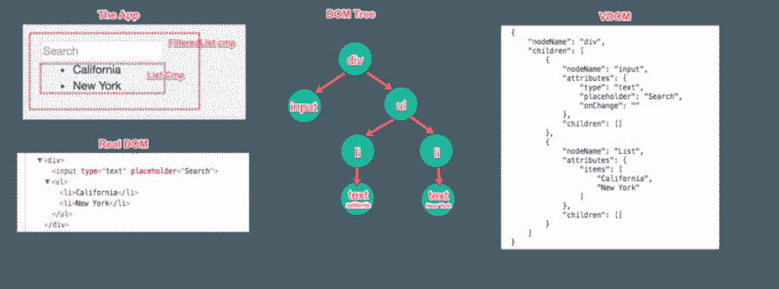
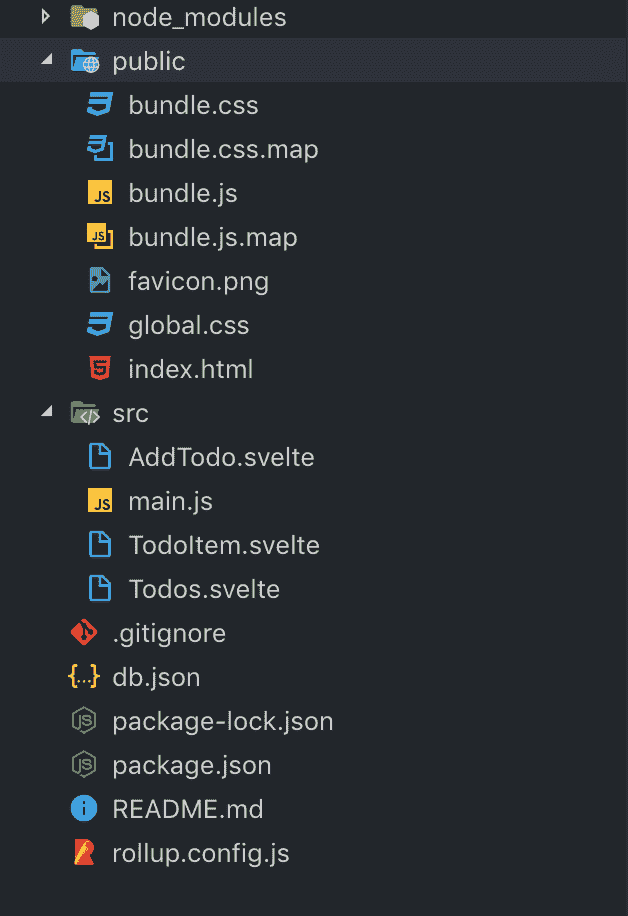
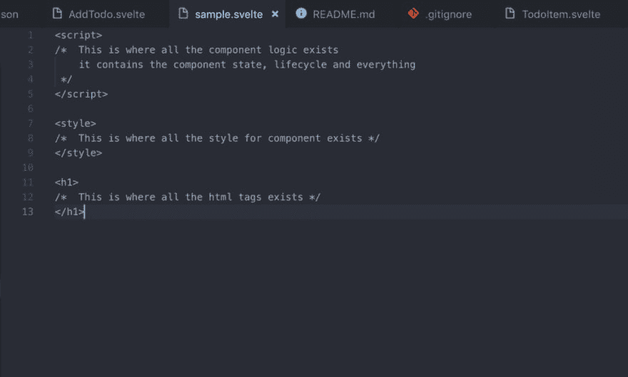
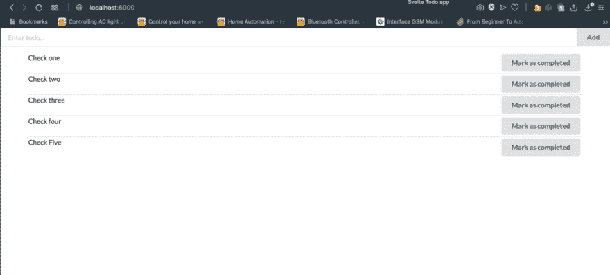

# 为什么你可能需要考虑 svelte.js 而不是 React、Vue 或 Angular

> 原文：<https://dev.to/ganeshmani/why-you-may-need-to-consider-svelte-js-over-react-vue-or-angular-24io>

为了支持我的工作-阅读来自[原始来源](https://cloudnweb.dev/2019/05/why-you-may-need-to-consider-svelte-js-over-reactvue-or-angular/)的这篇文章

[](https://res.cloudinary.com/practicaldev/image/fetch/s--l-JaT3WG--/c_limit%2Cf_auto%2Cfl_progressive%2Cq_66%2Cw_880/https://cloudnweb.dev/wp-content/uploads/2019/05/oh_no.gif)

我知道。我知道。你可能会想，为什么我需要学习另一个框架？。但是 svelte 有一些独特的东西使它从其他框架中脱颖而出。

让我们看看这篇文章有什么特别之处。

### 什么是 svelte.js？

最重要的是，Svelte.js 是一个类似 React 和 Vue 的组件框架，但有一个重要的区别。React 使用了一种叫做 VirtualDOM 的技术，我们将在本文后面介绍这种技术。

简单来说，React 允许我们编写状态驱动的代码，由浏览器转换成理想的 javascript 代码。这可能很痛苦，因为大部分转换发生在浏览器中，而 svelte 在构建时将代码转换为理想的 javascript 代码，而不是在运行时进行。

### 什么是虚拟 DOM？

操作真正的 DOM 很慢。假设我们有一个包含十个条目的列表。当一个项目发生变化时，我们需要重新渲染所有十个项目。考虑在一个现代网站中，我们有很多 DOM 操作，这使得应用程序很慢。

为了解决这个问题，React 团队提出了一个虚拟 DOM 的解决方案，它类似于 DOM 对象，但它缺乏改变屏幕上任何内容的能力。

每个虚拟 DOM 对象都与真实 DOM 对象相映射。虚拟 DOM 被改变了，而不是操纵真实的 DOM。

<figure>[](https://res.cloudinary.com/practicaldev/image/fetch/s--CULZSeuU--/c_limit%2Cf_auto%2Cfl_progressive%2Cq_auto%2Cw_880/https://cloudnweb.dev/wp-content/uploads/2019/05/v_dom-1024x380.png) 

<figcaption>来源:[https://medium.com/@rajaraodv](https://medium.com/@rajaraodv)</figcaption>

</figure>

阅读更多关于虚拟 DOM 的信息

### 虚拟 DOM 的开销:

React 带来了虚拟 DOM Diffing 的概念。一旦虚拟 DOM 更新完毕，React 就会将虚拟 DOM 与更新前拍摄的虚拟 DOM 快照进行比较。

通过将新的虚拟 DOM 与更新前的版本进行比较，React 精确地计算出哪些虚拟 DOM 对象发生了变化。这个过程叫做“diffing”

最明显的是，脱衣服不是免费的。如果不首先将新的虚拟 DOM 与以前的快照进行比较，就不能对真实 DOM 应用更改。

这就是苗条闪耀的地方。Svelte 不需要虚拟 DOM 就能解决这个问题。

[苗条的身材](https://svelte.dev/blog/virtual-dom-is-pure-overhead)

### Svelte.js -入门:

在本文中，我们将看到如何在 svelte.js 中创建一个待办事项列表应用程序

首先，我们将安装 svelte.js 并使用命令行创建一个启动项目。

```
npx degit sveltejs/template my-svelte-project
cd my-svelte-project

npm install
npm run dev
```

现在，应用程序将会运行，当您访问 http://localhost:5000 时，您将会在浏览器中看到 **Hello World** 。

如果你有使用 React 或 Vue 的经验。这对你来说是小菜一碟。如果你还没有，不要担心。你在正确的时间出现在正确的地方。

让我们看看 svelte 项目中的文件夹结构和组件

[](https://res.cloudinary.com/practicaldev/image/fetch/s--_ihgkDfX--/c_limit%2Cf_auto%2Cfl_progressive%2Cq_auto%2Cw_880/https://cloudnweb.dev/wp-content/uploads/2019/05/Screen-Shot-2019-05-19-at-11.54.02-PM.png)

*   **public**——包含应用程序的编译代码。我们在浏览器中看到的网页就是从这些编译后的代码中呈现出来的
*   这个文件夹包含了我们为应用程序编写的所有代码
*   package.json -它有点像元数据描述，包含了项目所使用的依赖关系
*   **main.js** -这个文件是应用程序的根。

如前所述，svelte 是一个基于组件的框架。我们将创建创建待办事项列表应用程序所需的组件

## 纤细的组件结构:

<figure>[](https://res.cloudinary.com/practicaldev/image/fetch/s--7vTtDNP7--/c_limit%2Cf_auto%2Cfl_progressive%2Cq_auto%2Cw_880/https://cloudnweb.dev/wp-content/uploads/2019/05/Screen-Shot-2019-05-20-at-12.04.10-AM-1024x615.png) 

<figcaption>**构件结构**</figcaption>

</figure>

好了....说真的。这是一个组件的结构。很简单，对吧？

我们可以将所有的组件逻辑写在

在为应用程序编写任何代码之前。我们将看到如何构建待办事项应用程序。

[](https://res.cloudinary.com/practicaldev/image/fetch/s--jz2n8VgT--/c_limit%2Cf_auto%2Cfl_progressive%2Cq_auto%2Cw_880/https://cloudnweb.dev/wp-content/uploads/2019/05/Screen-Shot-2019-05-20-at-12.11.55-AM-1024x462.png)

应用程序可以分为三个部分。

*   **Todos 组件** -包含自定义组件列表和输入框
*   **TodoItem 组件** -它包含 Todo 标题和一个按钮
*   **AddTodo 组件** -它包含输入框和一个插入按钮

我们将使用模拟服务器(json-server)来创建一个模拟数据库。了解更多关于 [json 服务器](https://github.com/typicode/json-server)的信息。

创建一个名为 **db.json** 的文件，并为模拟服务器添加以下数据

```
{
  "todos": [
    {
      "id": 1,
      "title": "Check one",
      "iscompleted": false
    },
    {
      "id": 2,
      "title": "Check two",
      "iscompleted": false
    },
    {
      "id": 3,
      "title": "Check three",
      "iscompleted": false
    },
    {
      "id": 4,
      "title": "Check four",
      "iscompleted": false
    },
    {
      "id": 5,
      "title": "Check Five",
      "iscompleted": false
    }
  ]
}
```

创建一个名为 **Todos.svelte** 的文件，并添加以下代码

```
<script>
        import TodoItem from './TodoItem.svelte';
    import AddTodo from './AddTodo.svelte';
    import { onMount,afterUpdate } from 'svelte';
    export let name;

    let todosData = [];

    onMount(async ()=> {

    let response = await fetch('http://localhost:3000/todos');
        let result = await response.json();
    todosData = result;

    })

    afterUpdate(async ()=> {

         let response = await fetch('http://localhost:3000/todos');
         let result = await response.json();                  
         todosData = result;    
    })
</script>

<style>
    h1 {
        color: purple;
    }
    .mtop{
        margin-top : 15px;
    }
</style>

    <AddTodo />
    <div class="ui container mtop">

    <div class="ui middle aligned divided list">
        {#each todosData as todo}

            <TodoItem  title={todo.title} id={todo.id} isCompleted={todo.iscompleted}/>  
        {/each}
    </div>
</div>
```

TodoItem 和 AddTodo 是我们导入到父组件中的子组件。**上线**和**更新后**是苗条的生命周期事件。了解生命周期事件，[生命周期事件](https://svelte.dev/tutorial/onmount)

在生命周期事件中，我们调用 API 来获取数据，并将其传递给 **TodoItem** 子组件。

创建一个名为 **TodoItem.svelte** 的文件，并添加以下代码

```
<script>
   export let id;
   export let title;
   export let isCompleted;

   async function handleClick(id,title){

       let data = {
           id : id,
           title : title,
           iscompleted : true
       }
       let response = await fetch(`http://localhost:3000/todos/${id}`,{
           method : 'PUT',
           headers : {
               'content-type' : 'application/json'
           },
           body : JSON.stringify(data) 
       });

       let result = await response.json();
       console.log(result);
   }
</script>

<style>
    .completed{
        background : green;
    }
</style>

<div class="item">
{#if isCompleted }

    <div class="content completed">
            {title}
    </div>
{:else }
    <div class="right floated content">
        <div class="ui button" on:click={() => handleClick(id,title)}>Mark as completed</div>
    </div>

    <div class="content">
        {title}
    </div>
{/if}              
</div>
```

这里，我们创建了一个 **onclick** 按钮事件，它将 todo 标记为已完成。

创建一个名为 AddTodo.svelte 的文件，并添加以下代码。

```
<script>
    let titleValue = '';

    async function addTodo(title){

          let data = {
           title : title,
           iscompleted : false
       }
       let response = await fetch(`http://localhost:3000/todos`,{
           method : 'POST',
           headers : {
               'content-type' : 'application/json'
           },
           body : JSON.stringify(data) 
       });
       let result = await response.json();

        titleValue = '';
    }

</script>

<style>

</style>

<div class="ui fluid action input">
        <input type="text" bind:value={titleValue} placeholder="Enter todo...">
        <div class="ui button" on:click={() => addTodo(titleValue)}>Add</div>
</div>
```

Angular 的一个重要特性就是**双向数据绑定**。svelte 使用了一些类似于[的特性](https://svelte.dev/tutorial/text-inputs)，将 javascript 变量与输入值绑定在一起。每当我们改变输入值时，javascript 变量就会更新。

```
<input type="text" bind:value={titleValue} placeholder="Enter todo...">
```

现在，如果我们在浏览器中运行应用程序，我们就能够访问简单的待办事项应用程序。

[](https://res.cloudinary.com/practicaldev/image/fetch/s--z7CUBGTP--/c_limit%2Cf_auto%2Cfl_progressive%2Cq_auto%2Cw_880/https://cloudnweb.dev/wp-content/uploads/2019/05/Screen-Shot-2019-05-20-at-12.11.55-AM-1-1024x462.png)

这个应用程序的完整源代码可以在这里找到。[苗条演示](https://github.com/ganeshmani/svelte-todo)

参考:

[纤细的文档](https://svelte.dev/tutorial/basics)

阅读更多关于 [web 开发的信息](https://cloudnweb.dev/category/web-dev/)