# 面向初学者的 AWS 静态网站托管第 1 部分

> 原文：<https://dev.to/exampro/aws-static-website-hosting-for-beginners-5hl5>

以下是使用 AWS 简单存储服务(S3)建立静态网站的快速指南。这是我正在做的一个更长的教程的第一部分(在[exam pro](https://www.exampro.co/)workshop 部分查看它)。

在这个简短的指南结束时，你将建立一个由 amazon 生成的 URL 引用的实时网站。

本教程的一个很好的应用是将其用作专业的网络简历。如果你在 webdev 市场找工作，这是向雇主展示你接触 AWS 服务的一个很好的方式。如果您对 AWS 感兴趣，您可以将本指南作为动手练习，熟悉控制台并树立信心。

### 创建 S3 存储桶

我们在创建一个静态网站的第一个任务是建立我们的 S3 桶。我们可以使用存储桶来存储文件、图像、录音等。但在本教程中，我们将使用它来存储我们的网站项目文件，然后将它们渲染到浏览器中。

* * *

手头有一个静态模板。我选择了以下内容。确保在根目录下有一个 index.html 和一个 error.html 文件。将某种类型的错误消息添加到 error.html 文件中。

[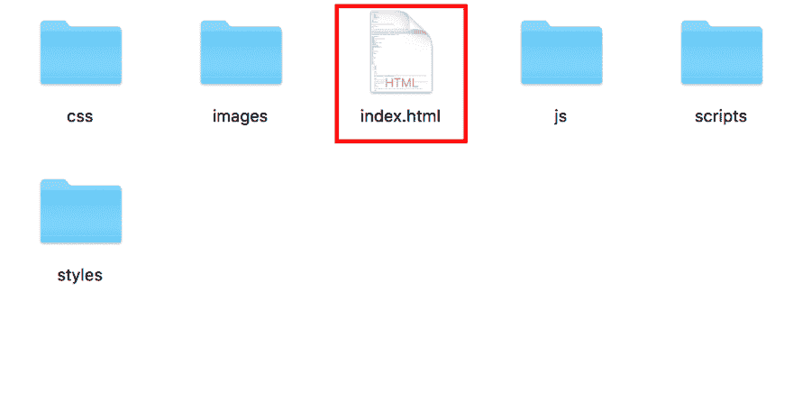](https://res.cloudinary.com/practicaldev/image/fetch/s--238A0PQ3--/c_limit%2Cf_auto%2Cfl_progressive%2Cq_auto%2Cw_880/https://s3.amazonaws.com/exampro/workshops/simg/static-website-hosting/bucket-policy/1.png)

* * *

*   导航到 S3 管理控制台
*   单击左上角的服务下拉选项卡

* * *

[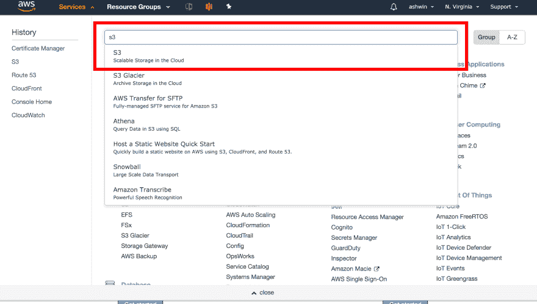](https://res.cloudinary.com/practicaldev/image/fetch/s--yJ1TqPGl--/c_limit%2Cf_auto%2Cfl_progressive%2Cq_auto%2Cw_880/https://s3.amazonaws.com/exampro/workshops/simg/static-website-hosting/bucket-policy/2.png)

* * *

*   在搜索栏中键入 S3，并从搜索结果中选择它

* * *

*   现在应该会打开 S3 控制台页面:

* * *

[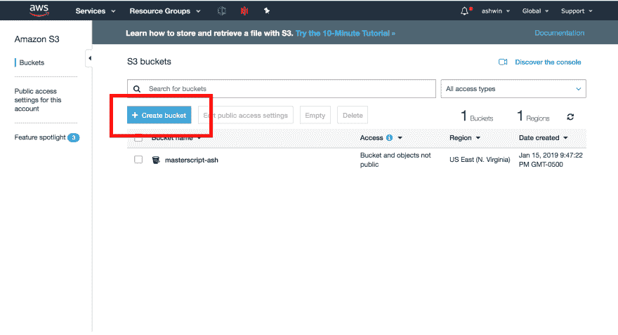](https://res.cloudinary.com/practicaldev/image/fetch/s--9Yr2dazw--/c_limit%2Cf_auto%2Cfl_progressive%2Cq_auto%2Cw_880/https://s3.amazonaws.com/exampro/workshops/simg/static-website-hosting/bucket-policy/3.png)

* * *

*   继续“创建存储桶”

* * *

*   输入存储桶名称。这将被用作 AWS 生成的唯一 URL。每个存储桶名称必须是唯一的，因为这是与您的网站相关联的 URL。

*   添加" [www。](http://www.)“至始而”。com”(或者您的域的后缀)添加到您的 bucket 名称的末尾。

[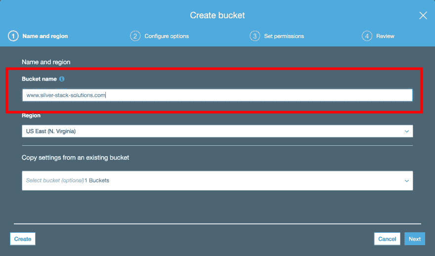](https://res.cloudinary.com/practicaldev/image/fetch/s--xnkND7Mf--/c_limit%2Cf_auto%2Cfl_progressive%2Cq_auto%2Cw_880/https://s3.amazonaws.com/exampro/workshops/simg/static-website-hosting/bucket-policy/4.png)

* * *

*   将配置选项留空，然后点击“下一步”

[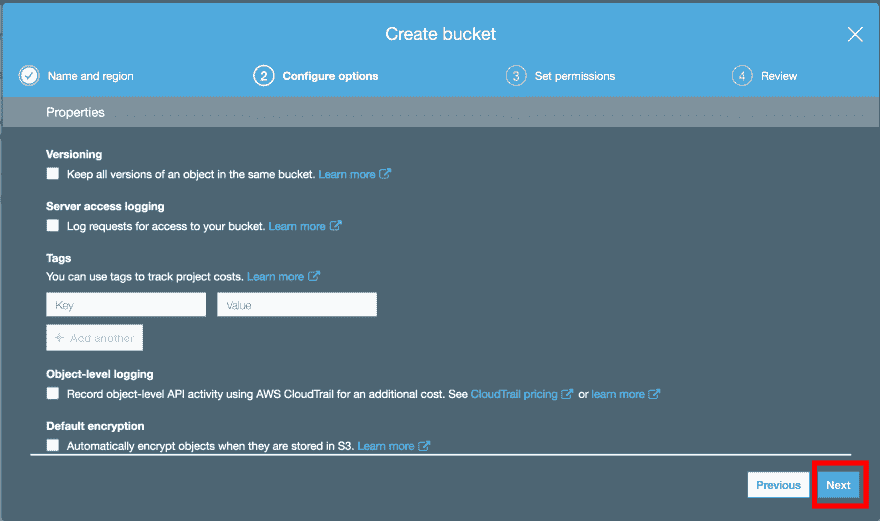](https://res.cloudinary.com/practicaldev/image/fetch/s--avuESP1M--/c_limit%2Cf_auto%2Cfl_progressive%2Cq_auto%2Cw_880/https://s3.amazonaws.com/exampro/workshops/simg/static-website-hosting/bucket-policy/5.png)

* * *

*   取消选中“管理公共存储桶策略”下的两个选项

*   保持选中 ACL(访问控制列表)选项

[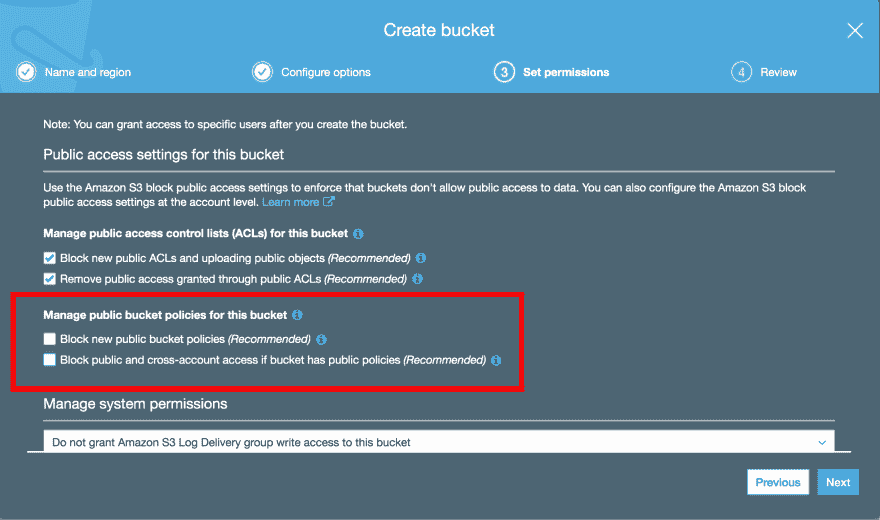](https://res.cloudinary.com/practicaldev/image/fetch/s--63wvuTR7--/c_limit%2Cf_auto%2Cfl_progressive%2Cq_auto%2Cw_880/https://s3.amazonaws.com/exampro/workshops/simg/static-website-hosting/bucket-policy/6.png)

* * *

*   您的评论页面现在看起来像这样。点击“创建存储桶”

[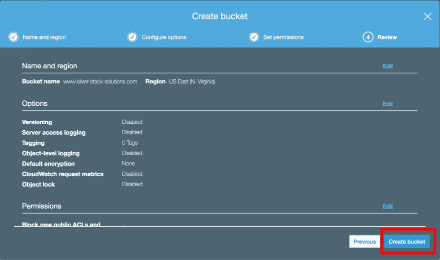](https://res.cloudinary.com/practicaldev/image/fetch/s--rxYK7fhi--/c_limit%2Cf_auto%2Cfl_progressive%2Cq_auto%2Cw_880/https://s3.amazonaws.com/exampro/workshops/simg/static-website-hosting/bucket-policy/7.png)

* * *

*   现在，您的域名/存储桶名称将列在您的 S3 存储桶列表下。

[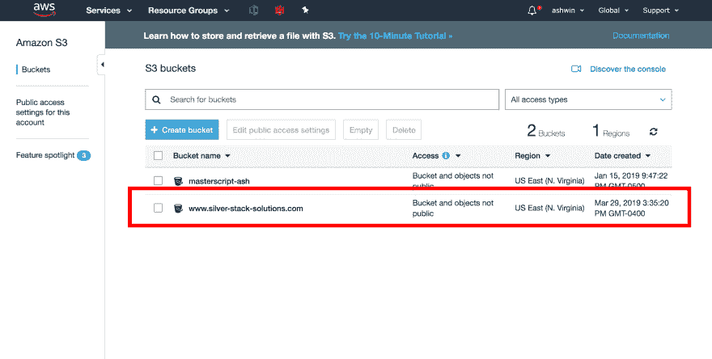](https://res.cloudinary.com/practicaldev/image/fetch/s--jwCudJ8B--/c_limit%2Cf_auto%2Cfl_progressive%2Cq_auto%2Cw_880/https://s3.amazonaws.com/exampro/workshops/simg/static-website-hosting/bucket-policy/8.png)

* * *

### 启用静态虚拟主机

我们在 S3 控制台中列出了我们的存储桶。请注意，它没有设置为 public。我们必须改变 bucket 权限和属性来实现这一点。

* * *

*   单击新创建的存储桶名称，它现在应该列在 S3 存储桶下，然后选择属性选项卡

[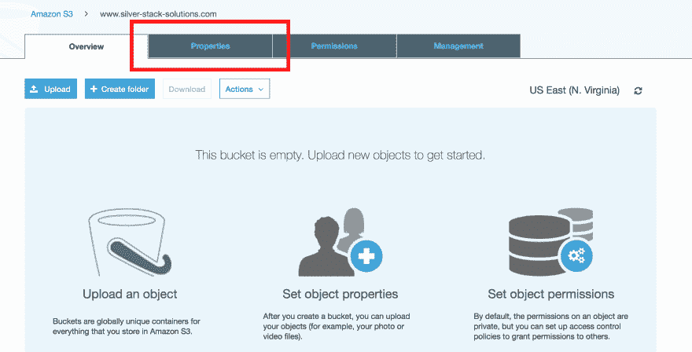](https://res.cloudinary.com/practicaldev/image/fetch/s--QFkIFGO0--/c_limit%2Cf_auto%2Cfl_progressive%2Cq_auto%2Cw_880/https://s3.amazonaws.com/exampro/workshops/simg/static-website-hosting/create-s3-bucket/1.png)

* * *

*   单击“静态网站托管”选项，该选项目前处于禁用状态，我们需要启用它

[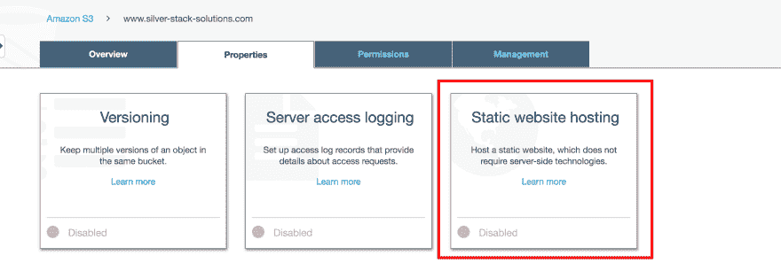](https://res.cloudinary.com/practicaldev/image/fetch/s--fbLbzcg_--/c_limit%2Cf_auto%2Cfl_progressive%2Cq_auto%2Cw_880/https://s3.amazonaws.com/exampro/workshops/simg/static-website-hosting/create-s3-bucket/1.5.png)

* * *

*   选择“静态网站托管”后，应打开一个模式。
    *   选中“使用此存储桶托管网站”选项。
    *   然后用“index.html”和“error.html”填写索引和错误输入
    *   保存更改

[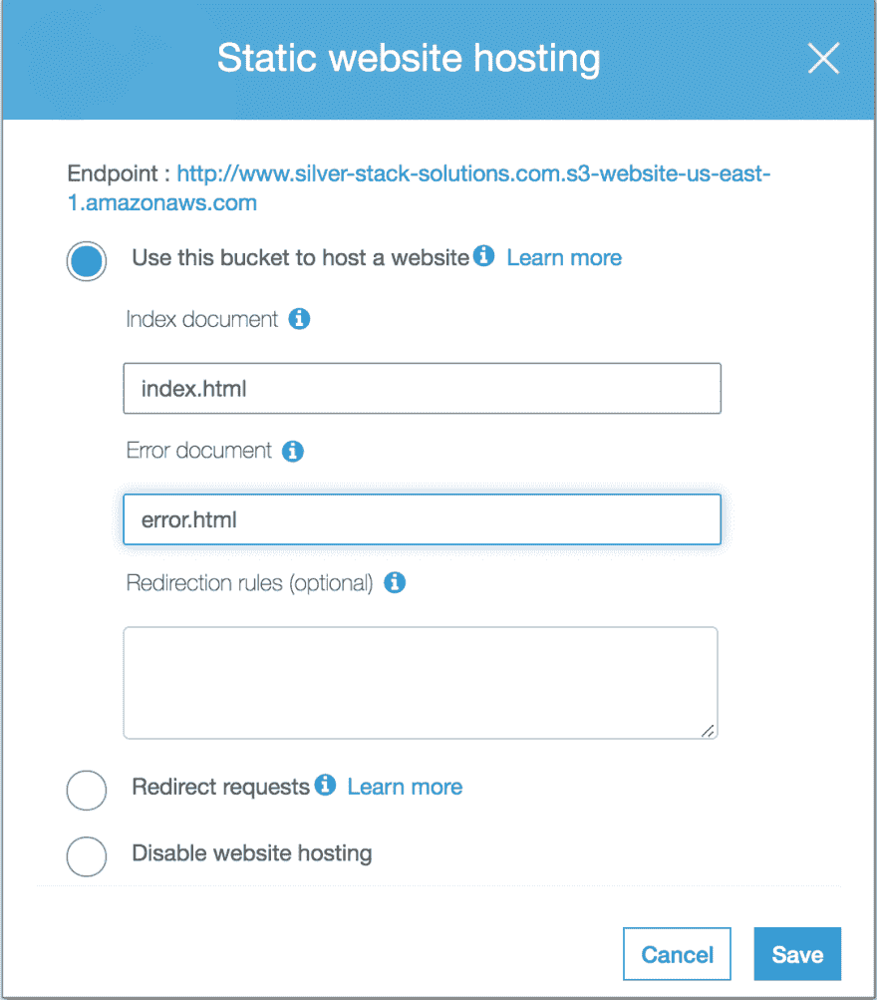](https://res.cloudinary.com/practicaldev/image/fetch/s--0qvnpQU7--/c_limit%2Cf_auto%2Cfl_progressive%2Cq_auto%2Cw_880/https://s3.amazonaws.com/exampro/workshops/simg/static-website-hosting/create-s3-bucket/3.png)

* * *

*   在您的概述属性标签，它现在应该显示“静态网站托管”为启用状态
    *   我们已经正式建立了我们的静态虚拟主机桶
    *   接下来，我们需要设置“权限”来允许对我们的文件进行读取访问

[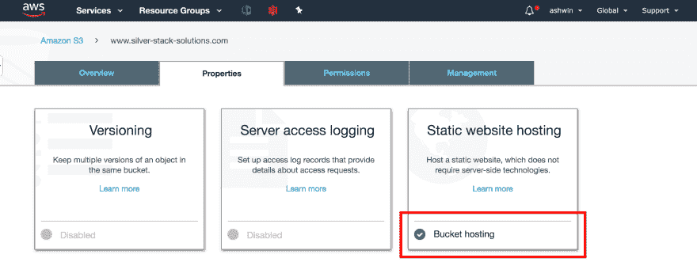](https://res.cloudinary.com/practicaldev/image/fetch/s--ji3Y9Bg3--/c_limit%2Cf_auto%2Cfl_progressive%2Cq_auto%2Cw_880/https://s3.amazonaws.com/exampro/workshops/simg/static-website-hosting/create-s3-bucket/4.png)

* * *

### 斗策

*   选择“属性”旁边的“权限”选项卡。
*   然后在“权限”中，选择“存储桶策略”选项卡。

[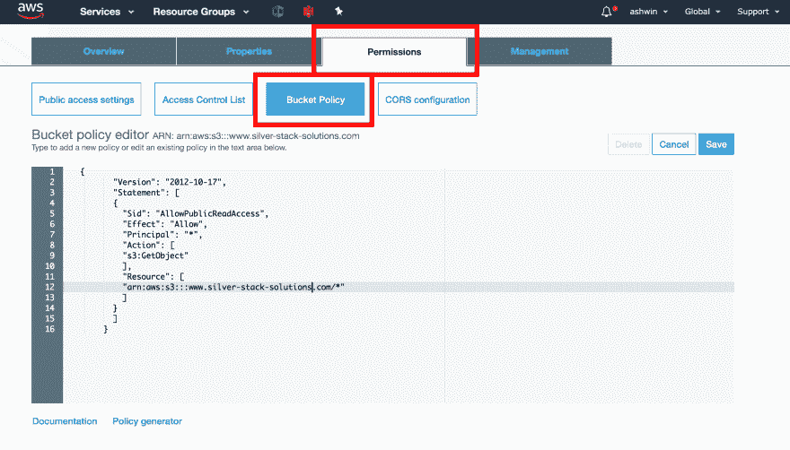](https://res.cloudinary.com/practicaldev/image/fetch/s--CF51FTt9--/c_limit%2Cf_auto%2Cfl_progressive%2Cq_auto%2Cw_880/https://s3.amazonaws.com/exampro/workshops/simg/static-website-hosting/set-static-web-hosting/1.png)

* * *

*   在存储桶策略编辑器中，粘贴以下代码行

    ```
    {
      "Version": "2012-10-17",
      "Statement": [
      {
        "Sid": "AllowPublicReadAccess",
        "Effect": "Allow",
        "Principal": "*",
        "Action": [
        "s3:GetObject"
        ],
        "Resource": [
        "arn:aws:s3:::www.silver-stack-solutions.com/*"
        ]
      }
      ]
    } 
    ```

*   用您自己的存储桶名称替换“www.silver-stack-solutions.com ”,然后“保存”

* * *

[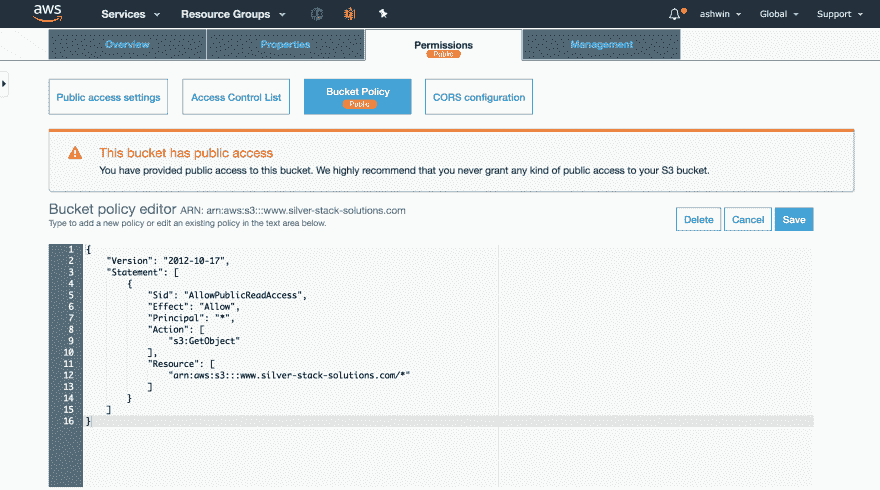](https://res.cloudinary.com/practicaldev/image/fetch/s--UOZzGObE--/c_limit%2Cf_auto%2Cfl_progressive%2Cq_auto%2Cw_880/https://s3.amazonaws.com/exampro/workshops/simg/static-website-hosting/set-static-web-hosting/2.png)

* * *

*   您收到一条警告消息是正常的:“您已经授予了对您的存储桶的公共访问权限”。这允许读取我们的 index.html 文件

*   导航回 S3 控制台。您的 AWS S3 控制台现在应该将您的存储桶列为“公共”

[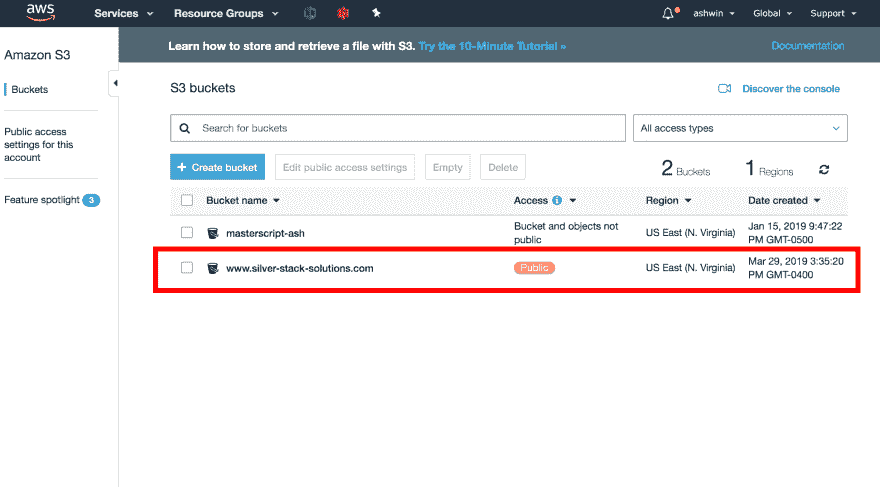](https://res.cloudinary.com/practicaldev/image/fetch/s--EAir2Iah--/c_limit%2Cf_auto%2Cfl_progressive%2Cq_auto%2Cw_880/https://s3.amazonaws.com/exampro/workshops/simg/static-website-hosting/set-static-web-hosting/3.png)

* * *

### 上传内容

* * *

*   点击回到你的 S3 桶，并选择“上传选项”

[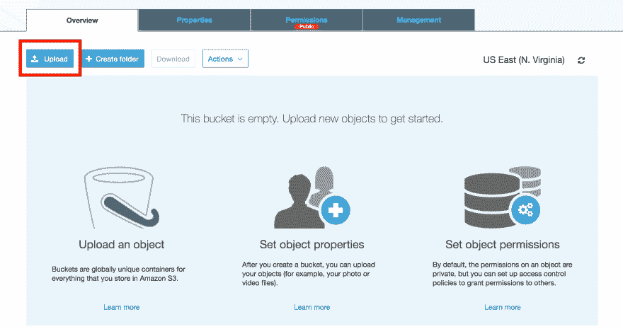](https://res.cloudinary.com/practicaldev/image/fetch/s--Eij1-lRe--/c_limit%2Cf_auto%2Cfl_progressive%2Cq_auto%2Cw_880/https://s3.amazonaws.com/exampro/workshops/simg/static-website-hosting/upload-content/1.png)

* * *

*   拖放您的项目文件并上传它们

[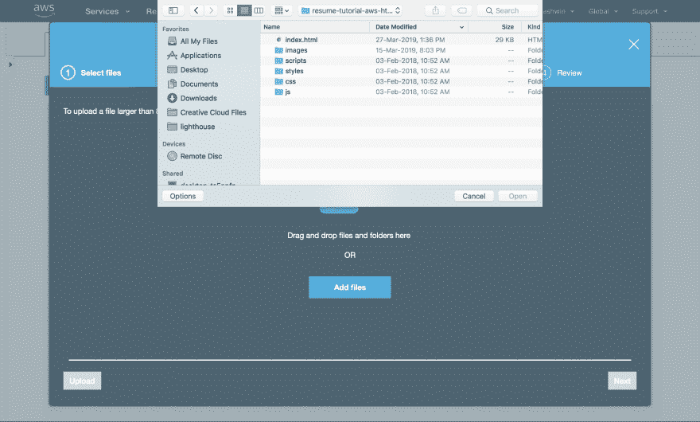](https://res.cloudinary.com/practicaldev/image/fetch/s--EOAlYXQp--/c_limit%2Cf_auto%2Cfl_progressive%2Cq_auto%2Cw_880/https://s3.amazonaws.com/exampro/workshops/simg/static-website-hosting/upload-content/2.png)

* * *

*   一旦完成，您的项目文件应该在您的桶中

* * *

### 查看网站

我们已经完成了设置我们的 bucket 并赋予它权限。我们现在可以从网络浏览器访问我们的内容。

* * *

*   导航到您的 S3 桶
    *   点击进入你的 index.html 文件

[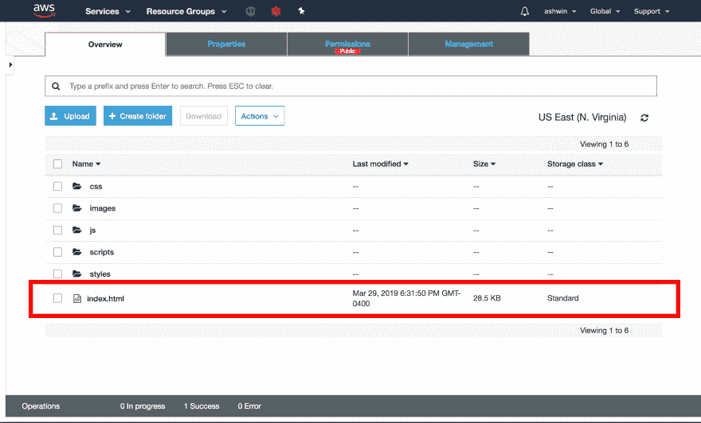](https://res.cloudinary.com/practicaldev/image/fetch/s--BpbZ5P8---/c_limit%2Cf_auto%2Cfl_progressive%2Cq_auto%2Cw_880/https://s3.amazonaws.com/exampro/workshops/simg/static-website-hosting/view-website/1.png)

* * *

*   注意这个 URL，它是你的静态网站的端点。继续点击它。

[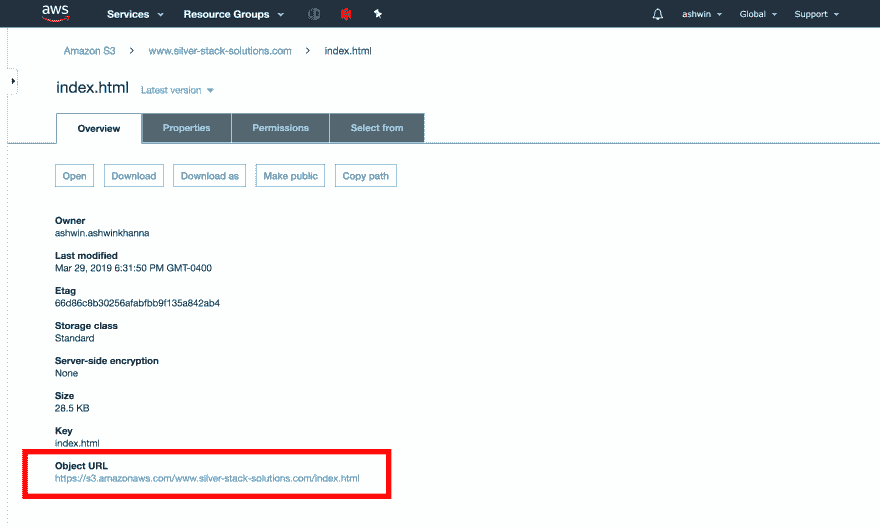](https://res.cloudinary.com/practicaldev/image/fetch/s--AB7zSYQC--/c_limit%2Cf_auto%2Cfl_progressive%2Cq_auto%2Cw_880/https://s3.amazonaws.com/exampro/workshops/simg/static-website-hosting/view-website/2.png)

* * *

*   对象 URL 附属于您的 bucket 名称，但是作为 AWS 资源 URL 生成。我们可以通过导入预先购买的域名或直接从 aws route53 购买域名来改变这一点(此处未涉及)。

*   如果一切顺利，您应该能够查看您新创建的网站。如果您遇到任何问题，您将被定向到 error.html 文件。

[](https://res.cloudinary.com/practicaldev/image/fetch/s--7Vudd2cq--/c_limit%2Cf_auto%2Cfl_progressive%2Cq_auto%2Cw_880/https://s3.amazonaws.com/exampro/workshops/simg/static-website-hosting/view-website/3.png)

* * *

### 结论

* * *

我希望这篇教程对读者有所帮助。这是我给 dev.to 的第一篇教程帖子，所以如果你跟了进来，让我知道我做得怎么样。

* * *

如果你喜欢这篇文章，看看我们的 UX 工程师 Karan 的另一篇 ExamPro 文章。这也是他的第一篇帖子所以分享一些鼓励:

[](/karanbalaji) [## AWS 在 Adobe XD 上快速构建架构图

### 卡兰·巴拉吉·🇨🇦5 月 20 日 192 分钟阅读

#aws #tutorial #productivity #webdev](/exampro/aws-free-ui-kit-on-adobe-xd-496h)

* * *

第 2 部分是关于建立你自己的域名

[](/ashtoronto) [## 面向初学者的 AWS 静态网站托管第 2 部分:设置域名

### ashwin🇨🇦9 月 16 日 197 分钟阅读

#beginners #aws #career #webdev](/exampro/aws-static-website-hosting-for-beginners-part-2-setting-up-a-domain-4jif)