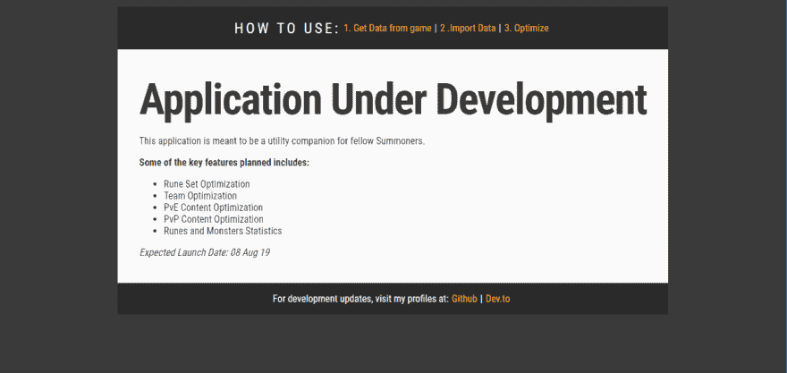

# 一个有抱负的 Web 开发人员的第一天

> 原文：<https://dev.to/tangweejieleslie/day-one-of-an-aspiring-web-developer-36j3>

在决定走这条路之后，我采取的第一步是选择一个想法。我最终决定[创建一个游戏实用程序](https://dev.to/tangweejieleslie/a-beginner-s-plan-in-launching-the-first-web-application-im7)。

做出这个决定和发布这个决定的过程占用了我一天的大部分时间。我从早上 8 点左右就开始考虑了。当我发布我的决定时，已经是下午 4 点了！尽管我必须承认，在研究我的一些想法时，我最终偏离了方向。

在发布我的计划后不久，我已经为这个项目建立了 [Github 存储库](https://github.com/tangweejieleslie/summoners-war-utility-app),并为这个应用程序创建了一个快速登陆页面，旁边是我第一次迭代的主要特性——添加数据——的一个准系统页面。

## 选择一个 Web 堆栈

虽然只有两个网页，但我过去读过的关于“不要重复自己(干)原则”的信息很快跃入脑海。仅仅通过 HTML 和 CSS 制作 web 应用程序的过程是不够的。这促使我寻找一种更合适方法，使我的开发过程更加有效和高效。搜索很快将我引向了选择 web 堆栈的方向。

说到网络堆栈，我是一个新手，我最接近的是跟随一些 YouTube 教程在过去，不一致。经过快速的研究，我最终选择了 MEVN 栈、MongoDB、Express、Vue 和 Node。

#### MongoDB

我选择这个作为数据库是因为“文档”的概念。我对 NoSQL 数据库知之甚少，但是直接存储 JSON 格式数据的想法听起来会缩短开发时间。

#### 视图

我过去做过一些关于 Angular，React 和 Vue 的教程。我回忆说，Angular 给我带来的麻烦最多，Vue 给我带来的麻烦最少。这就是我选择 Vue 作为前端框架的原因。选择阻力最小的道路是有意义的，尤其是因为我真的看不出三者之间有什么区别。

至于 Express 和 Node，我所知道的是，Express 是为 HTTP 请求服务的，Node 是为后端和管理版本服务的。我听说过它们，对它们有所了解，但从未真正尝试过。我希望花一些时间来了解这两个问题。

## 今天的一些视觉进展

我今天写的唯一代码只是一个静态的 index.html 页面。虽然这个页面没有什么特别的，但是我很自豪突然有了使用导航条来引导用户体验的灵感。虽然这不太可能是什么原创，但我很高兴自己得出了这个结论😁

 
*第一天结束时登陆页面*

我还在这里留了一个到我的 Github 库的链接，以防有人感兴趣。

# 待改进

我可能明天会学习更多关于 VueJS 的知识，并转换我现有的页面。

干杯！