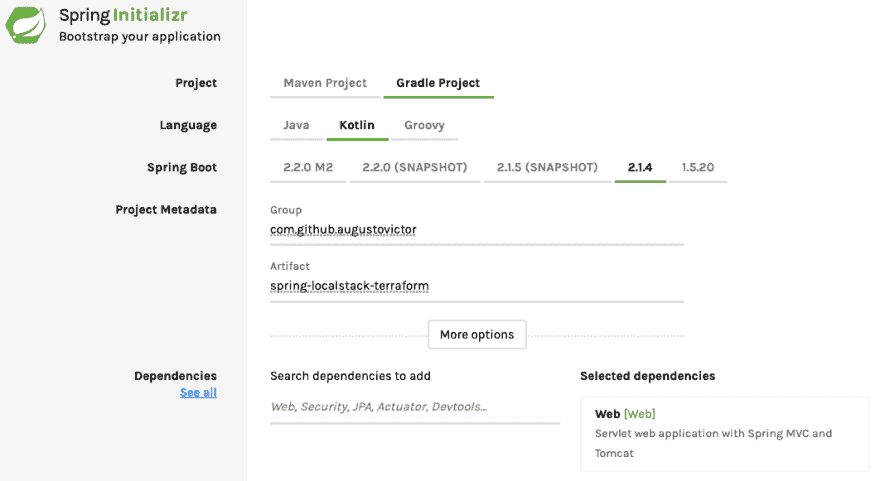

# 如何设置弹簧引导项目

> 原文：<https://dev.to/victorcosta/how-to-setup-a-spring-boot-project-341>

# 设置

要下载 SpringBoot，请转到 [start.spring.io](https://start.spring.io) ，并确保您的配置如下(记得替换`Group`描述，并添加`Web`依赖项):

[](https://res.cloudinary.com/practicaldev/image/fetch/s--UdL_SDkS--/c_limit%2Cf_auto%2Cfl_progressive%2Cq_auto%2Cw_880/https://thepracticaldev.s3.amazonaws.com/i/n1k7xudoam5joiafzpnn.png)

* * *

### 与 [Intellij](https://www.jetbrains.com/idea/download)

*   文件>新建>来自现有源的项目
*   选择`Gradle`选项(因为我们已经选择它作为我们的构建和依赖项管理器)
*   选择`Use auto-import`选项，以便自动下载依赖关系
*   `Select the downloaded spring-boot folder`
*   等待所有依赖项下载完毕(这可能需要几分钟)

### 用命令行

*   安装 [Gradle](https://gradle.org/install/) (如果您选择 maven 作为您的构建和依赖管理器，请安装它
*   将下载的文件夹复制到 Intellij 目录
*   进入文件夹并运行`gradle build`(该命令也运行应用程序测试)

## 用 Intellij 运行项目

IDE 的右上角有一个绿色的`play`按钮。只需点击它，并观察 IDE 终端的类似输出:

```
2019-05-19 09:36:07.615  INFO 70436 --- [           main] o.s.s.concurrent.ThreadPoolTaskExecutor  : Initializing ExecutorService 'applicationTaskExecutor'
2019-05-19 09:36:07.751  INFO 70436 --- [           main] o.s.b.w.embedded.tomcat.TomcatWebServer  : Tomcat started on port(s): 8080 (http) with context path ''
2019-05-19 09:36:07.754  INFO 70436 --- [           main] com.example.demo.DemoApplicationKt       : Started DemoApplicationKt in 1.826 seconds (JVM running for 2.28)
2019-05-19 09:36:12.131  INFO 70436 --- [       Thread-4] o.s.s.concurrent.ThreadPoolTaskExecutor  : Shutting down ExecutorService 'applicationTaskExecutor' 
```

## 使用命令行运行项目

*   在项目的文件夹中运行`gradle bootRun`并得到如上所示的输出。

* * *

如果你在下面的推荐中有任何问题，请告诉我，或者如果一切都如你所愿，请留下你的反馈。