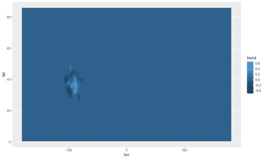
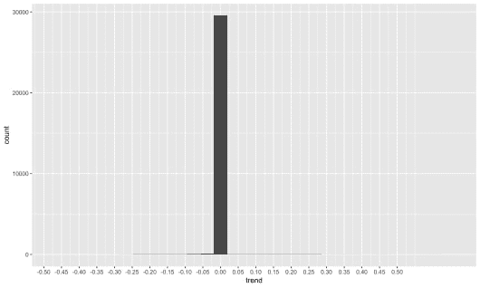
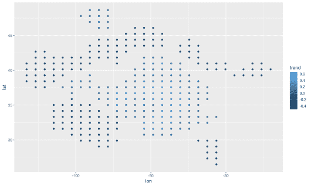
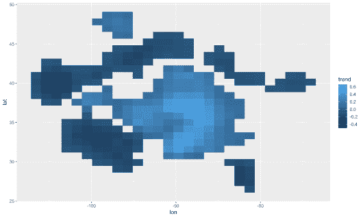
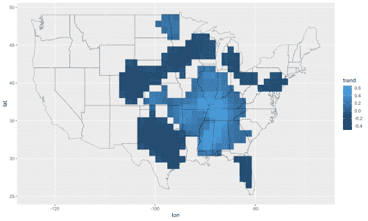
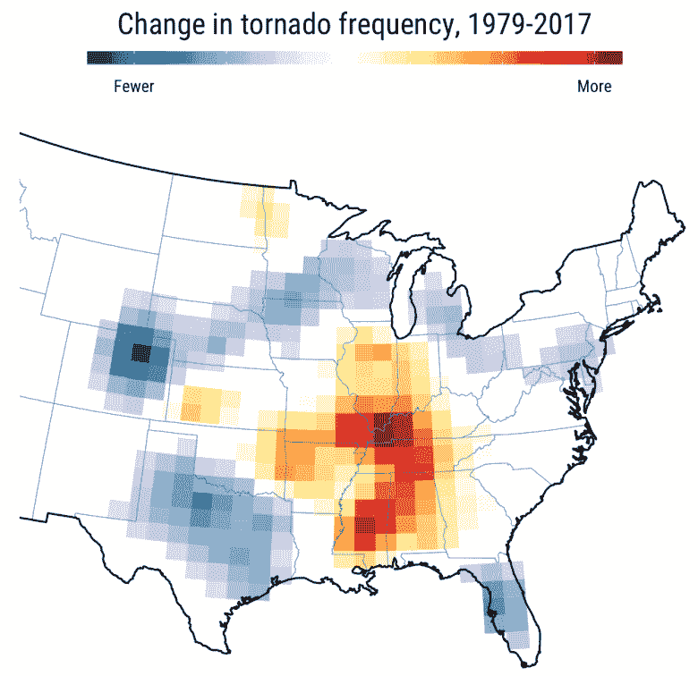

# 用 R 绘制龙卷风走廊

> 原文：<https://dev.to/hrbrmstr/mapping-tornado-alley-with-r-156b>

我捕捉到了这条推文的转发，转发者是 [@harry_stevens](http://twitter.com/harry_stevens) :

> 线程:我在 [@observablehq](http://twitter.com/observablehq) 上写了一篇关于我今天做的一张地图的帖子。它展示了一个图形记者典型的一天:你永远不知道在最后期限内你将不得不解决什么问题！【https://t.co/yRhW1wbLxN[# d3js](https://twitter.com/hashtag/d3js?src=hash&ref_src=twsrc%5Etfw)[# dataviz](https://twitter.com/hashtag/dataviz?src=hash&ref_src=twsrc%5Etfw)1/7[pic.twitter.com/7N6mmK0nz3](https://t.co/7N6mmK0nz3)
> 
> —哈里·史蒂文斯([@哈里 _ 史蒂文斯](http://twitter.com/Harry_Stevens))[2019 年 5 月 16 日](https://twitter.com/Harry_Stevens/status/1129160171161300995?ref_src=twsrc%5Etfw)

Harry 的主题和 Observable post 本身就很棒，它们都展示了 Observable javascript 笔记本的强大功能和实用性。

然而，这条转发(我不贴了，因为它太傻了)对 Python 和 R 都进行了抨击。现在，我完全支持对 Python 进行猛烈抨击(主要是为了确保我们永远不会忘记语言导致的所有破碎的空格键和 tab 键)，但当涉及到完成事情时，我会很高兴地捍卫它和 R，即使是在截止日期之前。

让我们回顾一下，如果我们中的一个人处于和哈利相同的情况下，我们可能会做些什么。

### 绘制上一个截止日期

因此，我们必须在截止日期前绘制一张历史龙卷风频率趋势图。

我们给研究人员发了邮件，[收到了三份`txt`文件](https://rud.is/dl/tornado.zip)。一个是一组纬度，一个是经度，最后一个是趋势值。这是网格数据。

下载该 ZIP 文件，并假设您在电子邮件中获得了三个文件，创建一个名为“tornado”的新 RStudio 项目，并将这三个文件放在本地到项目根目录`data/`的目录中。让我们读进去看看:

```
library(hrbrthemes) # not 100% necessary but i like my ggplot2 theme(s) :-)
library(tidyverse) # data wrangling & ggplot2

tibble(
  lat = scan(here::here("data/lats.txt")),
  lon = scan(here::here("data/lons.txt")),
  trend = scan(here::here("data/trends.txt"))
) -> tornado 
```

Enter fullscreen mode Exit fullscreen mode

您很可能从来没有直接使用过`base::scan()`函数，但是它在这里很方便，因为我们只有 doubles 类型的文件，每个值由空格分隔。现在，让我们看看我们有什么:

```
tornado  summary(tornado)  ggplot(tornado,  aes(lon,  lat))  +  geom_point(aes(color  =  trend)) 
```

Enter fullscreen mode Exit fullscreen mode

[](https://i1.wp.com/rud.is/b/wp-content/uploads/2019/05/grid-overview-1.png?ssl=1)T3】

```
ggplot(tornado, aes(trend)) +
  geom_histogram() +
  scale_x_continuous(breaks = seq(-0.5, 0.5, 0.05)) 
```

Enter fullscreen mode Exit fullscreen mode

[](https://i0.wp.com/rud.is/b/wp-content/uploads/2019/05/trend-overview-1.png?ssl=1)

由于我们只在[美国](https://www.nature.com/articles/s41612-018-0048-2.epdf?author_access_token=PQZthaEqlkut62uLi4HlpNRgN0jAjWel9jnR3ZoTv0Ofpugx93Jq3uh7IKWsjvSCCm9cT6oavbBDxy4CNfmgPbnVGCtRW0GfAXKcI3DSQ1vbeVbyw-jzqriwQAlEDMNsLcaDsYkvTU-SaxpOcafW-Q%3D%3D)寻找趋势(任一方向),纬度和经度范围将需要缩小一点(它确实看起来像全球网格数据),并且我们将能够进一步缩小数据集，因为我们只想查看大趋势或小趋势。

对于这个项目(即新的`{sf}`生态系统)，我们真的不需要现代的 R/ggplot2 映射习惯用法，所以我们将保持它的“简单”(因为这是一个加载的术语，所以用引号引起来)，只使用内置的地图和`geom_map()`。首先，让我们得到美国的州，并提取它们的边界框/限制:

```
maps::map("state", ".", exact = FALSE, plot = FALSE, fill = TRUE) %>% 
  fortify(map_obj) %>% 
  as_tibble() -> state_map

xlim <- range(state_map$long)
ylim <- range(state_map$lat) 
```

Enter fullscreen mode Exit fullscreen mode

注意:我倾向于不使用方便的`ggplot::map_data()`函数，因为它最终会破坏我经常使用的`purrr::map()`(虽然不是在这篇文章中)。这些天我也试着使用`{sf}`,所以这不再是一个问题。

现在，让我们把注意力集中在原始论文和 Axios 文章中的目标区域:

```
filter(
  tornado,
  between(lon, -107, xlim[2]), between(lat, ylim[1], ylim[2]), # -107 gets us ~left-edge of TX
  ((trend < -0.07) | (trend > 0.07)) # approximates notebook selection range
) -> tornado

ggplot(tornado, aes(lon, lat)) +
  geom_point(aes(color = trend)) 
```

Enter fullscreen mode Exit fullscreen mode

[](https://i1.wp.com/rud.is/b/wp-content/uploads/2019/05/grid-overview-2-1.png?ssl=1)

现在我们正接近我们的最终解决方案。

正如《可观察笔记》中所陈述的和“网格”这个词所暗示的，这些点是网格矩形的质心。这意味着我们真正想要的是盒子，而不是点数。这篇文章很有趣，但实际上并没有必要，因为我们可以使用`ggplot2::geom_tile()`来获得所说的框:

```
ggplot(tornado, aes(lon, lat)) +
  geom_tile(aes(fill = trend, color = trend)) 
```

Enter fullscreen mode Exit fullscreen mode

[](https://i2.wp.com/rud.is/b/wp-content/uploads/2019/05/grid-overview-3-1.png?ssl=1)

现在，我们只需要添加地图层，并调整一些美学，使它看起来像一个地图。我们就天真地开始:

```
ggplot() +
  geom_tile(
    data = tornado,
    aes(lon, lat, fill = trend, color = trend)
  ) +
  geom_map(
    data = state_map, map = state_map,
    aes(long, lat, map_id = region),
    color = "black", size = 0.125, fill = NA
  ) 
```

Enter fullscreen mode Exit fullscreen mode

[](https://i2.wp.com/rud.is/b/wp-content/uploads/2019/05/map-1-1.png?ssl=1)

我们的网格数据肯定覆盖了正确/相同的区域，所以我们只需要让它更适合一篇文章。我们将使用哈利的调色板和美国各州的边界层，一个整体的国家边界，并近似标题和传说美学:

```
c(
  "#023858", "#045a8d", "#0570b0", "#3690c0", "#74a9cf",
  "#a6bddb", "#d0d1e6", "#ece7f2", "#fff7fb", "#ffffff",
  "#ffffcc", "#ffeda0", "#fed976", "#feb24c", "#fd8d3c",
  "#fc4e2a", "#e31a1c", "#bd0026", "#800026"
) -> grad_cols # colors from article

ggplot() +

  # tile layer

  geom_tile(
    data = tornado,
    aes(lon, lat, fill = trend, color = trend)
  ) +

  # state borders

  geom_map(
    data = state_map, map = state_map,
    aes(long, lat, map_id = region),
    color = ft_cols$slate, size = 0.125, fill = NA
  ) +

  # usa border

  borders("usa", colour = "black", size = 0.5) +

  # color scales

  scale_colour_gradientn(
    colours = grad_cols,
    labels = c("Fewer", rep("", 4), "More"),
    name = "Change in tornado frequency, 1979-2017"
  ) +
  scale_fill_gradientn(
    colours = grad_cols,
    labels = c("Fewer", rep("", 4), "More"),
    name = "Change in tornado frequency, 1979-2017"
  ) +

  # make it Albers-ish and ensure we can fit the borders in 

  coord_map(
    projection = "polyconic",
    xlim = scales::expand_range(range(tornado$lon), add = 2),
    ylim = scales::expand_range(range(tornado$lat), add = 2)
  ) +

  # tweak legend aesthetics

  guides(
    colour = guide_colourbar(
      title.position = "top", title.hjust = 0.5
    ),
    fill = guide_colourbar(
      title.position = "top", title.hjust = 0.5
    )
  ) +
  labs(
    x = NULL, y = NULL
  ) +
  theme_ipsum_rc(grid="") +
  theme(axis.text = element_blank()) +
  theme(legend.position = "top") +
  theme(legend.title = element_text(size = 16, hjust = 0.5)) +
  theme(legend.key.width = unit(4, "lines")) +
  theme(legend.key.height = unit(0.5, "lines")) 
```

Enter fullscreen mode Exit fullscreen mode

[](https://i2.wp.com/rud.is/b/wp-content/uploads/2019/05/map-final-header.png?ssl=1)

### 鳍

我为刚接触 R 的人做了一些额外的步骤，但总的方法至少和可观察的方法一样方便，而且——尽管相当愚蠢的转发者声称——这和可观察的笔记本一样“可共享”或“可重复使用”。您可以克隆回购协议([https://git.sr.ht/~hrbrmstr/tornado](https://git.sr.ht/~hrbrmstr/tornado))并立即重用这项工作。

如果你尝试另一种方法——特别是如果你确实使用了`{sf}`——一定要写博客，并在这里或 Twitter 上放一个链接。