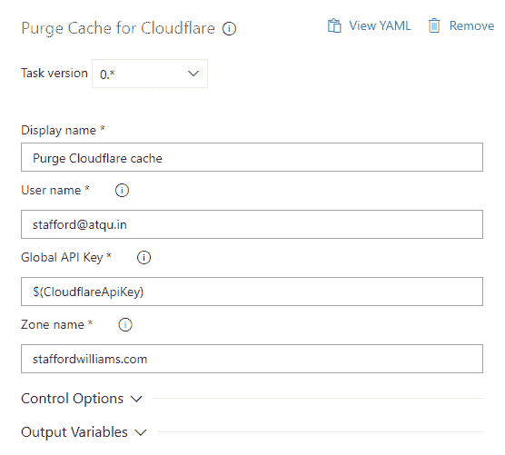

# 发布自定义 Azure 管道发布任务

> 原文：<https://dev.to/staff0rd/publishing-a-custom-azure-pipelines-release-task-2pd>

我想在 Azure 管道部署期间清除我的 Cloudflare 缓存。Cloudflare 提供了一个 REST API 来完成这项工作，但是我决定不使用脚本，而是编写一个自定义任务来完成这项工作，并将其发布到 Visual Studio 市场上。

## 获取分机

该扩展在 Visual Studio Marketplace 上是免费的，在 github 上是开源的。下面是它在 Azure DevOps 中的截图:

[](https://res.cloudinary.com/practicaldev/image/fetch/s--qmP-tmB---/c_limit%2Cf_auto%2Cfl_progressive%2Cq_auto%2Cw_880/http://staffordwilliams.com/assets/purge-for-cloudflare.png)

## 我是如何建造的

我在 docs.microsoft 上做了一个很棒的[演示。我喜欢这些说明促进了类型脚本和测试，尽管我不打算为这样一个小任务编写测试。](https://docs.microsoft.com/en-us/azure/devops/extend/develop/add-build-task?view=azure-devops)

另一位网友[已经指出](https://www.david-tec.com/2018/06/clear-the-cloudflare-cache-as-part-of-a-release-in-visual-studio-team-services-vsts/)我需要首先查询 Cloudflare REST API 来将一个区域名转换成一个区域 id，然后请求清除。我将这些指令转换成[类型脚本](https://github.com/staff0rd/tfx-cloudflare-purge/blob/master/cloudflarePurge/index.ts)，编译成 javascript，并使用`tfx-cli`将这个 javascript 捆绑成一个 vsix 扩展。

总的来说，代码非常简单。其结构如下:

*   / [vss-extension.json](https://github.com/staff0rd/tfx-cloudflare-purge/blob/master/vss-extension.json)
    *   扩展清单，定义了关于扩展做什么的基本信息。[参考文件](https://docs.microsoft.com/en-us/azure/devops/extend/develop/manifest?view=azure-devops)。
* img/扩展名-icon.png
    *   代表扩展名的图标
*   /cloudflarePurge/[index . ts](https://github.com/staff0rd/tfx-cloudflare-purge/blob/master/cloudflarePurge/index.ts)
    *   任务将执行的代码。自从 v2 之前我就没有写过 TypeScript，所以我怀疑用 async 或类似的语言来写错误处理会更好。
*   /cloudflarePurge/[task . JSON](https://github.com/staff0rd/tfx-cloudflare-purge/blob/master/cloudflarePurge/task.json)
    *   定义如何呈现任务的配置选项，以及在构建时将执行哪些脚本。[参考文件](https://github.com/Microsoft/azure-pipelines-task-lib/blob/master/tasks.schema.json)

如果我们只是使用 javascript 而没有依赖，那就是了。但是我们使用的是 typescript，所以我们也有；

*   /cloudflarepuge/index . js
    *   `tsc`输出(已生成)
*   /cloudflarePurge/[package . JSON](https://github.com/staff0rd/tfx-cloudflare-purge/blob/master/cloudflarePurge/package.json)
    *   节点依赖关系
*   /cloudflarepuge/[tsconfig . JSON](https://github.com/staff0rd/tfx-cloudflare-purge/blob/master/cloudflarePurge/tsconfig.json)
    *   类型脚本配置

一旦安装好了，我就用以下内容打包扩展:

```
npx tfx-cli extension create --rev-version --manifest-globs vss-extension.json 
```

## 出版

发布有点奇怪——要公开发布您的 Visual Studio Marketplace 帐户，需要获得微软某个人的发布批准。这是通过输入我是谁的一些细节并点击请求批准(或类似的)按钮来完成的。大约两天后，我收到了微软某个人发来的批准和“你现在被批准了”的邮件。

在被批准之前，市场将阻止任何设置了`public:true`的扩展的上传。批准后，上传者指出我需要在公共扩展中包含一个`overview.md`。但是，您可以将`vss-extension.json`中的内容/细节指向`README.md`来解决这个问题:

```
"content": {
    "details": {
        "path": "README.md"
    } 
}, 
```

## 就是这样！

总的来说，在 Azure Pipeline 版本中执行定制代码并将其打包成扩展非常简单。在这里，我想了解 Azure Pipeline yaml 构建如何调用这样一个任务，并在提交时自动将该任务的更新部署到市场——我的一个同事在这个上有[个帖子。](https://blog.raph.ws/2018/03/build-and-release-pipeline-for-your-own-custom-vsts-tasks/)