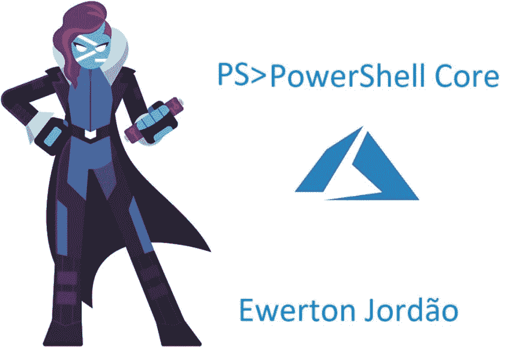
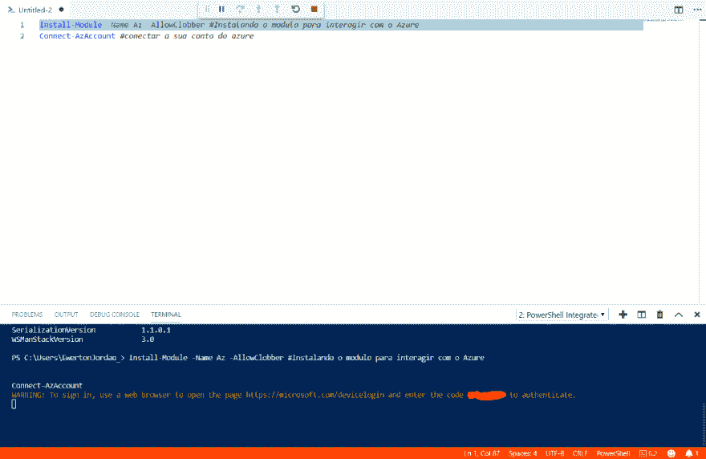
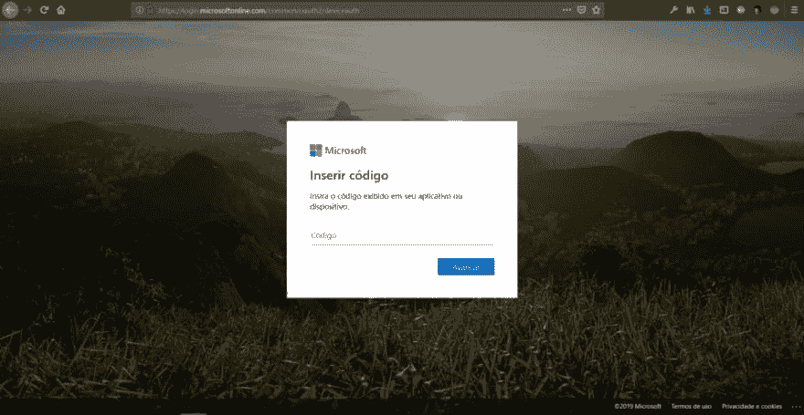
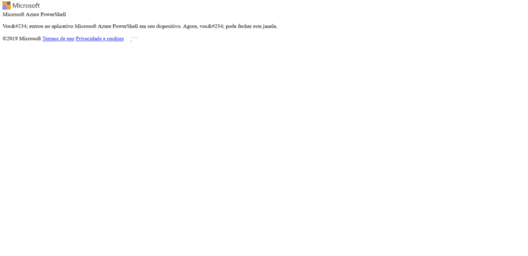

# PowerShell 核心| Azure | Blob 存储

> 原文：<https://dev.to/ewertonjordao/powershell-core-azure-blob-storage-470o>

### PowerShell Core | Azure | Blob 存储

#### 设置存储帐户

怎么样，伙计们？又一篇文章，再次表明 **PS 是生命**。我将演示在不进入蓝色门户网站的情况下调配存储解决方案是多么简单。

(enable-anaria)记下我们将在此演示中使用的内容:Visual Studio 代码、PowerShell 核心和蓝色帐户。

首先，我们要安装蓝色模块。

<figure> 

<figcaption>安装模块与蓝方进行交互并认证我们的客户。</figcaption>

</figure>

现在，我们将通过访问地址[https://Microsoft . com/device log in](https://microsoft.com/devicelogin)连接我们的 Azure 帐户。

<figure>

<figcaption></figcaption>

</figure>

验证后，我们收到以下消息:

<figure> 

<figcaption>注册我们的蓝色机器</figcaption>

</figure>

后

<figure> 

<figcaption>登记认证后返回</figcaption>

</figure>

市场是连接的，我们暂时还是没有蓝色的资源。

<figure>

<figcaption>Criando Grupo de recurso。</figcaption>

</figure>

<figure> 

<figcaption>蓝色可视化。</figcaption>

</figure>

现在，我们将设置存储帐户。

**tip≤ctrl+space 快捷键带来了具有预定义值列表(使用 PowerShell Core 终端)的参数中可用的选项。**

<figure>

<figcaption>【ctrl+空格】</figcaption>

</figure>

<figure> 

<figcaption>。</figcaption>

</figure>