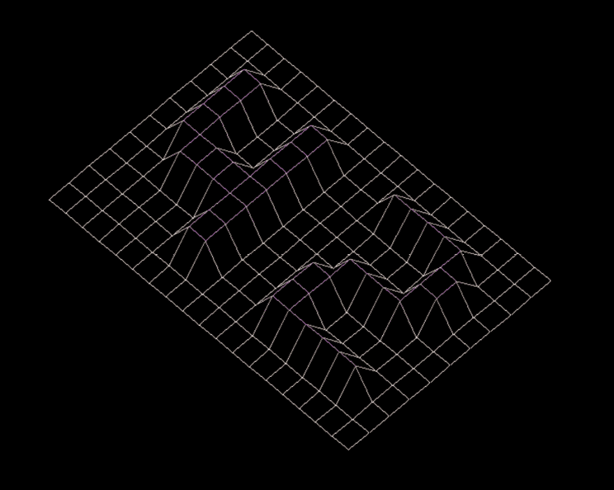
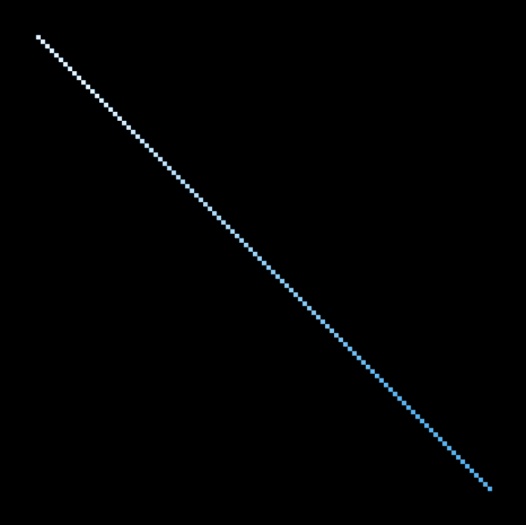
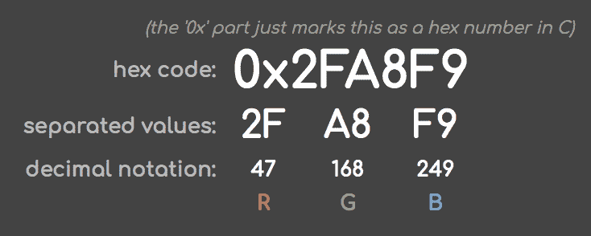
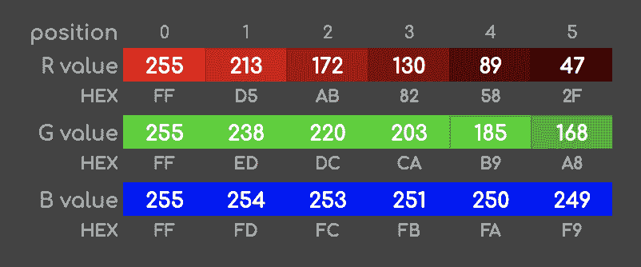
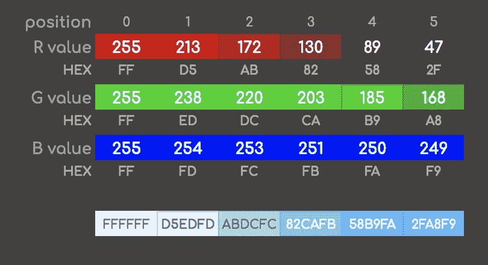

# 一种可能很糟糕的渲染渐变的方式

> 原文：<https://dev.to/freerangepixels/a-probably-terrible-way-to-render-gradients-1p3n>

我最近在硅谷 42 号的项目让我用 c 语言创建一个三维线框渲染引擎。其中一个必需的功能是根据渲染线的高度平滑地改变其颜色，就像这样:

[](https://res.cloudinary.com/practicaldev/image/fetch/s--djCfxuix--/c_limit%2Cf_auto%2Cfl_progressive%2Cq_auto%2Cw_880/https://thepracticaldev.s3.amazonaws.com/i/uxv6lzwg77mcdfu0tsyv.png)

因此，我需要建立一个 C 函数，可以增加颜色的平滑梯度。它需要与 Olivier Crouzet 的 miniLibX 一起工作，miniLibX 将 RGB 颜色解释为一个十六进制的 int(这可能是每个图形库都做的)?我没有研究这个)。

所以我们有这样一个 bois:

谁需要变成这个 boi:

## **0x2FA8F9**

它需要看起来很漂亮，就像这样:

[](https://res.cloudinary.com/practicaldev/image/fetch/s--o99QfaJ---/c_limit%2Cf_auto%2Cfl_progressive%2Cq_auto%2Cw_880/https://thepracticaldev.s3.amazonaws.com/i/w4e4cqxpueaq4zi5z4kv.png)

自从 2002 年以来，我就没有做过数学，所以我的工作迫在眉睫。

我惊讶地发现，这些**随机的行话数字**实际上一直都是 RGB 数值，每对两位数字代表红色、绿色或蓝色光的值。这意味着十六进制代码可以这样分解:

[](https://res.cloudinary.com/practicaldev/image/fetch/s--HM2ufc9c--/c_limit%2Cf_auto%2Cfl_progressive%2Cq_auto%2Cw_880/https://thepracticaldev.s3.amazonaws.com/i/i762eoe5xrloa9j4x0oj.png)

有了这个启示，很明显我需要以某种方式分离出十六进制数中的数字对，操纵它们，并重新组合它们。

哦，不，我意识到，*我必须用 16 进制做数学。上帝，请不要...*

*不，你不需要，*碧昂斯通过阳光从高空回答，*这实际上非常简单，因为存在位移法。*

* * *

# **移位历险记**

在**十进制记数法中，** 255 看起来是这样的:
`255`

而在**的十六进制表示法中，**看起来是这样的:
`FF`

但是在**双星中，**看起来是这样的:
`0000 0000 0000 0000 0000 0000 1111 1111`

使用**按位运算符的魔力，我们可以像这样移动这个值:
`FF << 8`**

 **这导致了:
`0000 0000 0000 0000 1111 1111 0000 0000`

在十六进制中是这样的:
`FF00`

这意味着我们可以反过来做同样的事情，这样我们可以分离出一个十六进制数的前两位:
`0x2FA8F9 >> 16 = 0x2F`
**我们有我们的 R 值！**

隔离 G 和 B 值需要使用一个带有按位*和*的*位掩码*，对此 [Neso Academy](https://www.youtube.com/watch?v=jlQmeyce65Q&t=266s) 可以比我解释得更好，但看起来是这样的:
`0x2FA8F9 & 0xFF = 0xF9`

简而言之，它是这样工作的:

**0x2FA8F9** 二进制是:
`0000 0000 0010 1111 1010 1000 1111 1001`
和 **0xFF** 二进制是:
`0000 0000 0000 0000 0000 0000 1111 1111`

按位*和*返回一个整数，其中包含两个数字共有的位:
`0000 0000 0000 0000 0000 0000 1111 1001`
，十六进制为 **0xF9** ！

我们可以结合使用这些技术来分离 G 值，因此我们剩下的是:

`R = color >> 16`
`G = color >> 8 & 0xFF`
T2】

既然我们已经将所有的颜色值隔离到单独的变量中，数学就可以开始了。

* * *

# **数学开始了**

要创建渐变，我们需要以均匀的增量增加每个颜色值，如下所示:

[](https://res.cloudinary.com/practicaldev/image/fetch/s--VgSXwAI8--/c_limit%2Cf_auto%2Cfl_progressive%2Cq_auto%2Cw_880/https://thepracticaldev.s3.amazonaws.com/i/n8x1nrye5ezpq1v1j8av.png)

增量值很好，也很容易计算:

`increment = (end_color - start_color) / steps`

这里只是像素。由于我的画线算法是**而不是**，像素数量只是 x 距离或 y 距离中较大的一个。我们需要这些值的绝对值(无符号)-- 16 的 x 变化将小于 5 的 y 变化，但是 16 是更大的距离。我做了一个宏，可以像这样找到绝对最大值:

`steps = ABS_MAX((x1-x0), (y1-y0))`

现在我们有了这些，我们可以将每个像素的颜色描述为三个值的函数:行中的`starting color`、`increment`和`position`。

`color = (position * increment) + start_color`

如果我们将`position`作为一个计数器存储在我们的循环中，我们也可以很容易地找到那个片段。

`int position = 0;
while(condition){
gradient_stuff(position);
position++;
}`

* * *

# **一个梯度诞生**

现在我们有了所有的部分，我们可以创建我们的渐变！

如果我们从示例颜色 **0xFFFFFF** 和 **0x2FA8F9** 移动 5 步，我们的增量将是:

[](https://res.cloudinary.com/practicaldev/image/fetch/s--M8mP4a2V--/c_limit%2Cf_auto%2Cfl_progressive%2Cq_auto%2Cw_880/https://thepracticaldev.s3.amazonaws.com/i/xet6qr2ynijffirlhk45.png)

下面是我们在每一步将颜色公式应用到单独的颜色通道时的样子。

[](https://res.cloudinary.com/practicaldev/image/fetch/s--xNg-mA3d--/c_limit%2Cf_auto%2Cfl_progressive%2Cq_auto%2Cw_880/https://thepracticaldev.s3.amazonaws.com/i/r8rdu54wr2y9j886z52v.png)

您会注意到所有这些值都被四舍五入为最接近的整数，因为 RGB 值不能处理小数。

一旦我们有了 R、G 和 B 的单个值，我们就可以反向进行位运算，将这些值相加得到最终的颜色。

`RGB = (R << 16) + (G << 8) + B`
`RGB = (0x2F << 16) + (0xA8 << 8) + (F9)`
`RGB = 0x2F0000 + 0x00A800 + 0x0000F9`

看起来是这样的:

[](https://res.cloudinary.com/practicaldev/image/fetch/s--jGZDpA-R--/c_limit%2Cf_auto%2Cfl_progressive%2Cq_auto%2Cw_880/https://thepracticaldev.s3.amazonaws.com/i/xn05x6z25lk7j4ga77lw.png)

所有这些以前都有人做过，而且可能更优雅、更有效。但是这个函数是我的函数而且都是我自己做的，所以我得到一个冰棍*。如果你出于某种原因想要看到更多，你可以在 [github](https://github.com/tasertasertaser/fdf) 上查看项目的其余部分(仍在进行中)。
这是完整的函数。

```
# define R(a) (a) >> 16
# define G(a) ((a) >> 8) & 0xFF
# define B(a) (a) & 0xFF
# define RGB(a, b, c) ((a) << 16) + ((b) << 8) + (c)

int gradient(int startcolor, int endcolor, int len, int pix)
{
    double increment[3];
    int new[3];
    int newcolor;

    increment[0] = (double)((R(endcolor)) - (R(startcolor))) / (double)len;
    increment[1] = (double)((G(endcolor)) - (G(startcolor))) / (double)len;
    increment[2] = (double)((B(endcolor)) - (B(startcolor))) / (double)len;

    new[0] = (R(startcolor)) + ft_round(pix * increment[0]);
    new[1] = (G(startcolor)) + ft_round(pix * increment[1]);
    new[2] = (B(startcolor)) + ft_round(pix * increment[2]);

    newcolor = RGB(new[0], new[1], new[2]);

    return (newcolor);
} 
```

他们不会真的给我们冰棍。**