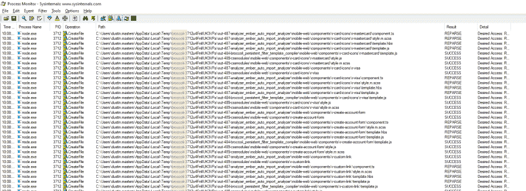
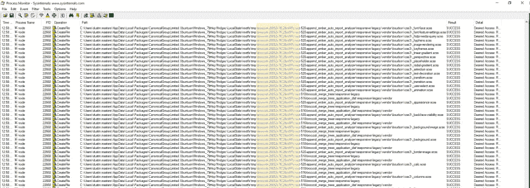
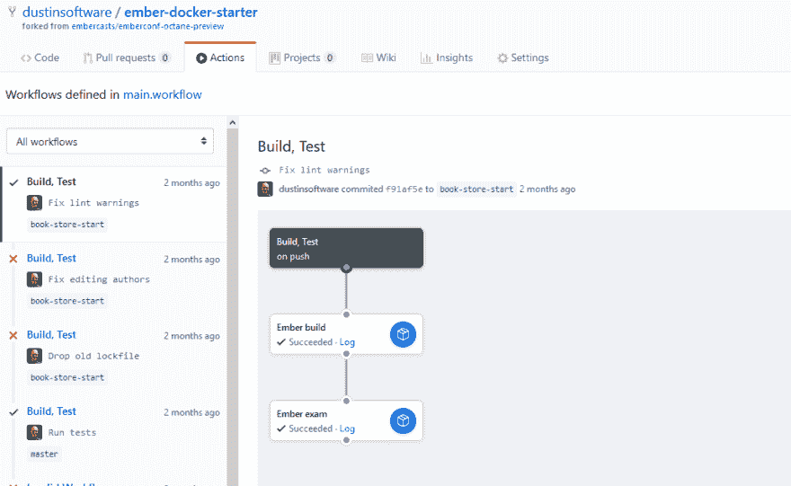

# 用 Docker 在 Windows 上构建更快的 Ember

> 原文：<https://dev.to/dustinsoftware/build-hacks-faster-ember-builds-with-docker-on-windows-7e1>

当我加入一个维护 Ember web 应用程序的团队时，我惊讶地得知几乎整个团队都只在 MacBooks 上开发。该团队在 Windows 上经历了缓慢的 Ember 构建，处理原生节点依赖性(如 node-gyp)是一次令人沮丧的经历。微软最近做了一些改进，以支持 Windows 上基于节点的开发环境，所以我着手看看我们能做些什么来使它变得更好。

> **注意** : [WSL2 已经发布](https://devblogs.microsoft.com/commandline/announcing-wsl-2/)，它解决了我们经历的许多性能问题。这篇文章对于那些想使用 Docker 作为开发容器的人来说应该还是有意义的。

## 快给我看代码！

GitHub 上的[提供了 Docker 设置的工作演示。在本文中，我们将链接到它。](https://github.com/dustinsoftware/ember-docker-starter)

# 为什么构建如此缓慢？

Ember 的构建管道创建了很多临时文件，我们通过使用[进程监视器](https://docs.microsoft.com/en-us/sysinternals/downloads/procmon)确认了这一点。我们怀疑 Windows NTFS 文件系统本身比其他平台有更多的开销，在磁盘上创建一堆临时文件然后读取它们是我们的主要瓶颈所在。

构建过程中创建的一些临时文件的例子:
[](https://res.cloudinary.com/practicaldev/image/fetch/s--EH_2FBmA--/c_limit%2Cf_auto%2Cfl_progressive%2Cq_auto%2Cw_880/https://thepracticaldev.s3.amazonaws.com/i/he5ndkvzlxbbgil50vqu.png)

我们加速构建的第一个方法是利用 Linux 的 Windows 子系统(WSL ),它在不使用 VM 的情况下模拟 Linux 环境。您可以在这里找到关于文件系统映射如何工作的更多细节[，但重要的是主机的本机文件系统仍然用于存储底层文件(NTFS)。](https://github.com/Microsoft/WSL/issues/873)

在 WSL:
[](https://res.cloudinary.com/practicaldev/image/fetch/s--mVSKfYOW--/c_limit%2Cf_auto%2Cfl_progressive%2Cq_auto%2Cw_880/https://thepracticaldev.s3.amazonaws.com/i/2trshwufoyxiub3umc0k.png) 下运行构建的本地文件系统活动的截图

我们证实了我们的预期，即构建会像在原生 Windows 环境中一样慢，所以我们转向了其他选项。我们的下一步是将构建工作区完全从 NTFS 中移除，这意味着使用某种类型的 VM。Docker for Windows 非常适合这一点。

## 我们需要什么

*   团队中所有 Windows 开发人员的简单设置。对主机的唯一要求应该是 Docker 和。网芯。
*   避免(在可能的情况下)对主机的本机依赖(如`build-essential`或`node-sass`绑定)
*   容器中正在运行的开发服务器(在本例中为`ember serve`),当文件改变时可以得到通知，它通过 HTTP 为构建的资产提供服务
*   非常快速的访问读写一堆临时文件

# 配置容器

我们决定在 Docker 中运行整个 Ember 构建管道，并使用容器的基于 Linux 的文件系统，其中一些脚本只同步来自主机工作站的应用程序源。让我们详细了解一下这是如何实现的。

使用的工具:

*   [码头-化合物. yml](https://github.com/dustinsoftware/ember-docker-starter/blob/bbff257c32a8bdfc4439e78bded57459f27344d0/docker-compose.yml)
*   [Dockerfile](https://github.com/dustinsoftware/ember-docker-starter/blob/bbff257c32a8bdfc4439e78bded57459f27344d0/Dockerfile)

Docker 通过一个共享的`/host-app`挂载来公开应用程序源代码。这总是与主机同步，但它不是存放临时文件的好地方，因为它是作为 SMB 装载点公开的。在容器启动时，源文件被从主机复制到容器的文件系统中的一个目录下，然后构建过程运行。重要的是`node_modules`恢复发生在容器内，而不是在共享挂载上，这样构建就可以快速访问它的依赖项。可以通过`--build-arg`使用 docker-cli 参数来控制构建过程中运行的步骤，例如进行初始单元测试运行。

## 通知容器更新

使用的工具:

*   [码头定货监测员](https://github.com/dustinsoftware/Docker-Volume-Watcher)
*   [主管](https://github.com/dustinsoftware/ember-docker-starter/blob/bbff257c32a8bdfc4439e78bded57459f27344d0/supervisord.conf)
*   【T0 语法】T1

当文件改变时,`/host-app`挂载不会发出通知，所以我们需要一种方法来同步对容器的`/app`目录的改变。我们可以使用轮询，但这很慢，而且会占用不必要的 CPU 时间，因此我们构建了一个工具来模拟来自容器主机的文件更改通知。`DockerVolumeWatcher`工具使用 Windows 文件系统 API 来监视通过主机挂载映射到容器的目录中所有更改的文件，忽略`.dockerignore`中列出的任何内容。

当一个文件被改变时，`chmod`在被改变的文件的容器内运行(通过`chmod $(stat -c %a {filepath}) {filepath}`),以向容器的运行进程引发文件改变事件。这种方法在这种情况下效果很好，因为它实际上并没有修改主机上的文件内容。使用像`touch`这样的工具会触发另一个文件修改事件，这是我们不希望在这里发生的。从这里开始，可以使用一个简单的镜像工具(如`lsync`)将更改后的源代码从`/host-app`复制到`app`。

## 让开发者体验更好

构建容器会产生许多工件，在构建新映像几天后，Docker 文件系统可能会耗尽空间。为了解决这个问题，我们制作了一个 Powershell 脚本，作为启动开发环境的一部分，它可以做几件事:

*   开始`DockerVolumeWatcher`
*   清理超过 24 小时的容器和图像
*   通过在主机上创建一个文件并通过`docker exec`检查其是否存在，检查文件系统观察器是否正常工作

你可以点击查看脚本[的源代码。](https://github.com/dustinsoftware/ember-docker-starter/blob/bbff257c32a8bdfc4439e78bded57459f27344d0/docker-start.ps1)

## 粗糙的边缘

这种设置工作良好，但需要一些工作流程的变化。对于一些 VS 代码插件，需要最新版本的 Node 来支持林挺。包更新还需要附加到容器，运行`yarn add <package>`，并使用`cp /app/package.json /host-app/package.json`复制已更改的清单(与锁文件相同)。在更新包之后重新构建容器也比本地包更新慢，因为容器是从一个新的状态开始的。要解决这个问题，您可以创建一个“增量”并运行两次包恢复:

```
COPY --chown=user:user ./package-base.json ./package.json
COPY --chown=user:user ./yarn-base.lock ./yarn.lock

# Restore initial packages (cached in future container builds)
RUN yarn

COPY --chown=user:user ./package.json .
COPY --chown=user:user ./yarn.lock .

# This should be very fast, since it only restores missing packages
RUN yarn 
```

在主机上切换分支也不是很好，因为一次会生成数百个文件通知。有时，集装箱必须重新启动才能恢复到良好状态。

## 这到底有多快

结果是在采用 32 GB RAM 和固态硬盘的英特尔至强 E-2176M 处理器上，经过 5 次测试后得出的中值。

构建是用管理特权运行的，所以 Ember 构建可以使用符号链接来加速构建。[更多信息请点击此处](https://ember-cli.com/user-guide/#windows)

| 环境 | 包恢复 | 首次构建 | 观察模式重建 |
| --- | --- | --- | --- |
| Windows 本机 | 67.51 秒 | 120.04s | 6.017 秒 |
| WSL | 164.67 秒 | 208.13 秒 | 33.52 秒 |
| 码头集装箱 | 118.81 秒 | 70.61 秒 | 0.68 秒 |

# 奖励:持续集成构建的容器

许多 CI 服务支持将`Dockerfile`作为构建方法，比如 [Github Actions](https://github.com/dustinsoftware/ember-docker-starter/actions) 和 [Travis](https://docs.travis-ci.com/user/docker/) 。如果您的构建需要复杂的设置步骤，比如安装特定版本的 Chrome 或创建到其他文件夹的符号链接，使用`Dockerfile`可以避免在 CI 脚本和本地开发脚本之间同步命令的需要。

[](https://res.cloudinary.com/practicaldev/image/fetch/s--eoE68A38--/c_limit%2Cf_auto%2Cfl_progressive%2Cq_auto%2Cw_880/https://thepracticaldev.s3.amazonaws.com/i/hykjmxplgu02p9efebo3.PNG)

# 感谢阅读！

这是一个有趣的实验，看看我们能以多快的速度获得本地构建。我们也在测试 VS 代码的[远程容器扩展](https://code.visualstudio.com/docs/remote/containers)，我们期待在 2019 年 6 月发布时使用 WSL2，看看我们如何在不牺牲速度的情况下简化这个设置！

如果你已经做到了这一步，考虑参与你日常使用的 OSS 项目。他们可能需要人手来更新文档、测试或修复一些错误。[。如果您正在寻找需要帮助的项目，NET Foundation 项目列表](https://dotnetfoundation.org/projects)是一个很好的起点。

干杯🍻

我在推特上 [@dustinsoftware](https://twitter.com/dustinsoftware)

感谢 Tamar Kornblum 和 Frank Tan 审阅了本文的早期草稿。