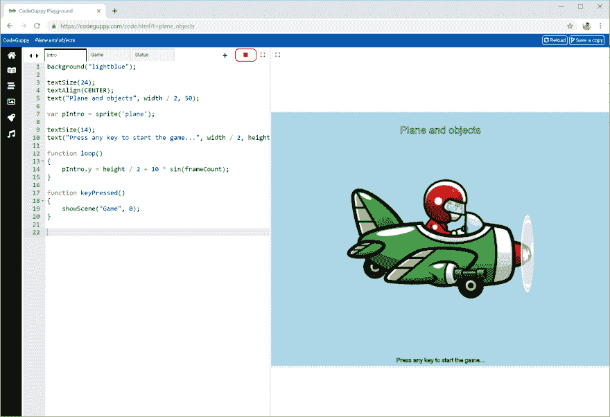

# 平面与物体

> 原文：<https://dev.to/codeguppy/plane-vs-objects-1221>

# [T1】简介](#intro)

这个有趣的游戏把你放在一架可爱飞机的飞行员座位上。你的目标是摧毁所有飞向你的物体。一旦你摧毁了所有的物体，游戏就会进入一个新的阶段，面临更多的挑战。

在制作这个游戏的过程中，你将会学到:

*   如何创建多场景/多层次的游戏
*   如何操纵精灵对象
*   如何在屏幕上更新和显示几个移动的对象

# 需要什么？

要运行本文中的代码，您不需要在本地计算机上安装任何东西。

只需从[codeguppy.com/code.html](https://codeguppy.com/code.html)打开在线 JavaScript playground，在集成编辑器中复制并粘贴以下代码。

准备就绪后，按“播放”按钮运行代码。

[](https://res.cloudinary.com/practicaldev/image/fetch/s--TwkC6cn_--/c_limit%2Cf_auto%2Cfl_progressive%2Cq_auto%2Cw_880/https://thepracticaldev.s3.amazonaws.com/i/pyu26g5ho0sjebaaujk6.png)

# 源代码

> 这个节目包含多个场景。请在单独的代码页中复制并粘贴每个场景。确保场景的名称如下所示。

## 场景:简介

```
background("lightblue");

textSize(24);
textAlign(CENTER);
text("Plane and objects", width / 2, 50);

var pIntro = sprite('plane');

textSize(14);
text("Press any key to start the game...", width / 2, height - 9);

function loop()
{
    pIntro.y = height / 2 + 10 * sin(frameCount);
}

function keyPressed()
{
    showScene("Game", 0);
} 
```

## 场景:游戏

```
var p = sprite('plane', 150, 300, 0.2);

var maxObjects = 10;
var bullets = [];
var objects = [];

var isHit = false;

function enter()
{
    background('Scene1');
    maxObjects += PublicVars.Arguments;

    p.x = 150;
    p.y = 300;
    p.velocity.y = 0;
    p.rotation = 0;
    p.rotationSpeed = 0;
    p.show('fly');
    isHit = false;

    createObjects();
    bullets = [];
}

function loop()
{
    readKeys();

    clear();
    updateObjects();
    displayObjects();
    updateBullets();
    displayBullets();

    checkStatus();
    displayStats();
}

function readKeys()
{
    if (isHit)
        return;

    if ( keyIsDown( UP_ARROW ) && p.y > 0  )
    {
        p.y -= 5;
    }
    else if ( keyIsDown( DOWN_ARROW) && p.y < height - 30 )
    {
        p.y += 5;
    }

    if ( keyIsDown( RIGHT_ARROW) && p.x < width - 50 )
    {
        p.x += 5;
    }
    else if ( keyIsDown( LEFT_ARROW) && p.x > 0 )
    {
        p.x -= 5;
    }

    if ( keyIsDown (32) )  // SPACE
    {
        p.show('shoot');
        createBullet();
    }
    else
    {
        p.show('fly');
    }
}

function createObjects()
{
    objects = [];

    for(var i = 0; i < maxObjects; i++)
    {
        var obj = { x : random(width, width * 2), 
                    y : random(0, height), 
                    r : random(20, 30),
                    color : random(['LightPink', 'LightSalmon', 'PapayaWhip', 'LemonChiffon', 'LightGreen', 'MediumAquamarine', 'Tan', 'Beige']),
                    hit : false
                };

        objects.push(obj);
    }
}

function checkStatus()
{
    if (isHit && p.y > height)
    {
        showScene("Status", false);
    }
    else if ( objects.length == 0 )
    {
        showScene("Status", true);
    }
}

function updateObjects()
{
    if (isHit)
        return;

    for(var i = objects.length - 1; i >= 0; i--)
    {
        o = objects[i];

        if (o.hit)
        {
            if (o.r >= 0)
            {
                o.r--;
            }
            else
            {
                objects.splice(i, 1);

            }

            continue;
        }

        o.x -= 5;
        if (o.x < 0)
        {
            o.x = width;
            o.y = random(height);
        }

        checkCollision(o);
    }
}

function displayObjects()
{
    stroke(0);

    for(var o of objects)
    {
        fill(o.color);
        circle(o.x, o.y, o.r);
    }
}

function createBullet()
{
    if (frameCount % 5 != 0)
        return;

    var bullet = { x : p.x, y : p.y };
    bullets.push(bullet);
}

function updateBullets()
{
    for(var i = bullets.length - 1; i >= 0; i--)
    {
        var bullet = bullets[i];
        bullet.x += 10;

        if (bullet.x > width)
        {
            bullets.splice(i, 1);
        }
    }
}

function displayBullets()
{
    fill('brown');
    noStroke();

    for(var bullet of bullets)
    {
        circle(bullet.x, bullet.y, 5);
    }
}

function displayStats()
{
    fill(0);

    text(objects.length, 10, height - 10);
}

function checkCollision(o)
{
    if (o.hit)
        return;

    var hit = collisionCircleRect(o.x, o.y, o.r, p.x - 48, p.y - 32, 96, 60);
    if (hit)
    {
        isHit = true;

        p.show('crash');
        p.velocity.y = 9;
        p.rotationSpeed = 9;
    }

    for(var i = bullets.length - 1; i >= 0; i--)
    {
        var bullet = bullets[i];
        hit = collisionCircleCircle(o.x, o.y, o.r, bullet.x, bullet.y, 5);
        if (hit)
        {
            o.hit = true;
            bullets.splice(i, 1);
        }
    }
} 
```

## 场景:状态

```
var win;

function enter()
{
    win = PublicVars.Arguments;

    clear();
    textAlign(CENTER);
    text(win ? "You win!" : "You loose.", width / 2, height / 2);

    text("Press R to restart...", width / 2, height - 10);
}

function keyPressed()
{
    if (key.toUpperCase() === 'R')
    {
        showScene("Game", win ? 10 : 0);
    }
} 
```

# 反馈

如果你喜欢这篇文章，请在 Twitter 上关注 [@codeguppy](https://twitter.com/codeguppy) 和/或访问 codeguppy.com[获得更多教程和项目。](https://codeguppy.com)

另外，如果你想用详细的说明来扩展这篇文章，解释如何一步一步地构建程序，请在评论中留下反馈。