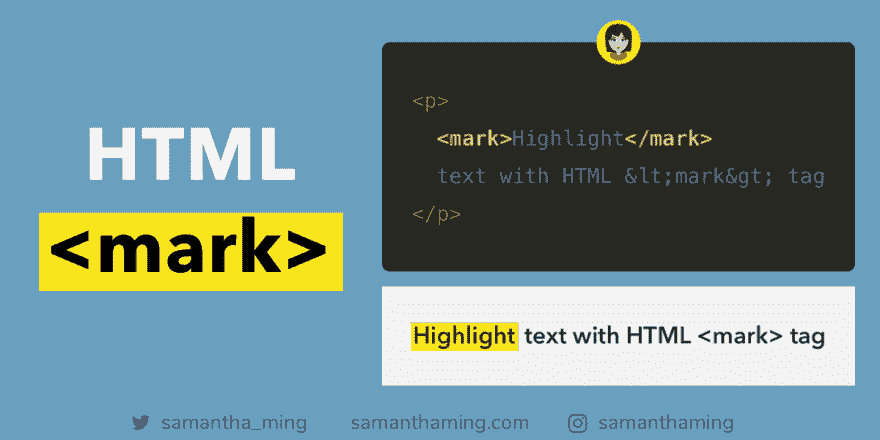

# Html 突出显示文本用 HTML 标记标签突出显示文本

> 原文：<https://dev.to/samanthaming/highlight-text-with-html-mark-tag-g1g>

[](https://res.cloudinary.com/practicaldev/image/fetch/s--9ZQDgF8k--/c_limit%2Cf_auto%2Cfl_progressive%2Cq_auto%2Cw_880/https://thepracticaldev.s3.amazonaws.com/i/6vjmthy9jzjcganepzfg.png)

如果你需要标记段落中的文本，最好使用`<mark>`标签。这是黄色荧光笔的 HTML 版本。我一直使用一个带有 CSS 样式的`<span>`标签，没有意识到这种更具语义的选项的存在。HTML5 充满了各种好东西，对吗😆

```
<p>
  <mark>Highlight</mark>
  text with HTML &lt;mark&gt; tag
</p> 
```

Enter fullscreen mode Exit fullscreen mode

## 默认`<mark>`造型

`<mark>`的默认背景颜色是黄色。

```
<p>
  <mark>Default Yellow Highlight</mark>
</p> 
```

Enter fullscreen mode Exit fullscreen mode

*输出*

[](https://res.cloudinary.com/practicaldev/image/fetch/s--4pd7RQDu--/c_limit%2Cf_auto%2Cfl_progressive%2Cq_auto%2Cw_880/https://thepracticaldev.s3.amazonaws.com/i/ien59h0l3qctwqt1w7r8.png)

## 用 CSS 自定义样式`<mark>`

当然，像任何文本 HTML 标签一样，您可以使用 CSS 应用自定义样式。你可以把它想成类似于你如何设计一个`<p>`标签的样式。

```
mark {
  background: red;
  color: white;
} 
```

Enter fullscreen mode Exit fullscreen mode

*输出*

[](https://res.cloudinary.com/practicaldev/image/fetch/s--nyGyC66y--/c_limit%2Cf_auto%2Cfl_progressive%2Cq_auto%2Cw_880/https://thepracticaldev.s3.amazonaws.com/i/r4g02n3rnlbdkwp0f26h.png)

## `<mark>` vs 其他文本 HTML 标签

#### 强大

`<strong>`用于表示比周围文本更重要的文本，如警告或错误。语义上，它的重要性。它显示为**粗体**

#### b

`<b>`与`<strong>`非常相似，因为它也显示为**粗体**。然而，与它不同，它并不真正传达任何重要性，它更多的是一种文体而不是语义。

#### em

`<em>`用来强调某个单词。它显示为*斜体*

#### 标记

仅仅强调某段文字的相关性。在这个标签出现之前，许多人已经使用了`em`或`strong`来赋予突出显示的内容一些语义。不会再有了！如果你需要突出显示，使用这个标签🌟

## 为什么语义 HTML 标签很重要

你不只是到处使用`<div>`标签的原因是因为它们没有语义。当我刚开始学习编程时，你可能和我一样——谁会关心语义是否正确🙄。错误的❌.其实像 Google 这样的搜索引擎都有！因为语义传达了你的网站的含义。当搜索机器人浏览你的网站时，他们会知道发生了什么。换句话说，丁对你的 SEO 或者**搜索引擎优化**🏆

语义正确的另一个原因是为了可访问性。许多可访问性工具依赖于标签的语义来将你的网站转换成对使用它的用户的意义(即屏幕阅读器)。这里打个比方。还记得以前，我们让电脑从一个网站上阅读文本。这听起来超级机器人和奇怪🤖。没有恰当的语义，也就那样了。这有用吗，当然——但是听起来很糟糕😱。然而，当你使用适当的语义时，就像听 Siri 一样。它听起来更人性化，因为它有各种不同的音调变化，甚至知道什么时候暂停。当使用语义正确的 HTML 标签时，您可以获得类似的更好的体验👍

### HTML5 标签和 SEO

不过，我想指出一件事。

谷歌的约翰·穆勒在推特上提到了这一点:

> 如果可以的话，合理使用 HTML5 当然是有意义的，这样做对 SEO 没有负面影响:)。

以下是我从这里收集到的信息。无论你是否使用 HTML5 标签，都不会伤害你的谷歌搜索结果排名。然而，这是否意味着你应该使用 HTML5 标签。一点也不！可访问性优势仍然存在。一些 HTML5 标签有非常有趣的浏览器行为，它向你的用户开放了更多以前没有的高级功能🤩

## 无障碍关注

好的，希望我已经成功地向你传达了语义 HTML 标签的重要性。现在你可以理解`<mark>`不仅仅是对文本进行样式化，而是在语义上是一件好事。

但是！有人担心它的可及性。不幸的是，大多数屏幕阅读器在默认设置中并没有声明使用`<mark>`标签。但好消息是，有一种方法可以绕过它。您可以使用 CSS 内容属性和伪元素来发布公告。

```
mark::before {
  content: " [highlight start] ";
}

mark::after {
  content: " [highlight end] ";
}

/* Hide the text created in the CSS content property */
mark::before, 
mark::after {
  clip-path: inset(100%);
  clip: rect(1px, 1px, 1px, 1px);
  height: 1px;
  overflow: hidden;
  position: absolute;
  white-space: nowrap;
  width: 1px;
} 
```

Enter fullscreen mode Exit fullscreen mode

屏幕阅读器在这里要做的是。当它遇到包裹在`<mark>`标签中的文本时，它会宣布“高亮显示开始”,然后是标签中的文本。然后一旦标记结束就宣布“突出显示结束”。

### 但是...

请注意:如果你有很多这样的“公告”，它可能会非常冗长，有时会添加一些烦人的不必要的信息。这可能会导致一些屏幕阅读器用户关闭该功能。所以，这里的教训是。“🕷".，权力越大，责任越大不要滥用这种技术，只在不知道突出显示的内容会对用户的理解产生负面影响的情况下才使用它。

## 用例为`<mark>`

有趣的部分来了！让我们看一些`<mark>`的使用案例:

### 用例:搜索结果

这里有一个流行的。您可以使用它来突出显示用户搜索的术语。

```
<p>Search Result for "Vue"</p>

<hr>

<p><mark>Vue</mark> is a awesome JavaScript framework. <mark>Vue</mark> is awesome. Can you tell I really like <mark>Vue</mark>😆</p> 
```

Enter fullscreen mode Exit fullscreen mode

*输出*

[](https://res.cloudinary.com/practicaldev/image/fetch/s--7-lKFi82--/c_limit%2Cf_auto%2Cfl_progressive%2Cq_auto%2Cw_880/https://thepracticaldev.s3.amazonaws.com/i/f96ci3u6jlglh9jukfa7.png)

### 用例:引号

为报价(`<q>`)和块报价(`<blockquote>`)提供亮点是很棒的。

```
<p>According to Samantha, <q>Vue is <mark>AWESOME</mark></q></p> 
```

Enter fullscreen mode Exit fullscreen mode

*输出*

[](https://res.cloudinary.com/practicaldev/image/fetch/s--Oq62xAQR--/c_limit%2Cf_auto%2Cfl_progressive%2Cq_auto%2Cw_880/https://thepracticaldev.s3.amazonaws.com/i/un035cmdgt57ax4peg0d.png)

* * *

## 资源

*   [MDN 网络文档:HTML 标记](https://developer.mozilla.org/en-US/docs/Web/HTML/Element/mark)
*   [w3schools: HTML 标记](https://www.w3schools.com/tags/tag_mark.asp)
*   [教程要点:HTML 标记标签](https://www.tutorialspoint.com/html/html_mark_tag.htm)
*   [20 个 HTML 元素实现更好的文本语义](https://www.sitepoint.com/20-html-elements-better-text-semantics)
*   [标记 HTML5 中的标签](https://www.c-sharpcorner.com/UploadFile/667ddf/mark-tag-in-html5/)
*   [TechOnTheNet: HTML 标记标签](https://www.techonthenet.com/html/elements/mark_tag.php)
*   [html 5 医生:用标记吸引注意力](http://html5doctor.com/draw-attention-with-mark/)
*   [tutorial Republic:html 5 mark tag](https://www.tutorialrepublic.com/html-reference/html5-mark-tag.php)
*   [正确使用 HTML5 没有 SEO 的坏处](https://www.seroundtable.com/google-html5-seo-25870.html)

* * *

**感谢阅读❤**
问好！[insta gram](https://www.instagram.com/samanthaming/)|[Twitter](https://twitter.com/samantha_ming)|[脸书](https://www.facebook.com/hisamanthaming) | [媒体](https://medium.com/@samanthaming) | [博客](https://www.samanthaming.com/blog)