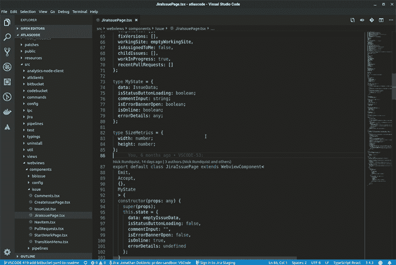
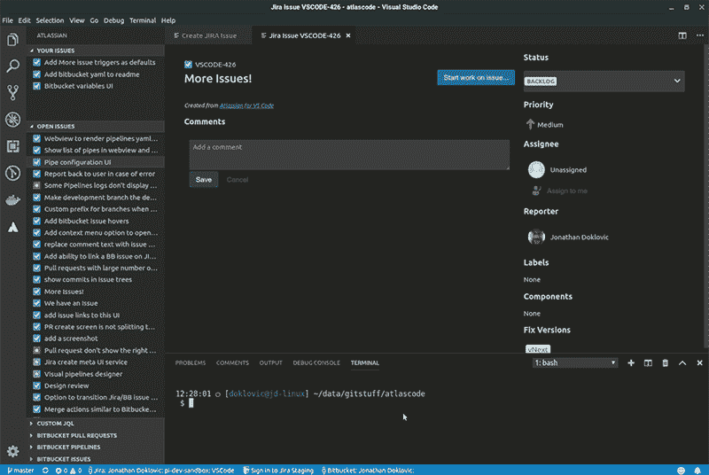
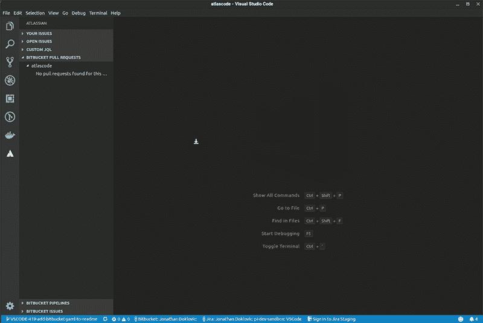
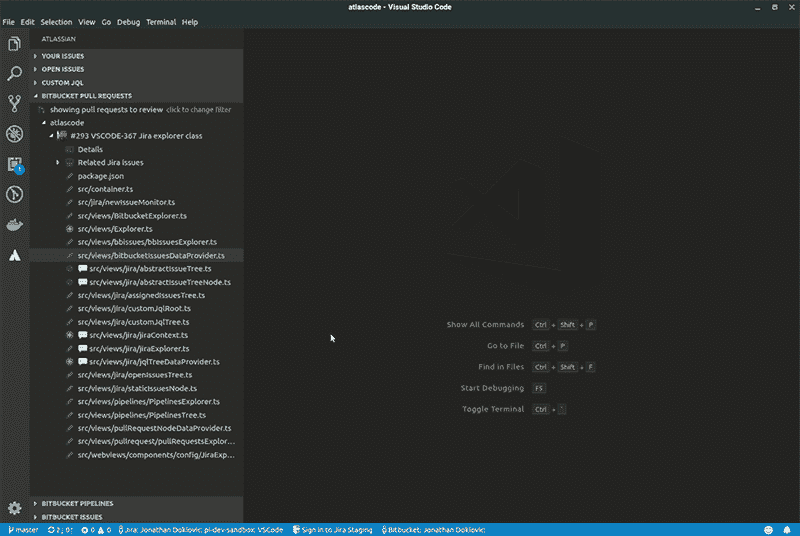
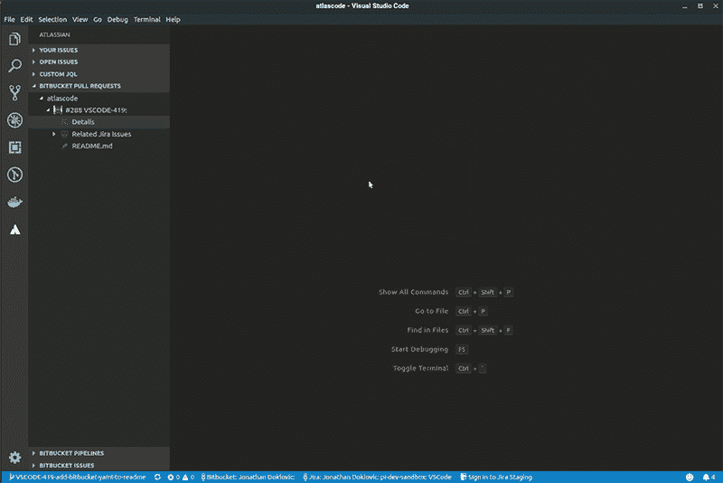

# 构建 IDE 扩展如何改变我们发布代码的方式

> 原文：<https://dev.to/atlassian/how-building-an-ide-extension-changed-the-way-we-ship-code-20oo>

当我们的团队开始为 VS 代码扩展构建 [Atlassian 时，我们的任务很简单:创建一个 MVP 来测试在 VS 代码中使用 Bitbucket Cloud 和吉拉软件云特性是否会带来更好的开发体验。](https://marketplace.visualstudio.com/items?itemName=Atlassian.atlascode)

首先，我们做了我们都知道的事情:安排计划会议，举行每日站立会议，为会议之间发生的所有讨论建立一个松散的渠道，试图猜测发布日期，并安排回顾来讨论哪里出了问题，哪里进展顺利。

随着时间的推移，我们发现，通过使用我们自己的工具，我们解决了一个众所周知的难题:以使团队更有生产力的方式改变开发人员的行为，同时减轻通常使他们变慢的管理任务。

Dogfooding 我们自己的扩展帮助我们的团队开发了对代码库的更好的共享理解，并将健康的项目管理所需的非编码任务紧密地集成到开发循环中，从而成为开发人员的首选工作方式。

我们已经意识到，如果您构建了使用起来有趣的工具，这一切都将有机地发生。

### 在黑暗中迭代

筒仓的问题在于它们内部通常是黑暗的。

当我们第一次开始为 Bitbucket 和吉拉用户构建 VS 代码扩展时，我们以一种非常熟悉的方式工作，我们每个人都进入我们的“编码洞穴”很长一段时间，并且每隔一段时间出来检查我们设置的 Slack 通道。

几乎可以肯定的是，频道里会有一条消息，请求某人审查一两个小时前的公关，如果不是更多的话。然后，作为一名优秀的团队成员，我们会停下手头的工作，打开 Bitbucket，在浏览器中查看代码。我们可能会在这里或那里添加评论(一旦提交，就会被作者遗忘)，然后肯定会休息一会儿，然后再回来爬进我们的洞穴。

冲洗，重复。问题是，仍然感觉像是不同的人在代码库的不同区域工作，没有很多关于事物如何工作的跨职能知识。我们基本上被蒙在鼓里。

阐明(双关语)一些问题:

*   没有人喜欢在一个房间里坐几个小时，屏幕上显示着吉拉的公告板，而有人在激烈的讨论和对话中疯狂地输入吉拉的问题。
*   一旦开始编码，开发人员倾向于只接受他们熟悉的领域知识(筒仓)内的任务，跨功能的学习就失去了
*   缺乏跨功能的代码库知识意味着关于代码库其他部分的错误和想法留给了开发人员，他们在缺乏协作输入的情况下工作
*   开发人员讨厌上下文切换，这反过来意味着:
*   错误或功能可能会被发现，但新的吉拉问题不会被输入
*   拉取请求被提交，但是唠叨必须发生以使它们被审查
*   可以在“拉”请求上输入注释，但是回复要么没有被跟进，要么需要几天才能得到新的回复
*   更新吉拉问题以反映项目的状态是一件苦差事，通过唠叨发生，因此让吉拉处于谎言状态
*   确保吉拉工作单元链接到每个分支中的代码，每次提交在最好的情况下是不一致的，在最坏的情况下也不会发生
*   当开发人员觉得其他人是专家时，协作就会减少

### 走出洞穴

有一天，事情发生了。我们终于达到了可以对吉拉和比特桶进行认证的程度，并且我们已经具备了开始扩展的基本特性。第一个开发人员带着胜利的喜悦喊道:“嘿，我刚刚批准了我们扩展的 PR！”我们知道可行性不再是我们的使命…

新的路线图出现了，几乎完全由工程师领导，很少监督和大量喂养:我们将采取自私的方法，专注于使我们自己在 VS 代码中的生活更容易，知道如果我们获得了吉拉和 Bitbucket 经验(大部分)正确，我们将对 Atlassian 以外的其他开发团队产生积极的影响。如果我们在开发周期中有痛点，其他团队也有可能有。

为了说明我们团队取得的一些成功，让我们看看我们新的开发实践，这些实践集成了我们扩展的特性，模糊了编码、吉拉和比特桶之间的界限。还有什么比…中间更好的开始呢？

### 一个共享的洞穴，光线非常好

为了说明我们团队取得的一些成功，让我们看看我们新的开发实践，这些实践集成了我们扩展的特性，模糊了编码、吉拉和比特桶之间的界限。还有什么比…中间更好的开始呢？

#### 吉拉工作单位:永远不忘发现

好吧，假设我是一名开发人员……当我正在编写一些代码时，我注意到了一堆散落着吉拉问题密钥的评论。(我们一会儿会谈到为什么会这样)看到密钥和一个小评论，但不能访问问题细节，这有点令人沮丧。更令人沮丧的是，跳出我的 IDE，仅仅为了查看细节就将密钥粘贴到吉拉的 web 界面中，因此我添加了一点 TODO 注释:

```
// TODO: add a "quick view" when hovering over Jira issue keys 
```

尽管有各种各样的扩展来列出/管理待办事项评论，但是如果我不记得在下一次计划会议上提出来，或者停下手头的工作，跳到吉拉的网络界面并为其创建一个问题，这将会丢失。

使用“创建吉拉问题”代码链接，该链接显示可定制的评论前缀(TODO、BUG、FIME、问题等)，我只需点击链接，创建问题，然后继续编写代码。

最重要的是，该扩展将更新注释并添加新创建的问题密钥作为前缀，以便其他开发人员可以引用它。

```
// TODO: VSCODE-12324 - add a "quick view" when hovering over Jira issue keys 
```

[](https://res.cloudinary.com/practicaldev/image/fetch/s--5L_inGJg--/c_limit%2Cf_auto%2Cfl_progressive%2Cq_66%2Cw_880/https://cdn-images-1.medium.com/max/800/0%2Auhoy2va6RncsmUal.gif)

#### 将想法转化为代码:开始工作

假设团队中有另一个开发人员，他刚刚完成了一项任务，正在寻找工作。她在 VS 代码中的吉拉问题树中看到了我们上面制作的吉拉问题，并打开了它。在通读了细节之后，她决定继续努力。

遵循我们的最佳编码实践，开始一项新任务比只是编码要复杂一点。她需要:

*   创建一个分支，确保吉拉发行密钥在分支名称中
*   将本地分支与 Bitbucket 上的新上游分支链接
*   将问题分配给她自己
*   将问题转换到“进行中”状态，以便其他开发人员和“项目人员”知道正在进行什么
*   最后检查本地分支并开始编码

这是需要做的事情的一个小列表，但是在做了几(上百)次之后，大多数开发人员往往会错过其中的一些步骤。

使用 VS 代码中吉拉详细信息屏幕上提供的“开始处理问题”按钮，这可以在一个步骤中完成。

[](https://res.cloudinary.com/practicaldev/image/fetch/s--OTAVSQBC--/c_limit%2Cf_auto%2Cfl_progressive%2Cq_66%2Cw_880/https://cdn-images-1.medium.com/max/800/0%2AzAtJWURQtBj3shuE.gif)

* * *

**专业提示:确保所有提交都包含发布密钥**

那么，在分支机构名称中放置问题密钥是怎么回事？

这个想法很简单:如果你把你的吉拉实例链接到你的 Bitback 存储库中，Bitback 会在你的分支名称和提交/公关评论中寻找问题密钥，并且能够在 Bitback 用户界面中链接它们。

在 Bitbucket UI 之上，Atlassian for VS Code 扩展检查这些地方的问题密钥，并“神奇地”在各种 UI 中为您提供与您的 PRs 相关的问题列表。现在，您可以轻松地更好地了解 VS 代码中的问题/代码关系。

那么，如何确保每个提交在注释中都有一个吉拉问题键呢？

尽管在 VS 代码扩展之外，我们使用了一个小的 Git 脚本，它通过在分支名称中找到 issue 键并将其预先挂起到该分支上的所有 commit 注释来自动化这个过程。

开发人员永远不必在注释中键入问题密钥，只要分支包含该密钥。

您可以从我们的 [Bitbucket 片段中获得这个漂亮的脚本和指令。](https://bitbucket.org/snippets/atlassian/qedp7d/prepare-commit-with-jira-issue)

* * *

因此，我们的开发人员觉得她的功能已经完成，现在需要创建一个拉请求。这将服务于多个目的:

*   她的队友将进行代码审查，找出她可能遗漏的任何东西
*   她的队友将有机会测试新功能
*   整个团队可以讨论该方法，并根据需要进行任何更改
*   团队有机会通过批准来“签署”拉动请求
*   最后，可以合并拉取请求

让我们一步一步来，首先创建一个拉请求。

传统上，创建一个拉请求意味着跳出 IDE，导航 Bitbucket UI，并创建拉请求。有了我们的扩展，这现在可以在 VS 代码中完成。

[](https://res.cloudinary.com/practicaldev/image/fetch/s--0LCtojol--/c_limit%2Cf_auto%2Cfl_progressive%2Cq_66%2Cw_880/https://cdn-images-1.medium.com/max/800/0%2AwKAwPeyu0f0aRMZ7.gif)

已经创建了一个拉取请求，现在通常是我们的开发人员喝咖啡休息(这是她应得的)的时候，当她回来时，检查是否有人看过它。通常答案是否定的，所以她需要放松一下，温和地请求她的队友看一下公关。即使这样也需要一些运气，其他开发人员正处于他们“出来透透气”的时刻。

在我们的扩展中，我们希望尽可能地消除唠叨和等待，所以当她创建拉请求时，她的队友会在 VS 代码中得到一个小的通知弹出窗口，她的拉请求会显示在 VS 代码中他们所有的“拉请求树”视图中。

现在，她的团队成员不仅知道有东西要审查，而且他们可以看到拉请求的详细摘要，看到与拉请求相关的任何和所有吉拉问题，并在他们的 IDEs 中检查各个文件差异..你知道，开发者喜欢在那个星期用他们决定使用的任何疯狂的主题来看代码。

当他们研究细节和差异时，他们可以快速地逐行添加注释，并且由于在 VS 代码中添加新的注释时会通知开发人员，所以等待回复的时间大大减少了，有效地将 pull request 变成了一个有意义的交流工具。

[](https://res.cloudinary.com/practicaldev/image/fetch/s--_8abd8RB--/c_limit%2Cf_auto%2Cfl_progressive%2Cq_66%2Cw_880/https://cdn-images-1.medium.com/max/800/0%2AK_jR5ZMjBuih2-wY.gif)

* * *

自从使用了这些拉式请求特性，我们的团队在知识共享方面享受到了巨大的加速，这反过来有助于打破我们的孤岛，将每个团队成员变成产品专家，而不是代码库中较小领域的专家。

我们都对我们的整个代码库有了更深刻的理解，并且仅仅通过更好的交流就变得更加协作。

* * *

一旦每个团队成员完成了对 pull 请求的审查，他们只需在 VS Code 中的 details 屏幕上单击 approve 按钮，就可以返回到他们的编码中。同样，我们提交 PR 的开发人员也可以直接从详细信息屏幕进行合并。

[](https://res.cloudinary.com/practicaldev/image/fetch/s--aNeXQzPf--/c_limit%2Cf_auto%2Cfl_progressive%2Cq_66%2Cw_880/https://cdn-images-1.medium.com/max/800/0%2AhjFJF4wMJ0FC25pl.gif)

一旦合并，就是新任务的时候了。我们的开发人员可以像以前一样在树形视图中浏览问题列表，或者现在她可以简单地将鼠标悬停在她在代码中找到的问题键上，并使用新的“问题快速查看”功能，这将允许她获得重要的问题详细信息，打开完整的详细信息视图，并可选地开始处理该问题。

### 版本化是一个结果，而不是一个计划

自从决定在 VS 代码中使用 Bitbucket 和吉拉特性进行测试以来，我们的团队已经取得了很大的进步。我们开始创建一个有用的工具来帮助缓解常见编码周期中的一些棘手问题。我们最终得到的正是。我们没有计划的是，通过使用我们自己的工具，我们将有机地改变我们的工作方式。

到目前为止，我们看到的最大变化是，我们不再带着“下一个版本”的版本号走进房间，给它一个日期，并把我们认为可以完成的事情打包。相反，我们编码，我们在过程中发现错误和特性，我们在开发中更加协作，每个人现在都感觉拥有整个代码库，并渴望在其中的任何部分工作。

我们过去在预定的时间内发布产品，现在随着有用特性的完成，我们会发布更多的产品。我们不会等待发布任何东西，因为“1.x 应该在月底发布”。事实上，我们只有一个版本，它的标签是 vNext。在任何时候，我们都可以说“是时候了”几分钟后，我们及时释放该快照并为其分配适当的标签。

### 当没有截止日期时，你永远不会完成

我们的团队正在以前所未有的速度前进，我们已经看到了编码周期的巨大改进。

我们的延期绝不是“银弹”，正如他们所说的“结果可能会有所不同”。我们的团队充满热情(也很自私)地不断寻找使用新工具和新工作流程的方法，让每个团队都尽可能做到最好。

我们很高兴了解 Atlassian 以外的团队如何利用这些功能，以及我们如何改进。

[立即安装扩展模块](https://marketplace.visualstudio.com/items?itemName=Atlassian.atlascode)并告诉我们您的想法！

Jonathan Doklovic: Jonathan 已经在 Atlassian 工作了近十年，目前是产品集成团队的首席开发人员。他从事过许多 Atlassian 产品以及核心插件系统和 Atlassian Connect。

*原载于 2019 年 5 月 15 日*[*【https://bitbucket.org】*](https://bitbucket.org/blog/how-atlassian-for-vscode-changed-the-way-we-ship-code)*。*

* * *