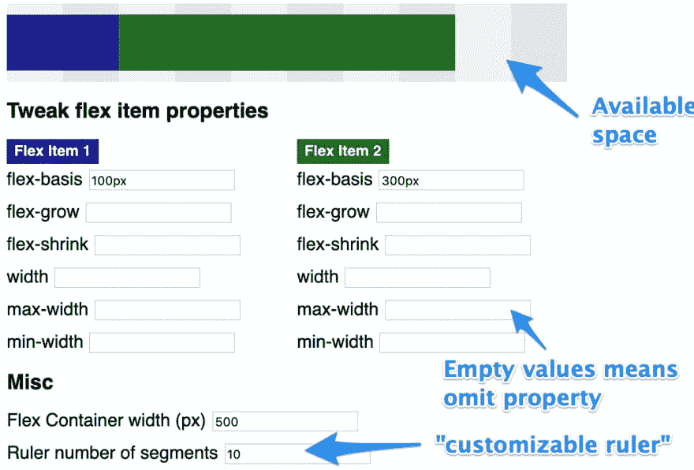
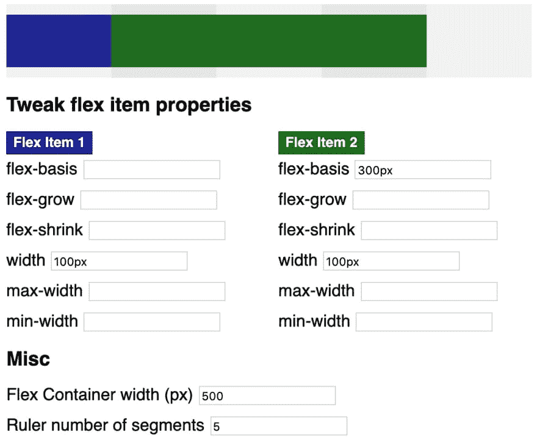
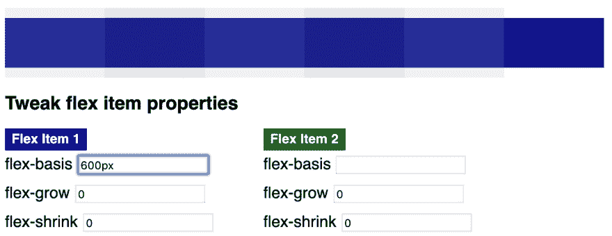
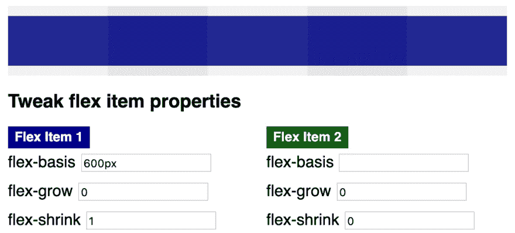
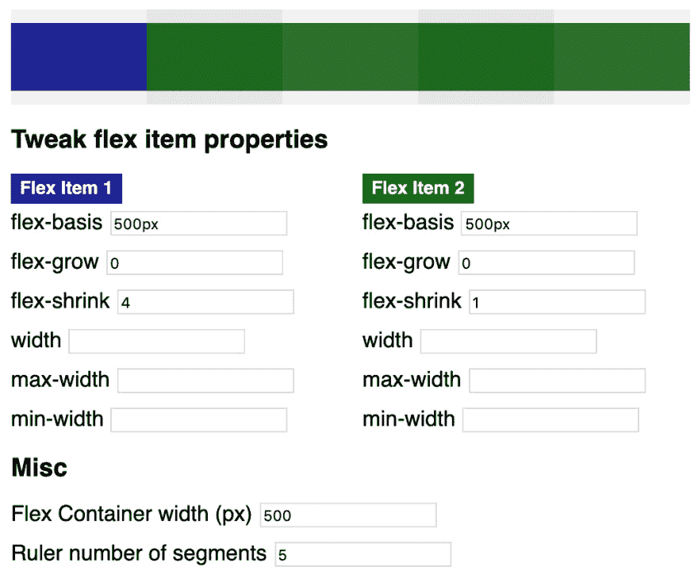
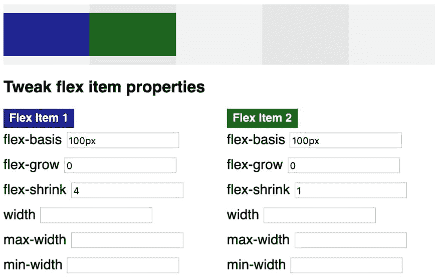
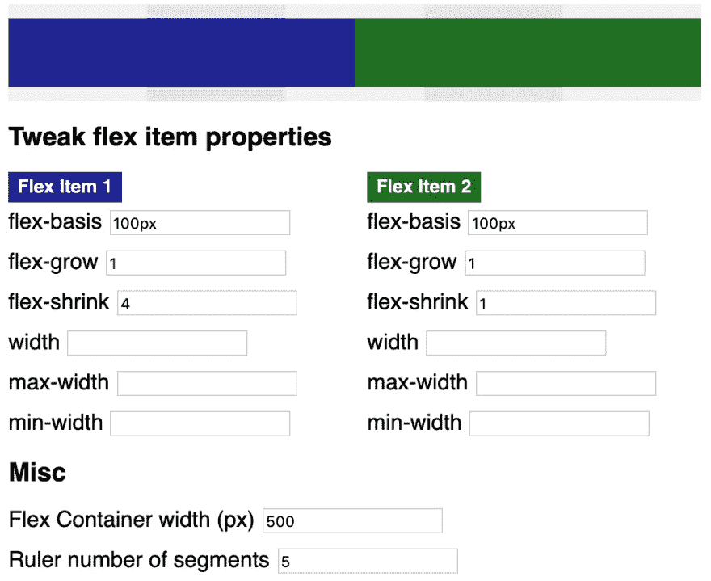
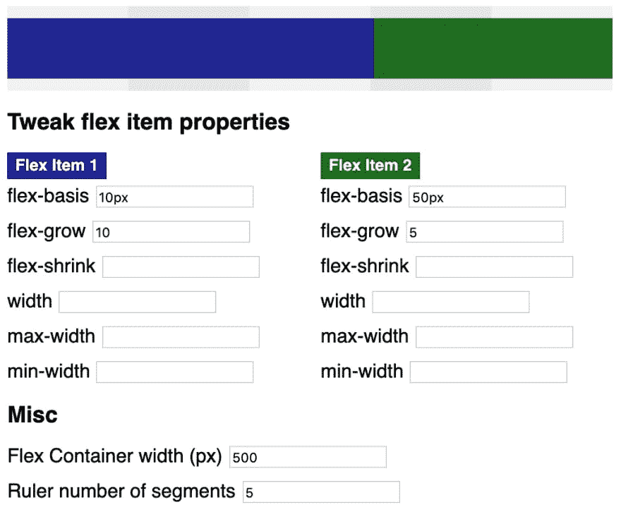
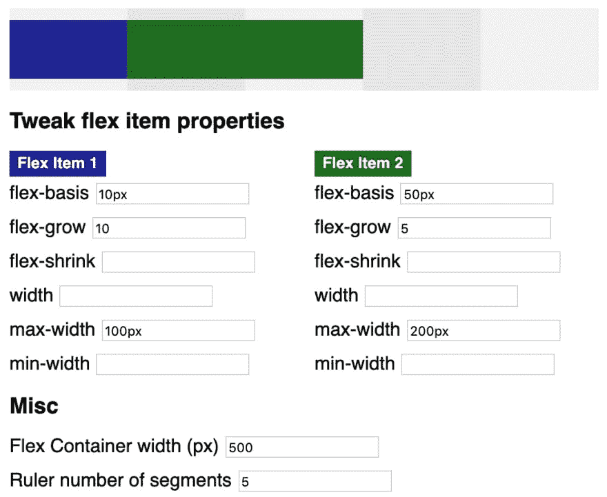
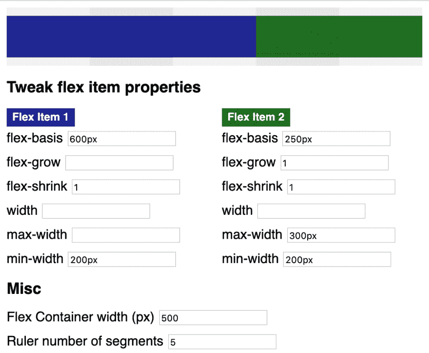

# 通过了解 flex-grow、flex-shrink 和 flex-basis 掌握 Flexbox 扩展

> 原文：<https://dev.to/doppelmutzi/master-flexbox-scaling-by-understanding-flex-grow-flex-shrink-and-flex-basis-5dlf>

受一篇文章为什么 [flex-grow 很奇怪](https://css-tricks.com/flex-grow-is-weird/)的启发，我开发了一个[小工具(Codesandbox)](https://qqq3mv5rvw.codesandbox.io/) 来探索 flex 项目的不同属性如何单独或组合工作。你可以用我的工具复制这篇文章的所有例子。希望你觉得有用。

[https://codesandbox.io/embed/qqq3mv5rvw](https://codesandbox.io/embed/qqq3mv5rvw)

如果这个工具对您来说不够直观，本文将分解不同的组合 [flex-basis](https://www.w3.org/TR/css-flexbox-1/#flex-basis-property) 、 [flex-grow](https://www.w3.org/TR/css-flexbox-1/#flex-grow-property) 和 [flex-shrink](https://www.w3.org/TR/css-flexbox-1/#flex-shrink-property) ，以展示如何将这些灵活性属性用于响应式 flexbox 布局。

## 弹性基础

看下一张截图。

[](https://res.cloudinary.com/practicaldev/image/fetch/s--p603pTxh--/c_limit%2Cf_auto%2Cfl_progressive%2Cq_auto%2Cw_880/https://thepracticaldev.s3.amazonaws.com/i/62mk88dz90ykory6i998.jpg)

首先，蓝色的注释解释了这个工具是如何工作的。在本例中，2 个 flex 项目(蓝色= flex 项目 1，绿色= flex 项目 2)没有占用 flex 容器的全部可用空间(宽度为`500px`)。`100px`自由空间由 2 个灰度方块表示(500 像素/ 10 段)。灰色标尺是用来直观显示 flex 容器中有多少“部分”是免费分发的。

下一个例子显示了`width`和`flex-basis`。

[](https://res.cloudinary.com/practicaldev/image/fetch/s--yUV_SpL5--/c_limit%2Cf_auto%2Cfl_progressive%2Cq_auto%2Cw_880/https://thepracticaldev.s3.amazonaws.com/i/ucof1et5qqxbowyvg9wa.jpg)

那么，`width`和`flex-basis`之间的区别是什么呢？如果你指定了两个属性(绿色 flex 项)，`width`将被忽略。蓝色 flex 项没有指定`flex-basis`，所以该项自动获得默认属性(`flex-basis: auto`)。在这种情况下，`width`用于缩放。

Dave Geddes 对[宽度和 flex-basis](https://gedd.ski/post/the-difference-between-width-and-flex-basis/) 之间的差异进行了深入的解释。

## 伸缩

正如你在下一个例子中看到的，`flex-basis`会导致 flex 容器溢出。
[](https://res.cloudinary.com/practicaldev/image/fetch/s--ouuUvJUd--/c_limit%2Cf_auto%2Cfl_progressive%2Cq_auto%2Cw_880/https://thepracticaldev.s3.amazonaws.com/i/zr0mpf3ktskq1gao6o78.jpg)

然而，指定一个`flex-shrink`值通过允许蓝色伸缩项收缩来解决这个问题。

[](https://res.cloudinary.com/practicaldev/image/fetch/s--NWq__1qI--/c_limit%2Cf_auto%2Cfl_progressive%2Cq_auto%2Cw_880/https://thepracticaldev.s3.amazonaws.com/i/ccn0k0tdgolrsgwwpoi4.jpg)

您可以为每个 flex 项目指定`flex-shrink`。在下一个示例中，伸缩项 1 比伸缩项 2 收缩了 4 倍。

[](https://res.cloudinary.com/practicaldev/image/fetch/s--eDVgyfYW--/c_limit%2Cf_auto%2Cfl_progressive%2Cq_auto%2Cw_880/https://thepracticaldev.s3.amazonaws.com/i/ksgt8rchindn6n9cwz7l.jpg)

如您所见，蓝色伸缩项消耗 1 个点(`100px`)，绿色伸缩项消耗 4 个点(`400px`)。怎么会这样

下面的代码片段显示了上述示例中可用空间的计算。

```
// pseudo algorithm for flex-shrink

const flexItem1Width = 500
const flexItem2Width = 500
const flexContainerWidth = 500
// 500 - 500 + 500 = | -500 | = 500px
const spaceToDistribute =
  Math.abs(flexContainerWidth - flexItem1Width + flexItem2Width)
const flexItem1ShrinkFactor = 4
const flexItem2ShrinkFactor = 1
// 5
const totalShrinkValues = flexItem1ShrinkFactor + flexItem2ShrinkFactor
// 100px
const distributionSpot = spaceToDistribute / totalShrinkValues
// 500px - (4 * 100px) = 100px
const flexItem1ComputedWidth =
  flexItem1Width - (flexItem1ShrinkFactor * distributionSpot)
// 500px - (1 * 100px) = 400px
const flexItem2ComputedWidth =
  flexItem2Width - (flexItem2ShrinkFactor * distributionSpot) 
```

裁员只有在需要的时候才会发生。在下面的例子中，考虑了`flex-basis`值。

[](https://res.cloudinary.com/practicaldev/image/fetch/s--QKmEMayf--/c_limit%2Cf_auto%2Cfl_progressive%2Cq_auto%2Cw_880/https://thepracticaldev.s3.amazonaws.com/i/arixar5r672pora9yefj.jpg)

## 伸缩增长

当然，您可以指定多个弹性项目属性。下一个截图显示提供`flex-shrink`和`flex-grow`值是完全合法的。

[](https://res.cloudinary.com/practicaldev/image/fetch/s--WZB82BBF--/c_limit%2Cf_auto%2Cfl_progressive%2Cq_auto%2Cw_880/https://thepracticaldev.s3.amazonaws.com/i/owvgr40jfm993mbati8w.jpg)

在这种情况下，只有`flex-grow`值生效，导致两个伸缩项等量增长(因为相同的因子`1`)。显然，您也可以为 flex 项目指定不同的`flex-grow`值，并且行为完全如您所期望的那样(与`flex-shrink`相同，但是是增长而不是收缩)。

最后，让我们看看下面的例子来检查一下`flex-grow`的计算公式。

[](https://res.cloudinary.com/practicaldev/image/fetch/s--PHM8o4el--/c_limit%2Cf_auto%2Cfl_progressive%2Cq_auto%2Cw_880/https://thepracticaldev.s3.amazonaws.com/i/d3u01c8t7l1uw25pt5hc.jpg)

算法与`flex-shrink`几乎相同。

```
// pseudo code for flex-grow algorithm

const flexItem1Width = 10
const flexItem2Width = 50
// 10px + 50px - 500px = | -440px | = 440px
const spaceToDistribute = 440
const flexItem1GrowFactor = 10
const flexItem2GrowFactor = 15
// 15
const totalGrowValues = flexItem1GrowFactor + flexItem2GrowFactor
// 440px / 15 = 29,3333
const distributionSpot = spaceToDistribute / totalGrowValues
// 10px + (10 * 29,3333px) = 303,33333px
const flexItem1ComputedWidth =
  flexItem1Width + (flexItem1GrowFactor * distributionSpot)
// 50px + (5 * 29,3333px) = 196,6666px
const flexItem2ComputedWidth =
  flexItem2Width + (flexItem2GrowFactor * distributionSpot) 
```

## 最小宽度和最大宽度

让我们以最后一个例子为例，也为两个 flex 项指定`max-width`值。

[](https://res.cloudinary.com/practicaldev/image/fetch/s--CTt7yQtA--/c_limit%2Cf_auto%2Cfl_progressive%2Cq_auto%2Cw_880/https://thepracticaldev.s3.amazonaws.com/i/bmbpn3b1esrfwwwu9lzj.jpg)

如你所见，`max-width`价值观受到尊重。这就是为什么 flex item 1 不会增长到超过`100px`(它不会扩展到`303,333px`)。此外，flex item 2 不会扩展到`200px`之外(它不会扩展到`196,6666px`)。

最后，让我们看看不同的 flex 项目属性是如何表现的。

[](https://res.cloudinary.com/practicaldev/image/fetch/s--bqeu_tDH--/c_limit%2Cf_auto%2Cfl_progressive%2Cq_auto%2Cw_880/https://thepracticaldev.s3.amazonaws.com/i/zw6rtfepflluevm21f94.jpg)

在本例中，弹性项目 1 不能消耗其`600px`的[假想主尺寸](https://gedd.ski/post/the-difference-between-width-and-flex-basis/)。由于指定了一个`flex-shrink`值而不是`0`或`auto`值，蓝色伸缩项被允许收缩。但是，它不会收缩超过其`min-width`值(`200px`)。最后，它的宽度是`300px`，这是因为 flex item 2 的属性。绿色柔性项目不能采用其`flex-basis`宽度(`250px`)。由于`flex-grow`和`flex-shrink`的值，允许项目收缩和增长。因为 flex 容器中没有可用的空闲空间，所以无法增长。所以，`max-width`值是不相关的。但是,`min-width`会受到重视，绿色柔性项目会占用`200px`空间。

## 灵活速记

曼努埃尔·马图索维奇[详细解释了](https://css-tricks.com/flex-grow-is-weird/)为什么`flex-grow: 1`和`flex: 1`不一样。

这是因为`flex`是`flex-grow`、`flex-shrink`和`flex-basis`的简写。这很棘手，因为你可以[用一个、两个和三个值](https://developer.mozilla.org/en-US/docs/Web/CSS/flex#Syntax)来使用它。例如，如果您仅使用一个值，则隐式设置其他值(例如，通过默认值)。

## 总结和吸取教训

通过开发这个小工具，它对我理解 flex 项目的缩放帮助很大。为了学习和分享知识，我可以鼓励其他人也这样做。

对我来说，结合已知的`width`、`min-width`和`max-width`属性，对`flex-grow`、`flex-shrink`和`flex-basis`的良好理解允许开发更好的(在响应性和健壮性方面)flexbox 布局。