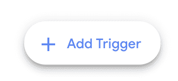

# 提交谷歌表单时点击云功能

> 原文：<https://dev.to/googlecloud/hitting-a-cloud-function-when-you-submit-a-google-form-3hkn>

Google Forms 是一个很棒的工具——容易创建，容易使用，等等。我最近在一个会议上与用户谈论谷歌云平台，有人说他们希望能够将谷歌表单与谷歌云功能挂钩。

想了一秒，我想“这一定是可能的”。虽然 G Suite 和 Google Cloud 之间通常没有很多直接的互操作性，但我知道你可以为大多数 Google Docs 编写一个 Apps 脚本触发器，这将允许你发出 HTTP 请求，云函数可以接受任意的 HTTP 请求作为事件，所以没有理由这不工作。

事实上，它完全有效！

## 编写您的云函数

您将为此创建的云函数并没有什么特别之处:它就像任何其他接受 HTTP 请求的云函数一样。假设我们将来回传递 JSON 作为有效负载:

该函数看起来像这样:

```
def form_trigger(request):
    payload = request.get_json(silent=True)
    print(f"Payload was: {payload}")
    return "OK" 
```

这将从`POST`请求中获取 JSON，将其打印到我们的日志中，并返回一个“OK”。显然，此时您可以对有效载荷做任何您想做的事情:将它存储在您的数据库中，开始一个作业，等等。

使用`gcloud functions deploy form_trigger --trigger-http --runtime python37`部署该功能，并继续下一步。

## 创建您的谷歌表单

您创建的 Google 表单将和其他表单一样:您可以有多部分问题、多项选择问题、自由形式问题等。

## 为您的表单创建脚本

我们可以从这里开始把这些点联系起来。首先，在编辑表单时，在菜单中选择三个点:

[](https://res.cloudinary.com/practicaldev/image/fetch/s--2qayrScV--/c_limit%2Cf_auto%2Cfl_progressive%2Cq_auto%2Cw_880/https://thepracticaldev.s3.amazonaws.com/i/ngsowpgdyksnvgk7it7b.png)

从该菜单中，选择**“脚本编辑器”**进入该表单的应用程序脚本编辑器。这将为您提供一个名为`Code.gs`的文件，其中包含一个空函数，如下所示:

```
function myFunction() {

} 
```

我们将对其进行更新，如下所示:

```
// Replace with the URL to your deployed Cloud Function
var url = "<YOUR CLOUD FUNCTION URL>"

// This function will be called when the form is submitted
function onSubmit(event) {

  // The event is a FormResponse object:
  // https://developers.google.com/apps-script/reference/forms/form-response
  var formResponse = event.response;

  // Gets all ItemResponses contained in the form response
  // https://developers.google.com/apps-script/reference/forms/form-response#getItemResponses()
  var itemResponses = formResponse.getItemResponses();

  // Gets the actual response strings from the array of ItemResponses
  var responses = itemResponses.map(function getResponse(e) { return e.getResponse(); });

  // Post the payload as JSON to our Cloud Function 
  UrlFetchApp.fetch(
    url,
    {
      "method": "post",
      "payload": JSON.stringify({
        "responses": responses
      })
    };
  );
} 
```

确保用您部署的云函数的完整 URL 更新`url`变量。

## 添加触发器

现在，从脚本编辑器中，点击**【编辑】** > **【当前项目的触发器】**。这将提示您为项目命名，然后带您到 G Suite Developer Hub，并向您显示项目的所有触发器(应该没有)。

在右下角，选择“+添加触发器”来添加新的触发器:

[](https://res.cloudinary.com/practicaldev/image/fetch/s--VN_AZ-qf--/c_limit%2Cf_auto%2Cfl_progressive%2Cq_auto%2Cw_880/https://thepracticaldev.s3.amazonaws.com/i/s442x9zvpqcdoo3o2mvo.png)

对话框应该默认为您为表单声明的`onSubmit`函数，否则选择它。

您还应该确保将“选择事件类型”字段从“打开时”更改为“提交表单时”。

这将创建一个弹出窗口，允许应用程序脚本查看和修改您的表单。

最后，保存您的触发器，它应该出现在触发器列表中。

## 结论

至此，您的表单已经完全连接到云函数了！您可以提交一些测试响应，您应该可以在您的函数的日志中看到这些响应。

从这里，您可以将该功能与其他服务挂钩，或者根据响应有条件地做一些事情，并且您不需要编写额外的应用程序脚本来实现它。