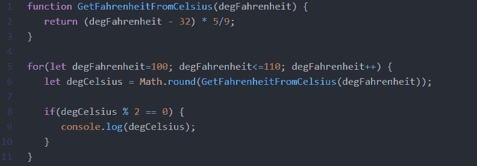
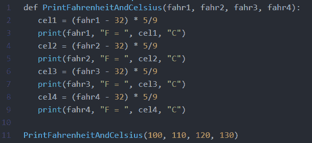
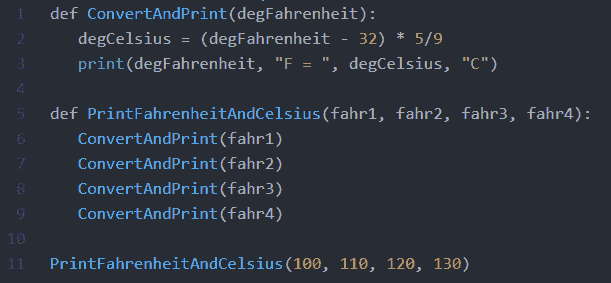
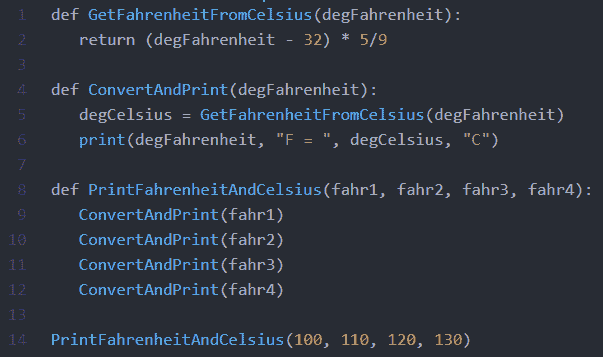
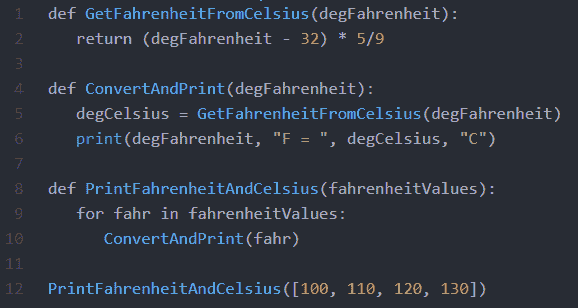

# 让您的源代码光彩照人的 3 个基本技巧

> 原文：<https://dev.to/stewoe/3-essential-tips-that-make-your-source-code-shine-3joi>

*用 Python 和 JavaScript 举例*

在本文中，您将了解到 3 个重要的技巧，它们将有助于您的源代码脱颖而出。看，有一些**不成文的法则**是每个优秀的程序员都要遵守的。即使你面临一个紧张的时间表，并且你试图尽可能快地写出你的代码:你仍然必须遵循这些规则。

**即使你是一个经验丰富的程序员！**

我说的不是算法、数据结构、软件架构和设计。我说的是更基本、更重要的东西:可读性

源代码需要**精心制作**。一直都是。不存在“迅速黑掉身边”这种说法。如果你试图跳过这些基本规则而变得更快，你最终总是会变得更慢。

看到了吧，源代码写一次，读很多次。**因此，优化代码可读性**至关重要。我向你展示了你必须遵守的 3 条重要规则，这样你才能写出可读性高的代码。遵循这些规则有助于你和其他使用你的代码的人维护、扩展和修改它。此外，可读代码更不容易出错。

这 3 条规则最大的好处是:你可以马上实施这些规则。不需要培训时间。只要几分钟，你就会成为一名更好的程序员！

我们开始吧。

# 使用有意义的变量和函数名

一行代码说了 1000 多个字。嗯，有时候不是。使用不言自明的变量和函数名会使你的代码更容易阅读、理解、维护和扩展。这里有一个例子:

当然，在编写这段代码时，我清楚地知道我在实现什么样的公式。你也知道吗？也许是，也许不是。我本来可以添加一个注释来描述该公式的用途，但更好的方法是只使用描述性的变量名，如下所示:

哇，现在清楚了。仅仅通过使用描述性的变量名，读者就可以立即了解到这段代码将华氏温度转换为摄氏温度。现在让我们将代码放入一个函数中，根据函数名和参数名观察可读性的程度。

比较“简短”版本:

更精致的版本:

我知道你在想什么:*写那个“长”字要比只用单个字母作为变量名和函数名花的时间长得多。*

然而，让我问你一个问题:理解一段用这两种风格编写的代码需要多长时间？自我解释的代码不仅为阅读你的代码的其他人节省了大量的时间，甚至对你自己也是如此。你多久回过头来扩展或修改一次你 3 个月前写的代码？你有多少次想过:“天哪，我到底在这里做了什么？”请记住:

*代码写一次，却被多次读取。*

你能做的任何优化阅读表现的事情都值得你额外的写作努力。

# 使用适当的缩进

如果你正在用 Python 编程，你也可以跳过这个技巧，感谢吉多·范·罗苏姆决定在“他的”编程语言中强制使用缩进。

对于大多数其他流行的编程语言，如 C/C++、Java、JavaScript、PHP、C#、PHP 等。仔细阅读:

分层缩进您的代码

我不在乎你用制表符还是空格。(好的..我知道，但那是另一篇博文的内容..)我不在乎你用 3 个还是 4 个空格。我只是想让你明白，缩进是编程中的一个**必须**。让我们比较几段 JavaScript 代码。此代码:

1.  将 100 到 110 之间的值从华氏温度转换为摄氏温度

2.  将转换后的值舍入到逗号后的 0 位(使它们成为整数)

3.  向控制台输出所有偶数摄氏度值(这是通过使用模数运算符“%”完成的，它返回整数除法的余数)。因此，11 % 2 等于 1，12 % 2 等于 0)

比较非缩进格式:

使用缩进格式:

我还添加了一些空行，使代码更加结构化。这两个代码片段中哪一个可读性更好？

# (适当地)使用功能

使用函数创建可重复使用的构建块。这些也有助于你结构化你的代码，使其更具可读性和可理解性。函数最重要的特性是避免重复代码。请记住:

**避免重复！**

如果你在你的代码库中多次看到相同的文本行，你很可能没有创建一个函数(或者一个类，或者一个模块，等等……取决于你使用哪种编程语言)。让我给你举个例子:

上面的代码打印出 4 个以度为单位的值。华氏温度及其转换值，单位为度。摄氏度。我们可以很容易地看到，我们正在处理代码重复，所以让我们通过创建一个为我们进行转换和打印的函数来消除它:

好多了，对吧？代码看起来“干净”和“精简”。此外，它比第一个例子更具描述性。不管怎样，这个公式仍然存在于 ConvertAndPrint 函数中。如果我们想把华氏温度转换成摄氏温度，而不打印它们的值，那该怎么办？让我们把公式提取到它自己的函数中:

瞧啊。我们生成了一些不言自明的代码，其中包含了我们可以在不同脚本中以多种方式重用的构建块。

然而，我们还没有完成。

看，我们仍然有一些重复的代码。我们的 PrintFahrenheitAndCelsius 函数接受 4 个值。但是如果你只想打印 3 个值呢？想印 300 张怎么办？有更好的方法。

根据您的编程语言，很可能有几个选项来抽象函数的参数数量。几乎总是有效的想法是使用容器(如数组或列表)代替多个变量。参见最后一个例子:

这最后一个变化使我们的功能更加优越:

1.  它更短，更容易阅读

2.  它更加通用

# 结论

如果你遵循一些简单的规则/风格指南，源代码会更容易阅读(从而理解、维护和扩展)。

此外，我们已经看到了抽象的力量:使用函数(或者您选择的编程语言提供的任何抽象方式)来创建**可重用的**构件。

通过使用**适当的命名**来升级你的变量和函数，这样你的源代码就变得**易读**。有些人甚至声称源代码读起来必须像一个故事。

实施这三个建议，我向你保证，你会看到惊人的结果。