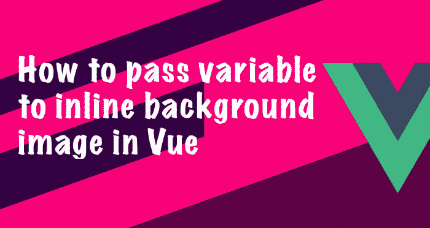

# 如何在 Vue 中将变量传递给内嵌背景图像

> 原文：<https://dev.to/jakzaizzat/how-to-pass-variable-to-inline-background-image-in-vue-1ppj>

[](https://res.cloudinary.com/practicaldev/image/fetch/s--_TmOcqPC--/c_limit%2Cf_auto%2Cfl_progressive%2Cq_auto%2Cw_880/https://jakzaizzat.com/wp-content/uploads/2018/10/How-to-pass-variable-to-inline-background-image-in-Vue.png)

将样式绑定传递到 Vue 很容易。你可以像这样通过

```
<div v-bind:style="{ color: activeColor, fontSize: fontSize + 'px' }"></div> 
```

来自 Vue 官网的例子

你可以像这样直接使用 from 变量

```
<div class="progress">
   <div class="progress__fill" :style="{width: progress}"></div>
</div>

<script>
export default {
    props : ['percent'],
    data() {
        return {
            progress: this.percent + '%'
        }
    }
}
</script> 
```

如果你和我一样，我喜欢用图片作为 div 的背景图片。

我认为这种方法将使 div 在浏览器变化时具有一致的大小，并可以处理不同类型的图像大小。

普通的 HTML 应该是这样的

```
<div class="box" style="background-image: url('<https://vuejs.oimg/logo.png>')"></div> 
```

但是，如果背景图像依赖于数据绑定，如何传递数据呢？这有点乱，因为我们需要处理一个字符串中的特殊字符。

有两种方法来处理它。

## 1。如果你有一个静态数据

```
<template>
    <div class=" bg-no-repeat bg-cover  bg-white hero relative" :style="{ backgroundImage: `url(${backgroundUrl})` }"></div>
</template>

<script>
import backgroundUrl from '~/assets/img/bg-wp.png'
export default {
  data() {
    return {
      backgroundUrl
    }
  }
}
</script> 
```

导入文件并将其传递到 Vue 数据绑定中。

## 2。动态数据

```
<template>
    <div class="min-h-screen bg-grey bg-cover flex items-end block md:fixed w-full md:w-1/2 shadow-md" :style="{ backgroundImage: `url(${member.coverImage})` }">
        <p>{{ member.name }}</p>
    </div>
</template>

<script>
export default {
  data() {
    return {
      member: {
                name: "Jakz",
                coverImage: "<https://vuejs.oimg/logo.png>"
            }
    }
  }
}
</script> 
```

您可以直接将变量传递给内联样式

原文提交自[我的博客](https://jakzaizzat.com/how-to-pass-variable-to-inline-background-image-in-vue/)