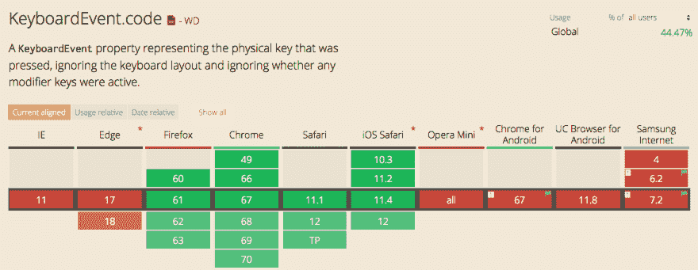

# 覆盖 DOM 输入的键入字符

> 原文：<https://dev.to/iamandrewluca/wip-override-dom-input-typed-character-4611>

### 试图解决的问题。

将每个键盘(输入源/布局)映射回 EN-US。你会问，我为什么要这么做？

在工作中，我们有一个二维码扫描仪，可以连接到任何机器(通过 USB)，当你扫描二维码时，它会模拟一些键盘输入。

扫描仪使用美国标准 101 布局(EN-US)，例如，它知道字符`Y`具有扫描码`0x1c`，而`Z`将具有扫描码`0x1d`，它将模拟键盘上特定按键的扫描码( [USB 键盘扫描码](https://www.win.tue.nl/~aeb/linux/kbd/scancodes-14.html))。

例如，我们有一个二维码代表这个网址。

```
https://amayzyng.com/iamandrewluca 
```

Enter fullscreen mode Exit fullscreen mode

这将为 5 键盘输入二维码扫描仪(输入源/布局)

```
// English (ABC)
https://amayzyng.com/iamandrewluca

// German (ABC - QWERTZ)
httpsÖ--amazyzng.com-iamandrewluca

// Dvorak
dyyloSzzamaf;fbivjrmzcamabep.,ngja

// Russian
реезыЖ//фьфнянипюсщь/шфьфтвкуцдгсф

// Romanian - Standard
httpsȘ//amayzyng.com/iamandrewluca 
```

Enter fullscreen mode Exit fullscreen mode

正如你所看到的，每个人的结果都是一样的🙃这就是为什么我们需要将美国标准 101 布局扫描码映射到 EN-US

### 要求

解决方案基于代表按键物理代码的 [KeyboardEvent.code](https://developer.mozilla.org/en-US/docs/Web/API/KeyboardEvent/code) 。此外，并非所有浏览器都支持`KeyboardEvent.code`(状态:工作草案)。

[](https://res.cloudinary.com/practicaldev/image/fetch/s--uNfzmzKA--/c_limit%2Cf_auto%2Cfl_progressive%2Cq_auto%2Cw_880/https://thepracticaldev.s3.amazonaws.com/i/xi7h6yeduabkcau0u5c0.png)

如果你想支持更多的浏览器，这里有一个多填充符

### 解决问题的方法。我们开始吧！

这是你在这篇文章中看到的唯一一段`HTML`🙂

其余将浩浩荡荡`JavaScript`

```
<input type="text" /> 
```

Enter fullscreen mode Exit fullscreen mode

首先让我们看看在一个输入中使用最多的事件是什么，以及它们是以什么顺序被触发的。

```
const input = document.querySelector('input')

input.addEventListener('focus', info)
input.addEventListener('keydown', info)
input.addEventListener('keypress', info)
input.addEventListener('input', info)
input.addEventListener('keyup', info)
input.addEventListener('change', info)
input.addEventListener('blur', info)

function info(event) {
    console.log(event.type, event.target.value)
} 
```

Enter fullscreen mode Exit fullscreen mode

捕捉输入字符的唯一方法是观察`keypress`事件。

在这个阶段人物不会出现在`input.value`

```
function onFocus  (event) { info(event) }
function keyDown  (event) { info(event) }
function keyPress (event) {
  info(event)
  // this 2 calls will stop `input` and `change` events
  event.preventDefault();
  event.stopPropagation();

  // get current props
  const target = event.target
  const start = target.selectionStart;
  const end = target.selectionEnd;
  const val = target.value;

  // get some char based on event
  const char = getChar(event);

  // create new value
  const value = val.slice(0, start) + char + val.slice(end);

  // first attemp to set value
  // (doesn't work in react because value setter is overrided)
  // target.value = value

  // second attemp to set value, get native setter
  const nativeInputValueSetter = Object.getOwnPropertyDescriptor(
    window.HTMLInputElement.prototype,
    "value"
  ).set;
  nativeInputValueSetter.call(target, value);

  // change cursor position
  target.selectionStart = target.selectionEnd = start + 1;

  // dispatch `input` again
  const newEvent = new InputEvent('input', {
    bubbles: true,
    inputType: 'insertText',
    data: char
  })
  event.target.dispatchEvent(newEvent);
}
function keyUp    (event) { info(event) }
function onInput  (event) { info(event) }
function onChange (event) { info(event) }
function onBlur   (event) {
  // dispatch `change` again
  const newEvent = new Event('change', { bubbles: true })
  event.target.dispatchEvent(newEvent);
  info(event)
}

function info     (event) { console.log(event.type) }

function getChar(event) {
  // will show X if letter, will show Y if Digit, otherwise Z
  return event.code.startsWith('Key')
    ? 'X'
    : event.code.startsWith('Digit')
      ? 'Y'
      : 'Z'
} 
```

Enter fullscreen mode Exit fullscreen mode