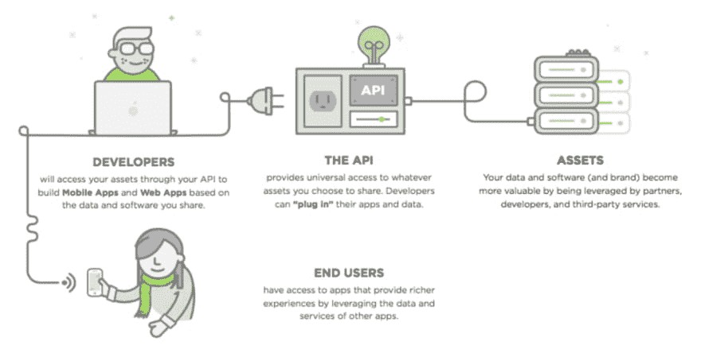
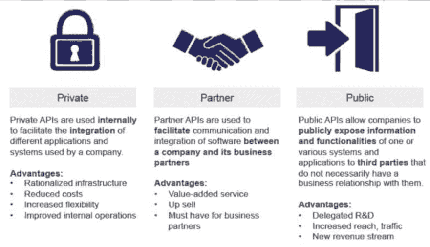

# API 的基本介绍

> 原文：<https://dev.to/mshin1995/a-basic-introduction-to-apis-27a0>

自从我几个月前开始编写代码以来，我就听到了关于三个字母的 API 的讨论。对于有编程经验的人来说，这是一个非常熟悉的术语，但它到底是什么呢？我对 API 的第一次体验实际上来自我的第一个编码项目。在这个项目中，我和我的合作伙伴承担了构建 CLI 应用程序的任务。该应用程序利用了 NBA stats API，并将返回用户在终端中输入的任何球员的统计数据。在这个时候，我认为 API 只是可以从中提取信息的数据库。对于新用户来说，这是一个常见的误解，因为 API 经常被用来获取数据。然而，API 并不是实际数据的来源。

## **什么是 API？**

API 是应用程序编程接口的缩写。更具体地说，定义是“允许创建访问操作系统、应用程序或其他服务的特征或数据的应用程序的一组功能和过程”。它实际上不是一个数据库，而是服务器的一部分，允许不同的应用程序相互通信。API 充当中间人，负责接收请求和返回响应。思考这个问题的一个简单方法是想象餐厅里的人流。客户(您的应用程序)通过服务员(API)点餐，服务员然后将您的订单转发到厨房(系统)。厨房做出食物(回应)，服务员端回来给你。需要指出的是，这些响应并不仅限于数据，不同的 API 可以用于不同的目的。

<figure>

<figcaption>Flow of using an API</figcaption>

</figure>

## **常见的 API 类型**

最常用的 API 类型之一是 web APIs。Web APIs 允许不同的应用程序通过互联网相互通信和连接。其中许多都基于 HTTP 协议，这意味着几乎所有的编程语言都可以访问它们。Web APIs 可以进一步分为公共 API 和私有 API。公共 API 通常对任何想要使用它们的人开放。然而，私有 API 限制了公众对它们的访问。这些 API 通常由公司使用，需要密钥才能访问。根据 API 的不同，可以购买访问权限。另一种类型是基于库的 API。就像名字一样，这种类型引用了一个代码库或函数库，可以用来创建不同应用程序之间的连接。

## **为什么要使用 API？**

应该使用 API 的一个原因是，它们使应用程序更加高效。当只考虑数据而不是让应用程序自己收集数据时，使用已经收集了您正在寻找和检索的数据的 API 可以节省大量时间和精力。当您想在应用程序中使用预先存在的功能，而不是从头开始创建时，API 也很有用。除了简化您的应用程序之外，API 还提供了另一层安全性，它在传递信息时充当了一扇大门。

## **外卖**

考虑到使用 API 的所有好处，我强烈建议只要有机会就使用它们。然而，并非所有的 API 都以相同的方式工作。从个人经验来看，我可以自信地说，有些比其他人更好。在使用一个特定的 API 之前，我肯定会仔细检查一下，看看它是否真的对你打算使用它的任何东西有好处。感谢阅读！

