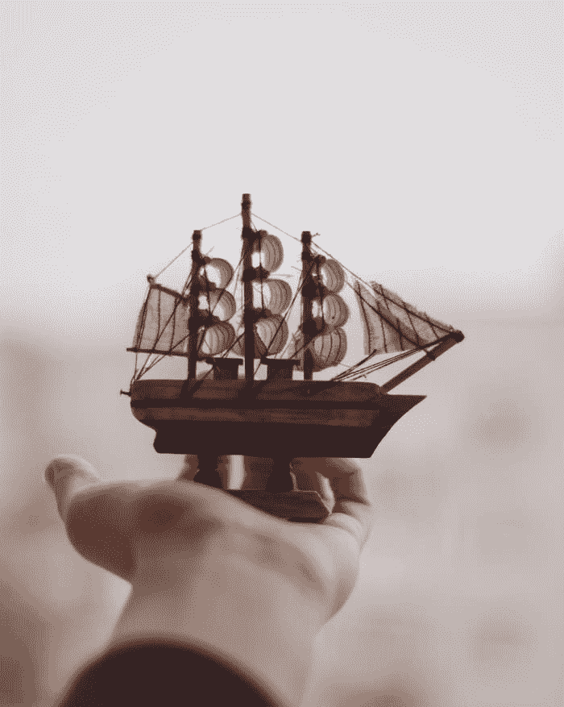

# 将道具传递给情感组件

> 原文：<https://dev.to/paulryan7/pass-props-to-an-emotion-component-35aj>

## 太酷了！

这是一个快速的帖子，但我说我分享，因为我认为这真的很酷，因为你可以将组件道具传递到你的风格中！！

我们将使用我自己通常使用的可信的沙箱，我们将通过向`Card`组件传递一个图像道具来改变背景图像。

[https://codesandbox.io/embed/q88wyjjrqw](https://codesandbox.io/embed/q88wyjjrqw)

所以我们从 unsplash 里挑一张性感的图片，我们用这张:
[](https://res.cloudinary.com/practicaldev/image/fetch/s--MAJ7QglN--/c_limit%2Cf_auto%2Cfl_progressive%2Cq_auto%2Cw_880/https://images.unsplash.com/photo-1557816580-686145586d02%3Fixlib%3Drb-1.2.1%26ixid%3DeyJhcHBfaWQiOjEyMDd9%26auto%3Dformat%26fit%3Dcrop%26w%3D700%26q%3D80)

我们将使用它作为我们的背景图片，在`index.js`文件中将图片链接传递给`Card`组件。我缩短了图像链接，因为原来是一个野兽！

```
render() {
    return <Card image={'https://bit.ly/2JE7bwk'} handleClick={this.handleClick} />;
  } 
```

现在在`Card`组件中把`image`从道具中析构出来并把`image`传递给我们的情感`Component`

```
const Card = ({ handleClick, image }) => {
  return (
    <Component image={image}>
      <div className="card">
..... 
```

现在最大的问题是，既然看起来我们不能给它传递道具，我们如何把它传递给我们的样式组件？

这其实很简单，我们需要这样做，本质上是使用一个箭头函数来获取我们的道具:
`props => props.image`

所以在我们的例子中，我们只需要做以下事情:

```
const Component = styled("card")`
  .card {
    background-image: url('${props => props.image}'); 
```

瞧，完成了！我非常喜欢这个特性，它使得组件完全独立变得非常容易。

最终代码沙盒:
[https://codesandbox.io/embed/74915yzz8q](https://codesandbox.io/embed/74915yzz8q)

我目前在 Twitter 上有 99 个关注者[，所以如果你能成为我的第 100 个](https://twitter.com/PaulRyan7)就太好了！