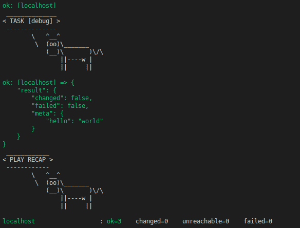
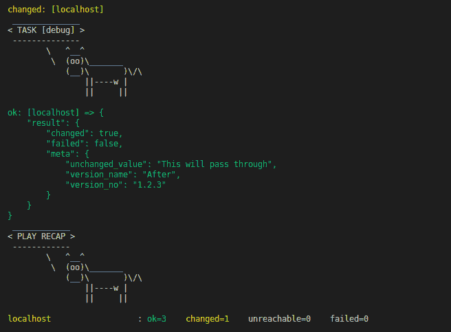

# 用 Python 写一个 Ansible 模块

> 原文：<https://dev.to/austincunningham/write-a-ansible-module-with-python-2eb8>

Ansible 有许多可用的模块[在这里](https://docs.ansible.com/ansible/latest/modules/modules_by_category.html)。但是我想写我自己的。Ansible 集成了 Python 来实现这一点。我将从一个 hello world 模块开始，并从那里继续工作。

## Hello World 模块

创建一个剧本，用 hello_world.yml 调用新模块，注意我们用 hello_world 调用模块:模块将返回结果，debug 将显示结果。

```
- hosts: localhost

  tasks:
  - name: Test that my hello_world module works
    hello_world: 
    register: result

  - debug: var=result 
```

Enter fullscreen mode Exit fullscreen mode

在项目的根目录下用 python 文件创建库目录

```
hello_world.yml
[library]
   |_ hello_world.py 
```

Enter fullscreen mode Exit fullscreen mode

将以下内容添加到 hello_world.py

```
#!/usr/bin/python 
from ansible.module_utils.basic import *

def main():
    module = AnsibleModule(argument_spec={})
    theReturnValue = {"hello": "world"}
    module.exit_json(changed=False, meta=theReturnValue)

if __name__ == '__main__':
    main() 
```

Enter fullscreen mode Exit fullscreen mode

> 你需要 **#！/usr/bin/python**
> 
> 您需要导入 ansible.module_utils.basic 来使用 **AnsibleModule**
> 
> 你需要一个 **main()**
> 
> AnsibleModule 用于将参数传入和传出模块，在这种情况下，我们只传回值为**return value**的 meta。
> 
> **注意**:argument _ spec 是一个空对象，表示没有任何东西被传入 AnsibleModule。

就是这样 hello_world 剧本可以用
运行

```
$ ansible-playbook hello_world.yml 
```

Enter fullscreen mode Exit fullscreen mode

当作为元数据运行时，这将返回一个 hello world

[](https://res.cloudinary.com/practicaldev/image/fetch/s--UYaydX_Z--/c_limit%2Cf_auto%2Cfl_progressive%2Cq_auto%2Cw_880/https://cdn-images-1.medium.com/max/800/1%2AqwqmhXM2n2VFpu7JbENfaQ.png%3Fstyle%3Dcenterme)

你的 hello world 模块到此结束。

## 将变量传入和传出 Python 模块

我正在开发一个升级脚本，我需要修改语义版本，也就是修改 1.1.1 的次要版本，Ansible 对此处理得很差，因为它不是 float 或 int。所以编写一个小模块来处理这个问题是有意义的。为此，我需要向 python 模块传递一个变量，然后修改版本并传回一个值。

再次在根目录下创建一个文件`version_change.yml`，并用你的 python 文件`version_change.py`
创建一个库目录

```
- hosts: localhost

  tasks:
  - name: Test that my change_version module works
    version_change: 
      version_name: "Before"
      version_no:  1.1.1 
      unchanged_value: "This  will  pass  through"
    register: result

  - debug: var=result 
```

Enter fullscreen mode Exit fullscreen mode

例如，我将三个变量传递给 version_changed.py 文件
中名为 version_change 的模块(version_name、version_no 和 unchanged_value)

```
#!/usr/bin/python 
from ansible.module_utils.basic import *

def main():

    fields = {
        "version_no": {"default": True, "type": "str"},
        "version_name": {"default": True, "type": "str"},
        "unchanged_value": {"default": True, "type": "str"}
    }

    module = AnsibleModule(argument_spec=fields)
    # change the name
    module.params.update({"version_name": "After"})
    # bump minor and patch version
    mylist = module.params["version_no"].split('.')
    mylist[2] = str(int(mylist[2]) + 2)
    mylist[1] = str(int(mylist[1]) + 1)
    mystr= '.'.join(mylist)
    module.params.update({"version_no": mystr})

    module.exit_json(changed=True, meta=module.params) 
```

Enter fullscreen mode Exit fullscreen mode

> 我们用`fields`字典处理输入变量，我们可以使用“默认”或“必需”布尔和“类型”,在这种情况下我们使用“str”
> 
> 所有变量都需要在 dict 字段中声明，不管你是否使用它们
> 
> `fields`作为`argument_spec`传递给`AnsibleModule`
> 
> 然后我们可以使用 python 字典方法访问`module.params`
> 
> 然后我们将`module.params`作为元传递回剧本
> 
> 然后我们可以用
> 运行剧本

```
$ ansible-playbook version_change.yml 
```

Enter fullscreen mode Exit fullscreen mode

您会看到结果，如您所见，未更改值保持不变，版本名称和版本号发生了变化

[](https://res.cloudinary.com/practicaldev/image/fetch/s--Lm0QxZGQ--/c_limit%2Cf_auto%2Cfl_progressive%2Cq_auto%2Cw_880/https://cdn-images-1.medium.com/max/800/1%2AxJZOjUG7ULrZYfE09rU7Qw.png%3Fstyle%3Dcenterme)

不需要，但作为最后一步，您可以在模块顶部添加文档和示例字符串。参见下面的 [Git repo](https://github.com/austincunningham/python-ansible.git) 获取这个基本演示的代码。

[我的博客](https://austincunningham.ddns.net)